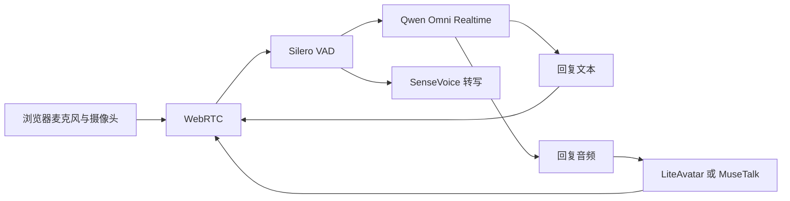
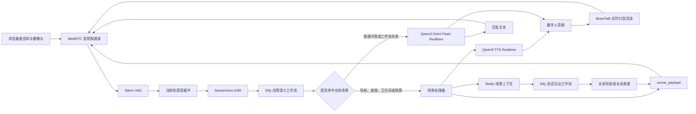
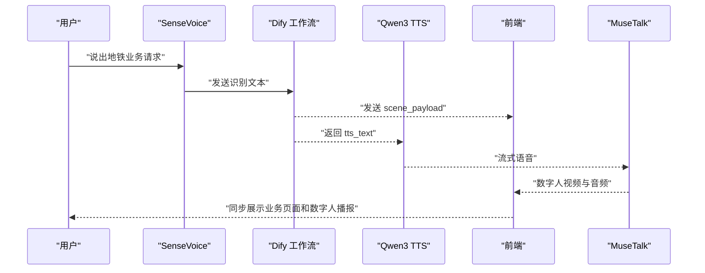

## 从 OpenAvatarChat 到广州地铁数字人：实时互动改造实践

### 项目背景

本项目基于开源项目 [OpenAvatarChat](https://github.com/HumanAIGC-Engineering/OpenAvatarChat) 进行二次开发，目标不是重新实现一套数字人框架，而是在其模块化实时音视频能力之上，完成一个可以服务广州地铁业务的实时互动数字人。

OpenAvatarChat 已经提供了以下基础能力：

* 基于 WebRTC 的浏览器实时音视频通信。
* Silero VAD 语音活动检测。
* SenseVoice 语音识别。
* Qwen Omni 实时多模态对话。
* LiteAvatar、MuseTalk 等数字人渲染组件。
* 可替换的 ASR、LLM、TTS 和 Avatar Handler。

本次实践重点解决的是开源项目落到真实业务时遇到的问题：

* 如何把通用语音对话扩展为地铁路线、美食、卫生间和购票等业务场景。
* 如何让数字人语音、字幕、口型动画和业务页面保持一致。
* 如何处理“关闭导航”“不要美食了”等依赖上一轮状态的表达。
* 如何在业务工作流失败时无感回退到通用对话。
* 如何在 NVIDIA 服务器上稳定安装 MuseTalk、PyTorch 和 OpenMMLab 依赖。

> 本文会明确区分 OpenAvatarChat 的原有能力与本项目的改造内容。Qwen Omni、SenseVoice、MuseTalk、WebRTC 等属于开源项目或第三方组件；领域路由、Redis 上下文、场景协议、广州地铁数据工程和音视频时序优化属于本项目的二次开发。

### 开源基线

本次改造最初基于 OpenAvatarChat 2025 年 9 月 30 日的上游提交 `29077cd`，整体属于 0.5.x 时期的架构。

```bash
git clone https://github.com/HumanAIGC-Engineering/OpenAvatarChat.git
cd OpenAvatarChat
git checkout 29077cd
git submodule update --init --recursive --depth 1
```

OpenAvatarChat 后续版本已经继续演进。如果直接在更新版本上复现本文改造，需要根据新版目录、配置结构和前端分离方式重新适配，不能机械套用旧分支的补丁。

### 配套材料

本文同时提供一套[脱敏配套材料](./code/guangzhou-metro-digital-human/README.md)，包括：

* 基于上游提交 `29077cd` 的广州地铁后端 Patch。
* 两份可导入 Dify 的脱敏 DSL：应用语义分析工作流和会话互动工作流。
* OpenAvatarChat YAML、`.env`、前端生产环境变量模板。
* Redis Compose、CUDA 12.8 Dockerfile 的 MMCV 修复补丁。
* WebUI 构建上传、Dify 数据挂载和 MuseTalk 视频素材说明。
* 不发起模型对话的只读冒烟检查脚本。

为了让大文件仍可在笔记仓库中稳定保存，Patch 和 DSL 使用 gzip + Base64 封装。还原命令为：

```bash
cd ai/code/guangzhou-metro-digital-human
python3 scripts/materialize_examples.py
```

生成内容位于 `generated/`。材料目录同时记录了还原后文件的 SHA-256，方便检查内容是否完整。

### 改造前后对比

| 能力 | OpenAvatarChat 基线 | 广州地铁改造版本 | 归属 |
|---|---|---|---|
| 实时通信 | WebRTC 音视频传输 | 继续复用，并扩展场景消息 | 上游能力 + 本项目扩展 |
| 语音检测 | Silero VAD | 继续复用 | 上游能力 |
| 语音识别 | SenseVoice 用于转写 | 同时作为 Dify 业务路由输入 | 上游能力 + 本项目编排 |
| 通用模型 | Qwen Omni Turbo Realtime | Qwen3 Omni Flash Realtime | 模型组合升级 |
| 业务判断 | 通用对话 | Dify 工作流判断地铁业务场景 | 本项目改造 |
| 业务播报 | Omni 自由生成 | Qwen3 TTS 受控播报 | 本项目改造 |
| 数字人 | LiteAvatar | 切换为 MuseTalk 自定义形象 | 使用上游组件并调优 |
| 前端输出 | 音视频和聊天文本 | 增加地图、美食、指南等 H5 联动 | 本项目改造 |
| 会话状态 | 主要依赖模型上下文 | Redis 保存导航、美食短期上下文 | 本项目改造 |
| 关闭互动 | 无业务页面关闭语义 | 支持关闭导航、关闭美食 | 本项目改造 |
| 可靠性 | 基础实时连接 | 心跳、重连、会话重建和异常回退 | 本项目改造 |
| 并发配置 | `concurrent_limit=1` | `concurrent_limit=3` | 本项目配置优化 |

需要特别说明：`concurrent_limit` 表示 RTC 会话并发上限，不等于 GPU 数量，也不代表 MuseTalk 会自动把不同会话分配到不同 GPU。实际显存需求仍取决于数字人 Handler 的实现和请求负载。

### 原始链路

开源基线中的 Qwen Omni 模式可以简化为：



这套链路适合通用实时对话，但业务落地时存在两个问题：

* 模型只能“回答用户”，不能直接控制地图、美食列表等业务组件。
* 业务场景要求确定性响应，不能完全依赖大模型自由生成。

### 改造后的整体架构

改造后增加了业务路由、状态管理和前端场景协议：



这套设计不是简单地在大模型前面增加一个分类器，而是把通用对话和业务操作拆成两条不同的执行路径：

* 普通问题继续交给 Qwen Omni，保持自然的实时对话体验。
* 业务场景由工作流返回结构化数据，再由 TTS 播报固定文案，同时通知前端打开对应页面。

### 核心升级一：增加领域场景路由

在原始 Qwen Omni Handler 中增加一条 `ASR → Dify → 场景判断` 的后台链路。

伪代码如下：

```python
asr_text = transcribe_with_sensevoice(audio_bytes)
workflow_result = call_dify(asr_text)

if workflow_result is None:
    fallback_to_qwen_omni()
elif workflow_result["scene"] in {"1", "2", "3", "4"}:
    handle_application_scene(workflow_result)
else:
    fallback_to_qwen_omni()
```

这里选择复用 SenseVoice，而不是直接依赖 Omni 的输入转写，主要有两个原因：

* 本地 ASR 的文本输出更加稳定，适合发送给业务工作流进行意图判断。
* 业务工作流通常需要明确的站点名称、目的地和操作动词，转写不稳定会直接造成错误跳转。

如果 ASR 为空、Dify 超时、响应格式错误或者没有命中业务场景，系统会回退到 Qwen Omni，不阻断用户对话。

### 核心升级二：统一四类广州地铁场景

当前业务工作流返回的场景定义如下：

| `scene` | 场景 | 数字人行为 | 前端行为 | 是否保存短期上下文 |
|---|---|---|---|---|
| `"1"` | 路线导航 | 播报正在打开地图 | 展示路线地图 | 是 |
| `"2"` | 周边美食 | 播报正在打开美食列表 | 展示美食推荐 | 是 |
| `"3"` | 卫生间导向 | 播报导向提示 | 展示导向内容 | 否 |
| `"4"` | 购票指南 | 播报购票提示 | 展示购票指南 | 否 |
| 其他 | 普通对话 | Qwen Omni 自由回复 | 展示问答内容 | 否 |

业务工作流建议统一返回以下字段：

```json
{
  "input": "从示例站 A 到示例站 B 怎么走",
  "scene": "1",
  "output": {
    "start": {
      "name": "示例站 A",
      "location": [113.0000, 23.0000]
    },
    "end": {
      "name": "示例站 B",
      "location": [113.1000, 23.1000]
    },
    "paths": []
  },
  "tts_text": "正在为您打开路线地图"
}
```

`output` 的具体结构可以由前端业务组件约定，但 `scene` 和 `tts_text` 应保持稳定：

* `scene` 用于选择前端页面。
* `tts_text` 用于数字人的受控语音播报。
* `output` 用于地图、列表或指南组件渲染。

### 核心升级三：业务场景使用受控 TTS

业务场景不能让 Qwen Omni 和独立 TTS 同时回复，否则容易出现：

* 数字人重复说两遍。
* Omni 回复内容与前端页面不一致。
* Omni 先返回英文或无关内容。
* 两路音频叠加，导致口型和声音错乱。

因此命中业务场景后，处理流程改为：

1. 设置 `ignore_omni_response`，忽略当前轮可能返回的 Omni 音频。
2. 清理已经追加到 Omni 会话中的输入音频。
3. 使用工作流返回的 `tts_text` 调用 Qwen3 TTS。
4. 将相同文案同时发送到字幕通道。
5. 将 TTS 音频发送给 MuseTalk。
6. 业务轮结束后重建 Omni 会话，恢复普通对话。



如果工作流没有返回有效的 `tts_text`，可以使用安全的默认文案，例如：

```text
导航：正在为您打开路线地图
美食：正在为您打开美食列表
卫生间：正在为您指引最近的卫生间
购票：正在为您打开购票指南
```

### 核心升级四：Redis 保存业务上下文

用户打开地图后，下一句可能不会重复说“导航”，而是说：

```text
关闭它
不用了
不要这个页面了
先不看了
```

只分析当前句无法判断用户想关闭什么，因此本项目新增 Redis 场景上下文。

导航上下文示例：

```json
{
  "user_input": "从示例站 A 到示例站 B 怎么走",
  "system_output": "正在为您打开路线地图"
}
```

美食上下文示例：

```json
{
  "user_input": "推荐示例站 A 附近的美食",
  "system_output": "正在为您打开美食列表"
}
```

默认上下文有效期为 120 秒：

```yaml
navigation_context_ttl: 120
food_context_ttl: 120
```

当普通场景再次收到用户输入时：

1. 查询导航和美食上下文。
2. 如果都不存在，直接进入 Qwen Omni。
3. 如果存在，选择剩余 TTL 最长的上下文。
4. 将当前输入和场景上下文发送给 Dify 会话互动工作流。
5. 根据结果关闭导航、关闭美食或继续普通问答。

这种方式让“关闭它”具备了业务指代能力，同时避免长期保存不必要的用户对话。

### 核心升级五：扩展 RTC 前端场景协议

原始 RTC 文本消息主要包含 `type`、`message`、`id` 和 `role`。本项目在消息元数据中增加：

```json
{
  "type": "chat",
  "id": "example-message-id",
  "role": "scene",
  "message": "正在为您打开路线地图",
  "scene_dialog": true,
  "scene_payload": {
    "scene": "1",
    "input": "从示例站 A 到示例站 B 怎么走",
    "output": {},
    "tts_text": "正在为您打开路线地图"
  }
}
```

前端收到消息后，根据 `scene_payload.scene` 执行不同动作：

```javascript
switch (scenePayload.scene) {
  case "1":
    openRouteMap(scenePayload.output)
    break
  case "2":
    openFoodList(scenePayload.output)
    break
  case "3":
    openRestroomGuide(scenePayload.output)
    break
  case "4":
    openTicketGuide(scenePayload.output)
    break
  default:
    showNormalAnswer()
}
```

关闭页面时使用独立的场景标识：

```json
{
  "scene_dialog": true,
  "scene_payload": {
    "scene": "close_map",
    "scene_type": "close_navigation"
  }
}
```

美食页面关闭使用 `close_food`。前端应同时兼容 `scene` 和 `scene_type`，方便协议后续演进。

### 核心升级六：返回数字人完整回答文本

数字人系统如果只传输音频，会产生以下问题：

* 页面无法展示完整字幕。
* 聊天记录只能看到用户问题，看不到数字人回答。
* 业务 Payload 和播报文案难以对应。

因此在非业务场景下，系统会收集 Qwen Omni 的流式文本增量，并在回答完成后将完整文本发送到前端。

业务场景则直接使用 `tts_text` 作为字幕，保证以下内容完全一致：

```text
前端字幕 = 数字人播报 = 工作流业务状态
```

### 核心升级七：修复 Payload、字幕和音频顺序

实时系统中，不同数据来自不同线程：

* Dify 工作流返回业务 Payload。
* Qwen3 TTS 返回音频分片。
* Qwen Omni 返回文本和音频增量。
* MuseTalk 消费音频并生成视频帧。

如果每个线程直接向 RTC 通道发送数据，很容易出现：

```text
音频已经播放，但地图还没有打开
字幕属于下一轮，口型仍在播放上一轮
回答结束事件早于最后一个音频分片
```

本项目将文本、Payload 和音频分别放入有序队列，由固定的处理线程发送，并使用同一个 `speech_id` 关联一轮对话。

关键原则如下：

* 一轮对话只生成一个稳定的 `speech_id`。
* 先发送场景信息和字幕，再发送对应的音频。
* 最后发送 `avatar_text_end` 和 `avatar_speech_end`。
* 新一轮语音开始前清理上一轮残留状态。

### 核心升级八：增强会话可靠性

Qwen Omni Realtime 使用长连接，实际运行时可能遇到网络抖动、服务端主动断开和业务场景清理连接等情况。

本项目增加了以下机制：

* 连接就绪事件，避免连接尚未建立就追加音频。
* 定时心跳，降低空闲连接被回收的概率。
* 固定间隔自动重连，并限制最大重试次数。
* 业务场景完成后重建 Omni 会话。
* 使用指令摘要告诉新会话上一轮业务已经完成。
* Dify、ASR 和 TTS 分别设置超时时间。
* 任意业务链路异常时，优先回退到 Qwen Omni。

业务场景结束后的摘要可以类似：

```text
导航场景：用户请求了路线，系统已打开地图并完成固定播报，无需继续导航。
```

这样重建会话后，模型不会重复回答已经完成的业务操作。

### 核心升级九：模型和数字人形象升级

基线配置使用：

```text
Qwen Omni : qwen-omni-turbo-realtime
Avatar    : LiteAvatar
并发上限  : 1
```

当前验证配置使用：

```text
Qwen Omni : qwen3-omni-flash-realtime
Qwen TTS  : qwen3-tts-flash-realtime
Avatar    : MuseTalk 1.5
FPS       : 15
Batch     : 5
并发上限  : 3
```

这里的 MuseTalk 并非本项目重新实现，而是 OpenAvatarChat 已经集成的数字人组件。本项目主要完成：

* 从 LiteAvatar 切换到 MuseTalk。
* 更换适合地铁场景的数字人底版视频。
* 调整 FPS 和 Batch Size。
* 配合新的音频队列优化口型同步。

### 核心升级十：广州地铁数据工程

业务工作流要正确返回路线，除了模型能力，还依赖高质量的地铁数据。

本项目专门整理了地铁线路数据和采集指南，重点检查：

* 每条线路是否包含完整站点。
* 相邻站点是否建立双向连接。
* 线路中间是否存在断点。
* 换乘站是否包含所有相关线路。
* 不同线路之间的换乘时间是否完整。
* 站点名称、线路名称和方向名称是否统一。
* 行驶时间和换乘时间是否采用一致单位。

例如，站点 A 与站点 B 相邻时，不能只记录：

```text
A -> B
```

还必须校验：

```text
B -> A
```

否则路线规划可能只在一个方向可用。

正式发布时不应把内部原始地铁数据、未经脱敏的业务规则或生产工作流直接写进公开笔记。本文配套 DSL 只保留工作流结构和代码逻辑，并替换了真实地点、坐标与示例会话。

### 已验证运行环境

以下信息来自实际运行中的 NVIDIA 服务器：

| 项目 | 已验证配置 |
|---|---|
| 操作系统 | Ubuntu 22.04.5 LTS |
| Linux 内核 | 6.8.0-87-generic |
| 内存 | 62 GiB |
| GPU | 3 × NVIDIA GeForce RTX 2080 Ti |
| 单卡显存 | 22528 MiB |
| NVIDIA Driver | 575.64.03 |
| `nvidia-smi` CUDA 上限 | 12.9 |
| Python | 3.11.14，运行于项目 `.venv` |
| uv | 0.9.17 |
| PyTorch | 2.8.0+cu128 |
| TorchVision | 0.23.0+cu128 |
| TorchAudio | 2.8.0+cu128 |
| DashScope SDK | 1.25.3 |
| FunASR | 1.2.7 |
| ModelScope | 1.33.0 |
| Transformers | 4.40.0 |
| MMCV | 2.2.0+pt2.8.0cu128 |
| MMDetection | 3.3.0 |
| MMPose | 1.3.2 |
| MMEngine | 0.10.7 |

需要区分三个 CUDA 概念：

```text
nvidia-smi 显示的 CUDA 12.9：驱动能够支持的最高 CUDA 版本
PyTorch 2.8.0+cu128：PyTorch Wheel 自带的 CUDA 12.8 运行时
nvcc：CUDA Toolkit 编译器，本次运行环境没有安装
```

当前服务能够正常运行，说明这套部署不要求系统预先安装完整 CUDA Toolkit，也不要求存在 `nvcc`。核心前提是 NVIDIA 驱动能够支持 PyTorch Wheel 携带的 CUDA 运行时。

模型目录的实际占用大致如下：

| 模型目录 | 占用 |
|---|---:|
| `models/musetalk` | 约 26 GiB |
| `models/iic` | 约 897 MiB |
| `models/sd-vae` | 约 639 MiB |
| `models/face-parse-bisent` | 约 96 MiB |

服务空闲运行时，OpenAvatarChat 进程在单张 RTX 2080 Ti 上占用约 5 GiB 显存。该数据只代表当前空闲状态，不能作为峰值显存承诺。

### 从零开始部署

#### 1. 检查 NVIDIA 驱动

首先确认系统已经识别显卡：

```bash
nvidia-smi
```

如果没有驱动，可以先查看系统推荐版本：

```bash
sudo apt update
sudo apt install -y ubuntu-drivers-common
ubuntu-drivers devices
```

生产服务器不建议在没有回滚方案的情况下随意更换驱动。本文验证的是 575.64.03，但不要求所有机器安装完全相同的驱动版本，只要它能够支持 PyTorch CUDA 12.8 运行时即可。

#### 2. 安装系统工具

```bash
sudo apt update
sudo apt install -y \
  git \
  git-lfs \
  curl \
  ffmpeg \
  build-essential \
  pkg-config \
  libgl1 \
  libglib2.0-0

git lfs install
```

#### 3. 安装 uv

```bash
curl -LsSf https://astral.sh/uv/install.sh | sh
source ~/.bashrc
uv --version
```

也可以使用 `pip` 安装：

```bash
python3 -m pip install --user uv
```

#### 4. 获取项目

先获取与本文改造一致的上游基线：

```bash
git clone https://github.com/HumanAIGC-Engineering/OpenAvatarChat.git
cd OpenAvatarChat
git checkout 29077cd
git submodule update --init --recursive --depth 1
```

然后在配套材料目录还原后端补丁和 Dify DSL：

```bash
cd <materials-root>
python3 scripts/materialize_examples.py

cd <openavatarchat-root>
git apply --check \
  <materials-root>/generated/openavatarchat-guangzhou-metro.patch
git apply \
  <materials-root>/generated/openavatarchat-guangzhou-metro.patch
```

补丁只修改 `pyproject.toml`、Redis 客户端、Qwen Omni Handler 和 RTC 输出服务，不包含 API Key、服务器地址、业务数据、视频素材或前端构建产物。前端业务界面使用独立 WebUI 仓库构建，后文单独说明。

#### 5. 创建 Python 3.11 虚拟环境

```bash
uv venv --python 3.11.11
source .venv/bin/activate

uv pip install -U pip setuptools wheel
uv pip install openmim
```

项目要求 Python `>=3.11.7, <3.12`，不要直接使用系统中的 Python 3.12 或 Python 3.13。

#### 6. 创建公开安全的本地配置

复制一份配置并使用 `.local.yaml` 后缀区分本机配置：

```bash
cp config/chat_with_qwen_omni.yaml \
  config/chat_with_qwen_omni_metro.local.yaml
```

应将本机配置加入 `.gitignore`：

```gitignore
config/*.local.yaml
```

示例配置如下，所有敏感字段均使用占位符：

```yaml
default:
  logger:
    log_level: INFO

  service:
    host: 0.0.0.0
    port: 8282
    cert_file: ssl_certs/localhost.crt
    cert_key: ssl_certs/localhost.key

  chat_engine:
    model_root: models
    concurrent_limit: 3
    handler_search_path:
      - src/handlers

    handler_configs:
      RtcClient:
        module: client/rtc_client/client_handler_rtc
        connection_ttl: 900
        turn_config:
          turn_provider: turn_server
          urls:
            - turn:<turn-server-host>:3478
          username: <turn-username>
          credential: <turn-credential>

      SileroVad:
        module: vad/silerovad/vad_handler_silero
        speaking_threshold: 0.5
        start_delay: 2048
        end_delay: 5000
        buffer_look_back: 5000
        speech_padding: 512

      SenseVoice:
        enabled: true
        module: asr/sensevoice/asr_handler_sensevoice
        model_name: iic/SenseVoiceSmall

      QwenOmni:
        enabled: true
        module: llm/qwen_omni/llm_handler_qwen_omni
        model_name: qwen3-omni-flash-realtime
        voice: Cherry
        enable_video_input: true
        video_frame_interval_ms: 1000
        enable_text_output: true
        input_audio_format: PCM_16000HZ_MONO_16BIT
        output_audio_format: PCM_24000HZ_MONO_16BIT
        enable_turn_detection: false

        enable_asr_dify_integration: true
        asr_handler_name: SenseVoice
        dify_api_url: <dify-api-base-url>
        dify_timeout: 5
        asr_timeout: 3

        tts_model_name: qwen3-tts-flash-realtime
        tts_voice: Cherry

        redis_host: <redis-host>
        redis_port: 6379
        redis_db: 0
        redis_password: <redis-password>
        navigation_context_ttl: 120
        food_context_ttl: 120
        navigation_context_key: navigation_scene_context
        food_context_key: food_scene_context

        dify_interaction_timeout: 5

      AvatarMusetalk:
        module: avatar/musetalk/avatar_handler_musetalk
        fps: 15
        batch_size: 5
        avatar_video_path: src/handlers/avatar/musetalk/MuseTalk/data/video/avatar.mp4
        avatar_model_dir: models/musetalk/avatar_model
        force_create_avatar: false
        debug: false
        multi_thread_inference: true
```

`api_key`、`dify_api_key` 和 `dify_interaction_api_key` 不要写入 YAML。Qwen Omni Handler 在这些字段缺失时会从环境变量读取。

#### 7. 使用 `.env` 保存 API Key

项目已经支持加载根目录下的 `.env`：

```bash
vim .env
```

内容如下：

```dotenv
DASHSCOPE_API_KEY=<your-dashscope-api-key>
DIFY_API_KEY=<your-dify-workflow-api-key>
DIFY_INTERACTION_API_KEY=<your-dify-interaction-workflow-api-key>
```

确认 `.env` 已经被 Git 忽略：

```bash
git check-ignore .env
```

如果命令没有输出，需要手动在 `.gitignore` 中加入：

```gitignore
.env
```

Redis 密码、TURN 凭据和证书私钥也不能提交到公开仓库。生产环境应通过本机私有配置、服务管理器环境变量或密钥管理系统注入。

#### 8. 导入两份 Dify DSL

先还原配套材料：

```bash
cd <materials-root>
python3 scripts/materialize_examples.py
```

在 Dify 控制台中分别选择“导入 DSL 文件”，导入：

```text
generated/guangzhou-metro-scene-workflow.sanitized.yml
generated/guangzhou-metro-interaction-workflow.sanitized.yml
```

两份 DSL 的职责不同：

| 应用 | 输入 | 输出 | 用途 |
|---|---|---|---|
| 应用语义分析工作流 | SenseVoice 转写文本 | `scene`、`input`、`output`、`tts_text` | 导航、美食、卫生间、购票及普通对话分流 |
| 会话互动工作流 | 当前输入 + Redis 场景上下文 | `interaction`、`param` | 判断关闭导航或关闭美食 |

DSL 使用通义模型插件。导入后需要在 Dify 中完成模型供应商授权，确认 `qwen-max` 可用，再发布两个应用并分别获取 API Key。将两个 Key 写入 OpenAvatarChat 根目录的 `.env`，不要写回 DSL。

自托管 Dify 的配置示例：

```yaml
QwenOmni:
  dify_api_url: https://<dify-api-host>/v1
```

后端会在这个基础地址后追加 `/chat-messages`。两份应用共用 API 基地址，通过不同 API Key 区分。公开材料已替换原 DSL 中的真实地点、坐标和示例会话，但保留了节点结构与业务代码。

#### 9. 准备 Dify sandbox 数据

应用语义分析工作流读取以下 7 个 JSON 文件：

| 文件 | 用途 |
|---|---|
| `alias.json` | 地点、站点和商户别名 |
| `poi.json` | POI 坐标与入口候选 |
| `stations.json` | 站点连接、线路、时间和换乘 |
| `amap_subway.json` | 前端线路绘制数据 |
| `toilets.json` | 卫生间导向 |
| `ticket_guide.json` | 购票指南 |
| `food_list.json` | 周边美食 |

将业务数据放到 Dify 宿主机的：

```text
<dify-root>/docker/volumes/sandbox/data
```

并确认 `sandbox` 服务存在以下挂载：

```yaml
services:
  sandbox:
    volumes:
      - ./volumes/sandbox/data:/var/sandbox/sandbox-python/app_data
```

工作流中的代码节点默认从 `/app_data/*.json` 读取。更新 Compose 后可以重建 `sandbox` 服务：

```bash
cd <dify-root>/docker
docker compose config
docker compose up -d sandbox
```

部署前应逐个执行 `python3 -m json.tool` 检查 JSON。真实 POI、站点坐标、商户图片和内部业务兜底数据不应提交到公开仓库；字段说明与只读校验脚本见[数据材料说明](./code/guangzhou-metro-digital-human/data/README.md)。

#### 10. 使用 Docker 部署 Redis

本项目使用 Redis 保存导航与美食的短期上下文。配套材料提供了只绑定宿主机回环地址的 Compose：

```bash
cd <materials-root>/docker
cp redis.env.example .env
vim .env

docker compose -f docker-compose.redis.yml config
docker compose -f docker-compose.redis.yml up -d
docker compose -f docker-compose.redis.yml ps
```

健康检查不会把密码打印到终端：

```bash
docker compose -f docker-compose.redis.yml exec redis \
  sh -c 'redis-cli -a "$REDIS_PASSWORD" ping'
```

预期输出为 `PONG`。OpenAvatarChat 使用宿主机网络运行时可以配置：

```yaml
redis_host: 127.0.0.1
redis_port: 6379
redis_password: <与-redis-env-一致的密码>
```

Redis 密码目前由 OpenAvatarChat YAML 读取，因此该本机 YAML 必须加入 `.gitignore`。更严格的生产方案可以继续把它改造成环境变量或密钥管理器注入。

#### 11. 构建并上传广州地铁 WebUI

广州地铁页面在独立的 OpenAvatarChat-WebUI 仓库中维护，业务代码位于 `featrue/new_ui` 分支；当前 `develop` 分支不包含地铁地图、美食列表和场景联动页面。

```bash
cd <webui-source>
git fetch origin
git switch featrue/new_ui 2>/dev/null || \
  git switch --track origin/featrue/new_ui
```

构建前必须把 `vite.config.ts` 中的后端地址，以及地图组件中的地图平台 Key 和安全码改成 Vite 环境变量。脱敏模板见[前端构建说明](./code/guangzhou-metro-digital-human/frontend/README.md)：

```bash
cp <materials-root>/frontend/.env.production.example \
  .env.production.local
vim .env.production.local
```

项目锁定 `pnpm 10.10.0`，当前仓库部署说明使用 Node.js 25.2.1：

```bash
nvm install 25.2.1
nvm use 25.2.1
corepack enable
corepack prepare pnpm@10.10.0 --activate

pnpm install --frozen-lockfile
pnpm run build
test -f dist/index.html
```

构建完成后，将 `dist/` 上传到 OpenAvatarChat 的 RTC 静态资源目录：

```bash
rsync -av \
  dist/ \
  <ssh-user>@<server-host>:<openavatarchat-root>/src/handlers/client/rtc_client/frontend/dist/
```

这里故意不使用 `--delete`，上传前仍应自行备份已有 `dist`。以后每次修改都应从本地源码重新构建，不能直接编辑服务器上的压缩 JavaScript。

#### 12. 放置 MuseTalk 数字人视频

数字人素材就是一个普通视频文件，放到：

```text
<openavatarchat-root>/src/handlers/avatar/musetalk/MuseTalk/data/video
```

例如：

```bash
cp <avatar-source>/metro-avatar.mp4 \
  <openavatarchat-root>/src/handlers/avatar/musetalk/MuseTalk/data/video/avatar.mp4
```

然后在配置中使用同一路径：

```yaml
AvatarMusetalk:
  avatar_video_path: src/handlers/avatar/musetalk/MuseTalk/data/video/avatar.mp4
  fps: 15
  batch_size: 5
  force_create_avatar: false
```

视频应保持人脸正面、嘴部清晰、光线稳定并避免镜头切换。首次使用新视频会生成缓存，具体检查方法见[数字人素材说明](./code/guangzhou-metro-digital-human/avatar/README.md)。

如果使用 Docker，应在构建镜像前放入视频；若要在不重建镜像的情况下换人，则需要自行给运行脚本增加该视频目录的只读挂载。

#### 13. 下载 MuseTalk 模型

在项目根目录执行：

```bash
bash scripts/download_musetalk_weights.sh
```

下载完成后检查关键文件：

```bash
test -f models/musetalk/musetalkV15/unet.pth
test -f models/musetalk/musetalkV15/musetalk.json
test -f models/musetalk/whisper/pytorch_model.bin
test -f models/musetalk/dwpose/dw-ll_ucoco_384.pth
test -f models/musetalk/syncnet/latentsync_syncnet.pt
test -f models/face-parse-bisent/79999_iter.pth
```

SenseVoice 模型会在首次启动时由 ModelScope 下载，也可以提前将 `iic/SenseVoiceSmall` 放入 `models/iic/SenseVoiceSmall`。

#### 14. 安装项目依赖

依次执行：

```bash
./scripts/pre_config_install.sh \
  --config config/chat_with_qwen_omni_metro.local.yaml

uv run install.py --uv \
  --config config/chat_with_qwen_omni_metro.local.yaml

./scripts/post_config_install.sh \
  --config config/chat_with_qwen_omni_metro.local.yaml
```

安装完成后固定当前验证使用的 Transformers 版本：

```bash
uv pip install transformers==4.40.0
```

当前可运行的 OpenMMLab 组合为：

```text
PyTorch   2.8.0+cu128
MMCV      2.2.0+pt2.8.0cu128
MMEngine  0.10.7
MMDet     3.3.0
MMPose    1.3.2
```

实际部署时，直接使用 `mim install mmcv==2.2.0` 会出现：

```text
ModuleNotFoundError: No module named 'mmcv._ext'
```

原因是安装到的 MMCV 没有包含与 PyTorch 2.8、CUDA 12.8 和 Python 3.11 匹配的本地扩展。当前服务器使用以下方式解决：

```bash
uv pip uninstall mmcv mmdet mmpose mmengine

wget https://github.com/MiroPsota/torch_packages_builder/releases/download/mmcv-2.2.0/mmcv-2.2.0%2Bpt2.8.0cu128-cp311-cp311-linux_x86_64.whl

uv pip install mmcv-2.2.0+pt2.8.0cu128-cp311-cp311-linux_x86_64.whl
uv pip install mmdet mmpose
```

这一步应放在项目依赖安装完成之后，用预编译 Wheel 覆盖安装错误或不带 CUDA 扩展的 MMCV。安装 `mmdet` 和 `mmpose` 时会一并恢复 `mmengine` 依赖。

该 Wheel 来自第三方构建仓库，并非 OpenMMLab 官方 Wheel。生产环境使用时建议固定下载地址、保存本地副本并校验文件哈希，避免上游文件变化影响部署。

不要在不确认兼容性的情况下直接执行：

```bash
uv pip install -U torch transformers numpy opencv-python
```

MuseTalk、OpenMMLab、TensorFlow 和主项目对依赖版本的要求存在交叉约束，盲目升级通常会破坏已经可以运行的环境。

#### 15. 验证 Python 和 CUDA 环境

```bash
uv run python -c \
  "import torch; print(torch.__version__, torch.version.cuda, torch.cuda.is_available())"

uv run python -c \
  "import mmcv, mmdet, mmpose, transformers; print(mmcv.__version__, mmdet.__version__, mmpose.__version__, transformers.__version__)"
```

预期核心输出类似：

```text
2.8.0+cu128 12.8 True
2.2.0 3.3.0 1.3.2 4.40.0
```

#### 16. 准备 HTTPS 证书

浏览器在非 `localhost` 地址上调用摄像头和麦克风时通常要求安全上下文，因此局域网部署也需要 HTTPS。

测试环境可以运行：

```bash
bash scripts/create_ssl_certs.sh
```

生产环境应使用受信任证书，并在配置中填写本机证书路径：

```yaml
service:
  cert_file: <local-certificate-path>
  cert_key: <local-private-key-path>
```

不要把证书私钥提交到 Git。

#### 17. 配置 TURN Server

如果浏览器点击开始对话后一直处于连接状态，通常是 WebRTC NAT 穿透失败。

配置示例：

```yaml
RtcClient:
  module: client/rtc_client/client_handler_rtc
  turn_config:
    turn_provider: turn_server
    urls:
      - turn:<turn-server-host>:3478
    username: <turn-username>
    credential: <turn-credential>
```

除了 TCP 服务端口，还需要根据 TURN 部署方式开放 UDP 和中继端口范围。

#### 18. 使用源码启动服务

```bash
uv run src/demo.py \
  --config config/chat_with_qwen_omni_metro.local.yaml
```

当前验证服务监听端口为 `8282`。

#### 19. 使用 Docker 启动 OpenAvatarChat

如果希望隔离 Python 依赖，可以使用项目已有的 CUDA 12.8 Dockerfile 和脚本。安装 Docker Engine 与 NVIDIA Container Toolkit 时，应以 [Docker Ubuntu 安装文档](https://docs.docker.com/engine/install/ubuntu/) 和 [NVIDIA Container Toolkit 安装文档](https://docs.nvidia.com/datacenter/cloud-native/container-toolkit/latest/install-guide.html) 为准。

先验证容器能够访问 GPU：

```bash
docker run --rm --gpus all \
  nvidia/cuda:12.8.1-base-ubuntu22.04 \
  nvidia-smi
```

当前 Dockerfile 原本使用 `mim install mmcv==2.2.0`，仍可能得到不包含 `mmcv._ext` 的包。因此先应用配套补丁：

```bash
cd <openavatarchat-root>
git apply --check \
  <materials-root>/docker/Dockerfile.cuda12.8.mmcv.patch
git apply \
  <materials-root>/docker/Dockerfile.cuda12.8.mmcv.patch
```

补丁会安装与 PyTorch 2.8、CUDA 12.8、Python 3.11 对应的 MMCV Wheel，并固定 `transformers==4.40.0`。随后构建和运行：

```bash
bash build_cuda128.sh \
  --tag open-avatar-chat:latest \
  --config config/chat_with_qwen_omni_metro.local.yaml

bash run_docker_cuda128.sh \
  --config config/chat_with_qwen_omni_metro.local.yaml
```

现有运行脚本使用 `--network=host`、`--gpus all`，并挂载模型、配置、`.env` 和资源目录，因此 Redis 位于宿主机时仍可使用 `127.0.0.1:6379`。如果改成 Compose bridge 网络，应让两个容器加入同一网络，并把 `redis_host` 改成 Redis 服务名。

完整命令和检查项见[Docker 部署说明](./code/guangzhou-metro-digital-human/docker/README.md)。本文只记录已经确认的配置和命令，没有在当前生产服务器上执行镜像构建、容器启动或干净机器复现。

### 快速使用

#### 1. 检查服务进程

```bash
ps -ef | grep 'src/demo.py' | grep -v grep
```

#### 2. 检查监听端口

```bash
ss -ltn | grep 8282
```

#### 3. 检查 HTTPS

```bash
curl -k -sS -o /dev/null \
  -w 'status=%{http_code}\n' \
  https://127.0.0.1:8282/
```

根路径返回 `307` 跳转属于正常现象。

#### 4. 检查显存

```bash
nvidia-smi
```

也可以只查看进程：

```bash
nvidia-smi \
  --query-compute-apps=pid,process_name,used_gpu_memory \
  --format=csv
```

#### 5. 浏览器访问

```text
https://<server-host>:8282
```

首次打开时需要：

* 信任测试证书或使用正式证书。
* 允许浏览器访问麦克风。
* 如果开启视频输入，允许访问摄像头。
* 确认扬声器没有静音。

#### 6. 执行只读冒烟检查

配套脚本只检查模型文件、Dify 数据、HTTPS 和 Redis 容器状态，不发起模型对话：

```bash
export OPENAVATAR_ROOT=<openavatarchat-root>
export DIFY_DATA_DIR=<dify-root>/docker/volumes/sandbox/data
export SERVICE_URL=https://127.0.0.1:8282

bash <materials-root>/tests/smoke.sh
```

由于当前没有额外资源，本次整理没有在干净机器或生产服务器上实际执行该脚本、重新构建镜像或重启服务。

### 应用场景测试

#### 路线导航

测试语句：

```text
请帮我规划从示例站 A 到示例站 B 的路线
```

预期结果：

* SenseVoice 返回识别文本。
* Dify 返回 `scene="1"`。
* 前端打开路线地图。
* 数字人播报正在打开地图。
* Redis 保存导航上下文。

#### 周边美食

测试语句：

```text
推荐一下示例站 A 附近的粤菜
```

预期结果：

* Dify 返回 `scene="2"`。
* 前端打开美食列表。
* 数字人播报正在打开美食列表。
* Redis 保存美食上下文。

#### 卫生间导向

测试语句：

```text
最近的卫生间在哪里
```

预期结果：

* Dify 返回 `scene="3"`。
* 前端展示卫生间导向内容。
* 数字人播报导向提示。

#### 购票指南

测试语句：

```text
第一次坐地铁应该怎么买票
```

预期结果：

* Dify 返回 `scene="4"`。
* 前端展示购票指南。
* 数字人播报购票提示。

#### 上下文关闭

在地图打开后继续说：

```text
关闭它
```

预期结果：

* 系统从 Redis 找到导航上下文。
* 会话互动工作流判断需要关闭导航。
* 前端收到 `close_navigation`。
* 数字人播报关闭提示。
* Redis 删除导航上下文。

在美食列表打开后说：

```text
不看美食了
```

预期结果类似，但关闭事件为 `close_food`。

#### 普通多模态问答

测试语句：

```text
请描述一下摄像头里看到的内容
```

如果没有命中业务场景，系统应回退到 Qwen Omni，并正常返回文本、语音和数字人视频。

### 常见问题

#### 旧文档中的 Conda 和 CUDA 12.4 是否必须

不是。

当前实际运行环境使用项目 `.venv`、PyTorch 2.8.0+cu128，并没有安装 `nvcc`。旧文档中的 Conda、Torch 2.4 和 CUDA 12.4 方案可以作为历史参考，但不应继续作为当前部署基线。

#### `uv.lock` 与实际环境版本不完全一致

定制分支的锁文件可能记录 `transformers==4.44.1`，但当前稳定运行环境使用 `transformers==4.40.0`。

对于这类包含多个大型开源组件的项目，应记录一份实际验证过的版本矩阵，而不是认为锁文件中的任意组合都已经经过业务验证。

#### `uv pip check` 不是完全通过

MuseTalk 对旧版 NumPy、OpenCV 和 Hugging Face 依赖有严格要求，而其他包可能要求更新版本，因此环境中可能存在依赖检查告警。

处理原则是：

* 以经过验证的核心导入和启动测试为准。
* 不要为了清空所有告警而全量升级依赖。
* 新建干净虚拟环境验证升级，不直接破坏生产环境。

#### 首次启动时间很长

MuseTalk 第一次加载自定义人物视频时需要预处理人脸、姿态和数字人缓存。

```yaml
force_create_avatar: false
```

第一次生成完成后，后续启动会直接加载缓存。只有更换人物视频或缓存损坏时才需要强制重新生成。

#### 缺少 Face Parse 模型

检查：

```bash
ls -lh models/face-parse-bisent/
```

至少应包含：

```text
79999_iter.pth
resnet18-5c106cde.pth
```

#### YAML 出现重复键错误

例如重复配置 `connection_ttl` 会触发：

```text
DuplicateKeyError
```

YAML 中同一个层级只能保留一个同名键。

#### 数字人说话和字幕不同步

重点检查：

* 是否同时放行了 Omni 音频和业务 TTS。
* Payload、字幕和音频是否使用同一个 `speech_id`。
* 结束标记是否早于最后一个音频分片发送。
* 新一轮开始时是否清理上一轮队列。

#### 数字人视频卡顿

MuseTalk 的 `fps` 和 `batch_size` 需要根据显卡调节。

当前 RTX 2080 Ti 验证参数：

```yaml
fps: 15
batch_size: 5
```

如果日志出现空闲帧插入或首帧延迟明显，可以降低 FPS 或 Batch Size。

#### `concurrent_limit=3` 是否表示需要三张显卡

不是。

它控制允许建立的 RTC 会话数量。当前 OpenAvatarChat 进程主要使用一张 GPU，服务器上的其他 GPU 可能同时运行完全无关的模型服务。

#### 修改前端源码后页面没有变化

需要确认运行时读取的是前端源码还是已经构建的 `dist` 目录。业务前端修改后应重新构建，并保证源码、构建产物和子模块提交同步，避免只修改压缩后的 JavaScript。

### 进一步优化方向

* 将 Redis Key 增加用户或 Session 前缀，避免多用户共享上下文。
* 将场景编号改为可读枚举，例如 `navigation`、`food`、`restroom`、`ticket`。
* 为 Dify 响应增加 Pydantic Schema 校验。
* 为场景 Payload 增加协议版本号。
* 将 Redis、TURN 和 Dify 地址全部迁移到环境配置或密钥管理系统。
* 增加端到端延迟指标，分别记录 VAD、ASR、工作流、TTS 和数字人首帧耗时。
* 对音频队列、关闭互动和异常回退增加自动化测试。
* 将业务前端源码与 OpenAvatarChat 后端分开维护，避免直接修改构建产物。
* 根据新版本 OpenAvatarChat 的前后端分离架构重新整理改造补丁。

### 总结

这次实践最大的收获不是把一个数字人 Demo 跑起来，而是把通用实时对话框架改造成了可控制业务页面、可维护短期状态、可降级和可持续运行的地铁互动系统。

OpenAvatarChat 提供了优秀的模块化基础，本项目的升级重点可以概括为：

```text
通用实时对话
    + 领域工作流路由
    + 受控 TTS
    + Redis 场景上下文
    + RTC 业务协议
    + 地铁数据工程
    + 音视频时序与连接可靠性
    = 广州地铁实时互动数字人
```

如果要把数字人用于交通枢纽、政务大厅、展馆、医院或商业导购，也可以复用同样的模式：保留 OpenAvatarChat 的实时音视频底座，把确定性的业务操作从通用大模型中拆出来，通过结构化场景协议与前端系统联动。

### 参考资料

* [OpenAvatarChat](https://github.com/HumanAIGC-Engineering/OpenAvatarChat)
* [MuseTalk](https://github.com/TMElyralab/MuseTalk)
* [FunASR](https://github.com/modelscope/FunASR)
* [Qwen3-Omni](https://github.com/QwenLM/Qwen3-Omni)
* [Dify Documentation](https://docs.dify.ai/)
* [uv Documentation](https://docs.astral.sh/uv/)
* [MMCV Documentation](https://mmcv.readthedocs.io/)
* [Redis Documentation](https://redis.io/docs/latest/)
* [Docker Engine on Ubuntu](https://docs.docker.com/engine/install/ubuntu/)
* [NVIDIA Container Toolkit](https://docs.nvidia.com/datacenter/cloud-native/container-toolkit/latest/install-guide.html)
