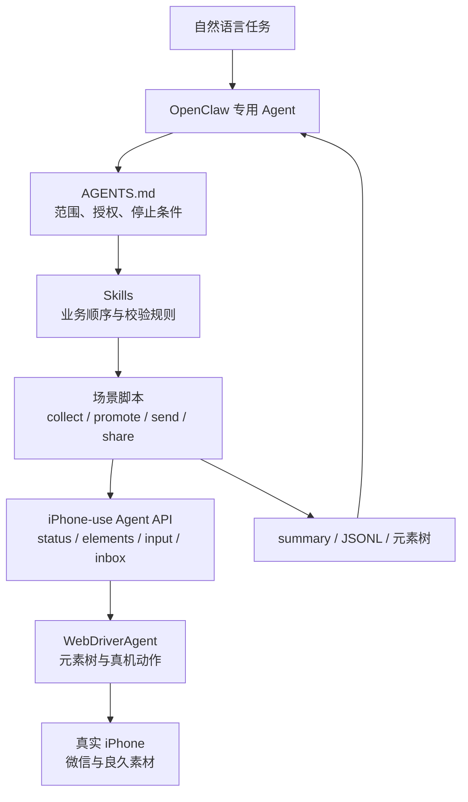
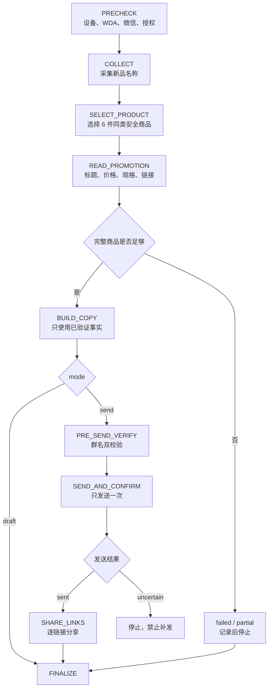
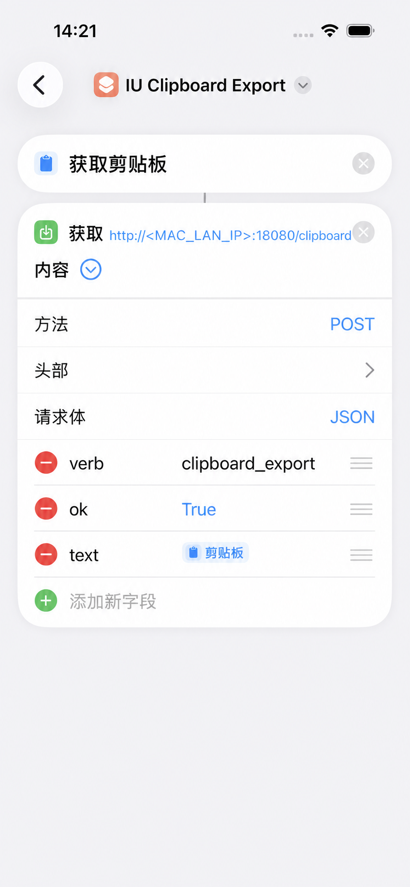

## 使用 OpenClaw + iPhone-use + WDA 实现“良久素材”自动化微信推广

### 业务问题

这次实践要完成一条真实的微信推广链路：

```text
新品首发采集
  -> 同类安全选品
  -> 标题、价格、规格、链接提取
  -> 推广文案
  -> 指定群发送
  -> 商品链接逐个分享
```

难点不在点击，而在状态与副作用。商品列表会变化，微信会保留上次页面，iPhone 和 Mac 的剪贴板可能不同步，群搜索存在相似结果；发送一旦发生，又不能靠重试解决。

因此，OpenClaw 只做业务编排，确定性的手机操作交给脚本。每个阶段都要留下结构化结果，无法确认时停止。iPhone-use、WDA 签名和 USB 中继的安装不在本文展开，可先阅读[在 Mac 上使用 iPhone-use 与 WebDriverAgent](./Using%20iPhone-use%20and%20WDA%20on%20Mac.md)。

本文只讨论“良久素材”新品推广，不包含图片或视频下载。示例统一使用以下占位符：

| 占位符 | 含义 |
| --- | --- |
| `<TARGET_WECHAT_GROUP>` | 本次明确授权的目标群 |
| `<MAC_LAN_IP>` | Mac 在当前局域网中的地址 |
| `<APPLE_TEAM_ID>` / `<IPHONE_UDID>` | 本机 WDA 配置 |
| `<REDACTED>` | 已移除的链接后缀或业务信息 |
| `$IPHONE_USE_DIR` | iphone-use 项目目录 |
| `$RUN_DIR` | 单次任务产物目录 |

### 实践文件

四个场景脚本和 OpenClaw 工作区文件原本只存在于本地，尚未进入 iphone-use 上游仓库。为使本文可复现，仓库内保留了一份[2026-07-14 公开脱敏快照](./code/liangjiu-wechat-promotion/README.md)。

| 文件 | 作用 |
| --- | --- |
| [AGENTS.md](./code/liangjiu-wechat-promotion/openclaw/AGENTS.md) | 任务范围、指令优先级、发送授权和停止条件 |
| [TOOLS.md](./code/liangjiu-wechat-promotion/openclaw/TOOLS.md) | 脚本、快捷指令、文案文件和坐标参数 |
| [新品采集 Skill](./code/liangjiu-wechat-promotion/openclaw/skills/liangjiu-new-products-collection-v1-0-0/SKILL.md) | 场景一到场景二的 WDA 衔接规则 |
| [微信推广 Skill](./code/liangjiu-wechat-promotion/openclaw/skills/liangjiu-wechat-auto-promotion-v1-0-0/SKILL.md) | 采集、选品、文案、发送与分享编排 |
| [iu_clipboard_relay.py](./code/liangjiu-wechat-promotion/iphone-use/scripts/iu_clipboard_relay.py) | 将 iPhone 剪贴板转发至 `/agent/inbox` |
| [场景一脚本](./code/liangjiu-wechat-promotion/iphone-use/scripts/wechat-iphone-scenario1-v13-names-only.sh) | 预检、启动和新品名称采集 |
| [场景二脚本](./code/liangjiu-wechat-promotion/iphone-use/scripts/wechat-iphone-scenario2-v13-safe-reset-list-top.sh) | 列表复位、详情提取和链接回传 |
| [场景三脚本](./code/liangjiu-wechat-promotion/iphone-use/scripts/wechat-iphone-scenario3-v6-send-button-fixed.sh) | 群名校验、文案输入和单次发送 |
| [场景四脚本](./code/liangjiu-wechat-promotion/iphone-use/scripts/wechat-iphone-scenario4-v2-share-confirm-send.sh) | 从最终文案提取链接并逐个分享 |

公开快照没有真实群名、用户名路径、Team ID、UDID、默认商品或完整小程序链接。控制流程、CLI、状态判断、错误码和产物格式与实践版本一致；场景三中原先内嵌的历史文案与确认标记被改为运行时输入。

### 分层与任务契约



这套分层有意把变化速度不同的内容拆开：

| 层 | 负责 | 不负责 |
| --- | --- | --- |
| Agent | 理解任务、选 Skill、判断继续或停止 | 临时猜坐标 |
| AGENTS / Skills | 授权、选品、顺序、成功与停止条件 | 保存页面瞬时状态 |
| 场景脚本 | 真机流程、断言、错误码和产物 | 自行改变推广目标 |
| iPhone-use / WDA | 元素树、输入、滚动和 App 切换 | 业务选品与文案 |

OpenClaw 在调用脚本前建立任务上下文：

```json
{
  "task_id": "liangjiu-promo-20260714-001",
  "source_page": "新品首发",
  "target_count": 6,
  "selection_mode": "auto_safe_same_category",
  "target_group": "<TARGET_WECHAT_GROUP>",
  "mode": "draft"
}
```

它是编排层契约，不是 Shell CLI。编排层再把字段转换为 `--limit`、`--products-file`、`--group`、`--message-file` 和 `--dry-run`。其中 `draft` 只生成结果，`send` 才允许进入正式发送。

任务状态按下面的顺序推进：



运行前先检查设备是否真的可驱动：

```bash
cd "$IPHONE_USE_DIR/scripts"
./wechat-iphone-scenario1-v13-names-only.sh status
```

继续执行至少要求 `ready=true`，同时满足 `status.ok`、`wda`、`wda_actionable`、`drivable`，并且 `wda_locked=false`、`mode=agent`。画面可见不等于设备可操作。

### 场景一：建立候选池

场景一只读取“新品首发”的商品名称，不提前进入详情：

```bash
./wechat-iphone-scenario1-v13-names-only.sh collect-new-products \
  --limit 50 \
  --max-scrolls 20 \
  --out-dir "$RUN_DIR/new-products"
```

脚本逐页保存元素树，并生成：

- `summary.json`：目标数、采集数、滚动次数和结束原因；
- `products.jsonl`：商品名、元素类型、矩形和建议点击位置；
- `seen-keys.txt`：采集阶段去重键；
- `page-*.json`：每一页的原始元素树。

2026-07-13 的任务目标为 50 件，页面到底后实际得到 24 件。结果应如实记录：

```json
{
  "target_count": 50,
  "collected_count": 24,
  "target_reached": false,
  "completion_reason": "end_reached_or_no_more_recognizable_products"
}
```

采集只解决候选池。规格、数量或颜色文本可能被误识别为标题，选品前还要清洗。

### 自动选品：同一安全品类

未指定品类时，Agent 先排除规格片段，再过滤酒水、保健品、医疗器械、药品、成人用品以及带治疗、理疗、检测、医用等暗示的商品。剩余标题归入普通食品、服饰鞋包、家居日用、厨房用品等低风险品类。

只有同一品类能够选满六件才进入详情提取。少于六件时停止，不跨高风险品类凑数。进入场景二前，Agent 先报告所选品类和六个标题；标题是否真实存在、价格与链接是否有效，仍由详情页验证。

### 场景二：详情提取

选品结果每行一个写入 `selected-products.txt`，场景二先将列表安全复位到顶部，再逐个处理：

```bash
./wechat-iphone-scenario2-v13-safe-reset-list-top.sh promote-products \
  --products-file "$RUN_DIR/selected-products.txt" \
  --link-read-mode shortcut \
  --clipboard-shortcut-name "IU Clipboard Export" \
  --skip-open \
  --out-dir "$RUN_DIR/promote-products"
```

`--skip-open` 依赖场景连续性：场景一结束后没有用户接管、弹窗或锁屏，且 WDA 状态健康，就直接复位列表。若元素树显示已离开良久素材、出现未知页面或无法定位商品，则停止；不为重复看到“新品首发”标签而完整重入微信。

每件商品执行相同的短闭环：

```text
读取列表 -> 精确定位标题 -> 打开详情 -> 校验标题
-> 提取价格与规格 -> 复制链接 -> 验证回传
-> 返回列表并重新读取元素树
```

滚动、返回或复位后，旧元素矩形立即失效。脚本必须重新读取元素树；只有唯一候选才允许点击。

核心产物是 `results.jsonl`、`summary.json`、`initial-copies.txt`，以及 `detail-*.json`、`share-menu-*.json`、`copy-status-*.json` 等页面证据。脱敏后的单商品结果如下：

```json
{
  "target_title": "青岛野生大虾仁",
  "ok": true,
  "detail": {
    "name": "青岛野生大虾仁",
    "price_text": "¥89",
    "specs": ["2袋（500g/袋）"]
  },
  "product_link": "#小程序://良久素材/<REDACTED>",
  "link_copy": {
    "status": "iphone_shortcut_inbox_received",
    "copy_action_verified": true,
    "read_mode": "shortcut"
  }
}
```

### iPhone 快捷指令与剪贴板 Relay

iPhone 点击“复制链接”后，Mac 通用剪贴板可能仍是旧值。实践中改为由 iPhone 快捷指令读取本机剪贴板，再通过 Relay 写入 iphone-use 的 `/agent/inbox`：

```text
iPhone 剪贴板
  -> IU Clipboard Export
  -> http://<MAC_LAN_IP>:18080/clipboard
  -> iu_clipboard_relay.py
  -> http://127.0.0.1:44321/agent/inbox
```

#### 1. 启动 Relay

先确认 iphone-use 已运行且 `~/.iphone-use/agent-token` 存在：

```bash
cd "$IPHONE_USE_DIR"
python3 scripts/iu_clipboard_relay.py
```

Relay 默认监听 `0.0.0.0:18080`，读取本机 Agent Token，并带 Bearer Token 转发到 `127.0.0.1:44321/agent/inbox`。iPhone 端不保存 Token。

另开终端检查健康状态：

```bash
curl http://127.0.0.1:18080/health
```

预期结果：

```json
{
  "ok": true,
  "service": "iu-clipboard-relay",
  "upstream": "http://127.0.0.1:44321/agent/inbox"
}
```

可用下面的命令查看 Wi-Fi 地址；如果 Mac 使用其他网络接口，改查相应接口：

```bash
ipconfig getifaddr en0
```

#### 2. 创建 `IU Clipboard Export`

在 iPhone“快捷指令”App 新建同名快捷指令，按顺序添加两个操作：

1. **获取剪贴板**。
2. **获取 URL 内容**。

第二个操作设置为：

| 配置 | 值 |
| --- | --- |
| URL | `http://<MAC_LAN_IP>:18080/clipboard` |
| 方法 | `POST` |
| 请求体 | `JSON` |
| `verb` | 文本 `clipboard_export` |
| `ok` | 布尔值 `true` |
| `text` | 第一步的“剪贴板”变量 |
| 请求头 | 不需要 |



首次运行时，iOS 可能询问本地网络访问权限，应允许“快捷指令”访问当前局域网。Mac 与 iPhone 必须处于同一可信网络。

#### 3. 验证回传

先在 iPhone 复制一段容易识别的测试文本，再运行：

```bash
./wechat-iphone-scenario2-v13-safe-reset-list-top.sh test-clipboard-bridge \
  --clipboard-shortcut-name "IU Clipboard Export" \
  --shortcut-timeout 25
```

成功时，脚本从 `/agent/inbox` 读到同一文本：

```json
{
  "ok": true,
  "action": "test-clipboard-bridge",
  "shortcut_name": "IU Clipboard Export",
  "clipboard": "<TEST_TEXT>"
}
```

Relay 返回给 iPhone 的响应还包含 `forwarded`、`upstream_status` 和 `received`。其中 `ok=true` 且 `forwarded=true` 才表示上游 inbox 已接受请求。

| 现象 | 判断 |
| --- | --- |
| iPhone 无法连接 | 检查局域网、IP、18080 端口、Mac 防火墙和本地网络权限 |
| Relay 返回 502 | 检查 Agent Token、iphone-use 服务和 `/agent/inbox` |
| 场景二等待超时 | 确认快捷指令名称、编辑器运行按钮和 `text` 是否引用剪贴板变量 |
| 读到旧链接 | 触发前先 drain inbox，只接受本次快捷指令的新回传 |
| 卡片没有直接运行 | 快捷指令可能打开编辑器；脚本识别后点击右下角运行按钮 |

`0.0.0.0:18080` 只适合可信局域网和短时运行。Relay 虽然拒绝非私网地址，但 iPhone 到 Relay 这一段没有鉴权；任务结束后应停止服务，不能将端口映射到公网。

### 文案、发送与逐链接分享

文案只能使用本次详情页验证过的标题、价格、规格和链接。缺少链接的商品不进入最终文案；规格未识别时保留缺失状态，不由模型补写。

实践版本的主 Skill 仍带有“现货充足、尺码颜色齐全、早拍早发”等固定收尾句。这些内容未必来自商品详情，与“只使用已验证事实”冲突，是当前技术债。公开快照保留它以反映真实版本，但新任务应删除该尾句，或逐项取得事实依据。

正式发送前先 dry-run：

```bash
./wechat-iphone-scenario3-v6-send-button-fixed.sh send-promotion \
  --group "<TARGET_WECHAT_GROUP>" \
  --message-file "$RUN_DIR/final-promotion.txt" \
  --dry-run
```

dry-run 会进入群聊并填写文案，不点击发送。正式运行前必须确认输入框没有残留草稿，然后执行不带 `--dry-run` 的同一命令。

场景三先精确搜索群名，进入聊天后检查一次顶部标题；写入文案后再次检查，再按元素树定位“发送”按钮。发送按钮只点击一次。后置检查即使超时，也不能覆盖“点击可能已经发生”这一事实。

发送成功后，场景四从最终文案提取 `#小程序://` 链接：

```bash
./wechat-iphone-scenario4-v2-share-confirm-send.sh share-product-links \
  --promotion-file "$RUN_DIR/final-promotion.txt" \
  --target-group "<TARGET_WECHAT_GROUP>"
```

首次回归可加 `--max-links 1`。每个链接单独写入 `results.jsonl`；单项失败时返回部分结果，不通过随机点击补偿。

### 实测结果

以下结果均可由本地 `summary.json`、`results.jsonl` 和发送前后元素树复核：

| 日期 | 范围 | 结果 | 边界 |
| --- | --- | --- | --- |
| 2026-07-10 | 两商品详情提取 | 2/2 得到标题、价格、规格和链接 | 验证详情解析与快捷指令回传 |
| 2026-07-13 | 新品候选采集 | 目标 50，实际 24 | 页面到底，`target_reached=false` |
| 2026-07-13 | 六商品详情 | 首轮 5 成功、1 个 `PRODUCT_NOT_FOUND`，随后补位 1 件 | 六件有标题、价格和链接；该批规格仍有未识别 |
| 2026-07-13 | 三商品推广 | 群文案发送完成，链接分享 3/3 | 验证发送与分享闭环 |
| 2026-07-13 | 六链接分享 | `results.jsonl` 为 6/6 | 只证明分享阶段成功 |

另一个非敏感样例是“朴小样韩式石锅拌饭酱”。本文不再公开其他商品名或完整链接。

结果状态不能混用：

| 状态 | 含义 | 后续 |
| --- | --- | --- |
| `sent` | 已点击发送，并取得足够的聊天区证据 | 可以进入逐链接分享 |
| `failed` | 能证明失败发生在发送点击之前 | 报告原因，不发送 |
| `uncertain` | 点击可能发生，但后置确认不足 | 立即停止，人工核验，禁止补发 |

### 故障复盘

| 现象 | 原因 | 修复原则 |
| --- | --- | --- |
| 状态健康但 `PHONE_CONTROLLER_BUSY` | `controller.lock` 中的进程已经退出 | 核对 PID；只清理确认失效的锁 |
| `NEW_PRODUCTS_NOT_VERIFIED` 阻塞 | `--skip-open` 仍要求重复确认标签 | WDA 健康且页面连续时直接安全复位；发现明确异常才停止 |
| Mac 剪贴板仍是旧值 | iPhone 与 Mac 通用剪贴板未同步 | 使用快捷指令经 inbox 回传 |
| 快捷指令有时进入编辑器 | Shortcuts 会恢复上次状态 | 先轮询 inbox，再识别编辑器并点击运行 |
| 滚动后定位错误 | 继续使用旧元素矩形 | 每次滚动、返回和复位后重新读取元素树 |
| 六件中一件找不到 | 列表标题变化或定位不唯一 | 返回部分失败，重新选候选，不点相似标题 |
| 发送后确认超时 | 元素树未及时出现消息 | 标记 `uncertain`，禁止自动重试 |

### 安全边界与未完成项

| 边界 | 当前规则 |
| --- | --- |
| 发送授权 | 本次任务必须明确为 `send`；历史授权不继承 |
| 手机互斥 | 同一时间只允许一个控制任务持锁 |
| 群聊 | 允许列表内，进入后和发送前两次完全匹配 |
| 文案 | 只使用本次已验证事实，失败商品不进入文案 |
| 选品 | 自动过滤高风险品类和医疗、功效暗示 |
| 恢复 | 只允许重新读元素树、回到已知页面等有限动作 |
| 发送 | 一次机会；结果不确定即停止 |
| 产物 | 元素树可能含群名与聊天内容，按需保留，公开前脱敏 |

当前已经验证采集、详情与链接提取、群文案发送和逐链接分享。下面这些能力仍未形成可复核的完整实现：

- OpenClaw 定时调度；
- 持久化商品去重库；
- 同一 `task_id` 的任务级幂等；
- 标准化发布回执；
- 六商品全流程的一次性稳定运行；
- UI 回归基线与任务指标。

这些能力应落到脚本和数据层。仅在 AGENTS.md 或 prompt 中写一句“不要重复”不能替代幂等控制。
