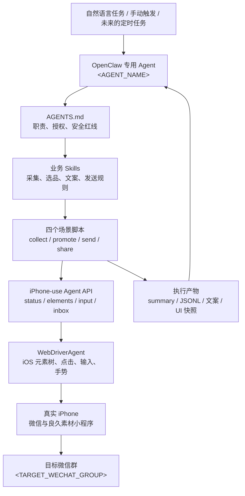
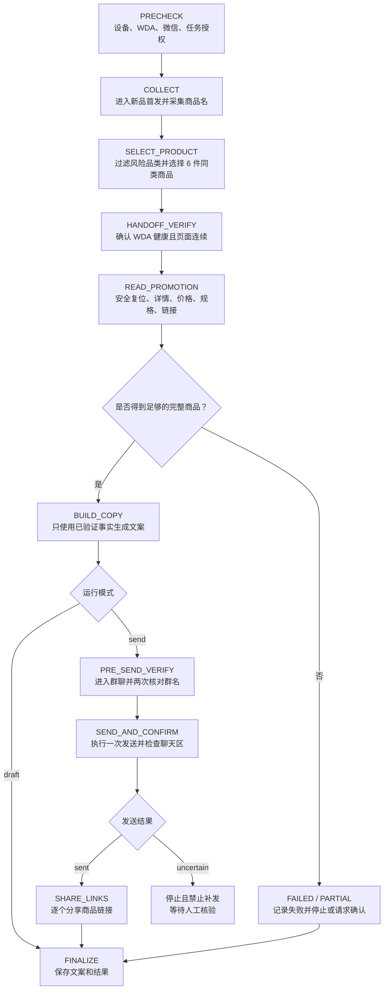

## 使用 OpenClaw + iPhone-use + WDA 实现“良久素材”自动化微信推广

### 背景与目标

“良久素材”的日常推广链路横跨微信小程序、真实 iPhone 和微信群，完整任务通常包含：

1. 打开微信并进入“良久素材”小程序；
2. 在“新品首发”中采集候选商品；
3. 从候选中选择同一安全品类的商品；
4. 逐个进入详情页，获取标题、价格、规格和小程序链接；
5. 基于已验证事实生成组合推广文案；
6. 进入指定微信群，校验群名后发送文案；
7. 再把每个商品链接逐个分享到群里；
8. 保存结构化结果和关键页面状态，供复盘与排障。

这些动作单独看并不复杂，但串联后会遇到明显的工程风险：微信页面会残留上一次任务状态，商品列表会随运营内容变化，iPhone 与 Mac 的剪贴板不一定同步，群名搜索可能出现相似结果，而“点击发送”又属于不可安全重试的副作用。

因此，本次实践的目标不是让 Agent 无约束地“看图点击”，而是建立一条可验证、可停止、可追溯的自动化链路：

```text
OpenClaw 理解任务并选择规则
  -> 场景脚本执行确定性步骤
  -> iPhone-use 提供受控手机 API
  -> WDA 读取元素树并操作真实 iPhone
  -> 每一步完成后验证状态并保存证据
```

本文重点介绍业务闭环和实际踩坑。iPhone-use、WDA 真机签名、USB 中继与基础服务安装请参见：[在 Mac 上使用 iPhone-use 与 WebDriverAgent](./Using%20iPhone-use%20and%20WDA%20on%20Mac.md)。

### 范围与公开信息约定

本文只覆盖“良久素材新品采集 -> 选品 -> 推广信息提取 -> 文案生成 -> 微信群发送 -> 逐链接分享”。不讨论商品图片、视频的批量下载，也不把尚未落地的去重数据库、定时调度或发布回执写成现有能力。

所有示例都按公开仓库标准脱敏：

| 占位符 | 含义 |
| --- | --- |
| `<AGENT_NAME>` | 承载本流程的 OpenClaw 专用 Agent |
| `<TARGET_WECHAT_GROUP>` | 经过授权并加入允许列表的目标微信群 |
| `<REDACTED>` | 已移除的小程序链接后缀、设备标识或其他业务信息 |
| `$IPHONE_USE_DIR` | 本地 iphone-use 项目目录 |
| `$RUN_DIR` | 本次任务的临时或持久化产物目录 |

不要把真实 Token、Apple Team ID、UDID、Bundle ID、微信群名、完整商品链接、聊天内容或带用户名的绝对路径提交到公开仓库。

### 当前实测结论

这套链路经历了多轮脚本和 Skill 迭代。下面只列出能从本地产物中复核的结果：

| 日期 | 实测范围 | 结果 | 能力边界 |
| --- | --- | --- | --- |
| 2026-07-10 | 两件商品详情提取 | 2/2 成功获取标题、价格、规格和链接 | 验证了列表定位、详情解析和快捷指令链接回传 |
| 2026-07-13 | “新品首发”候选采集 | 目标 50 件，页面到底后实际采集 24 件 | `target_reached=false` 是业务数据不足，不是脚本伪造成功 |
| 2026-07-13 | 六件商品详情实践 | 首轮 5 件成功、1 件 `PRODUCT_NOT_FOUND`；随后用另一候选补位 1 件 | 六件均有标题、价格和链接证据，但该批次规格仍有未识别项 |
| 2026-07-13 | 三商品文案发送与分享 | 文案已发送，商品链接分享 3/3 成功 | 验证了群聊发送与逐链接分享闭环 |
| 2026-07-13 | 六链接逐个分享 | `results.jsonl` 记录 6/6 成功 | 只证明分享阶段成功，不等同于六商品全流程已一次性无故障完成 |

其中，两件商品详情提取的非敏感样例包括“青岛野生大虾仁”和“朴小样韩式石锅拌饭酱”。公开示例中的链接统一写成：

```text
#小程序://良久素材/<REDACTED>
```

最重要的结论不是“某组坐标跑通了”，而是下面五点：

1. Agent 负责业务决策，场景脚本负责确定性执行；
2. 每一步都要形成“观察 -> 单动作 -> 再观察”的短闭环；
3. UI 元素、文本和页面状态优先，比例坐标只做经过校准的兜底；
4. 发送动作一旦可能发生，禁止自动补发；
5. 运行产物、错误码和停止规则必须是主流程的一部分。

### 总体技术架构



各层只承担自己的职责：

| 层次 | 主要职责 | 不应承担的职责 |
| --- | --- | --- |
| OpenClaw Agent | 理解任务、选择 Skill、传递参数、判断继续或停止、汇报结果 | 临场猜坐标或绕过脚本失败 |
| AGENTS.md / Skills | 固化范围、选品规则、授权、顺序、成功与停止条件 | 保存本次页面的瞬时状态 |
| 场景脚本 | 执行已验证的页面流程并输出结构化结果 | 自行扩大任务范围或修改营销目标 |
| iPhone-use | 提供手机状态、元素树、输入动作和 inbox 回传 | 判断商品是否适合推广 |
| WDA | 建立真机自动化会话并执行元素级动作 | 决定发送对象和重试策略 |
| 执行产物 | 保存结果、页面元素、复制状态和错误上下文 | 用一行“成功”代替完整证据 |

这种分层把“模型会不会点对”转化成了三个可以检查的问题：前置条件是否满足、动作是否被允许、后置断言是否成立。

### Agent 与 Skills 的设计

#### 使用专用 Agent

微信发送和商品推广都带有明显副作用，不适合放进一个职责无限扩张的通用 Agent。专用 Agent 的工作区只负责良久素材相关任务，并在每次运行开始时重新确认：

1. 本次是仅采集、仅生成草稿、发送文案，还是发送后继续逐链接分享；
2. 用户是否指定品类，未指定时是否允许自动安全选品；
3. 目标群名称及本次发送授权；
4. 主 Skill、依赖 Skill 和脚本目录；
5. 允许动作、禁止动作、成功条件和停止条件；
6. 本次发送机会是否已经消耗。

历史记忆只用于定位问题，不能覆盖当前 AGENTS.md、Skill 或用户本次授权。上一轮的商品、群名、链接、文案和页面状态都不能直接沿用。

#### Skill 中固化什么

本地实践将长期稳定的规则放在两个业务 Skill 中：

| Skill | 主要作用 |
| --- | --- |
| `liangjiu-new-products-collection-v1-0-0` | 约束场景一到场景二的 WDA 衔接、页面连续性和真正需要停止的异常 |
| `liangjiu-wechat-auto-promotion-v1-0-0` | 编排采集、自动选品、详情提取、文案、发送和逐链接分享 |

关键规则不能只靠 prompt 中的一句话提醒，还必须下沉到脚本：

- 设备不可驱动时禁止继续；
- 商品无法唯一定位时禁止点击相似项；
- 缺少链接的商品不能进入最终文案；
- 用户只要求草稿时不得调用发送脚本；
- 群名不完全一致时禁止发送；
- 发送动作可能发生后不得自动补发；
- 单个链接分享失败时返回部分结果，不随机点击补偿。

### 运行前提与 PRECHECK

基础安装完成后，每次任务仍要执行运行级预检。脚本中的 `status` 会综合判断 iPhone-use、WDA 和设备是否可操作：

```bash
cd "$IPHONE_USE_DIR/scripts"

./wechat-iphone-scenario1-v13-names-only.sh status
```

进入业务动作前，至少应满足：

```json
{
  "ready": true,
  "status": {
    "ok": true,
    "wda": true,
    "wda_actionable": true,
    "wda_locked": false,
    "drivable": true,
    "mode": "agent"
  }
}
```

`phone_target` 或镜像画面存在，并不能证明设备可安全输入；真正重要的是 `drivable`、`wda_actionable`、`wda_locked` 和控制模式。

业务预检还应确认：

- iPhone 已解锁并保持亮屏；
- 微信已登录且没有风控、升级或登录弹窗；
- 当前没有其他任务持有手机控制锁；
- 网络可以加载小程序页面；
- 本次目标群在允许列表内；
- 当前任务明确为 `draft` 或 `send`。

任意一项无法确认时停止任务，不通过连续点击“试一试”。

### 端到端状态流程



下面按四个真实场景脚本拆解实现。

### 场景一：采集“新品首发”商品名

场景一只负责进入小程序、打开“新品首发”并采集商品名称，不提前点击详情。典型命令为：

```bash
./wechat-iphone-scenario1-v13-names-only.sh collect-new-products \
  --limit 50 \
  --max-scrolls 20 \
  --out-dir "$RUN_DIR/new-products"
```

脚本按页保存元素树，并输出：

- `summary.json`：目标数、采集数、滚动次数和结束原因；
- `products.jsonl`：每个候选名称及其页面、元素类型、矩形和建议点击位置；
- `seen-keys.txt`：采集过程中的去重键；
- `page-*.json`：每一页的原始元素树。

实际运行中目标是 50 件，但列表到底后只识别到 24 件。正确处理方式是返回：

```json
{
  "target_count": 50,
  "collected_count": 24,
  "target_reached": false,
  "completion_reason": "end_reached_or_no_more_recognizable_products"
}
```

这比为了满足目标数而重复拼接、误把规格文本当商品名更可靠。采集结果中确实出现过类似“5盒（32g/盒）”的规格片段，选品前必须先清洗这种非独立商品标题。

### 自动选品：六件同一安全品类

用户未指定品类时，Agent 对采集名称进行轻量归类，选择能够凑满六件且合规风险较低的同一品类。

自动选品流程为：

1. 排除规格、数量、颜色等明显不是独立商品名的片段；
2. 排除酒水、保健品、医疗器械、药品、成人用品；
3. 排除名称带治疗、理疗、检测、医用、械字号等健康医疗暗示的商品；
4. 将剩余商品归入普通食品、服饰鞋包、家居日用、厨房用品、小家电等安全品类；
5. 优先选择数量最多、标题最明确、功效宣称风险最低的品类；
6. 精确选择六件，少于六件时停止，不跨高风险品类硬凑；
7. 进入详情提取前，先报告自动选择的品类和六个商品名。

选品阶段只基于列表名称做初筛。商品是否真实存在、标题是否唯一、价格和链接是否有效，仍然要由场景二逐项验证。

### 场景二：详情提取与链接回传

场景二接收精确商品名，先把列表安全复位到顶部，再逐个定位、打开详情并提取推广信息：

```bash
./wechat-iphone-scenario2-v13-safe-reset-list-top.sh promote-products \
  --products-file "$RUN_DIR/selected-products.txt" \
  --link-read-mode shortcut \
  --clipboard-shortcut-name "IU Clipboard Export" \
  --skip-open \
  --out-dir "$RUN_DIR/promote-products"
```

#### 场景一到场景二的衔接

如果场景一结束后没有其他 UI 操作、没有用户接管、没有锁屏或弹窗，并且 WDA 状态仍然健康，就可以把当前页面视为连续状态。此时 `--skip-open` 应继续进行列表复位和商品定位，而不是为了再次看到“新品首发”标签就完整重入微信。

但“页面连续”不是无条件信任。只要元素树明确显示当前不在良久素材列表、出现未知弹窗或无法找到商品卡片，就必须停止。这个规则解决的是过严的重复标签校验，不是允许绕过未知页面。

#### 商品定位与安全复位

脚本优先使用 `StaticText`、可见文本、元素矩形和页面层级定位商品。候选点击区域必须落在校准后的安全范围内；列表滚动后要重新读取元素树，不能继续使用旧坐标。

每件商品都执行短闭环：

```text
读取当前列表
  -> 查找完整商品名
  -> 点击唯一候选
  -> 验证详情页名称
  -> 提取价格和规格
  -> 打开分享菜单并复制链接
  -> 验证复制结果
  -> 返回列表并验证
```

商品无法唯一定位或详情标题不匹配时返回失败，不点击相似商品。

#### 为什么使用快捷指令和 `/agent/inbox`

真实实践中，iPhone 已执行“复制链接”并不代表 Mac 剪贴板会立刻得到同一内容。只读取主机剪贴板曾出现 `host_not_synced`，容易把旧链接当作本次商品链接。

稳定路径改为：

```text
商品详情点击复制
  -> 打开指定 iPhone 快捷指令
  -> 快捷指令读取 iPhone 剪贴板
  -> 将内容回传到 iPhone-use /agent/inbox
  -> 场景脚本轮询 inbox
  -> 校验是本次新收到的小程序链接
```

触发前应先清理旧 inbox 内容，并记录复制动作是否真实发生。快捷指令卡片可能直接运行，也可能打开编辑器，因此脚本应先轮询 inbox；只有没有回传时，再判断是否需要在编辑器中点击运行按钮。

场景二输出的核心文件包括：

- `results.jsonl`：每个商品一行结果；
- `summary.json`：目标数、成功数和告警；
- `initial-copies.txt`：已提取的标题、价格、规格和链接；
- `detail-*.json`：详情页元素树；
- `share-menu-*.json`：分享菜单元素树；
- `copy-status-*.json`：复制动作、回传模式与链接读取状态；
- `list-*.json`、`before-share-*.json`、`after-copy-*.json`：关键阶段页面证据。

脱敏后的单商品结果示例：

```json
{
  "index": 1,
  "target_title": "青岛野生大虾仁",
  "ok": true,
  "detail": {
    "name": "青岛野生大虾仁",
    "price_text": "¥89",
    "specs": ["2袋（500g/袋）"]
  },
  "product_link": "#小程序://良久素材/<REDACTED>",
  "link_copy": {
    "status": "iphone_shortcut_inbox_received",
    "copy_action_verified": true,
    "read_mode": "shortcut"
  }
}
```

### 文案生成：只使用已验证事实

最终文案由 OpenClaw 基于成功商品生成，允许使用的事实只有：

- 已验证的商品名称；
- 当前详情页读取到的价格；
- 当前详情页读取到的规格；
- 当前任务回传的小程序链接；
- 基于上述事实编写的简短使用场景描述。

禁止补充未验证的品牌背书、产地、库存、尺码颜色、发货时效、医疗功效、绝对化优惠和虚假稀缺。即使固定模板中存在“现货充足”“早拍早发”等收尾句，也必须重新检查事实来源，不能因为它出现在历史模板中就继续复用。

建议格式为：

```text
⏰{当前时间}{商品组合总结}综合开团！

{商品名称 1}｜{商品价格 1}
{基于已验证事实的简短文案 1}

#小程序://良久素材/<REDACTED>

{商品名称 2}｜{商品价格 2}
{基于已验证事实的简短文案 2}

#小程序://良久素材/<REDACTED>
```

缺少有效链接或详情验证失败的商品不能进入最终文案。规格未识别时也不能由模型猜测；可以明确标记缺失并停止，或在用户接受不完整结果后只使用已经验证的字段。

### 场景三：群名双校验与单次发送

正式发送前先执行 dry-run：

```bash
./wechat-iphone-scenario3-v6-send-button-fixed.sh send-promotion \
  --group "<TARGET_WECHAT_GROUP>" \
  --message-file "$RUN_DIR/final-promotion.txt" \
  --dry-run
```

dry-run 会进入群聊、填写文案并检查发送条件，但不点击发送。人工或上层 Agent 确认无误后，再在新的发送上下文中执行正式命令：

```bash
./wechat-iphone-scenario3-v6-send-button-fixed.sh send-promotion \
  --group "<TARGET_WECHAT_GROUP>" \
  --message-file "$RUN_DIR/final-promotion.txt"
```

dry-run 可能在输入框中留下草稿。正式运行前必须确认旧草稿已经清理，或由脚本验证输入框内容与本次文案完全一致；不能在未知草稿上直接追加后发送。

发送脚本的安全顺序为：

1. 返回微信聊天列表；
2. 搜索完整群名；
3. 只选择能够验证的精确结果；
4. 读取顶部导航栏并第一次确认群名；
5. 定位消息输入框并写入完整文案；
6. 再次读取顶部群名；
7. 通过元素树定位“发送”按钮，不默认使用固定坐标；
8. 点击一次发送；
9. 检查输入框清空和聊天区域中新消息的关键片段；
10. 保存发送前后的元素树。

#### 发送机会只能消耗一次

这是整个链路最重要的规则：每份最终文案、每次运行最多调用一次正式发送。

如果脚本已经点击发送，即使后续元素树读取不完整、退出码非零或聊天区确认超时，也不能自动补发。此时状态应标记为 `uncertain`，等待人工查看。只有能够证明失败发生在点击发送之前，例如没有找到发送按钮或群名校验失败，才能报告“未发送”。

### 场景四：逐个分享商品链接

文案发送完成后，场景四从最终文案中提取真实存在的 `#小程序://` 链接，并逐个执行分享。首次回归建议只测试一个链接：

```bash
./wechat-iphone-scenario4-v2-share-confirm-send.sh share-product-links \
  --promotion-file "$RUN_DIR/final-promotion.txt" \
  --target-group "<TARGET_WECHAT_GROUP>" \
  --max-links 1
```

确认分享流程稳定后处理全部链接：

```bash
./wechat-iphone-scenario4-v2-share-confirm-send.sh share-product-links \
  --promotion-file "$RUN_DIR/final-promotion.txt" \
  --target-group "<TARGET_WECHAT_GROUP>"
```

脚本使用文件传输会话打开小程序链接，再从商品详情触发“分享好友”，搜索目标群并在分享确认页发送。每个链接独立写入 `results.jsonl`；一旦某个链接失败，就返回部分成功结果，不通过手工乱点继续补偿。

### OpenClaw 任务上下文

主 Agent 在调用场景脚本前先建立结构化任务上下文。例如：

```json
{
  "task_id": "liangjiu-promo-20260714-001",
  "source_page": "新品首发",
  "target_count": 6,
  "selection_mode": "auto_safe_same_category",
  "target_group": "<TARGET_WECHAT_GROUP>",
  "mode": "draft"
}
```

这段 JSON 是 OpenClaw 编排层的业务契约，不是四个 Shell 脚本的直接 CLI Schema。编排层负责把上下文字段转换成脚本实际支持的 `--limit`、`--products-file`、`--group`、`--message-file` 和 `--dry-run` 等参数。

`mode` 当前只表达两种明确授权：

- `draft`：完成采集、详情和文案，不调用正式发送与分享；
- `send`：全部前置校验通过后，允许调用一次正式发送，并按任务要求继续逐链接分享。

未来可以统一为 `dry-run / review / auto` 三种运行模式，但目前只有场景三的 `--dry-run` 是明确存在的脚本能力，不能把完整模式切换体系写成已实现。

### 状态、结果与错误语义

主流程使用状态而不是“执行到第几行”描述进度：

| 状态 | 通过条件 | 失败后的处理 |
| --- | --- | --- |
| `PRECHECK` | iPhone-use、WDA、设备、微信和授权均正常 | 停止，不操作手机 |
| `COLLECT` | 产生可解释的商品名称列表和结束原因 | 保存页面证据并停止 |
| `SELECT_PRODUCT` | 得到六件同一安全品类、标题明确的候选 | 数量不足时请求用户决策 |
| `READ_PROMOTION` | 商品身份匹配，详情和链接读取状态可验证 | 单商品失败可跳过，不能猜测 |
| `BUILD_COPY` | 文案只包含有效商品和已验证事实 | 缺链接商品不进入文案 |
| `PRE_SEND_VERIFY` | 目标群两次完全匹配，发送按钮存在 | 点击发送前停止，状态为 `failed` |
| `SEND_AND_CONFIRM` | 发送动作执行且聊天区得到充分确认 | 无法确认时为 `uncertain`，禁止补发 |
| `SHARE_LINKS` | 每个链接有独立处理结果 | 返回部分成功，不随机补偿 |
| `FINALIZE` | 结果、文案和关键页面证据已落盘 | 报告缺失产物，不伪造完成 |

最终结果至少区分：

- `sent`：发送动作和聊天区回读都已确认；
- `failed`：已经证明在发送前失败，消息没有发出；
- `uncertain`：发送动作可能已经发生，但后置确认不足，必须人工核验。当前编排层应把脚本返回的 `sent=true`、`send_verified=false` 和退出码 `2` 映射为该状态。

常见脚本错误码和结果信号包括：

| 错误码 | 含义 | 处理原则 |
| --- | --- | --- |
| `PHONE_CONTROLLER_BUSY` | 手机控制锁被占用 | 检查真实进程，不并发操作同一手机 |
| `IPHONE_USE_UNREACHABLE` | iPhone-use 服务不可访问 | 检查服务和本机端口，停止业务动作 |
| `NEW_PRODUCTS_NOT_VERIFIED` | 脚本未能验证新品列表 | 区分过严标签校验与真实未知页面 |
| `PRODUCT_NOT_FOUND` | 未找到精确商品标题 | 跳过并记录，不点击相似商品 |
| `TARGET_GROUP_NOT_VERIFIED` | 群聊结果或顶部群名无法确认 | 停止，不发送 |
| `SEND_BUTTON_NOT_FOUND` | 发送前未找到按钮 | 报告未发送，不改用随机坐标 |
| `sent=true, send_verified=false` | 点击发送后未能确认完整文案 | 映射为 `uncertain`，禁止自动补发 |

### 实际产物目录

当前脚本已经生成的产物大致如下：

```text
~/.iphone-use/wechat-iphone/
├── new-products-YYYYMMDD-HHMMSS/
│   ├── page-001.json
│   ├── page-002.json
│   ├── products.jsonl
│   ├── seen-keys.txt
│   └── summary.json
├── promote-products-YYYYMMDD-HHMMSS/
│   ├── target-products.txt
│   ├── list-*.json
│   ├── detail-*.json
│   ├── before-share-*.json
│   ├── share-menu-*.json
│   ├── after-copy-*.json
│   ├── copy-status-*.json
│   ├── results.jsonl
│   ├── initial-copies.txt
│   └── summary.json
├── send-promotion-YYYYMMDD-HHMMSS/
│   ├── before-send.json
│   ├── after-send.json
│   └── final-promotion.txt
└── share-product-links-YYYYMMDD-HHMMSS/
    ├── product-links.txt
    ├── results.jsonl
    └── *.json
```

`*.json` 中保存的是不同分享页面和聊天页面的元素树。它们适合排障，但可能包含群名、商品信息和聊天内容，应限制权限、按需保留，并在公开前脱敏。

当前目录中没有统一的 `task.json`、持久化 `promotion_history` 或标准化 `publish-receipt.json`。这些属于后续增强项，不应出现在“已经生成”的目录示例里。

### 实践中的关键问题

#### 1. 健康状态正常，但脚本仍报告控制器忙

一次运行中 `/agent/status` 显示 WDA 可操作、设备可驱动且没有用户接管，但脚本仍返回 `PHONE_CONTROLLER_BUSY`。最终定位到 `controller.lock` 记录了已经不存在的进程。

这里不能简单地“看到锁就删”：

1. 先读取锁中记录的 PID；
2. 检查该进程是否仍存在且是否属于当前自动化任务；
3. 活跃进程存在时保持阻塞；
4. 只有确认是残留锁时才清理；
5. 把锁判断和设备状态分别写入日志。

手机状态与脚本互斥锁解决的是两个不同问题，不能用其中一个替代另一个。

#### 2. `NEW_PRODUCTS_NOT_VERIFIED` 校验过严

场景一成功后，WDA 健康、没有外部操作、元素树也能看到商品卡片，但场景二仍因为无法再次确认“新品首发”标签而停止。重复点击标签还会引起列表渲染抖动，使页面从正确状态变得不稳定。

修复原则是：在 `--skip-open` 模式中，如果 WDA handoff 健康、没有页面变化证据且列表元素能够被验证，就直接进行安全复位和商品定位；只有发现明确错误页面或无法定位商品时才失败。不要把完整重入当作默认恢复动作。

#### 3. iPhone 已复制，Mac 剪贴板没有同步

`host` 模式曾出现 iPhone 复制动作成功但 Mac 剪贴板仍是旧值。使用旧剪贴板会造成商品与链接错配，比直接失败更危险。

最终采用快捷指令读取 iPhone 剪贴板并回传 `/agent/inbox`。同时保存 `copy-status-*.json`，区分“复制按钮未验证”“快捷指令超时”“主机未同步”和“inbox 已收到”四类状态。

#### 4. 快捷指令卡片行为不固定

同一个快捷指令卡片有时直接运行，有时打开编辑器。如果脚本始终等待编辑器，就会把已经成功运行的情况误判为失败。

更稳妥的顺序是：触发卡片后先轮询 inbox；未收到时再读取快捷指令页面，定位编辑器运行按钮；运行后继续轮询并验证回传内容是新值。

#### 5. 商品列表渲染与旧坐标

列表滚动或重新进入标签后，原有元素矩形可能已经失效。脚本必须在每次滚动、返回或 safe reset 后重新读取元素树。坐标只属于当时的页面快照，不能跨状态复用。

#### 6. 六件任务中的单商品失败

六件详情实践中出现过 5 件成功、1 件 `PRODUCT_NOT_FOUND`。正确结果是 `ok=false` 并报告部分成功，随后从候选列表选择另一件商品重新验证，而不是把相似标题或旧链接拼入结果。

#### 7. 点击发送后不自动重试

发送脚本可能出现“发送动作已执行，但元素树没有完整确认”的情况。此时自动重试会造成重复群发。退出码或后置验证失败不能覆盖“点击已经发生”这一事实，因此必须返回 `uncertain` 并等待人工检查。

### 安全边界

#### 显式授权

只有用户在本次运行中明确要求发送，才能进入场景三正式发送。以下表达只允许生成草稿：

- “整理今天的新品”；
- “生成推广文案”；
- “先给我看看”；
- `mode=draft`。

发送授权不能从历史会话或上一次任务继承。

#### 群聊校验

- 目标群必须在允许列表内；
- 搜索结果要求精确匹配，不选择相似群名；
- 进入群后和发送前各校验一次顶部群名；
- 页面跳转、弹窗遮挡或任一次不匹配都立即停止。

#### 内容合规

- 自动排除高风险品类和强功效暗示商品；
- 营销描述只使用已验证事实；
- 不因商品详情中的宣传文本存在，就无条件复制医疗或绝对化表述；
- 最终文案只包含有有效链接的商品；
- 失败商品和不确定字段不由模型补全。

#### 有限恢复

允许的恢复动作必须预先定义，例如重新读取元素树、返回已知页面、清理确认失效的锁、重新触发一次快捷指令。连续失败、未知页面或发送结果不确定时停止，不能让 Agent 自由探索恢复路径。

#### 服务暴露

iPhone-use 当前最适合同机运行，通过 `127.0.0.1:44321` 访问。不要为了远程调用直接把手机控制服务裸露到公网；确需跨机器时应使用带认证的安全隧道、访问控制和超时限制。

### 尚未完成的工程增强

以下能力在参考方案中有设计，但当前本地产物不足以证明已经完整落地：

1. **持久化商品去重**：用标准标题和链接哈希维护最近 N 天推广记录；
2. **任务级幂等**：同一 `task_id` 只能进入一次正式发送阶段；
3. **统一发布回执**：标准化记录群名双校验、发送时间、消息摘要和证据路径；
4. **完整运行模式**：统一 `dry-run / review / auto`，并支持一键降级到 review；
5. **OpenClaw 定时调度**：定时任务调用同一份 Skill，而不是把安全规则复制到一次性 prompt；
6. **UI 回归基线**：为微信、小程序、快捷指令和分享确认页保存脱敏后的元素快照；
7. **监控指标**：任务成功率、商品处理成功率、safe reset 次数、不确定发送数和群名校验失败数。

这些增强应在脚本和数据层实现，不能只依赖 Agent “记住”。

### 验收清单

一条推广任务只有同时满足适用条件，才能被标记为完成：

- [ ] PRECHECK 中所有设备和授权条件均通过；
- [ ] 采集结果包含明确的结束原因，没有伪造到达目标数；
- [ ] 六件候选属于同一安全品类且标题明确；
- [ ] 最终文案中的每件商品都有可验证的详情和本次链接；
- [ ] 失败商品没有进入最终文案；
- [ ] 用户在本次运行中明确授权发送；
- [ ] 目标群进入后和发送前两次完全匹配；
- [ ] 正式发送脚本只调用一次；
- [ ] `sent` 有聊天区证据，`uncertain` 没有自动补发；
- [ ] 每个分享链接都有独立结果，部分失败得到如实报告；
- [ ] `summary.json`、`results.jsonl`、文案和关键元素树均已保存；
- [ ] OpenClaw 最终报告包含成功项、失败项、当前状态和产物目录。

### 总结

OpenClaw + iPhone-use + WDA 的价值，不是把一段人工操作改写成更长的点击脚本，而是把业务意图、稳定规则、真机动作和验证证据分层。

在这次良久素材实践中，真正提升稳定性的措施包括：专用 Agent、AGENTS.md 与 Skills 的约束优先级、四个独立场景脚本、WDA 健康衔接、安全复位、快捷指令 inbox 回传、群名双校验、单次发送语义和结构化运行产物。

当前链路已经验证了商品采集、详情和链接提取、微信群文案发送及逐链接分享，但六商品一次性稳定运行、持久化去重、任务幂等、统一发布回执和定时调度仍需要继续工程化。只有持续区分“已验证”“部分成功”和“建议增强”，这套自动化才具备长期维护价值。
