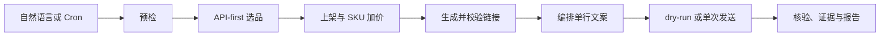
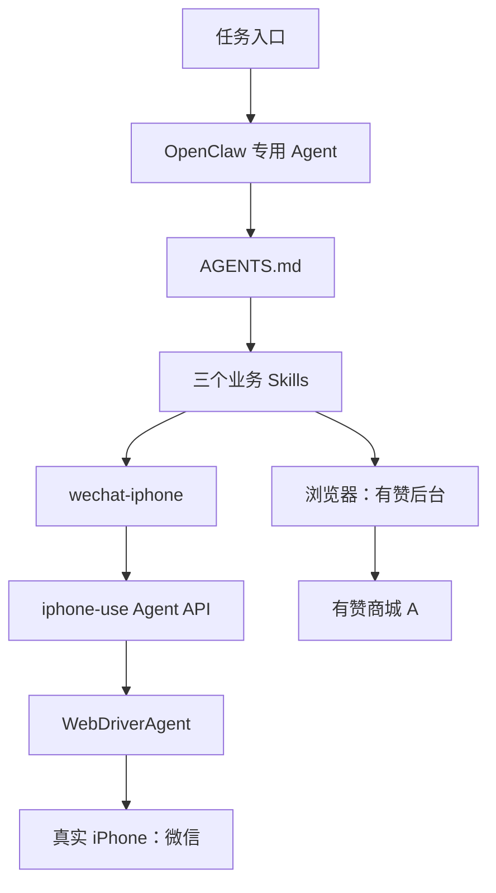
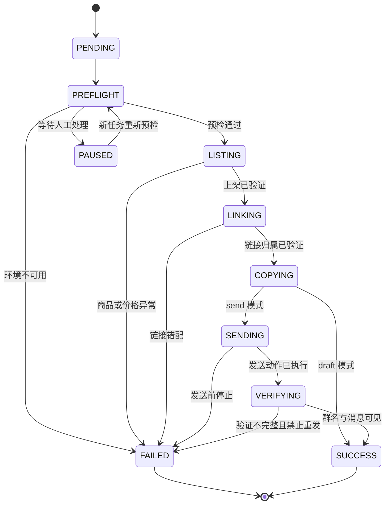

## 使用 OpenClaw + iPhone-use + WDA 实现有赞商城 A 自动化微信推广

### 业务目标与实测结果

这次实践把有赞选品上架、推广链接生成、文案编排和真机微信发送串成一个任务。OpenClaw 负责读取规则和控制阶段，浏览器处理有赞后台，`wechat-iphone` 经 iPhone-use 与 WDA 操作真实 iPhone。

链路已经跑通单商品推广；在后续的多商品扩展中，逐链接分享得到 6 条结构化结果，均为 `ok=true`。本文不公开商品、群聊、链接和聊天内容。

| 环节 | 实测结论 |
| --- | --- |
| 选品 | 优先读取榜单接口，按原始顺序选择首个字段完整且 `isAdded === false` 的商品 |
| 上架 | 分组、卖点和 SKU 价格都在保存前后重新读取 |
| 推广链接 | 关闭旧弹窗，用完整商品名筛选，并校验 alias/path |
| 微信发送 | 群聊 allowlist、群名双校验、草稿冲突检测、发送按钮元素定位 |
| 防重复 | 每个任务最多调用一次正式发送；验证不完整也不自动重发 |

这套流程的边界很明确：商品、发布、群发等外部状态只能按当前任务授权修改；页面或设备状态无法确认时，任务停止并保留证据。

### 实践文件

正文只解释关键决策，实际运行文件放在公开脱敏快照中：

| 文件 | 内容 |
| --- | --- |
| [实践快照说明](./code/youzan-wechat-promotion/README.md) | 文件关系、脱敏范围和部署位置 |
| [AGENTS.md](./code/youzan-wechat-promotion/openclaw/AGENTS.md) | 专用 Agent 的职责、授权、状态和停止规则 |
| [选品上架 Skill](./code/youzan-wechat-promotion/openclaw/skills/youzan-product-listing-daily-goods-v1-0-0/SKILL.md) | API-first 选品、卖点、SKU 加价和保存校验 |
| [推广链接 Skill](./code/youzan-wechat-promotion/openclaw/skills/youzan-product-promotion-v1-0-0/SKILL.md) | 完整商品名筛选和链接归属校验 |
| [主流程 Skill](./code/youzan-wechat-promotion/openclaw/skills/youzan-wechat-auto-promotion/SKILL.md) | 串联上架、链接、文案和发送 |
| [wechat-iphone 脚本](./code/youzan-wechat-promotion/iphone-use/scripts/wechat-iphone) | 状态、WDA、群聊、草稿和发送实现 |
| [allowlist 示例](./code/youzan-wechat-promotion/iphone-use/config/allowed-groups.json.example) | 目标群配置格式 |

这些文件来自 2026-07-14 的实际工作区。公开版只替换了本机路径、签名标识、设备标识和商品示例，没有重写执行逻辑。

### 前置条件

iPhone-use、WDA 签名、USB 中继和 Agent Token 的安装过程见[在 Mac 上使用 iPhone-use 与 WebDriverAgent](./Using%20iPhone-use%20and%20WDA%20on%20Mac.md)，这里不再重复。

开始业务任务前确认：

* 有赞后台已登录，浏览器会话属于有赞商城 A；
* iPhone 已通过 USB 连接、解锁、亮屏并信任当前 Mac；
* iphone-use daemon 和 WDA 均可访问；
* 手机处于 `mode=agent`，没有其他任务持有控制锁；
* 微信已登录，目标群已加入 allowlist；
* 当前任务明确为 `draft` 或 `send`。

本机值通过环境变量注入：

```bash
export IPHONE_USE_DIR="$HOME/path/to/iphone-use"
export WDA_TEAM_ID="<APPLE_TEAM_ID>"
export WDA_UDID="<IPHONE_UDID>"
export WECHAT_IPHONE_CONFIG="$HOME/path/to/allowed-groups.json"

WDA_KEEPALIVE=1 \
  "$IPHONE_USE_DIR/scripts/setup-wda.sh"
```

Team ID、UDID、WDA Bundle ID、Token 和群名不写入公开仓库。

### 端到端流程



每个阶段只接收上一阶段已验证的结构化结果。商品身份、链接归属或手机状态有一项不确定，后续阶段就不执行。

### 分层架构



| 层 | 职责 |
| --- | --- |
| `AGENTS.md` | 规定授权、阶段顺序、停止条件和 send once |
| 业务 Skills | 固化有赞页面规则、商品匹配和主流程依赖 |
| 浏览器 | 读取接口和 DOM，完成有赞侧动作 |
| `wechat-iphone` | 把手机动作收敛为微信业务命令 |
| iphone-use / WDA | 返回手机状态和元素树，执行单个 iOS 动作 |

OpenClaw 不直接编排长坐标序列。易变的页面定位放进 Skill 或脚本，Agent 只依据结构化状态决定继续还是停止。

### Agent、Skills 与任务输入

专用 Agent 每次运行重新读取主 Skill、两个依赖 Skill，以及 `wechat-iphone` 的命令行为和 allowlist。上一次任务的商品、链接、群聊或发送授权都不能复用。

三个 Skill 的分工是：

| 模块 | 输入 | 输出 |
| --- | --- | --- |
| `youzan-product-listing-daily-goods-v1-0-0` | 榜单、品类、分组、加价规则 | 商品身份、SKU 售价、上架校验 |
| `youzan-product-promotion-v1-0-0` | 完整商品名或唯一标识 | 当前商品的推广链接 |
| `youzan-wechat-auto-promotion` | 完整任务参数 | 草稿或发送报告 |

任务先落成结构化上下文：

```json
{
  "task_id": "youzan-promo-<YYYYMMDD>-<SEQ>",
  "store": "有赞商城A",
  "product_source": "auto_select",
  "ranking": "15天热销榜",
  "category": "日用百货",
  "listing_group": "<LISTING_GROUP>",
  "price_markup": 5.00,
  "target_group": "<TARGET_WECHAT_GROUP>",
  "mode": "draft"
}
```

`draft` 完成选品、上架、链接和文案，不调用微信发送；`send` 通过全部前置校验后只允许一次正式发送。

### 单商品执行主线

#### 1. 预检

先检查脚本和手机：

```bash
wechat-iphone doctor
wechat-iphone status
```

手机状态至少满足：

```json
{
  "ok": true,
  "wda": true,
  "wda_actionable": true,
  "wda_locked": false,
  "drivable": true,
  "mode": "agent"
}
```

`phone_target` 只能说明存在手机目标，不能替代 `drivable`。浏览器还要确认店铺、登录态、验证码和风控弹窗；任一项不清楚，状态进入 `PAUSED` 或 `FAILED`。

#### 2. API-first 选品

进入目标榜单后读取当前登录态下的接口：

```text
/v4/fenxiao/fxmarket/ranklist/getHotGoodsListMore.json
  ?category=dailySuppliers
  &scene=2
  &csrf_token=<CURRENT_CSRF_TOKEN>
```

选择规则保持简单：从 `data[0]` 开始按数组原始顺序检查，跳过 `isAdded === true`，遇到首个 `title`、`alias`、`algId` 完整且 `isAdded === false` 的商品后立即停止。

随后用同一条记录的 `alias` 和 `algId` 打开详情页，再核对完整商品名和“上架到店铺”入口。接口不可用或字段矛盾时才退回卡片悬停判断；视觉兜底也必须读到明确的“未添加”。

#### 3. 分组、卖点与 SKU 加价

上架页只处理当前商品：

1. 选择 `<LISTING_GROUP>`；
2. 核对商品名；
3. 定位“商品卖点”字段所属的“智能生成”；
4. 确认打开的是“商品卖点创作”面板；
5. 逐个读取已启用 SKU 的默认售价；
6. 将目标售价设为默认售价加 `5.00`；
7. 重新读取输入框实际值后保存；
8. 保存后再次检查商品状态。

有赞的自定义价格输入可能把新值追加到旧值后。实际处理中使用原生 value setter，并触发 `input`、`change`，再从 DOM 读取结果。页面若给出价格上限，则按页面约束停止，不强行保存。

#### 4. 生成并校验推广链接

推广链接必须和刚处理的商品形成闭环：

1. 从编辑页读取完整商品名；
2. 关闭残留的旧推广弹窗；
3. 用完整名称筛选商品管理列表；
4. 要求结果唯一且名称完全匹配；
5. 打开“推广 → 微信小程序 → 生成链接”；
6. 从当前 DOM、输入框或受控剪贴板读取链接；
7. 校验链接中的 alias/path 属于当前商品；
8. 将链接写入当前 `task_id`。

旧弹窗和旧剪贴板都不能作为成功证据。链接归属无法确认时，任务停在 `LINKING`。

#### 5. 编排单行文案

文案只使用已经验证的商品名、规格、价格、卖点和推广链接：

```text
{商品名称}上新啦！{已验证卖点或使用场景}，点击小程序查看详情：<PRODUCT_LINK>
```

传给微信前将 `\r\n`、`\r` 统一为换行，再把换行和连续空格压成一个空格。这样可避免微信把多段文本拆成多条消息。医疗功效、最低价、库存和运费等未验证信息不进入文案。

#### 6. dry-run 与正式发送

先用独立演练任务准备草稿并定位发送按钮：

```bash
wechat-iphone send \
  --group "<TARGET_WECHAT_GROUP>" \
  --message "单行推广文案 <PRODUCT_LINK>" \
  --dry-run
```

`--dry-run` 不点击发送，但会把文案留在输入框。正式任务必须重新预检；脚本会识别该草稿是 `exact`、`duplicate`、`different` 还是 `unknown`。

正式发送命令只调用一次：

```bash
wechat-iphone send \
  --group "<TARGET_WECHAT_GROUP>" \
  --message "单行推广文案 <PRODUCT_LINK>"
```

#### 7. 发送后核验

脚本点击发送元素后重新读取元素树，检查群名仍然可见、本次消息是否出现在聊天区域，并返回：

```json
{
  "sent": true,
  "verified": true,
  "group_still_open": true,
  "message_visible": true,
  "warning": null
}
```

OpenClaw 报告把 `group_still_open` 映射为 `group_verified`，并补充 `task_id` 和 `evidence_dir`。字段分层后，脚本结果和任务报告不会混为一谈。

### wechat-iphone 的安全抽象

Agent 使用稳定命令，不直接拼 WDA 请求：

```bash
wechat-iphone doctor
wechat-iphone status
wechat-iphone open-group --group "<TARGET_WECHAT_GROUP>"
wechat-iphone send --group "<TARGET_WECHAT_GROUP>" --message "消息" --dry-run
wechat-iphone read --group "<TARGET_WECHAT_GROUP>" --pages 1
wechat-iphone elements --group "<TARGET_WECHAT_GROUP>"
```

| 机制 | 实现 |
| --- | --- |
| allowlist | 群名不在配置中时返回 `GROUP_NOT_ALLOWED`，不进入微信搜索 |
| 控制锁 | `controller.lock` 阻止两个进程同时控制手机 |
| 草稿检查 | 输入前、聚焦后、输入后、发送前都读取元素树 |
| 群名双校验 | 搜索结果匹配后校验导航栏，发送前再校验一次 |
| 发送按钮 | 保持键盘展开，从元素树定位“发送”，不盲点固定坐标 |
| 结构化结果 | stdout 输出 JSON，stderr 只记录过程日志 |

控制锁只处理并发，不负责跨任务去重。任务级 send once 由 `AGENTS.md` 和主 Skill 约束。

正式发送遵守四条不可变规则：

1. 每个任务最多调用一次 `wechat-iphone send`；
2. `sent=true, verified=false` 仍按可能已经发送处理；
3. 发送失败后不使用 WDA、tap、click 或坐标补点；
4. 需要恢复时创建新任务，从预检重新开始。

### 状态、错误与证据



| 错误码 | 含义 | 处理 |
| --- | --- | --- |
| `IPHONE_USE_UNREACHABLE` | 无法读取手机状态 | 检查 daemon、Token 和本机代理 |
| `IPHONE_NOT_READY` | WDA、锁屏或 Agent 模式不满足 | 恢复设备后重新预检 |
| `PHONE_CONTROLLER_BUSY` | 手机被其他任务占用 | 等待持锁任务结束 |
| `GROUP_NOT_ALLOWED` | 群聊不在 allowlist | 修改受控配置后新建任务 |
| `TARGET_GROUP_NOT_VERIFIED` | 搜索后无法确认群名 | 停止并保存元素树 |
| `DRAFT_MESSAGE_CONFLICT` | 输入框存在其他内容 | 人工清理后新建任务 |
| `DRAFT_MESSAGE_DUPLICATED` | 检测到重复拼接 | 停止，禁止发送 |
| `SEND_BUTTON_NOT_FOUND` | 元素树中没有发送按钮 | 报告未发送，不补点 |
| `PRODUCT_LINK_MISMATCH` | 链接不属于当前商品 | 关闭弹窗并停止任务 |

证据按任务隔离，避免跨商品读取旧状态：

```text
$HOME/.iphone-use/wechat-iphone/tasks/<TASK_ID>/
├── task.json
├── listing.json
├── link.json
├── message.txt
├── before-send.json
├── after-send.json
└── report.json
```

`wechat-iphone` 本身把元素树写入状态目录；编排层再按 `task_id` 归档并在报告中填写 `evidence_dir`。

### 实践踩坑

| 现象 | 原因 | 处理 |
| --- | --- | --- |
| 链接属于上一件商品 | 旧推广弹窗或剪贴板未清理 | 先关弹窗，再用完整商品名筛选并校验 alias/path |
| 打开了错误的 AI 面板 | 页面有多个“智能生成” | 从“商品卖点”字段容器向内定位，并核对面板标题 |
| SKU 价格没有生效 | 面板遮挡或自定义输入未同步 | 关闭面板，触发原生事件，再读取 DOM |
| WDA 间歇失联 | WARP、VPN、Xcode 或镜像争用 CoreDevice/XCTest | 退出竞争进程，恢复直连后重新预检 |
| 一段文案变成多条消息 | 微信把换行解释为发送动作 | 发送前压成一个物理单行 |
| dry-run 后文案重复 | 输入框保留上次草稿 | 四阶段检查草稿，`exact` 时不重复输入 |
| 看不到消息就想重发 | 发送成功与元素树验证不是同一件事 | `sent=true` 即消耗发送机会，核验失败只报告 |

这些问题都不是靠增加点击次数解决的。恢复动作必须回到可验证的状态，而不是换一条未定义路径继续跑。

### 多商品素材小程序扩展

多商品实践使用另一套 Agent、Skills 和四个场景脚本，完整文件在[良久素材微信推广公开包](./code/liangjiu-wechat-promotion/README.md)。

扩展流程为：采集新品名称，选择 6 件同类安全商品，逐件提取详情与小程序链接，生成组合文案，再逐链接分享。数据通过 `products.jsonl`、`selected-products.txt`、`results.jsonl` 和 `final-promotion.txt` 交接。

这条链路已验证 6 条分享结果均为 `ok=true`。公开证据只保留结构化结果，不披露商品、目标群或小程序链接。

单商品与多商品链路共用三条边界：目标必须在 allowlist 中，发送或分享动作按任务计数，验证不完整时不自动重复外部动作。

### 定时运行与去重

定时任务只负责触发专用 Agent，不直接执行手机脚本：

```cron
30 10 * * 1-5 openclaw agent \
  --agent "<AGENT_NAME>" \
  --message "按有赞商城 A 推广流程执行，模式=draft"
```

推荐先定时生成 `draft`，人工审核后再建立独立的 `send` 任务。去重至少记录：

* `task_id`；
* 商品唯一标识或 alias；
* 推广链接摘要；
* 目标群；
* `send_invoked`；
* `sent` 与 `verified`；
* 完成时间。

`send_invoked=true` 后，同一任务不再进入 `SENDING`。如果需要再次推广，应创建新的业务任务，而不是修改旧状态。

### 验收清单

* [ ] Agent 读取了当前 `AGENTS.md`、三个 Skills、脚本 usage 和 allowlist；
* [ ] `doctor/status` 满足 WDA、锁、`drivable` 和 `mode=agent` 门槛；
* [ ] 按接口原始顺序选中首个完整且 `isAdded === false` 的商品；
* [ ] 分组、全部 SKU 价格和保存结果均已重新读取；
* [ ] 推广链接 alias/path 属于当前商品；
* [ ] 文案只有一行且只含已验证事实；
* [ ] 目标群在 allowlist 中，发送前后均完成群名校验；
* [ ] 正式任务尚未调用过发送命令；
* [ ] `sent` 与 `verified` 分开记录，验证不完整时没有重发；
* [ ] 证据已归档到当前 `task_id`；
* [ ] 公开文件不含本机标识、凭证、群名、商品或聊天内容。

### 参考资料

* [有赞商城 A 实践快照](./code/youzan-wechat-promotion/README.md)
* [多商品微信推广实践包](./code/liangjiu-wechat-promotion/README.md)
* [在 Mac 上使用 iPhone-use 与 WebDriverAgent](./Using%20iPhone-use%20and%20WDA%20on%20Mac.md)
* [iphone-use](https://github.com/leeguooooo/iphone-use)
* [Appium WebDriverAgent](https://github.com/appium/WebDriverAgent)
