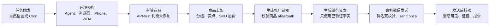
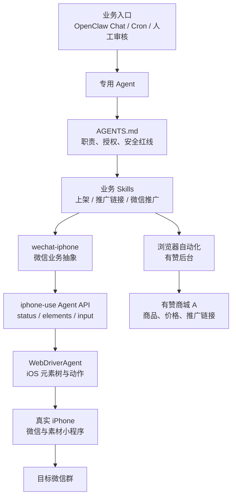
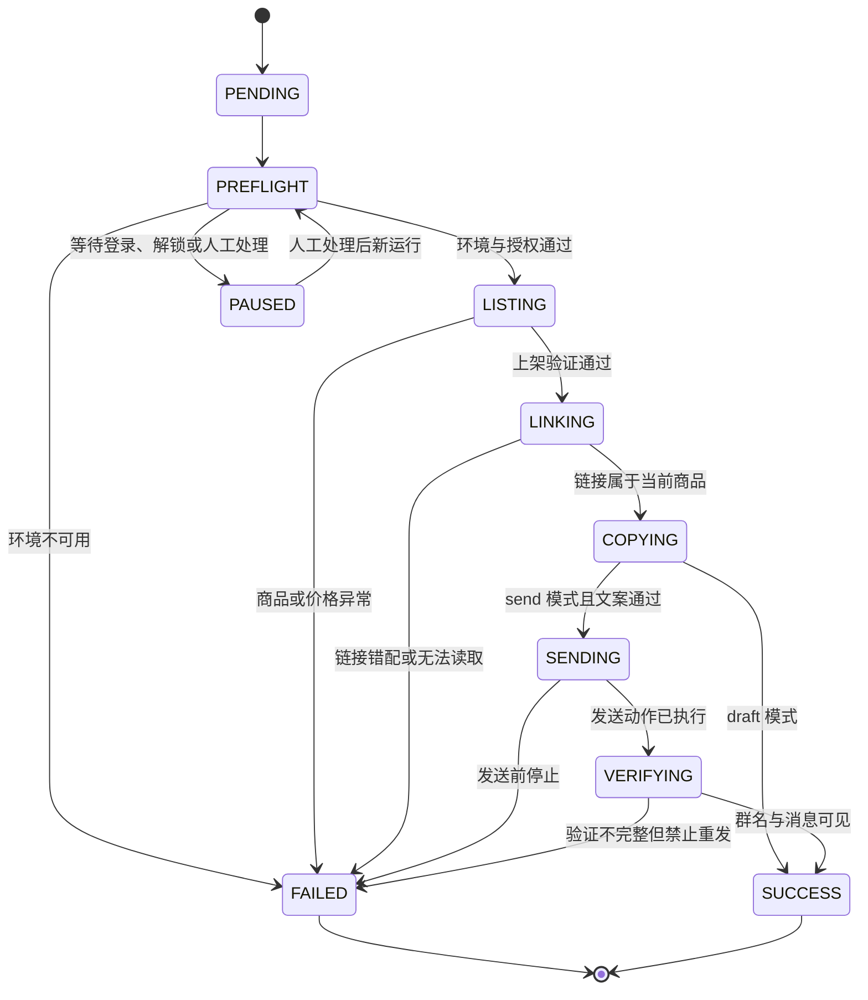

## 使用 OpenClaw + iPhone-use + WDA 实现有赞商城 A 自动化微信推广

### 业务目标

有赞商品推广通常包含多个跨系统步骤：在分销市场选品、判断商品是否已添加、设置分组与售价、生成微信小程序推广链接、编写文案、进入指定微信群发送，并在发送后确认结果。

这些步骤单独看并不复杂，但串联后存在几个明显风险：

* 商品列表状态判断错误，导致重复上架；
* SKU 价格编辑不完整，或者保存了错误价格；
* 旧弹窗、旧剪贴板残留，导致商品与推广链接错配；
* 微信搜索结果相似，消息被发送到错误群聊；
* 发送结果没有完整显示时自动重试，造成重复群发；
* 手机、WDA、浏览器或网络状态变化后仍继续执行。

本次实践的目标，是把这些动作收敛为一条可调度、可验证、可停止、可追溯的自动化链路：

```text
自然语言任务 / 定时任务
  -> 有赞选品与上架
  -> 生成并校验推广链接
  -> 生成单条营销文案
  -> 真机微信发送
  -> 发送后核验与报告
```

实现中使用以下组件：

* `OpenClaw`：理解任务、加载规则、编排 Skills、维护状态并输出报告；
* 浏览器自动化：操作已登录的有赞后台；
* `iphone-use`：提供统一的手机状态、元素树和输入动作 API；
* `WebDriverAgent`：在真实 iPhone 上读取 iOS 元素并执行动作；
* `wechat-iphone`：把底层手机动作封装为微信业务命令。

> 本文记录的是已经在真机链路上验证过的工程方法，不是无约束的“AI 自动点击”。正式发送、商品发布、支付、删除等高风险动作都必须有明确授权和停止规则。

### 实测结论

经过多轮脚本与 Skill 迭代，最终稳定下来的不是某一组坐标，而是下面几条原则：

1. 结构化数据优先于视觉猜测。选品首先读取有赞当前登录态下的榜单接口，视觉悬停只作为兜底。
2. 每个动作都采用“观察 -> 执行一个动作 -> 再观察”的短闭环，前一步没有验证成功就不进入下一步。
3. OpenClaw 负责编排，脆弱的页面细节放入专用 Skill 或脚本，避免模型临场发明恢复路径。
4. 微信正式发送每个任务只有一次机会。只要点击发送的动作已经发生，即使结果核验不完整，也禁止自动重试。
5. 群聊白名单、群名双校验、手机互斥锁、错误码和证据目录都是主流程的一部分，而不是上线后的补充项。

### 公开信息与占位符

本文按可公开发布标准脱敏，示例中的值不能直接复制到生产环境。

| 占位符 | 含义 |
| --- | --- |
| `<AGENT_NAME>` | OpenClaw 中承载本流程的专用 Agent |
| `<TARGET_WECHAT_GROUP>` | 允许发送的目标微信群 |
| `<LISTING_GROUP>` | 商品上架时使用的店铺分组 |
| `<APPLE_TEAM_ID>` | Apple Developer Team ID |
| `<IPHONE_UDID>` | 目标 iPhone 的 UDID |
| `<WDA_BUNDLE_ID>` | WDA Runner 的唯一 Bundle ID |
| `<PRODUCT_LINK>` | 当前商品的微信小程序推广链接 |
| `$IPHONE_USE_DIR` | 本机 iphone-use 项目目录 |
| `$OPENCLAW_WORKSPACE` | 专用 Agent 的工作空间 |

不要把真实 Token、UDID、Team ID、Bundle ID、群名、商品链接、聊天内容或带用户名的绝对路径提交到公开仓库。

### 前置条件

本文重点讲业务闭环，不重复 iPhone-use 和 WDA 的安装、签名、USB 中继与故障修复。相关准备过程参见：[在 Mac 上使用 iPhone-use 与 WebDriverAgent](./Using%20iPhone-use%20and%20WDA%20on%20Mac.md)。

进入业务流程前，应满足：

* 有赞账号已经登录，OpenClaw 能复用现有浏览器会话；
* iPhone 通过 USB 连接，已解锁、亮屏并信任当前 Mac；
* WDA 真机签名已经在 Xcode 中验证；
* iPhone-use daemon 和 WDA 本地端口可访问；
* 手机处于 `mode=agent`，没有其他任务占用控制权；
* 微信账号已经登录，目标群已加入 allowlist；
* 当前任务明确是 `draft` 还是 `send`。

WDA 启动参数只在本机临时设置：

```bash
export IPHONE_USE_DIR="$HOME/path/to/iphone-use"
cd "$IPHONE_USE_DIR"

WDA_KEEPALIVE=1 \
WDA_TEAM_ID="<APPLE_TEAM_ID>" \
WDA_UDID="<IPHONE_UDID>" \
./scripts/setup-wda.sh
```

WDA Bundle ID 和签名信息应优先复用 Xcode 项目中已经验证的配置，不要在公开脚本中硬编码真实值。

### 端到端业务流程

下面是单商品推广的完整路径：



关键点不是让 OpenClaw 一口气跑完所有步骤，而是让每一步只在结构化结果满足条件时进入下一步。

### 系统总体架构



各层职责如下：

| 层次 | 主要职责 | 不负责的事情 |
| --- | --- | --- |
| OpenClaw Agent | 理解意图、选择 Skill、传递参数、维护状态、决定停止 | 猜测坐标、绕过失败步骤 |
| AGENTS.md | 定义职责、授权、顺序、停止条件和报告格式 | 保存本次任务的动态页面状态 |
| 业务 Skill | 固化选品、上架、链接、文案和发送规则 | 修改无关商品或扩展任务范围 |
| 浏览器自动化 | 操作有赞后台并读取结构化数据 | 控制真机微信 |
| wechat-iphone | 打开群、发送、读取、校验、互斥和错误码 | 决定推广什么商品 |
| iphone-use | 提供手机状态、元素树、截图和输入 API | 承担有赞业务规则 |
| WDA | 在 iPhone 上执行元素级动作 | 决定发送对象或重试策略 |

这种分层可以把“模型会不会点对”转化为“接口是否满足前置条件、动作是否通过后置断言”。

### 专用 Agent 与 Skills

#### 为什么使用专用 Agent

有赞上架和微信发送都属于有副作用的操作，应该由独立 Agent 承载，避免通用会话中的记忆、工具和临时目标污染流程。

专用 Agent 每次运行都重新确认：

1. 本次商品来源或自动选品权限；
2. 目标微信群名称；
3. 本次是只生成草稿还是立即发送；
4. 主 Skill 和全部依赖 Skill；
5. 允许动作、禁止动作、成功条件和停止条件；
6. 本次发送机会是否已经消耗。

历史记忆只能帮助定位问题，不能覆盖当前 Skill。上一次商品、链接、群聊或发送结果不能直接复用。

#### Skill 分工

| Skill / 模块 | 输入 | 输出 | 必须停止的典型条件 |
| --- | --- | --- | --- |
| `youzan-product-listing-daily-goods-v1-0-0` | 榜单、品类、分组、加价规则 | 商品、SKU 售价、上架验证 | 状态不明确、价格校验失败、保存失败 |
| `youzan-product-promotion-v1-0-0` | 完整商品名或唯一标识 | 推广链接、alias/path 校验 | 匹配不唯一、旧弹窗、链接错商品 |
| `youzan-wechat-auto-promotion` | 完整任务参数 | 端到端报告 | 任一依赖返回 blocker |
| `wechat-iphone` | 群名、单行消息、模式 | `sent`、`verified`、证据 | 设备未就绪、群名不匹配、发送按钮缺失 |

主流程 Skill 只编排依赖，不重复实现每一个页面细节。

### 任务输入契约

一次执行先建立结构化任务上下文：

```json
{
  "task_id": "youzan-promo-<YYYYMMDD>-<SEQ>",
  "store": "有赞商城A",
  "product_source": "auto_select",
  "ranking": "15天热销榜",
  "category": "日用百货",
  "listing_group": "<LISTING_GROUP>",
  "price_markup": 5.00,
  "target_group": "<TARGET_WECHAT_GROUP>",
  "mode": "draft"
}
```

`mode` 只允许：

* `draft`：完成选品、上架、链接和文案，不操作微信发送；
* `send`：在所有前置校验通过后允许执行一次正式发送。

正式任务不能沿用另一条任务的发送授权。将 `draft` 改为 `send` 时，应创建明确的新运行上下文并重新预检。

### 单商品推广详细流程

#### 1. 环境预检

首先检查 `wechat-iphone` 和 iPhone-use：

```bash
wechat-iphone doctor
wechat-iphone status
```

iPhone-use 的理想状态至少满足：

```json
{
  "ok": true,
  "wda": true,
  "wda_actionable": true,
  "wda_locked": false,
  "drivable": true,
  "mode": "agent"
}
```

其中 `drivable` 比 `phone_target` 更重要。后者只能说明存在手机或镜像目标，并不代表当前可以安全输入。

业务预检还应确认：

* 当前是正确的有赞店铺；
* 浏览器标签页仍处于登录状态；
* 微信和有赞没有验证码、2FA 或风控弹窗；
* 当前没有其他手机任务持有 `controller.lock`；
* WARP、VPN 或代理没有接管 CoreDevice 和本机请求；
* 目标群存在于允许群配置。

任意一项无法确认都进入 `PAUSED` 或 `FAILED`，不能靠连续点击“试一试”。

#### 2. API-first 选品

进入有赞分销市场的目标榜单与品类后，优先观察当前登录态下的榜单接口：

```text
/v4/fenxiao/fxmarket/ranklist/getHotGoodsListMore.json
  ?category=dailySuppliers
  &scene=2
  &csrf_token=<CURRENT_CSRF_TOKEN>
```

选择规则：

1. 要求响应成功且 `data` 是数组；
2. 从 `data[0]` 开始，按接口原始顺序逐条检查；
3. 记录同一条数据的 `title`、`alias`、`algId`、`isAdded`；
4. `isAdded === true` 时跳过；
5. 找到第一条字段完整且 `isAdded === false` 的商品后立即停止扫描；
6. 使用同一条记录的 `alias` 和 `algId` 构造详情页；
7. 打开详情页后再次核对完整商品名和“上架到店铺”入口。

不要按销量、标题偏好、利润率或页面位置重新排序，也不要把商品文案中的“无添加”误判成上架状态。

只有接口不可用、字段缺失或与页面明显矛盾时，才使用列表卡片悬停徽标作为 fallback。fallback 同样要求读到明确的“未添加”状态，不能把没有触发悬停的截图当作证据。

#### 3. 上架、卖点与价格

上架时只处理当前商品：

1. 选择 `<LISTING_GROUP>`；
2. 确认商品名与已选商品一致；
3. 保留已有且可验证的卖点，或者在正确的“商品卖点创作”面板生成；
4. 逐个读取已启用 SKU 的默认售价；
5. 设置目标售价为默认售价加 `5.00`；
6. 重新读取 DOM 中的实际值；
7. 确认没有价格上限、必填项、库存或 SKU 校验错误；
8. 保存后重新读取页面状态验证结果。

有赞编辑页可能同时出现多个“智能生成”按钮。点击前先定位“商品卖点”字段，点击后必须验证面板标题确实是“商品卖点创作”。如果打开了商品名称或图片面板，应关闭并验证面板消失后再继续。

价格输入不要依赖盲目的 `fill`。某些自定义输入组件会出现追加值或页面状态未同步，应使用原生 value setter 并触发 `input`、`change`，然后重新读取实际值。

如果页面显示“价格最大不能超过 X”，不要强行保存 `+5.00`。应遵守页面允许范围，无法确定时停止并要求人工确认。

#### 4. 生成并校验推广链接

推广链接生成不是“点到复制就结束”，而是一次商品身份校验：

1. 进入商品管理前读取当前商品的完整名称；
2. 关闭可能残留的旧推广弹窗；
3. 使用完整商品名筛选，不能只用容易重复的关键词；
4. 确认第一条匹配结果和目标商品完全一致；
5. 打开“推广 -> 微信小程序 -> 生成链接”；
6. 等待生成状态变为“复制”；
7. 从当前 DOM、输入框或受控剪贴板读取链接；
8. 校验当前链接携带的 alias/path 属于本次商品；
9. 把链接写入当前 `task_id` 的上下文。

如果链接无法证明属于当前商品，主流程立即停止，不能进入文案或微信阶段。

#### 5. 生成单行营销文案

单商品文案只使用已经验证的商品名、价格、规格、卖点和推广链接：

```text
{商品名称}上新啦！{可验证卖点或使用场景}，点击小程序查看详情：<PRODUCT_LINK>
```

正式传给微信脚本前需要：

* 把 `\r\n` 和 `\r` 统一为 `\n`；
* 把一个或多个换行压缩成空格；
* 合并连续空格；
* 确保最终是一个物理单行字符串；
* 避免医疗功效、虚假稀缺、最低价、库存和运费承诺。

这样做是因为部分微信设置会把回车解释为发送动作，多行文本可能被拆成多条消息。

#### 6. dry-run 与正式发送

先用独立演练任务验证群名、输入框和发送按钮，但不点击发送：

```bash
wechat-iphone send \
  --group "<TARGET_WECHAT_GROUP>" \
  --message "单行推广文案 <PRODUCT_LINK>" \
  --dry-run
```

`--dry-run` 会准备并校验草稿，但不执行发送按钮。演练结束后由人工检查；正式发送应作为新的、重新预检的 `send` 运行，不在同一个正式任务中反复调用发送命令。

正式任务只调用一次：

```bash
wechat-iphone send \
  --group "<TARGET_WECHAT_GROUP>" \
  --message "单行推广文案 <PRODUCT_LINK>"
```

不可变规则：

* 正式发送命令每个任务最多调用一次；
* `sent=true, verified=true`：成功，不再检查或补发；
* `sent=true, verified=false`：发送动作已经发生，报告验证不完整，绝不重试；
* `sent=false`：报告失败并等待人工介入，不自行补发；
* 退出码非零：保留现场，不使用 WDA、坐标或其他工具补点发送按钮。

#### 7. 发送后核验与报告

发送动作返回成功不等于业务完成。脚本会重新读取元素树，验证：

* 页面顶部仍然是 `<TARGET_WECHAT_GROUP>`；
* 本次消息关键文本出现在聊天区域；
* 发送动作的传输结果可解析；
* 本次证据文件已经保存。

脚本原始输出中的 `group_still_open` 可以在业务报告中归一化为 `group_verified`：

```json
{
  "ok": true,
  "task_id": "youzan-promo-<YYYYMMDD>-<SEQ>",
  "product": {
    "name": "<PRODUCT_NAME>",
    "listing_group": "<LISTING_GROUP>",
    "price_markup": 5.00,
    "promotion_link": "<PRODUCT_LINK>"
  },
  "wechat": {
    "group": "<TARGET_WECHAT_GROUP>",
    "sent": true,
    "verified": true,
    "group_verified": true,
    "message_visible": true,
    "warning": null
  },
  "evidence_dir": "$HOME/.iphone-use/wechat-iphone/tasks/<TASK_ID>"
}
```

### wechat-iphone 业务抽象层

OpenClaw 不直接操作 WDA 原始接口，而是调用稳定的微信业务命令：

```bash
wechat-iphone doctor
wechat-iphone status
wechat-iphone open-group --group "<TARGET_WECHAT_GROUP>"
wechat-iphone send --group "<TARGET_WECHAT_GROUP>" --message "消息" --dry-run
wechat-iphone read --group "<TARGET_WECHAT_GROUP>" --pages 1
wechat-iphone elements --group "<TARGET_WECHAT_GROUP>"
```

#### 群聊 allowlist

允许群配置与脚本分离：

```json
{
  "groups": [
    "<TARGET_WECHAT_GROUP>"
  ]
}
```

群名不在 allowlist 时返回 `GROUP_NOT_ALLOWED`，不进入微信搜索和输入阶段。

#### 手机互斥锁

`controller.lock` 保证同一时间只有一个任务控制真机。锁中记录进程信息，脚本退出时通过 `trap` 清理。

如果锁已存在，返回 `PHONE_CONTROLLER_BUSY`。不能为了抢占手机而直接删除一个仍然有效的锁。

#### 草稿冲突检测

输入前、聚焦后、输入后和发送前都读取元素树，判断输入框状态：

* `empty`：允许输入一次；
* `exact`：草稿已经是目标文案，跳过重复输入；
* `duplicate`：完整文案已经重复拼接，停止；
* `contains` 或 `different`：输入框有冲突内容，停止；
* `unknown`：无法证明安全，停止。

这一步解决了“上一次 dry-run 留下草稿”和“文本输入 API 被重复调用”造成的重复拼接问题。

#### 群名双校验

打开群聊时先从聊天列表搜索，再读取顶部导航栏完整名称。输入消息后、点击发送前还要再次验证群名，避免页面跳转或用户接管后继续发送。

只点击搜索结果第一条并不等于验证成功。第一条结果必须和目标群完整匹配。

#### 元素优先，坐标兜底

WDA 可用时，优先从 `/agent/elements` 读取按钮、文本框和导航栏，并按元素执行动作。只有元素没有可用 label 且页面已经确认时，才使用经过校准的归一化坐标。

发送按钮属于高风险控件，脚本会在键盘保持展开的状态下重复读取元素树，而不是用固定坐标盲点。查找达到上限仍未发现按钮时返回 `SEND_BUTTON_NOT_FOUND`。

### 任务状态机



`FAILED` 不等于“继续换一种方式点”。它表示当前任务停止并保留现场；需要恢复时创建新任务，从预检重新开始。

### 错误码设计

| 错误码 | 来源 | 含义 | 处理方式 |
| --- | --- | --- | --- |
| `IPHONE_USE_UNREACHABLE` | 手机层 | 无法读取 iPhone-use 状态 | 检查 daemon、Token 和本机代理 |
| `IPHONE_NOT_READY` | 手机层 | WDA、锁屏或 Agent 模式不满足 | 解锁亮屏并重新预检 |
| `PHONE_CONTROLLER_BUSY` | 手机层 | 另一个任务持有控制锁 | 等待，不并发控制手机 |
| `GROUP_NOT_ALLOWED` | 微信层 | 群聊不在 allowlist | 修改受控配置后创建新任务 |
| `TARGET_GROUP_NOT_VERIFIED` | 微信层 | 搜索后无法确认目标群 | 停止发送并保留元素树 |
| `TARGET_GROUP_LOST` | 微信层 | 输入前后页面已离开目标群 | 停止，不继续点击 |
| `DRAFT_MESSAGE_CONFLICT` | 微信层 | 输入框已有其他内容 | 人工清理后重新运行 |
| `DRAFT_MESSAGE_DUPLICATED` | 微信层 | 检测到重复拼接文案 | 停止，禁止发送 |
| `SEND_BUTTON_NOT_FOUND` | 微信层 | 元素树中找不到发送按钮 | 报告未发送，不手动补点 |
| `PRODUCT_NOT_FOUND` | 有赞层 | 没有符合规则的未添加商品 | 调整品类或人工处理 |
| `PRODUCT_LINK_MISMATCH` | 有赞层 | 链接 alias/path 不属于当前商品 | 关闭旧弹窗后新建任务 |
| `MESSAGE_NOT_VERIFIED` | 业务层 | 发送后未发现关键文本 | 标记异常，不自动重发 |
| `VPN_TUN_ACTIVE` | 环境层 | VPN/TUN 干扰 CoreDevice | 断开后重新预检 |

错误码应进入最终报告，而不是只写在 stderr 日志里。

### 证据目录

每个 `task_id` 使用独立目录：

```text
$HOME/.iphone-use/wechat-iphone/tasks/<TASK_ID>/
├── task.json
├── steps.jsonl
├── product.json
├── promotion-link.json
├── message.txt
├── before-send-elements.json
├── after-send-elements.json
├── screenshots/
└── report.json
```

`steps.jsonl` 至少记录阶段、动作、开始时间、结束时间、结构化结果和错误码。截图和元素树只用于定位本次任务，不应混入另一个任务的判断。

对外分享日志前，应再次清理群名、商品链接、设备标识、账号信息和个人路径。

### 实践中遇到的问题

#### 旧推广弹窗和旧剪贴板串商品

现象是界面显示已经复制成功，但得到的仍是上一次商品链接。

最终规则是：生成前关闭残留弹窗，使用完整商品名筛选，生成后校验当前 alias/path，不能把“剪贴板有内容”当作成功。

#### 多个“智能生成”按钮容易点错

商品名称、卖点和图片区域可能都有外观相似的按钮。必须先定位“商品卖点”字段，再在相邻容器内寻找按钮，并在点击后断言面板标题。

错误面板关闭也需要验证。只在日志里写“准备关闭”不代表页面已经恢复。

#### 右侧面板会遮挡价格输入

即使卖点已经应用，创作面板没有真正关闭时，SKU 输入可能被遮挡或事件没有正确提交。价格阶段必须以“面板已消失”为前置条件。

#### WDA、XCTest 与 iPhone 镜像争用

WDA 的 XCTest Runner 会占用设备远程会话，Agent 模式下 iPhone 镜像中断属于预期现象。不要在 WDA 运行时反复尝试恢复镜像。

WARP 或其他 VPN 还可能破坏 CoreDevice 隧道，使 WDA 安装后立即退出。启动前运行 `doctor`，本地请求统一使用 `--noproxy "*"`。

#### 多行文案被拆成多条消息

部分微信环境把回车作为发送。解决方法不是逐行输入，而是在业务层先压缩为单行，并让脚本再次归一化。

多商品的长文案属于另一条经过验证的脚本流程，不能直接套用单商品 send 的输入策略。

#### 核验不完整不代表可以重发

点击发送后，元素树可能因为消息过长、动画或虚拟列表而没有立即返回完整气泡。如果此时根据“没看到”自动重试，就会产生重复消息。

因此脚本先把“是否执行过发送动作”和“是否完整核验”分开：`sent=true, verified=false` 仍然消耗本次发送机会。

#### 失败后模型容易偏离 Skill

长任务失败后，模型可能尝试切换页面、手动点按钮或换工具补救。解决办法是把硬约束同时放入 `AGENTS.md`、主 Skill 和执行脚本，并用结构化错误码让上层只能停止或进入明确的人工接管点。

### 素材小程序的多商品扩展

在单商品链路之外，还验证了一条素材小程序多商品推广流程。本文用 `<MATERIAL_MINI_PROGRAM>` 代称真实小程序。

扩展流程分为四个独立场景：

1. 从“新品首发”等页面采集前 50 个有效商品名称；
2. 在同一安全品类中选择 6 件商品，逐个提取名称、价格、规格和小程序链接；
3. 根据已验证事实生成组合文案并发送到目标群；
4. 从最终文案读取链接，逐个打开商品并分享小程序卡片。

自动选品会先排除明显的规格片段，以及未经用户明确允许的酒水、保健品、医疗器械、药品、成人用品和带强医疗功效暗示的商品。无法凑满 6 件安全同类商品时直接停止，不硬凑相似商品。

组合文案结构示例：

```text
⏰{当前时间}{商品总结}综合开团！

1. {商品名称}｜{商品价格}
{约 40 字、基于已验证事实的文案}
<PRODUCT_LINK>

... 共 6 件商品 ...
```

逐链接分享脚本使用最终文案作为唯一数据源，并为每个链接写入一条 `results.jsonl`：

```json
{"index": 1, "product_link": "<PRODUCT_LINK>", "ok": true, "warning": null}
```

最新一次完整实践中，6 条逐链接分享结果均为 `ok=true`。这里仅披露结构化结论，不公开真实商品、群聊、链接或聊天证据。

多商品流程和单商品流程应使用不同 Skill，避免把长文案、卡片分享和单条文本发送混成一个不可控动作。

### 定时运行与去重

当手工流程稳定后，可以由 OpenClaw Cron 触发，但仍要遵守：

* 使用完整 Agent Turn，并明确绑定 `<AGENT_NAME>`；
* 每次运行重新读取 workspace 的 `AGENTS.md` 和依赖 Skills；
* payload 显式传入 `task_id`、品类、目标群、模式和去重窗口；
* 同一手机链路串行执行，不允许两个 Cron 并发；
* 已推广商品以商品 id/alias 为主键，名称只作为辅助字段；
* 成功任务不能再次进入发送阶段；
* `UNKNOWN` 或核验不完整的任务也不能自动重发；
* 定时任务遇到登录、验证码、风控、锁屏或 WDA 异常时进入人工接管。

建议先完成不少于 20 次独立 dry-run 和 10 次正式单商品测试，并确认没有发错群、重复发送或价格错误，再开启无人值守的定时触发。

### 验收清单

正式运行前后逐项确认：

* [ ] 专用 Agent 可用，`AGENTS.md` 和当前 Skills 已重新加载；
* [ ] 有赞后台已登录，当前店铺是有赞商城 A；
* [ ] iPhone 已连接、解锁、亮屏，WDA 状态正常；
* [ ] iPhone-use 满足 `wda=true`、`drivable=true`、`mode=agent`；
* [ ] 当前没有其他任务持有手机锁；
* [ ] API-first 选中了第一条完整且 `isAdded === false` 的商品；
* [ ] 商品分组为 `<LISTING_GROUP>`；
* [ ] 所有 SKU 价格均已重新读取并验证；
* [ ] 推广链接 alias/path 属于当前商品；
* [ ] 文案只包含可验证事实，单商品文案没有换行；
* [ ] 目标群 `<TARGET_WECHAT_GROUP>` 在 allowlist 中；
* [ ] 正式任务尚未消耗发送机会；
* [ ] 发送前后均验证了群名；
* [ ] `sent` 和 `verified` 分开记录，没有因为核验不完整重发；
* [ ] 报告、元素树和证据目录已经保存；
* [ ] 对外内容不包含真实凭证和个人环境信息。

### 后续演进

当前 `wechat-iphone` 已经证明：上层 Agent 不需要理解所有 WDA 原始接口，只需要稳定的 `open-group`、`send`、`read` 和 `elements` 业务动作。

下一步可以继续抽象为通用 Phone Automation Layer：

* Observation：融合 WDA 元素树、截图、OCR 和页面签名；
* Action DSL：统一 `launch`、`tap`、`type`、`paste`、`scroll`、`share`、`wait_for`、`assert`；
* Planner：OpenClaw 生成短计划，而不是长坐标序列；
* Executor：逐动作执行、条件等待、校验和错误分类；
* Skill Recorder：把成功的人工操作固化为可参数化 Skill；
* Safety Guard：应用白名单、目标验证、高风险动作审批和速率限制；
* Memory & Metrics：记录动作耗时、失败模式和成功率，但不复用跨任务的动态业务数据。

这些属于后续设计方向，不代表当前版本已经完整实现。

### 参考资料

* [在 Mac 上使用 iPhone-use 与 WebDriverAgent](./Using%20iPhone-use%20and%20WDA%20on%20Mac.md)
* [iphone-use](https://github.com/leeguooooo/iphone-use)
* [Appium WebDriverAgent](https://github.com/appium/WebDriverAgent)
* 本地实践中的 OpenClaw `AGENTS.md`、有赞 Skills、`wechat-iphone` 脚本和脱敏运行记录
