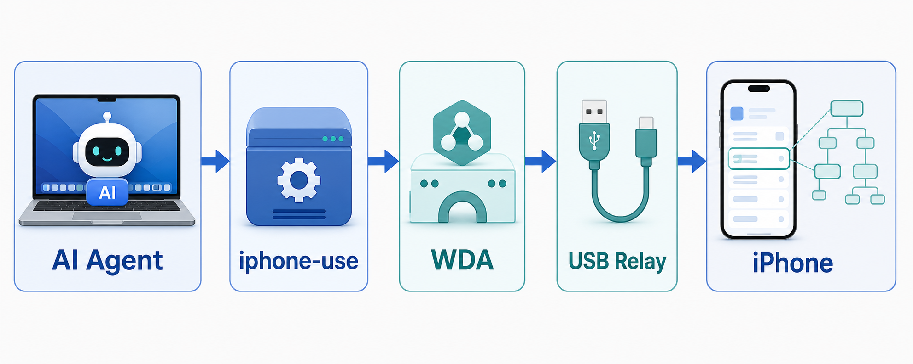
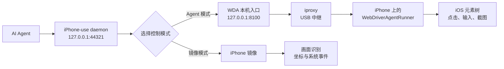
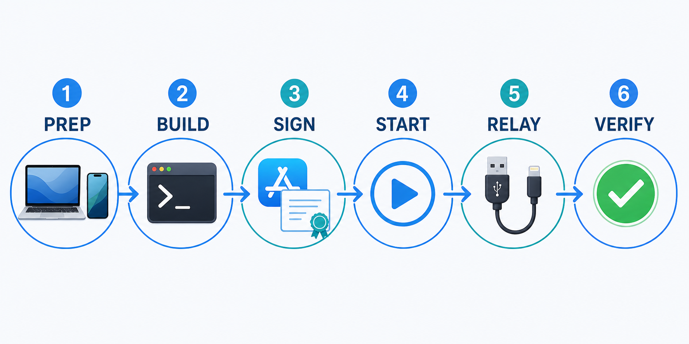
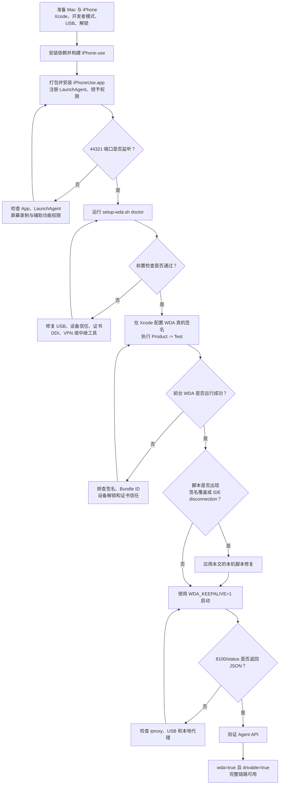
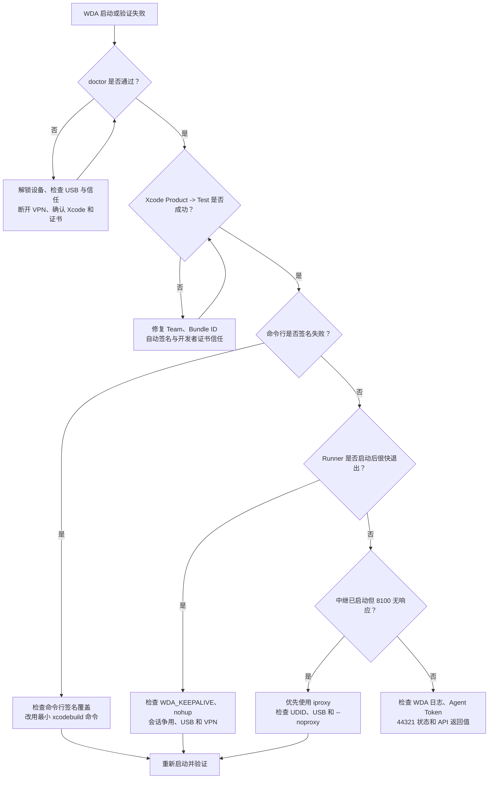

## 在 Mac 上使用 iPhone-use 与 WebDriverAgent

### 介绍

* [iPhone-use](https://github.com/leeguooooo/iphone-use) 可以让 AI Agent 通过 macOS 控制真实 iPhone。它既能通过 iPhone 镜像执行基于画面的操作，也能接入 [WebDriverAgent](https://github.com/appium/WebDriverAgent)（下文简称 `WDA`），读取 iOS 元素树并在手机端完成点击、输入和截图。

* 本文记录一套在真机上从零安装并最终启动成功的实践过程，重点包括：

  * 构建、安装并授权 `iPhone-use`；
  * 配置 `WDA` 真机签名；
  * 使用 USB `iproxy` 将本机 `8100` 端口转发到 iPhone；
  * 修复命令行签名覆盖和 `XCTest` 会话断开问题；
  * 启动、验证、停止和故障排查。

* 本文中的环境标识全部使用占位符：

  | 占位符 | 含义 |
  | --- | --- |
  | `<APPLE_TEAM_ID>` | Apple Developer Team ID |
  | `<IPHONE_UDID>` | 目标 iPhone 的 UDID |
  | `<WDA_BUNDLE_ID>` | 为 `WebDriverAgentRunner` 配置的唯一 Bundle ID |
  | `<AGENT_TOKEN>` | iPhone-use Agent API 的访问令牌 |
  | `<APP_BUNDLE_ID>` | 需要启动的 iOS App Bundle ID |
  | `<PHONE_IP>` | WDA 日志中显示的 iPhone 地址，仅用于识别日志，不应写入公开笔记 |
  | `$IPHONE_USE_DIR` | 当前 Shell 中指向 iPhone-use 项目目录的环境变量 |

> 不要把真实 Team ID、UDID、Bundle ID、Token、证书信息或本机绝对路径提交到公开仓库。

### 日常命令速查

* 先设置项目目录。请将示例路径替换为本机实际目录，但不要把带用户名的绝对路径写入笔记：

  ```bash
  export IPHONE_USE_DIR="$HOME/path/to/iphone-use"
  cd "$IPHONE_USE_DIR"
  ```

* 启动 `WDA`：

  ```bash
  WDA_KEEPALIVE=1 \
  WDA_TEAM_ID="<APPLE_TEAM_ID>" \
  WDA_UDID="<IPHONE_UDID>" \
  ./scripts/setup-wda.sh
  ```

  `WDA_KEEPALIVE=1` 会让启动脚本保持运行，以维持 `xcodebuild` 和 `XCTest` 会话。启动成功后不要关闭该终端。

* 查看状态：

  ```bash
  ./scripts/setup-wda.sh status
  ```

* 停止 `WDA`：

  ```bash
  ./scripts/setup-wda.sh stop
  ```

### 工作链路

下图展示从 AI Agent 到 iPhone 元素树的主要数据通道：



完整链路和模式分支如下：



其中：

* `iPhone-use daemon` 提供 `/agent` API；
* `WDA` 负责读取元素树，并在手机端执行点击、输入和截图；
* `iproxy` 通过 USB 将 Mac 的 `8100` 端口映射到 iPhone 的 `8100` 端口；
* `WebDriverAgentRunner` 是持续运行的 `XCTest`，控制端连接断开后 Runner 也会退出。

### 前置准备

#### Mac 侧

* 安装完整版本的 Xcode，并至少启动一次完成组件初始化。在 Xcode 的 `Settings -> Accounts` 中登录可用于真机签名的开发者账号。

* 检查 Xcode 和命令行开发目录：

  ```bash
  xcode-select -p
  xcodebuild -version
  ```

* 安装 USB 中继工具。`iproxy` 由 `libimobiledevice` 提供；`socat` 可作为没有 USB 中继时的 Wi-Fi 方案：

  ```bash
  brew install libimobiledevice socat
  ```

* 安装 Rust 工具链：

  ```bash
  curl --proto '=https' --tlsv1.2 -sSf https://sh.rustup.rs | sh
  source "$HOME/.cargo/env"
  cargo --version
  ```

#### iPhone 侧

* 使用稳定的数据线连接 Mac，首次连接时选择“信任此电脑”；
* 在“设置 -> 隐私与安全性 -> 开发者模式”中开启开发者模式；
* 构建、安装和启动期间保持 iPhone 解锁、亮屏；
* 如果系统要求信任开发者 App，在“设置 -> 通用 -> VPN 与设备管理”中信任对应的开发者证书；
* `WDA` 运行期间不要同时使用 Xcode GUI、iPhone 镜像或其他自动化工具争用同一个设备会话。

#### VPN 和代理

* WARP 或其他 VPN 可能影响 Xcode CoreDevice 建立真机隧道。如果设备长期停留在 `Connecting`，或 Runner 启动后立即断开，应先断开 VPN 再重试。

* 全局 HTTP、HTTPS 或 SOCKS 代理可能影响访问本机端口。验证 `44321` 和 `8100` 时统一使用：

  ```bash
  curl --noproxy "*" ...
  ```

### 从零安装到可用的流程

首次部署可以概括为 `PREP -> BUILD -> SIGN -> START -> RELAY -> VERIFY` 六个阶段：



下面的流程图给出了每个阶段的判断条件。每个判断节点都通过后，再进入下一步：



### 安装 iPhone-use

#### 下载项目

```bash
mkdir -p "$HOME/src"
cd "$HOME/src"

git clone https://github.com/leeguooooo/iphone-use.git
cd iphone-use

export IPHONE_USE_DIR="$PWD"
```

#### 构建可执行文件

```bash
cd "$IPHONE_USE_DIR"
cargo build --release --bin iphone-use
```

构建完成后，主程序位于：

```text
target/release/iphone-use
```

#### 打包并安装 macOS App

```bash
cd "$IPHONE_USE_DIR"

./scripts/make-app.sh
./install.sh ./iPhoneUse.app
```

安装脚本会安装 App、注册 LaunchAgent，并引导授予以下权限：

* “系统设置 -> 隐私与安全性 -> 屏幕录制”；
* “系统设置 -> 隐私与安全性 -> 辅助功能”。

权限与 App 的签名身份和 Bundle ID 关联。授权后如果服务没有立即生效，可以退出并重新打开 `iPhoneUse.app`，或者重新加载 LaunchAgent。

### 验证 iPhone-use daemon

#### 检查端口

```bash
lsof -nP -iTCP:44321 -sTCP:LISTEN
```

出现 `LISTEN` 记录表示 daemon 已经启动。

#### 准备 Agent Token

部分版本会将 Agent Token 保存到 `$HOME/.iphone-use/agent-token`。只把 Token 读入环境变量，不要打印或写入文档：

```bash
TOKEN="$(cat "$HOME/.iphone-use/agent-token")"
printf 'Token length: %s\n' "${#TOKEN}"
```

如果当前版本没有生成该文件，应使用安装时配置的 `PHONE_REMOTE_AGENT_TOKEN` 或安装程序生成的访问凭证。不要把凭证明文放入 Shell 历史、截图或 Git 仓库。

#### 查询状态

```bash
curl --noproxy "*" -sS \
  -H "Authorization: Bearer $TOKEN" \
  http://127.0.0.1:44321/agent/status \
  | python3 -m json.tool
```

`WDA` 尚未接入时，状态中的 `wda` 可能为 `false`，这是正常现象。

### 配置 WebDriverAgent 真机签名

#### 运行环境检查

进入项目目录，使用脱敏后的参数运行 `doctor`：

```bash
cd "$IPHONE_USE_DIR"

WDA_TEAM_ID="<APPLE_TEAM_ID>" \
WDA_UDID="<IPHONE_UDID>" \
./scripts/setup-wda.sh doctor
```

`doctor` 会检查 Xcode、开发团队、USB 设备、中继工具、设备信任状态以及可能影响 CoreDevice 的 VPN。

首次执行时，脚本会准备 `WebDriverAgent`。默认目录通常为：

```text
$HOME/.iphone-use/WebDriverAgent
```

#### 在 Xcode 中完成签名

打开项目：

```bash
open "$HOME/.iphone-use/WebDriverAgent/WebDriverAgent.xcodeproj"
```

在 Xcode 中完成以下配置：

1. 顶部 Scheme 选择 `WebDriverAgentRunner`；
2. 运行设备选择当前连接的物理 iPhone；
3. 左侧 Target 选择 `WebDriverAgentRunner`；
4. 在 `Signing & Capabilities` 中勾选 `Automatically manage signing`；
5. Team 选择自己的开发团队；
6. Bundle Identifier 设置为唯一的 `<WDA_BUNDLE_ID>`；
7. 执行 `Product -> Test`，确认 WDA 能安装到真机并开始运行。

> 只选中 `WebDriverAgentRunner` Target 并不代表顶部 Scheme 已经切换。顶部必须明确显示 `WebDriverAgentRunner`，不能是其他 Scheme。

#### 用前台命令验证 WDA

完全退出 Xcode GUI，避免它与命令行争用 `XCTest` 会话：

```bash
osascript -e 'tell application "Xcode" to quit'
```

进入 WDA 目录，使用不覆盖项目签名配置的最小命令进行测试：

```bash
cd "$HOME/.iphone-use/WebDriverAgent"

xcodebuild \
  -project WebDriverAgent.xcodeproj \
  -scheme WebDriverAgentRunner \
  -destination "platform=iOS,id=<IPHONE_UDID>" \
  test
```

成功标志包括：

* 编译和签名完成；
* iPhone 上出现 `WebDriverAgentRunner`；
* 终端出现 `Running tests...`；
* 日志出现 `ServerURLHere->http://<PHONE_IP>:8100<-ServerURLHere`。

不要关闭这个前台命令。`xcodebuild` 退出后，手机端 WDA Runner 也会停止。

### 本机实测的 setup-wda.sh 修复

以下修改用于解决特定环境中遇到的问题：Xcode 项目内已经保存了可用的签名配置，但脚本仍通过命令行覆盖签名；同时后台启动方式导致 `xcodebuild` 失去稳定的父进程，最终出现 `IDE disconnection`。

新版脚本可能已经调整实现，修改前应先比较当前脚本。不要在没有复现相同问题时机械套用本节。

#### 备份脚本

```bash
cp \
  "$IPHONE_USE_DIR/scripts/setup-wda.sh" \
  "$IPHONE_USE_DIR/scripts/setup-wda.sh.original"
```

#### 移除命令行签名覆盖

在本次实测环境中，以下命令行参数会覆盖 Xcode 项目中已经生效的 Target 级签名配置，从而触发 `No Account for Team`、`No signing certificate` 或 `No profiles`：

```text
-allowProvisioningUpdates
-allowProvisioningDeviceRegistration
DEVELOPMENT_TEAM=...
PRODUCT_BUNDLE_IDENTIFIER=...
CODE_SIGN_IDENTITY=...
CODE_SIGN_STYLE=...
```

删除这些覆盖后，核心命令应接近：

```bash
xcodebuild \
  -project WebDriverAgent.xcodeproj \
  -scheme WebDriverAgentRunner \
  -destination "platform=iOS,id=$WDA_UDID" \
  test > "$RUN_LOG" 2>&1 &
```

这不是通用规则。对于尚未在 Xcode 中完成自动签名的新环境，官方流程可能仍需要 `-allowProvisioningUpdates` 等参数。判断标准是：Xcode GUI 中 `Product -> Test` 已经成功，但脚本的命令行构建因签名覆盖而失败。

#### 移除 nohup 和立即退出的子 Shell

容易出问题的结构类似：

```bash
(
  cd "$WDA_DIR"
  nohup xcodebuild ... test > "$RUN_LOG" 2>&1 &
  echo $! > "$RUNNER_PID_FILE"
)
```

在本次实测环境中，子 Shell 退出后 `xcodebuild` 变成孤儿进程，随后手机端出现 `DTXConnection` 或 `Exiting due to IDE disconnection`。

调整为由 `setup-wda.sh` 直接保存并维持 `xcodebuild` 子进程：

```bash
ORIGINAL_DIR="$PWD"
cd "$WDA_DIR"

xcodebuild \
  -project WebDriverAgent.xcodeproj \
  -scheme WebDriverAgentRunner \
  -destination "platform=iOS,id=$WDA_UDID" \
  test > "$RUN_LOG" 2>&1 &

RUNNER_PID=$!
echo "$RUNNER_PID" > "$RUNNER_PID_FILE"

cd "$ORIGINAL_DIR"
```

启动时再设置 `WDA_KEEPALIVE=1`，让主脚本持续运行并维持 `XCTest` 控制连接。

#### 同步固定脚本副本

如果当前安装流程会把脚本复制到 `$HOME/.iphone-use`，修改后同步该副本：

```bash
cp \
  "$IPHONE_USE_DIR/scripts/setup-wda.sh" \
  "$HOME/.iphone-use/setup-wda.sh"

chmod +x \
  "$IPHONE_USE_DIR/scripts/setup-wda.sh" \
  "$HOME/.iphone-use/setup-wda.sh"
```

检查最终结果：

```bash
grep -n -A15 -B3 \
  "xcodebuild -project" \
  "$IPHONE_USE_DIR/scripts/setup-wda.sh"
```

应确认：没有不需要的签名覆盖，没有 `nohup`，并且当前脚本直接保存 `RUNNER_PID`。

### 配置 USB iproxy 中继

#### 检查工具和设备

```bash
command -v iproxy
idevice_id -l
```

`idevice_id -l` 能列出目标设备，表示 `usbmuxd` 和 `iproxy` 可以使用。不要把输出中的真实 UDID 保存到文档或日志截图。

#### 手动测试中继

保持 WDA 的前台 `xcodebuild` 命令运行，在另一个终端启动中继：

```bash
iproxy \
  8100 \
  8100 \
  -u "<IPHONE_UDID>"
```

再打开一个终端验证：

```bash
curl --noproxy "*" -sS --max-time 5 \
  http://127.0.0.1:8100/status \
  | python3 -m json.tool
```

能返回 JSON 表示 Mac 的 `127.0.0.1:8100` 已经通过 USB 映射到 iPhone 上的 WDA。正式启动脚本时，应优先看到 `iproxy (USB) relay`，而不是依赖手机局域网地址的 `socat relay`。

### 启动完整链路

#### 启动前检查

* 退出 Xcode GUI；
* 关闭 iPhone 镜像以及其他会占用设备会话的工具；
* 保持 iPhone USB 连接、解锁和亮屏；
* 暂时断开 WARP 或其他可能干扰 CoreDevice 的 VPN；
* 确认 `$IPHONE_USE_DIR` 指向当前项目目录。

#### 停止旧会话

```bash
cd "$IPHONE_USE_DIR"
./scripts/setup-wda.sh stop
```

#### 正式启动

```bash
cd "$IPHONE_USE_DIR"

WDA_KEEPALIVE=1 \
WDA_TEAM_ID="<APPLE_TEAM_ID>" \
WDA_UDID="<IPHONE_UDID>" \
./scripts/setup-wda.sh
```

不要额外传入 `WDA_BUNDLE_ID`。本次实测环境直接复用 Xcode 项目中已经验证成功的 Bundle ID 和签名配置。

#### 查看日志

```bash
tail -f "$HOME/.iphone-use/wda-runner.log"
```

成功时，Runner 日志应包含：

```text
Running tests...
ServerURLHere->http://<PHONE_IP>:8100<-ServerURLHere
```

脚本终端应显示类似结果：

```text
WDA serving at http://<PHONE_IP>:8100
iproxy (USB) relay started
WDA reachable at http://127.0.0.1:8100
```

### 验证 WDA 和 Agent API

#### 验证 WDA

```bash
curl --noproxy "*" -sS --max-time 5 \
  http://127.0.0.1:8100/status \
  | python3 -m json.tool
```

#### 验证 iPhone-use

```bash
TOKEN="$(cat "$HOME/.iphone-use/agent-token")"

curl --noproxy "*" -sS \
  -H "Authorization: Bearer $TOKEN" \
  http://127.0.0.1:44321/agent/status \
  | python3 -m json.tool
```

理想状态应包含以下含义：

```json
{
  "wda": true,
  "wda_actionable": true,
  "wda_locked": false,
  "drivable": true,
  "mode": "agent"
}
```

不同版本返回的字段可能有差异，核心判断是 `wda` 和 `drivable` 为 `true`。

#### 切换到 Agent 模式

```bash
curl --noproxy "*" -sS \
  -H "Authorization: Bearer $TOKEN" \
  -H "Content-Type: application/json" \
  -X POST \
  http://127.0.0.1:44321/agent/mode \
  -d '{"mode":"agent"}'
```

#### 测试启动 App

```bash
curl --noproxy "*" -sS \
  -H "Authorization: Bearer $TOKEN" \
  -H "Content-Type: application/json" \
  -X POST \
  http://127.0.0.1:44321/agent/input \
  -d '{"type":"launch_app","bundle":"<APP_BUNDLE_ID>"}'
```

#### 验证元素树

```bash
curl --noproxy "*" -sS \
  -H "Authorization: Bearer $TOKEN" \
  http://127.0.0.1:44321/agent/elements \
  | python3 -m json.tool \
  | head -100
```

能看到按钮、文字和输入框等节点，说明 `iPhone-use -> WDA -> iOS 元素树` 链路已经打通。

### 日常运维

#### 状态检查

```bash
cd "$IPHONE_USE_DIR"
./scripts/setup-wda.sh status

curl --noproxy "*" -sS \
  http://127.0.0.1:8100/status
```

#### 停止

```bash
cd "$IPHONE_USE_DIR"
./scripts/setup-wda.sh stop
```

停止后，WDA 模式释放设备会话，才能恢复使用 iPhone 镜像或其他依赖设备远程会话的工具。

#### 日志位置

| 日志 | 默认位置 |
| --- | --- |
| WDA 构建和运行日志 | `$HOME/.iphone-use/wda-runner.log` |
| WDA 控制中继日志 | `$HOME/.iphone-use/wda-relay.log` |
| WDA MJPEG 中继日志 | `$HOME/.iphone-use/wda-mjpeg-relay.log` |
| iPhone-use LaunchAgent 日志 | `$HOME/Library/Logs/iPhoneUse/`，以安装脚本实际配置为准 |

### 常见故障

#### 故障定位流程图

遇到 WDA 启动或验证失败时，可以先按下面的顺序判断，再查看对应故障说明：



#### No Account for Team / No signing certificate / No profiles

* **现象**：Xcode GUI 中 `Product -> Test` 成功，但脚本的命令行构建失败。
* **原因**：命令行签名参数覆盖了 Xcode 项目内已经生效的 Target 级配置。
* **处理**：仅在确认属于同一问题后，移除 `DEVELOPMENT_TEAM`、`PRODUCT_BUNDLE_IDENTIFIER`、`CODE_SIGN_IDENTITY`、`CODE_SIGN_STYLE` 和不需要的 provisioning 参数，使用最小 `xcodebuild test` 命令。

#### relay up but WDA not answering / socat Operation timed out

* **现象**：WDA 日志显示已经监听手机端口，但 Mac 的 `127.0.0.1:8100` 没有响应。
* **原因**：Mac 无法访问手机的 Wi-Fi 地址，后台进程受本地网络权限限制，或中继连接到了错误设备。
* **处理**：确认 USB 连接和 `idevice_id -l` 输出，安装 `libimobiledevice`，优先使用 `iproxy` USB 中继。

#### DTXConnection / Exiting due to IDE disconnection

* **现象**：Runner 显示 `Running tests...` 后很快退出。
* **原因**：`XCTest` 控制连接断开；可能是 `nohup` 子 Shell 退出、Xcode GUI 或其他工具争用会话、USB 不稳定，或者 VPN 破坏 CoreDevice 隧道。
* **处理**：关闭 Xcode GUI 和 iPhone 镜像，清理旧会话，保持稳定 USB，断开 VPN，并使用 `WDA_KEEPALIVE=1`。如果脚本仍使用 `nohup` 子 Shell，再按本文的实测修复调整。

#### Waiting for ServerURLHere 后出现 Password

* **现象**：脚本等待 WDA 时终端突然停在 `Password:`。
* **原因**：可能存在暂停的 `sudo` 检查进程，并不一定是 WDA 或钥匙串在请求密码。
* **处理**：不要盲目输入密码；先使用 `ps` 检查残留的 `sudo` 和 `xcodebuild` 进程，确认来源后再终止并重新启动。

#### Terminated: 15

* **现象**：脚本前置检查出现 `Terminated: 15`。
* **原因**：超时保护进程在检查正常完成后被终止。
* **处理**：如果后续检查继续执行且 WDA 可以启动，通常可以忽略；它本身不代表 WDA 构建失败。

#### localhost 请求被代理

* **现象**：端口明明处于监听状态，但 `curl` 请求超时或返回代理错误。
* **原因**：全局 HTTP、HTTPS 或 SOCKS 代理接管了本机请求。
* **处理**：访问 `127.0.0.1:44321` 和 `127.0.0.1:8100` 时增加 `--noproxy "*"`。

#### 设备长期 Connecting 或 DDI 不可用

* **现象**：Xcode、`devicectl` 或脚本一直等待设备，无法进入构建阶段。
* **原因**：手机未解锁、信任握手尚未完成、Developer Disk Image 未挂载，或 VPN 干扰 CoreDevice 隧道。
* **处理**：保持手机解锁和亮屏，重新插拔 USB，确认已信任电脑，断开 VPN，然后重新运行 `doctor`。

#### WDA 启动后 iPhone 镜像中断

* **现象**：`WebDriverAgentRunner` 启动后，iPhone 镜像显示连接中断。
* **原因**：部分系统版本中，WDA 的 `XCTest` Runner 与 iPhone 镜像会争用设备远程会话。
* **处理**：Agent 模式下关闭 iPhone 镜像；需要恢复镜像时先执行 `./scripts/setup-wda.sh stop`。

### 安全注意事项

* `iPhone-use` 能读取屏幕并控制手机，应把访问 URL、密码和 Agent Token 当作敏感凭证；
* 除非确实需要局域网访问，否则优先只监听 `127.0.0.1`；
* 不要在控制期间停留在支付、私密聊天或双因素认证界面；
* 不使用时停止 WDA，并根据需要停止或卸载 iPhone-use LaunchAgent；
* 分享日志前先删除用户名、设备标识、Team ID、Bundle ID、证书信息、Token、手机地址和个人目录；
* Shell 示例中的占位符必须在本机终端临时替换，不能把真实值回填到本文。

### 参考文献

* [iPhone-use](https://github.com/leeguooooo/iphone-use)
* [iPhone-use WDA 接入指南](https://github.com/leeguooooo/iphone-use/blob/main/docs/wda-setup.html)
* [Appium WebDriverAgent](https://github.com/appium/WebDriverAgent)
