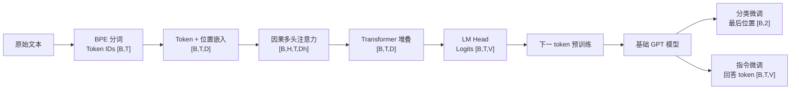

# 从文本到指令模型：从零构建 LLM 的七章主线

前面七章分别讲了数据、注意力、GPT、预训练和微调，这篇不再重复长代码，只把它们串成一条构建链路：**先把文本变成可训练的张量，再用因果 GPT 学习下一个 token，最后通过任务数据把基础模型变成分类器或指令模型。**

为了统一后面的形状记法：

- `B`：批次大小（batch size）
- `T`：序列长度（token 数）
- `D`：嵌入维度（embedding dimension）
- `H`：注意力头数
- `Dh`：单个注意力头的维度，`Dh = D / H`
- `V`：词表大小，GPT-2 为 `50257`

## 一条主流程



这条线里最重要的不变项是：GPT 始终在估计

$$
p(x_{t+1}\mid x_{\leq t})
$$

预训练与指令微调仍然是下一 token 预测，主要变化在数据格式和损失范围；分类微调则把词表输出头换成了类别输出头。

## 关键张量形状

| 阶段 | 张量 | 形状 | 含义 |
| --- | --- | --- | --- |
| 分词后 | `input_ids` | `[B, T]` | 每行是一段 token ID |
| 下一 token 目标 | `target_ids` | `[B, T]` | 与输入右移一位 |
| Token 嵌入 | `token_embeddings` | `[B, T, D]` | 把离散 ID 映射为连续向量 |
| 位置嵌入 | `position_embeddings` | `[T, D]` | 通过广播加到每个 batch |
| 多头 Q/K/V | `queries/keys/values` | `[B, H, T, Dh]` | 每个头独立计算 |
| 注意力得分 | `attention_scores` | `[B, H, T, T]` | 每个 token 对可见 token 的得分 |
| Transformer 输出 | `hidden_states` | `[B, T, D]` | 残差连接保持形状不变 |
| 语言模型输出 | `logits` | `[B, T, V]` | 每个位置对整个词表的原始分数 |
| 分类输出 | `logits[:, -1, :]` | `[B, 2]` | 每条短信的二分类分数 |

## 第 1 章：理解大语言模型

[章节笔记](<./Understand LLM.md>)

- **问题**：LLM 是什么，为什么需要预训练和微调，本书又为什么选择 decoder-only GPT。
- **输入**：文本生成、分类、问答等任务需求，以及大规模语料。
- **变换**：用 Transformer 学习文本的统计规律；先通过预训练获得通用语言能力，再通过微调适配特定任务。
- **输出**：一张三阶段蓝图：数据与模型实现 → 基础模型预训练 → 分类或指令微调。
- **代码模块**：本章不需要独立的可执行代码；后续所有实现共用的模型规格集中在 [`config.py`](./code/llm_from_scratch/config.py)。
- **易错点**：BERT 使用双向上下文预测被遮盖 token，GPT 只使用左侧上下文预测下一 token；两者都来自 Transformer，但训练目标和适用任务不同。

## 第 2 章：处理文本数据

[章节笔记](<./Process text data.md>)

- **问题**：神经网络不能直接处理字符串，如何把文本变成可训练、可批处理的数值张量。
- **输入**：原始文本，实践使用短篇小说 *The Verdict*。
- **变换**：教学阶段先用正则分词，实际训练改用 GPT-2 BPE；通过滑动窗口构造 `x=tokens[i:i+T]` 和 `y=tokens[i+1:i+T+1]`，再把 token 嵌入与绝对位置嵌入相加。
- **输出**：`inputs/targets [B,T]` 和模型的输入嵌入 `[B,T,D]`。笔记中的小例子是 `[8,4] → [8,4,256] + [4,256] → [8,4,256]`。
- **代码模块**：数据集、滑窗和 DataLoader 在 [`data.py`](./code/llm_from_scratch/data.py)；词嵌入与位置嵌入最终由 [`model.py`](./code/llm_from_scratch/model.py) 中的 `GPTModel` 管理。
- **易错点**：输入和目标只能错开一个 token；滑窗上界必须给 target 留出一位；应先切分训练/验证文本，再分别建窗；`stride < T` 会产生重叠样本；EOS、因果遮盖和填充遮盖的作用不同，不能互相替代；位置 ID 必须与输入在同一设备。

## 第 3 章：实现自注意力

[章节笔记](<./Implement self-attention.md>)

- **问题**：如何让当前 token 直接聚合序列中相关的上下文，同时保证生成时看不到未来 token。
- **输入**：嵌入张量 `x [B,T,D]`。
- **变换**：线性投影得到 Q/K/V，拆成 `H` 个头，计算 `QKᵀ/sqrt(Dh)`，用上三角因果遮盖把未来位置设为 `-inf`，经 Softmax 后对 V 加权求和，最后合并多头。
- **输出**：上下文向量 `[B,T,D]`；中间的注意力得分和权重均为 `[B,H,T,T]`。
- **代码模块**：教学用单头因果注意力在 [`chapter03_attention.py`](./code/examples/chapter03_attention.py)，可复用的 `MultiHeadAttention` 在 [`attention.py`](./code/llm_from_scratch/attention.py)。
- **易错点**：`D` 必须能被 `H` 整除；缩放项是 `sqrt(Dh)` 而不是 `sqrt(D)`；因果遮盖要在 Softmax 前施加；mask 应用 `register_buffer` 注册并按当前 `T` 裁剪；`transpose` 后在 `view` 前要调用 `contiguous()`；二维演示代码的 `.T` 不能直接照搬到带 batch 的张量。

## 第 4 章：从零实现 GPT

[章节笔记](<./Implement a GPT model for text generation.md>)

- **问题**：如何把嵌入、因果多头注意力和前馈网络组合成一个完整的自回归文本生成模型。
- **输入**：token IDs `[B,T]` 和一组 GPT 配置（`V`、上下文长度、`D`、`H`、层数、Dropout）。
- **变换**：`token + position embedding` 进入多个 Transformer Block。每个 Block 都是 `LayerNorm → MHA → Dropout → 残差` 和 `LayerNorm → D→4D→D 前馈网络 → Dropout → 残差`；最后经 LayerNorm 和 LM Head 投影到词表空间。
- **输出**：`logits [B,T,V]`。自回归生成时每轮只取 `logits[:, -1, :] [B,V]`，得到下一 token `[B,1]` 后追加到序列。
- **代码模块**：配置在 [`config.py`](./code/llm_from_scratch/config.py)，模型与 Transformer Block 在 [`model.py`](./code/llm_from_scratch/model.py)，贪心、温度、Top-k 和 EOS 生成在 [`generation.py`](./code/llm_from_scratch/generation.py)。
- **易错点**：`T` 不能超过位置嵌入的上下文长度；随机初始化的 GPT 生成乱码是正常现象；训练时交叉熵直接接收 logits，不先做 Softmax；“参数量按权重共享扣除输出头”不等于代码真正绑定了 `out_head.weight` 和 `tok_emb.weight`；批量生成不能用单个 `.item()` 判断整批 EOS。

## 第 5 章：在无标记数据上预训练

[章节笔记](<./Pre-training on unlabeled datasets.md>)

- **问题**：随机初始化的 GPT 只有结构，没有语言能力；如何定义损失、完成训练、评估生成结果并保存模型。
- **输入**：无标签文本经滑窗生成的 `inputs/targets [B,T]`。“无标记”不表示没有目标，目标由原文本自动右移一位得到。
- **变换**：模型输出 `[B,T,V]`，展平为 `[B*T,V]`；targets 展平为 `[B*T]`，计算平均交叉熵。训练循环固定为 `zero_grad → forward/loss → backward → step`，期间定期计算训练/验证损失并生成样例。
- **输出**：已训练的语言模型权重、优化器检查点、损失曲线和生成文本。
- **代码模块**：损失、评估和通用训练循环在 [`training.py`](./code/llm_from_scratch/training.py)，解码策略在 [`generation.py`](./code/llm_from_scratch/generation.py)，保存与恢复在 [`checkpoint.py`](./code/llm_from_scratch/checkpoint.py)，OpenAI GPT-2 权重映射在 [`openai_weights.py`](./code/llm_from_scratch/openai_weights.py)。
- **易错点**：`model.eval()` 只切换 Dropout 等层的行为，`torch.no_grad()` 才关闭梯度记录；变长末批次不应只对“批损失”做算术平均，严格结果应按有效 token 数加权；小语料上训练损失下降而验证损失上升是过拟合；要精确续训还需保存 epoch、global step、随机数状态与调度器；载入官方 GPT-2 时必须使用 `qkv_bias=True`，并正确处理 TensorFlow/PyTorch 线性层的转置。

### 第 5 章的两条路径

| 路径 | 起点 | 目的 | 结果应如何理解 |
| --- | --- | --- | --- |
| A：小语料从零预训练 | 随机初始化 GPT | 跑通损失、反向传播、评估、生成和检查点 | 它是教学性实验，会很快记住 *The Verdict*，不是可实用的基础模型 |
| B：加载官方 GPT-2 | OpenAI 预训练检查点 | 校验本地 GPT 结构与官方权重的对应关系 | 生成文本已有基本连贯性，也是第 6、7 章微调的实际起点 |

两条路径不冲突：A 用来理解模型怎么学，B 用来理解真正的基础模型怎么复用。

## 第 6 章：分类任务微调

[章节笔记](<./Fine-tuning for classification tasks.md>)

- **问题**：如何复用 GPT-2 的语言特征，把一条短信映射到 `spam/not spam` 两个固定类别。
- **输入**：平衡后的短信文本与整数标签。分词、截断和填充后为 `input_ids [B,120]`、`labels [B]`。
- **变换**：加载 GPT-2 small 124M，冻结所有预训练参数，把 LM Head 替换为二分类头，再解冻最后一个 Transformer Block、final LayerNorm 和分类头。模型先输出 `[B,120,2]`，只取最后位置 `[B,2]` 计算交叉熵。
- **输出**：二分类器权重、训练/验证/测试准确率，以及单条文本的 `spam` 或 `not spam` 结果。
- **代码模块**：数据平衡、划分、`SpamDataset`、分类损失/准确率和推理集中在 [`classification.py`](./code/llm_from_scratch/classification.py)；权重恢复复用 [`checkpoint.py`](./code/llm_from_scratch/checkpoint.py)。
- **易错点**：验证集和测试集必须沿用训练集的 `max_length`；交叉熵的类别标签必须是 `long`；替换输出头应放在冻结旧参数之后，新头才会默认可训练；本实践没有 padding attention mask，因此训练和推理必须保持相同的填充长度与规则；`drop_last=True` 会使训练 DataLoader 的“全量准确率”实际上少算末尾样本；测试集不参与调参。

## 第 7 章：指令遵循微调

[章节笔记](<./Instructions follow fine-tuning.md>)

- **问题**：预训练 GPT 会续写文本，却不一定会遵循“改写、分类、回答”等任务指令，如何用统一数据格式教会它完成任务。
- **输入**：1100 条 `{instruction, input, output}` 记录，格式化成 Alpaca 风格文本后分词。划分结果为 935/55/110。
- **变换**：每个 batch 按该批最长序列动态填充，输入和目标右移一位，保留第一个 EOS，把后续 PAD 的 target 设为 `-100`。加载 GPT-2 medium 355M 后进行 2 个 epoch 全参数 SFT。
- **输出**：动态形状的 `inputs/targets [B,T_batch]`，例如不同批次为 `[8,61]`、`[8,76]`；微调后导出 110 条测试回答和 GPT-2 medium SFT 权重。
- **代码模块**：提示词格式、`InstructionDataset`、动态 collate 和回答提取在 [`instruction.py`](./code/llm_from_scratch/instruction.py)；训练复用 [`training.py`](./code/llm_from_scratch/training.py)；生成复用 [`generation.py`](./code/llm_from_scratch/generation.py)；可选的本地评分逻辑单独放在 [`ollama_eval.py`](./code/llm_from_scratch/ollama_eval.py)。
- **易错点**：训练和推理必须使用同一提示词模板；粗暴截断可能把回答或 EOS 一起删掉，应先统计长度分布；当前损失覆盖“提示词 + 回答”全部有效 token，如果只想监督回答，需要把 `### Response` 之前的 targets 也设为 `-100`；往 GPU 搬数据不宜隐藏在多进程 collate 中；回答应按 token 长度截取，不按字符长度；单条生成的 EOS 逻辑不能原样扩展到多样本批量生成。

## 三种训练任务的差异

| 任务 | 模型起点 | 输入与目标 | 参与损失的 logits | 主要更新参数 | 主要评估 |
| --- | --- | --- | --- | --- | --- |
| 无标记预训练 | 随机 GPT | `x/y [B,T]`，y 右移一位 | 全部 `[B,T,V]` | 全参数 | 交叉熵、困惑度、生成样例 |
| 分类微调 | GPT-2 small 124M | 短信 `[B,T]`，标签 `[B]` | 最后位置 `[B,2]` | 最后 Block + final LN + 分类头 | 准确率、交叉熵 |
| 指令微调 | GPT-2 medium 355M | 动态 `[B,T_batch]`，target 含 `-100` | 所有非屏蔽 token 的 `[B,T_batch,V]` | 全参数 | 损失、人工检查、可选 LLM 评分 |

分类微调真正改了输出空间；指令微调没有改 GPT 的语言模型结构，而是用一致的任务格式和参考回答改变了模型的生成行为。

## 代码复用关系

| 模块 | 职责 | 主要被哪些章节复用 |
| --- | --- | --- |
| [`config.py`](./code/llm_from_scratch/config.py) | GPT 配置和模型规格 | 第 4～7 章 |
| [`data.py`](./code/llm_from_scratch/data.py) | 通用 GPT 滑窗数据集与 DataLoader | 第 2、5 章 |
| [`attention.py`](./code/llm_from_scratch/attention.py) | 因果多头自注意力 | 第 3～7 章（由 GPTModel 间接复用） |
| [`model.py`](./code/llm_from_scratch/model.py) | LayerNorm、GELU、FFN、Transformer Block、GPTModel | 第 4～7 章 |
| [`generation.py`](./code/llm_from_scratch/generation.py) | 文本/ID 转换、贪心、温度、Top-k、EOS 生成 | 第 4、5、7 章 |
| [`training.py`](./code/llm_from_scratch/training.py) | token 级损失、评估与训练循环 | 第 5、7 章 |
| [`checkpoint.py`](./code/llm_from_scratch/checkpoint.py) | 模型权重和训练检查点 | 第 5～7 章 |
| [`openai_weights.py`](./code/llm_from_scratch/openai_weights.py) | 下载、读取和映射官方 GPT-2 权重 | 第 5～7 章 |
| [`classification.py`](./code/llm_from_scratch/classification.py) | 短信数据、分类头、分类训练与推理 | 第 6 章 |
| [`instruction.py`](./code/llm_from_scratch/instruction.py) | 指令格式、动态填充、回答导出 | 第 7 章 |
| [`ollama_eval.py`](./code/llm_from_scratch/ollama_eval.py) | 通过本地 Ollama 做可选 LLM-as-a-judge 评估 | 第 7 章的未实践扩展 |

整理后的核心依赖方向是：

```text
data → attention → model → generation / training
                              ↓
                    checkpoint / OpenAI weights
                              ↓
                   classification / instruction
```

第 6、7 章只保留任务特有的数据和评估逻辑，不再复制注意力、GPT 和通用检查点代码。

## 实践边界

- 第 5 章在 *The Verdict* 上的从零预训练只是为了验证完整流程，训练集很小，不应将结果视为通用语言模型。
- 第 7 章已实践 GPT-2 medium 指令微调、110 条回答导出和模型权重保存。
- **Ollama 评分没有实践**。`ollama_eval.py` 只是根据原书流程整理的可选评估工具，不代表已经在本地运行。
- **`54.16` 是原书使用 Llama 3 8B 评估 110 条回答的参考平均分，不是本次实践结果。**
- 温度采样、设备、PyTorch 版本和随机调用顺序都会影响生成文本，不需要追求与书中输出逐字一致。

## 回到整条构建链路

七章真正完成的不是七套独立模型，而是一套可复用的 GPT 核心：第 2～4 章定义数据如何流过网络，第 5 章说明语言能力如何进入参数，第 6、7 章再分别用任务头和数据格式把同一个基础模型变成分类器与指令模型。
