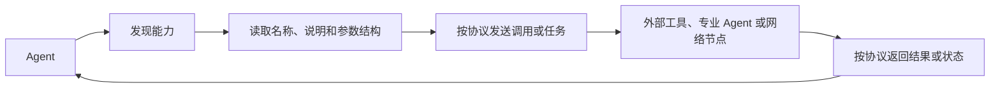
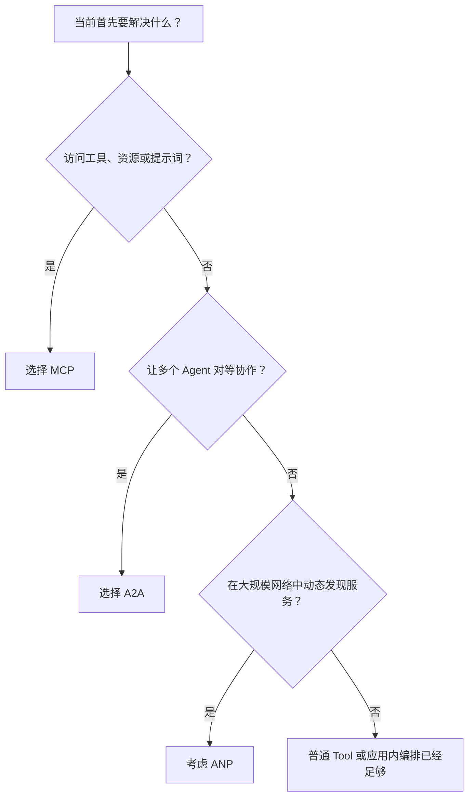
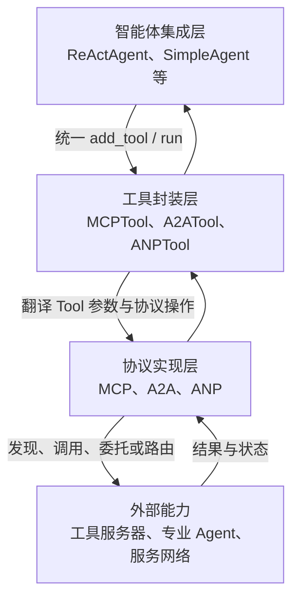

## 智能体通信协议

> 阅读资料：[《Hello-Agents》第十章 10.1：智能体通信协议基础](https://datawhalechina.github.io/hello-agents/#/./chapter10/%E7%AC%AC%E5%8D%81%E7%AB%A0%20%E6%99%BA%E8%83%BD%E4%BD%93%E9%80%9A%E4%BF%A1%E5%8D%8F%E8%AE%AE?id=_101-%e6%99%ba%e8%83%bd%e4%bd%93%e9%80%9a%e4%bf%a1%e5%8d%8f%e8%ae%ae%e5%9f%ba%e7%a1%80)
>
> 当前阅读范围为 10.1：先理解为什么需要通信协议，区分 MCP、A2A 与 ANP 的职责，再为 HelloAgents 增加协议层和统一 Tool 入口。具体传输与完整协议交互留到后续小节。

### 为什么 Agent 需要通信协议

#### 单体 Agent 的能力边界

前几章的 ReAct Agent 已经可以调用计算、搜索、记忆和文件工具。问题在于，这些工具都是框架内的 Python 类：新增 GitHub、数据库或天气服务时，仍要分别处理认证、连接、请求格式、错误和返回值。

这种集成方式在工具较少时很直接，规模扩大后会暴露三个问题：

| 问题 | 直接表现 | 通信协议要解决的部分 |
| --- | --- | --- |
| 工具集成重复 | 每个外部服务都要编写专用适配器 | 统一能力描述、发现和调用方式 |
| 能力被静态绑定 | Agent 只能使用启动时写入的工具 | 运行时查询服务提供的能力 |
| 多 Agent 协作缺少公共语言 | 调度者要了解每个 Agent 的私有接口 | 统一身份、任务和结果的交换方式 |

通信协议的价值不在于减少一次函数调用，而在于稳定系统之间的边界。服务内部可以使用不同语言和实现，只要对外遵守相同协议，调用方就不必了解其内部细节。



标准化带来四个直接收益：

- **接口统一**：调用方不再为每种服务重新设计交互格式。
- **互操作**：协议兼容的客户端与服务端可以独立开发和替换。
- **动态发现**：Agent 可以先读取能力说明，再决定调用什么。
- **扩展解耦**：增加服务通常不需要修改 Agent 的核心循环。

协议不能消除业务适配。认证、权限、限流、数据语义和失败恢复仍要实现；它只是把这些问题放进稳定、可复用的交互边界中。

#### 协议、Function Calling 和 Tool 不是同一个概念

三者位于不同层次：

- **Function Calling** 让模型输出结构化的函数名与参数，解决“模型决定调用什么”。
- **Tool** 是 HelloAgents 内部提供给 Agent 的统一能力接口，解决“框架怎样注册和执行能力”。
- **通信协议** 约束系统之间怎样发现、调用和交换结果，解决“能力位于进程或网络之外时怎样连接”。

因此，MCP 并不替代 Function Calling。常见链路是：模型通过 Function Calling 选中一个 Tool，Tool 再通过 MCP 请求外部服务器。

### MCP、A2A 与 ANP 的职责

三种协议针对的通信关系不同，不能只看成三种可互换的网络库。

| 维度 | MCP | A2A | ANP |
| --- | --- | --- | --- |
| 全称 | Model Context Protocol | Agent-to-Agent Protocol | Agent Network Protocol |
| 连接对象 | Agent 与工具、资源、提示词 | Agent 与 Agent | Agent 与大规模服务网络 |
| 核心问题 | 如何标准化外部能力访问 | 如何对等地委托任务与交换结果 | 如何注册、发现并路由到合适服务 |
| 典型场景 | 文件、数据库、GitHub、业务 API | 研究员与撰写员协作 | 开放网络中的动态服务发现 |
| 交互特点 | Client/Server，强调上下文与能力发现 | 对等协作，每个 Agent 可同时提供和消费能力 | 面向网络基础设施，强调身份、发现和连接 |
| 本章实现定位 | 基于 FastMCP | 基于 A2A SDK | 教学性的轻量概念实现 |

#### MCP：Agent 与外部能力之间的桥梁

MCP 统一工具、资源和提示词的暴露方式。客户端连接服务器后先发现能力，再使用名称与结构化参数发起调用。

这里的“上下文共享”不只是远程执行一个函数。服务端还可以向 Agent 暴露资源内容和提示模板，使 Agent 获得完成任务所需的环境信息。

#### A2A：Agent 之间的对等协作

A2A 面向具有独立目标、能力和执行过程的 Agent。一个 Agent 可以把任务委托给另一个 Agent，并持续交换状态与结果，而不是把对方简单视为本地函数。

多 Agent 框架中的固定轮询不等于 A2A。前者是应用内部的调度策略，后者关心不同 Agent 服务之间可互操作的通信边界。

#### ANP：面向 Agent 网络的发现与连接

当服务数量扩大后，预先写死每个 Agent 的地址不可维护。ANP 关注服务注册、能力发现、身份与路由，让请求方可以按类型或能力找到目标。

原文将 ANP 定位为仍处于发展中的概念性协议框架，因此本章实现用于理解网络管理思想，不能把内存注册表当成生产级去中心化网络。

#### 如何选择



实际系统可以组合使用。例如协调 Agent 通过 A2A 把任务交给研究 Agent，研究 Agent 再通过 MCP 访问搜索服务；当 Agent 数量很多时，先通过 ANP 找到研究服务。

### HelloAgents 的三层协议架构

原文没有把三种协议直接塞进 Agent，而是在现有 Tool System 下面增加协议实现层：



各层职责如下：

| 层 | 职责 | 不应承担的职责 |
| --- | --- | --- |
| 协议实现层 | 建立连接，处理协议消息、传输和返回值 | 决定 Agent 应该执行什么任务 |
| 工具封装层 | 把协议动作转换为统一 `Tool.run()` 调用 | 隐藏权限或伪造协议成功结果 |
| Agent 集成层 | 根据任务选择工具并整合结果 | 依赖某个协议的底层传输细节 |

这种分层延续了第七章“万物皆工具”的使用视角：Agent 仍然只操作 Tool，协议差异被收在适配层下面。不过统一入口不代表底层能力相同。MCP 客户端有连接生命周期，A2A 任务可能长时间运行，ANP 服务还涉及注册有效期和网络状态，后续实现仍要分别处理。

本节对应的目录增量为：

```text
hello_agents/
├── protocols/
│   ├── base.py
│   ├── mcp/
│   │   ├── client.py
│   │   ├── server.py
│   │   └── utils.py
│   ├── a2a/
│   │   └── implementation.py
│   └── anp/
│       └── implementation.py
└── tools/builtin/
    └── protocol_tools.py
```

`Protocol` 只记录协议类型和版本，不强制三种协议继承同一个抽象基类。它们解决的问题和依赖差异很大，为了形式统一而规定相同的 `send()`、`receive()` 往往会产生空实现或错误抽象。对 Agent 而言，真正统一的是 Tool 接口。

完整入口见 [`protocols/__init__.py`](./code/HelloAgents/hello_agents/protocols/__init__.py) 和 [`protocol_tools.py`](./code/HelloAgents/hello_agents/tools/builtin/protocol_tools.py)。

### 代码实践：三种协议快速体验

#### 本节实践边界

10.1 是架构导览。为了让原文的快速体验可以直接运行，本次完成的是一个最小闭环：

- `MCPTool()` 使用进程内演示服务器，支持能力发现以及 `add`、`subtract`、`multiply`、`divide` 调用。
- `ANPTool` 使用内存注册表，支持服务注册、注销、按类型和元数据发现。
- `A2ATool` 校验并保存对等 Agent 地址，本节只验证端点配置，不虚构远程 Agent 的回复。
- 三种能力都通过现有 `Tool.run(parameters)` 接口进入框架。

这使 10.1 展示的代码完整可执行，但不等于已经实现完整标准：FastMCP 传输、真实 A2A 任务交换以及网络化 ANP 将在相应小节继续补充。

#### MCP：先发现，再调用

进程内服务器保存“能力说明”和 Python 处理函数。客户端只能看到可序列化的名称、描述与参数 Schema，不会拿到函数对象：

```python
server.register_tool(
    name="add",
    description="计算两个数的和",
    input_schema=number_schema,
    handler=lambda a, b: float(a) + float(b),
)
```

Tool 封装把统一动作映射到客户端：

```python
if action == "list_tools":
    return self._client.list_tools()

if action == "call_tool":
    return self._client.call_tool(tool_name, arguments)
```

这个流程保留了协议最重要的两个动作：

1. 客户端发现服务端当前提供的能力。
2. 客户端按公开 Schema 组织参数并调用指定能力。

实现见 [`server.py`](./code/HelloAgents/hello_agents/protocols/mcp/server.py)、[`client.py`](./code/HelloAgents/hello_agents/protocols/mcp/client.py) 和 [`utils.py`](./code/HelloAgents/hello_agents/protocols/mcp/utils.py)。

#### ANP：注册信息必须足够支持发现

服务注册至少需要稳定 ID、类型和端点；可读名称、能力与元数据用于进一步筛选：

```python
service = ServiceInfo(
    service_id="calculator",
    service_type="math",
    endpoint="http://localhost:8080",
    capabilities=("add", "subtract"),
    metadata={"region": "local"},
)
discovery.register_service(service)
services = discovery.discover_services(service_type="math")
```

注册表以 `service_id` 为键，重复注册会更新服务信息，查询结果按 ID 排序，便于测试与日志比较。完整实现见 [`implementation.py`](./code/HelloAgents/hello_agents/protocols/anp/implementation.py)。

#### A2A：创建客户端不等于完成通信

原文快速示例只创建了：

```python
a2a_tool = A2ATool("http://localhost:5000")
```

这一步只能证明端点配置有效，不能证明远程 Agent 存在，更不能证明任务已成功执行。本次实现会检查地址必须是合法的 HTTP(S) URL，并提供本地 `describe` 动作；真实通信需要启动 A2A 服务、发现能力、发送任务并处理状态和产物。

实现见 [`implementation.py`](./code/HelloAgents/hello_agents/protocols/a2a/implementation.py)。

#### 运行示例

完整脚本见 [`protocol_basics_demo.py`](./code/HelloAgents/examples/protocol_basics_demo.py)：

原文使用已经打包好的第十章版本：

```bash
pip install "hello-agents[protocol]==0.2.2"
```

后续若通过 `npx` 启动社区 MCP Server，还需要安装 Node.js。本仓库则延续前几章的源码实现，10.1 的内存示例不依赖 FastMCP、A2A SDK 或网络服务；运行完整 `hello_agents` 包仍需此前使用的 `pydantic`、`openai` 和 `python-dotenv`。

```bash
cd code/HelloAgents
python3 examples/protocol_basics_demo.py
```

实际输出：

```text
=== MCP：统一发现与调用工具 ===
找到 4 个工具:
- add: 计算两个数的和
- subtract: 计算两个数的差
- multiply: 计算两个数的积
- divide: 计算两个数的商
MCP 计算结果: 30.0

=== ANP：注册并发现服务 ===
已注册服务: calculator
找到 1 个服务:
- calculator | math | http://localhost:8080

=== A2A：配置对等 Agent 端点 ===
A2A endpoint: http://localhost:5000
A2A 工具创建成功
```

这次运行没有调用模型、远程 API 或本地服务。它验证的是协议层到 Tool 层的参数传递、MCP 演示能力发现与调用、ANP 注册与过滤，以及 A2A 地址校验。

#### 原文说明代码中补齐的部分

- 原文直接导入 `MCPTool`、`A2ATool`、`ANPTool`，但 10.1 没有给出类实现；本次补齐三种 Tool 及导出关系。
- `MCPTool()` 所依赖的内置服务器没有展开；本次实现四个计算能力以及能力描述和参数校验。
- ANP 示例注册后直接查询，没有定义 `ServiceInfo` 和注册表；本次补齐数据结构、更新、注销和过滤逻辑。
- A2A 示例只打印“创建成功”，容易把实例化误解成连通性验证；本次只报告已校验的本地端点配置。
- 对缺少 `action`、缺少必填参数、未知操作、未知 MCP 工具、除零和非法 URL 都返回了可理解的错误。
- 协议类和 Tool 已从各层 `__init__.py` 导出，文章中的导入方式可以直接使用。

#### 继续实现时必须补上的工程能力

| 方向 | 10.1 当前状态 | 后续需要补充 |
| --- | --- | --- |
| MCP | 进程内能力发现与调用 | FastMCP、Stdio/HTTP 传输、资源、提示词和连接生命周期 |
| A2A | 端点配置与校验 | Agent Card、任务状态、消息、产物、流式更新与取消 |
| ANP | 单进程服务注册与过滤 | 网络身份、认证、分布式发现、路由、健康检查与失效清理 |
| 通用能力 | Tool 参数检查与错误文本 | 超时、重试、幂等、鉴权、审计、指标和链路追踪 |

协议让系统互通，也扩大了信任边界。外部服务的描述不一定准确，返回内容也可能包含恶意指令；Agent 在执行写文件、数据库更新或网络操作前仍需权限控制和人工确认。

### 参考资料

- [《Hello-Agents》第十章：智能体通信协议](https://github.com/datawhalechina/hello-agents/blob/main/docs/chapter10/%E7%AC%AC%E5%8D%81%E7%AB%A0%20%E6%99%BA%E8%83%BD%E4%BD%93%E9%80%9A%E4%BF%A1%E5%8D%8F%E8%AE%AE.md)
- [Model Context Protocol 官方文档](https://modelcontextprotocol.io/)
- [A2A Protocol 官方文档](https://a2a-protocol.org/)
- [Agent Network Protocol 官方文档](https://agent-network-protocol.com/)

### 小结

- 通信协议解决的是系统边界标准化，不是简单地再封装一个本地函数。
- MCP 连接 Agent 与工具、资源和提示词；A2A 支持 Agent 间对等协作；ANP 面向大规模网络中的服务发现与连接。
- Function Calling 决定调用意图，Tool 统一框架内入口，通信协议负责跨进程或跨系统交互，三者可以组成一条完整链路。
- HelloAgents 使用“协议实现层 → 工具封装层 → 智能体集成层”，使 Agent 不依赖具体传输。
- 统一 Tool 接口不会抹平协议差异，连接生命周期、任务状态和服务注册仍应在各自实现中处理。
- 本次代码完整跑通 10.1 的快速体验，但明确限制在内存 MCP、内存 ANP 与 A2A 端点配置，避免把教学桩误认为标准协议实现。
- 选择协议时先看通信对象：访问外部能力用 MCP，专业 Agent 协作用 A2A，大规模动态发现再考虑 ANP。
