## 智能体通信协议

> 阅读资料：[《Hello-Agents》第十章 10.1：智能体通信协议基础](https://datawhalechina.github.io/hello-agents/#/./chapter10/%E7%AC%AC%E5%8D%81%E7%AB%A0%20%E6%99%BA%E8%83%BD%E4%BD%93%E9%80%9A%E4%BF%A1%E5%8D%8F%E8%AE%AE?id=_101-%e6%99%ba%e8%83%bd%e4%bd%93%e9%80%9a%e4%bf%a1%e5%8d%8f%e8%ae%ae%e5%9f%ba%e7%a1%80)、[10.2：MCP 协议实战](https://datawhalechina.github.io/hello-agents/#/./chapter10/%E7%AC%AC%E5%8D%81%E7%AB%A0%20%E6%99%BA%E8%83%BD%E4%BD%93%E9%80%9A%E4%BF%A1%E5%8D%8F%E8%AE%AE?id=_102-mcp-%e5%8d%8f%e8%ae%ae%e5%ae%9e%e6%88%98)、[10.3：A2A 协议实战](https://datawhalechina.github.io/hello-agents/#/./chapter10/%E7%AC%AC%E5%8D%81%E7%AB%A0%20%E6%99%BA%E8%83%BD%E4%BD%93%E9%80%9A%E4%BF%A1%E5%8D%8F%E8%AE%AE?id=_103-a2a-%e5%8d%8f%e8%ae%ae%e5%ae%9e%e6%88%98)
>
> 当前阅读范围为 10.1—10.3：先区分 MCP、A2A 与 ANP 的职责，再分别完成 MCP 能力调用和 A2A Agent 协作闭环。

### 为什么 Agent 需要通信协议

#### 单体 Agent 的能力边界

前几章的 ReAct Agent 已经可以调用计算、搜索、记忆和文件工具。问题在于，这些工具都是框架内的 Python 类：新增 GitHub、数据库或天气服务时，仍要分别处理认证、连接、请求格式、错误和返回值。

这种集成方式在工具较少时很直接，规模扩大后会暴露三个问题：

| 问题 | 直接表现 | 通信协议要解决的部分 |
| --- | --- | --- |
| 工具集成重复 | 每个外部服务都要编写专用适配器 | 统一能力描述、发现和调用方式 |
| 能力被静态绑定 | Agent 只能使用启动时写入的工具 | 运行时查询服务提供的能力 |
| 多 Agent 协作缺少公共语言 | 调度者要了解每个 Agent 的私有接口 | 统一身份、任务和结果的交换方式 |

通信协议的价值不在于减少一次函数调用，而在于稳定系统之间的边界。服务内部可以使用不同语言和实现，只要对外遵守相同协议，调用方就不必了解其内部细节。

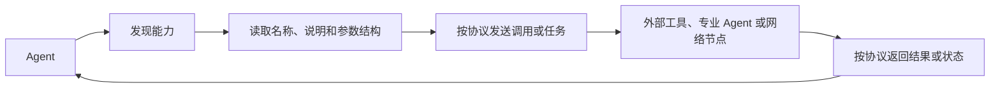

标准化带来四个直接收益：

- **接口统一**：调用方不再为每种服务重新设计交互格式。
- **互操作**：协议兼容的客户端与服务端可以独立开发和替换。
- **动态发现**：Agent 可以先读取能力说明，再决定调用什么。
- **扩展解耦**：增加服务通常不需要修改 Agent 的核心循环。

协议不能消除业务适配。认证、权限、限流、数据语义和失败恢复仍要实现；它只是把这些问题放进稳定、可复用的交互边界中。

#### 协议、Function Calling 和 Tool 不是同一个概念

三者位于不同层次：

- **Function Calling** 让模型输出结构化的函数名与参数，解决“模型决定调用什么”。
- **Tool** 是 HelloAgents 内部提供给 Agent 的统一能力接口，解决“框架怎样注册和执行能力”。
- **通信协议** 约束系统之间怎样发现、调用和交换结果，解决“能力位于进程或网络之外时怎样连接”。

因此，MCP 并不替代 Function Calling。常见链路是：模型通过 Function Calling 选中一个 Tool，Tool 再通过 MCP 请求外部服务器。

### MCP、A2A 与 ANP 的职责

三种协议针对的通信关系不同，不能只看成三种可互换的网络库。

| 维度 | MCP | A2A | ANP |
| --- | --- | --- | --- |
| 全称 | Model Context Protocol | Agent-to-Agent Protocol | Agent Network Protocol |
| 连接对象 | Agent 与工具、资源、提示词 | Agent 与 Agent | Agent 与大规模服务网络 |
| 核心问题 | 如何标准化外部能力访问 | 如何对等地委托任务与交换结果 | 如何注册、发现并路由到合适服务 |
| 典型场景 | 文件、数据库、GitHub、业务 API | 研究员与撰写员协作 | 开放网络中的动态服务发现 |
| 交互特点 | Client/Server，强调上下文与能力发现 | 对等协作，每个 Agent 可同时提供和消费能力 | 面向网络基础设施，强调身份、发现和连接 |
| 本章实现定位 | 基于 FastMCP | 基于 A2A SDK | 教学性的轻量概念实现 |

#### MCP：Agent 与外部能力之间的桥梁

MCP 统一工具、资源和提示词的暴露方式。客户端连接服务器后先发现能力，再使用名称与结构化参数发起调用。

这里的“上下文共享”不只是远程执行一个函数。服务端还可以向 Agent 暴露资源内容和提示模板，使 Agent 获得完成任务所需的环境信息。

#### A2A：Agent 之间的对等协作

A2A 面向具有独立目标、能力和执行过程的 Agent。一个 Agent 可以把任务委托给另一个 Agent，并持续交换状态与结果，而不是把对方简单视为本地函数。

多 Agent 框架中的固定轮询不等于 A2A。前者是应用内部的调度策略，后者关心不同 Agent 服务之间可互操作的通信边界。

#### ANP：面向 Agent 网络的发现与连接

当服务数量扩大后，预先写死每个 Agent 的地址不可维护。ANP 关注服务注册、能力发现、身份与路由，让请求方可以按类型或能力找到目标。

原文将 ANP 定位为仍处于发展中的概念性协议框架，因此本章实现用于理解网络管理思想，不能把内存注册表当成生产级去中心化网络。

#### 如何选择

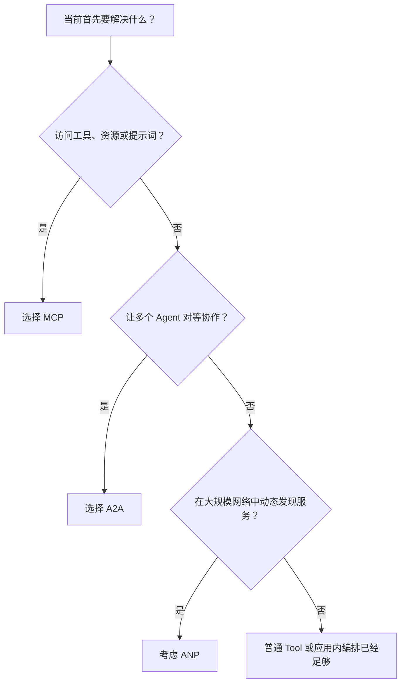

实际系统可以组合使用。例如协调 Agent 通过 A2A 把任务交给研究 Agent，研究 Agent 再通过 MCP 访问搜索服务；当 Agent 数量很多时，先通过 ANP 找到研究服务。

### HelloAgents 的三层协议架构

原文没有把三种协议直接塞进 Agent，而是在现有 Tool System 下面增加协议实现层：

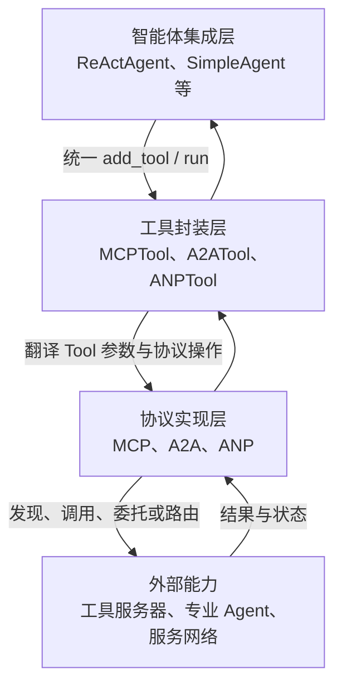

各层职责如下：

| 层 | 职责 | 不应承担的职责 |
| --- | --- | --- |
| 协议实现层 | 建立连接，处理协议消息、传输和返回值 | 决定 Agent 应该执行什么任务 |
| 工具封装层 | 把协议动作转换为统一 `Tool.run()` 调用 | 隐藏权限或伪造协议成功结果 |
| Agent 集成层 | 根据任务选择工具并整合结果 | 依赖某个协议的底层传输细节 |

这种分层延续了第七章“万物皆工具”的使用视角：Agent 仍然只操作 Tool，协议差异被收在适配层下面。不过统一入口不代表底层能力相同。MCP 客户端有连接生命周期，A2A 任务可能长时间运行，ANP 服务还涉及注册有效期和网络状态，必须分别处理。

本节对应的目录增量为：

```text
hello_agents/
├── protocols/
│   ├── base.py
│   ├── mcp/
│   │   ├── client.py
│   │   ├── server.py
│   │   └── utils.py
│   ├── a2a/
│   │   └── implementation.py
│   └── anp/
│       └── implementation.py
└── tools/builtin/
    └── protocol_tools.py
```

`Protocol` 只记录协议类型和版本，不强制三种协议继承同一个抽象基类。它们解决的问题和依赖差异很大，为了形式统一而规定相同的 `send()`、`receive()` 往往会产生空实现或错误抽象。对 Agent 而言，真正统一的是 Tool 接口。

完整入口见 [`protocols/__init__.py`](./code/HelloAgents/hello_agents/protocols/__init__.py) 和 [`protocol_tools.py`](./code/HelloAgents/hello_agents/tools/builtin/protocol_tools.py)。

### 代码实践：三种协议快速体验

#### 本节实践边界

10.1 是架构导览。为了让原文的快速体验可以直接运行，本次完成的是一个最小闭环：

- `MCPTool()` 使用进程内演示服务器，支持 6 个工具的发现和调用。
- `ANPTool` 使用内存注册表，支持服务注册、注销、按类型和元数据发现。
- `A2ATool` 校验并保存对等 Agent 地址，本节只验证端点配置，不虚构远程 Agent 的回复。
- 三种能力都通过现有 `Tool.run(parameters)` 接口进入框架。

这使 10.1 展示的代码完整可执行，但不等于已经实现完整标准。10.2 在这个骨架上补入 FastMCP 和真实传输，10.3 再补入 A2A Agent Card、任务事件和产物；网络化 ANP 仍留到后续小节。

#### MCP：先发现，再调用

进程内服务器保存“能力说明”和 Python 处理函数。客户端只能看到可序列化的名称、描述与参数 Schema，不会拿到函数对象：

```python
server.register_tool(
    name="add",
    description="计算两个数的和",
    input_schema=number_schema,
    handler=lambda a, b: float(a) + float(b),
)
```

Tool 封装把同步 `run()` 映射到客户端的异步连接周期：

```python
async with MCPClient(server) as client:
    tools = await client.list_tools()
    result = await client.call_tool("add", {"a": 10, "b": 20})
```

这个流程保留了协议最重要的两个动作：

1. 客户端发现服务端当前提供的能力。
2. 客户端按公开 Schema 组织参数并调用指定能力。

实现见 [`server.py`](./code/HelloAgents/hello_agents/protocols/mcp/server.py)、[`client.py`](./code/HelloAgents/hello_agents/protocols/mcp/client.py) 和 [`utils.py`](./code/HelloAgents/hello_agents/protocols/mcp/utils.py)。

#### ANP：注册信息必须足够支持发现

服务注册至少需要稳定 ID、类型和端点；可读名称、能力与元数据用于进一步筛选：

```python
service = ServiceInfo(
    service_id="calculator",
    service_type="math",
    endpoint="http://localhost:8080",
    capabilities=("add", "subtract"),
    metadata={"region": "local"},
)
discovery.register_service(service)
services = discovery.discover_services(service_type="math")
```

注册表以 `service_id` 为键，重复注册会更新服务信息，查询结果按 ID 排序，便于测试与日志比较。完整实现见 [`implementation.py`](./code/HelloAgents/hello_agents/protocols/anp/implementation.py)。

#### A2A：创建客户端不等于完成通信

原文快速示例只创建了：

```python
a2a_tool = A2ATool("http://localhost:5000")
```

在 10.1 中，这一步只能证明端点配置有效，不能证明远程 Agent 存在，更不能证明任务已成功执行。10.3 已在同一客户端上补齐 Agent Card 发现、消息发送、任务查询、取消以及流式事件归一化。

实现见 [`implementation.py`](./code/HelloAgents/hello_agents/protocols/a2a/implementation.py)。

#### 运行示例

完整脚本见 [`protocol_basics_demo.py`](./code/HelloAgents/examples/protocol_basics_demo.py)：

原文使用已经打包好的第十章版本：

```bash
pip install "hello-agents[protocol]==0.2.2"
```

后续若通过 `npx` 启动社区 MCP Server，还需要安装 Node.js。本仓库则延续前几章的源码实现，10.1 的内存示例不依赖 FastMCP、A2A SDK 或网络服务；运行完整 `hello_agents` 包仍需此前使用的 `pydantic`、`openai` 和 `python-dotenv`。

```bash
cd code/HelloAgents
python3 examples/protocol_basics_demo.py
```

实际输出：

```text
=== MCP：统一发现与调用工具 ===
找到 6 个工具:
- add: 计算两个数的和
- subtract: 计算两个数的差
- multiply: 计算两个数的积
- divide: 计算两个数的商
- greet: 生成友好问候
- get_system_info: 获取非敏感的运行环境信息
MCP 计算结果: 30.0

=== ANP：注册并发现服务 ===
已注册服务: calculator
找到 1 个服务:
- calculator | math | http://localhost:8080

=== A2A：配置对等 Agent 端点 ===
A2A endpoint: http://localhost:5000
A2A 工具创建成功
```

这次运行没有调用模型、远程 API 或本地服务。它验证的是协议层到 Tool 层的参数传递、MCP 演示能力发现与调用、ANP 注册与过滤，以及 A2A 地址校验。

#### 原文说明代码中补齐的部分

- 原文直接导入 `MCPTool`、`A2ATool`、`ANPTool`，但 10.1 没有给出类实现；本次补齐三种 Tool 及导出关系。
- `MCPTool()` 所依赖的内置服务器没有展开；本次实现 6 个工具、1 个资源和 1 个提示词模板。
- ANP 示例注册后直接查询，没有定义 `ServiceInfo` 和注册表；本次补齐数据结构、更新、注销和过滤逻辑。
- A2A 示例只打印“创建成功”，容易把实例化误解成连通性验证；本次只报告已校验的本地端点配置。
- 对缺少 `action`、缺少必填参数、未知操作、未知 MCP 工具、除零和非法 URL 都返回了可理解的错误。
- 协议类和 Tool 已从各层 `__init__.py` 导出，文章中的导入方式可以直接使用。

#### 继续实现时必须补上的工程能力

| 方向 | 10.1 当前状态 | 后续需要补充 |
| --- | --- | --- |
| MCP | FastMCP 可选集成、Stdio/HTTP 连接、Tools/Resources/Prompts | 生产级认证、重试、超时、审计和持久会话 |
| A2A | Agent Card、Message、Task、Artifact、流式状态与取消 | 身份认证、持久化任务、重试、审计和跨组织治理 |
| ANP | 单进程服务注册与过滤 | 网络身份、认证、分布式发现、路由、健康检查与失效清理 |
| 通用能力 | Tool 参数检查与错误文本 | 超时、重试、幂等、鉴权、审计、指标和链路追踪 |

协议让系统互通，也扩大了信任边界。外部服务的描述不一定准确，返回内容也可能包含恶意指令；Agent 在执行写文件、数据库更新或网络操作前仍需权限控制和人工确认。

### MCP 协议实战

#### Host、Client 与 Server

MCP 常被比作 AI 应用的 USB-C：它不规定设备内部如何实现，只统一连接后怎样声明和使用能力。MCP 的三个核心角色是：

| 角色 | 所在位置 | 主要职责 |
| --- | --- | --- |
| Host | 完整 AI 应用 | 管理对话、权限、模型调用和多个 Client |
| Client | Host 内部 | 与一个 Server 维持会话，发现并调用能力 |
| Server | 本地子进程或远程服务 | 按 MCP 暴露 Tools、Resources 和 Prompts |

一个 Host 可以同时连接多个 Server，但通常由独立 Client 分别管理会话。这个边界很重要：Agent 不需要知道 GitHub、文件系统或数据库的 SDK 细节，只看到它们公开的 MCP 能力。

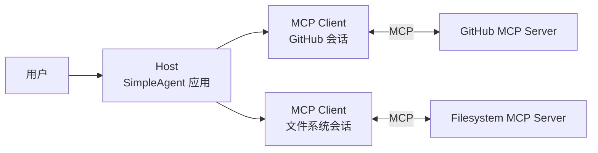

#### Tools、Resources 与 Prompts

三类能力的用法不同：

| 能力 | 表达的内容 | 典型例子 | 使用方 |
| --- | --- | --- | --- |
| Tools | 可执行的操作，带 JSON Schema 参数 | 搜索仓库、读写文件、查询数据库 | 模型根据任务选择并调用 |
| Resources | 可按 URI 读取的上下文 | 配置、文档、数据库记录 | Host 或应用主动读取 |
| Prompts | 可复用的提示模板 | 代码审查、概念解释模板 | 用户或应用选择后渲染 |

`Tool` 不是 Server 的全部。如果只实现 `list_tools()` 和 `call_tool()`，仅完成了 MCP 最常见的一部分。本次客户端同时补齐 `list_resources()`、`read_resource()`、`list_prompts()` 和 `get_prompt()`。

#### 一次工具调用怎样发生

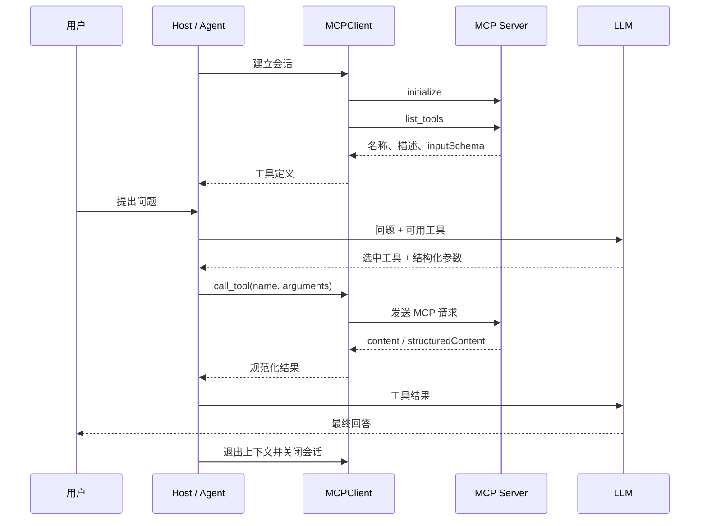

这也说明 MCP 和 Function Calling 不冲突：Function Calling 负责让模型选择名称和参数，MCP 负责让这个能力能够跨进程、跨语言或跨网络被发现和执行。HelloAgents 当前的 `SimpleAgent` 使用文本工具协议选择工具，之后仍可替换为原生 Function Calling，MCP 层无需重写。

#### MCPClient：异步连接与结果归一化

FastMCP 客户端的连接和操作都是异步的，必须在 `async with` 中使用：

```python
import asyncio

from hello_agents import MCPClient


async def main():
    client = MCPClient(["python", "examples/mcp_example_server.py"])
    async with client:
        tools = await client.list_tools()
        result = await client.call_tool("add", {"a": 4, "b": 6})
        resources = await client.list_resources()
        prompts = await client.list_prompts()


asyncio.run(main())
```

原文在 Resources 和 Prompts 的部分示例中省略了 `await`，照抄会得到协程对象而不是结果。本次代码统一使用异步底层；需要从 `Tool.run()` 同步调用时，由 `MCPTool` 完成同步桥接。

客户端还做了两类归一化：

- 工具参数同时兼容 `inputSchema` 和框架内部的 `input_schema`。
- 调用结果依次读取 `data`、`structuredContent` 与 `content`，文本、结构化数据和资源块都能返回给 Agent。

实现见 [`client.py`](./code/HelloAgents/hello_agents/protocols/mcp/client.py)。

#### 传输方式：区分“怎样启动”和“如何传输”

原文将常见用法归纳为 5 种方式，便于练习，但它们不是 5 种并列的 MCP 线上传输协议：

| 文章中的用法 | 本质 | 适用场景 |
| --- | --- | --- |
| 直接传入 FastMCP Server | 进程内 memory transport | 单元测试、快速验证，不经过线上传输 |
| 传入 `server.py` | Python 子进程 + stdio | 本地 Python Server |
| 传入 `['python', 'server.py']` 或命令加参数 | stdio | 自定义启动命令、`npx` 社区 Server |
| HTTP URL / `streamable_http` | Streamable HTTP | 独立部署的远程 Server |
| `sse` | 旧 HTTP+SSE 兼容方式 | 只用于旧 Server 迁移 |

按当前 MCP 规范，标准传输是 **stdio** 和 **Streamable HTTP**。内存方式是 FastMCP 的测试便利层，“Stdio with Args”仍然是 stdio，而旧 SSE 已被 Streamable HTTP 取代。所以选型时关心三件事即可：是否跨网络、谁负责启动 Server、连接如何认证。

Streamable HTTP Server 还应校验 `Origin`、本地部署时优先绑定回环地址，并配置认证。MCP 解决接口互操，不会自动解决 DNS rebinding、越权调用和凭据泄露。

#### MCPTool：把 Server 能力展开为原生 Tool

`MCPTool` 不只是一个“调用远程函数”的大工具。它连接 Server 后读取 Schema，将每个 MCP Tool 包装为独立的 `MCPWrappedTool`：

```python
from hello_agents import SimpleAgent
from hello_agents.tools import MCPTool

agent = SimpleAgent(name="助手", llm=llm)
agent.add_tool(MCPTool(name="calculator"))

# Agent 最终看到：
# calculator_add、calculator_subtract、calculator_multiply ...
```

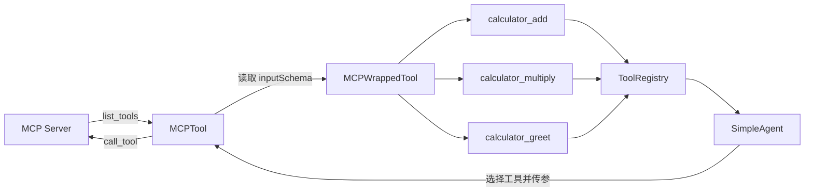

前缀用来避免多个 Server 提供同名工具。例如 GitHub 和文件系统分别命名为 `gh` 与 `fs`，展开后得到 `gh_search_repositories` 和 `fs_write_file`，不会相互覆盖。

```python
github = MCPTool(
    name="gh",
    server_command=["npx", "-y", "@modelcontextprotocol/server-github"],
    env_keys=["GITHUB_PERSONAL_ACCESS_TOKEN"],
)
agent.add_tool(github)
```

这里的环境变量选择是确定性规则：显式 `env` 优先，其次是 `env_keys`，最后才按已知 Server 名称查表。它不是“智能识别”，新 Server 应显式声明所需变量，也不应把 Host 的全部环境直接透传给子进程。

`MCPWrappedTool` 目前转换 JSON Schema 的顶层 `properties`，`string`、`number`、`integer`、`boolean`、`object` 和 `array` 可进入现有 Tool System。复杂的联合类型、嵌套校验和 Schema 约束仍由 Server 做最终判定。

#### 代码结构

10.2 没有重新建立一套独立演示，而是在 10.1 的协议层上继续补全：

```text
hello_agents/
├── protocols/mcp/
│   ├── client.py              # 异步客户端与传输选择
│   ├── server.py              # FastMCP 封装与离线 Server
│   └── utils.py               # 上下文与响应辅助函数
└── tools/builtin/
    ├── protocol_tools.py      # MCPTool 同步适配与自动展开
    └── mcp_wrapper_tool.py   # 单个 MCP Tool 的 Tool 适配器

examples/
├── mcp_protocol_demo.py       # 零网络完整闭环
├── mcp_example_server.py      # FastMCP stdio Server
├── mcp_stdio_client_demo.py   # 真实 stdio 客户端
└── mcp_document_assistant.py  # GitHub 搜索与报告生成
```

主要入口见 [`MCPClient`](./code/HelloAgents/hello_agents/protocols/mcp/client.py)、[`MCPServer`](./code/HelloAgents/hello_agents/protocols/mcp/server.py)、[`MCPTool`](./code/HelloAgents/hello_agents/tools/builtin/protocol_tools.py) 和 [`MCPWrappedTool`](./code/HelloAgents/hello_agents/tools/builtin/mcp_wrapper_tool.py)。

#### 实践一：离线跑通完整调用链

为了不把网络、Node.js、Token 或收费模型混入协议验证，[`mcp_protocol_demo.py`](./code/HelloAgents/examples/mcp_protocol_demo.py) 显式使用离线 Server。它依次验证：

1. `MCPClient` 发现工具并调用 `multiply`。
2. Client 读取 Resource 并渲染 Prompt。
3. `MCPTool` 将 6 个远程能力展开到 `ToolRegistry`。
4. 确定性假模型输出工具调用，`SimpleAgent` 把执行结果送回模型形成最终答案。

```bash
cd code/HelloAgents
PYTHONPATH=. python3 examples/mcp_protocol_demo.py
```

实际输出：

```text
=== MCPClient：发现与调用 ===
Transport: memory
Tools: add, subtract, multiply, divide, greet, get_system_info
multiply(25, 16): 400.0
Resource: name=HelloAgents
protocol=MCP
mode=memory
Prompt: 请用一个定义和一个例子解释 MCP。

=== MCPTool：自动展开与 Agent 集成 ===
Expanded tools: calculator_add, calculator_subtract, calculator_multiply,
calculator_divide, calculator_greet, calculator_get_system_info
Agent: 25 × 16 = 400。
```

这段输出不是手写的期望值：示例已在当前环境实际执行，且没有调用模型 API。

#### 实践二：FastMCP stdio 子进程

真实协议路径需要 FastMCP 2.x：

```bash
pip install "fastmcp>=2,<3"
PYTHONPATH=. python3 examples/mcp_stdio_client_demo.py
```

[`mcp_stdio_client_demo.py`](./code/HelloAgents/examples/mcp_stdio_client_demo.py) 会自动启动 [`mcp_example_server.py`](./code/HelloAgents/examples/mcp_example_server.py) 子进程，通过 stdin/stdout 交换 MCP 消息，退出 `async with` 时回收连接。业务输出如下：

```text
Transport: stdio
Tools: add, greet
add(4, 6): 10.0
Resource: 先 list_tools 发现能力，再 call_tool 传入结构化参数。
Prompt: 请用定义、一个例子和一条边界解释 MCP。
```

这一路径已使用 FastMCP 2.14.7 实际验证。运行 Server 测试时出现的 FastMCP banner 和依赖弃用警告属于 stderr 日志，不是 MCP 业务返回值。

#### 实践三：多 Agent 文档助手

[`mcp_document_assistant.py`](./code/HelloAgents/examples/mcp_document_assistant.py) 延续原文的三步流程：

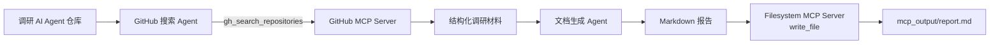

原文给文档 Agent 注册了文件系统 MCP Tool，随后却用 Python `open()` 保存，实际没有走 MCP。本次保留“搜索 → 生成 → 保存”的原意，但由应用显式调用文件 Server 的 `write_file`，让每个节点名副其实。

运行前需要：

- Node.js 与 `npx`。
- `GITHUB_PERSONAL_ACCESS_TOKEN`。
- `LLM_MODEL_ID`、`LLM_API_KEY` 和 `LLM_BASE_URL`。

该示例会下载并启动社区 Server、访问 GitHub 且调用模型，本次不执行，不将未发生的网络结果当作实践输出。社区包名称、参数和权限可能变化，正式使用时应固定版本并先审查源码。

#### 从说明代码到完整实现

原文专注说明 MCP 用法，多处细节需要在框架中落地：

| 说明代码留下的空缺 | 本次实现 |
| --- | --- |
| `MCPClient` 构造和连接逻辑未展开 | 支持 FastMCP 实例、Python 脚本、命令列表、传输字典与 HTTP URL |
| Resources / Prompts 示例缺少 `await` | 全部使用异步操作，并由上下文管理器关闭会话 |
| 工具 Schema 没有转换到 HelloAgents | 用 `MCPWrappedTool` 生成 `ToolParameter` 并自动注册 |
| 返回值类型不固定 | 归一化数据、结构化内容、文本块和资源块 |
| `MCPTool.run()` 需要同步返回 | 普通代码直接运行协程；已存在事件循环时改在独立线程运行，但 `run()` 仍是阻塞接口 |
| 默认演示依赖可选包 | FastMCP 存在时使用真实内存 Server，否则使用无第三方依赖的等价演示实现 |
| 文档助手注册了文件 Tool 却绕过它写入 | 报告保存明确经过 `write_file` MCP 调用 |

完整不等于把所有生产能力塞进本节。当前代码不做自动重试，也不替 Host 决定哪些工具可写、可删或需要人工确认。这些属于应用权限和可靠性设计，不应被协议封装隐藏。

#### 使用社区 MCP Server 前的检查

- 先查看工具列表、Schema 和服务器源码，不因为“支持 MCP”就默认可信。
- 文件 Server 只暴露必要根目录，数据库凭据使用最小权限账号。
- 只传入 Server 必需的环境变量，不在日志、笔记或工具结果中回显 Token。
- 对写入、删除、发送消息等高影响操作加权限分级与人工确认。
- 对网络 Server 配置超时、限流、重试边界、审计日志和调用指标。

### A2A 协议实战

#### A2A 解决的不是远程函数调用

MCP 把工具、资源和提示词暴露给 Agent，A2A 则让一个 Agent 把任务交给另一个独立 Agent。对方可以有自己的模型、工具、记忆和执行循环，调用方只关心它公开的能力、任务状态和最终产物。

原文用星型协调和网状协作解释 A2A 的动机：

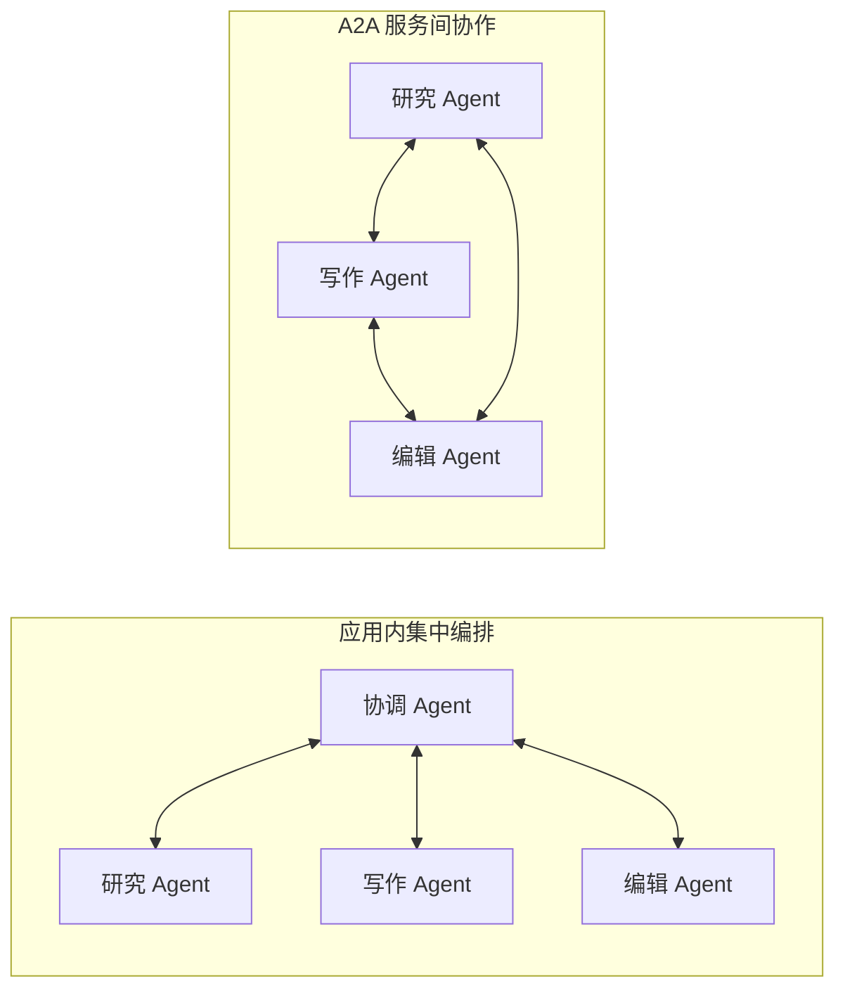

网状连接减少了所有消息都经过一个协调者的要求，但不能“从根本上”消除单点故障。应用若仍依赖唯一入口、注册中心或认证服务，这些组件依旧可能失效；连接增多后还会出现发现、鉴权、超时、重试和冲突处理问题。A2A 提供的是互操作边界，不替应用选择拓扑。

#### 六个核心对象

| 对象 | 作用 | 本次实践中的位置 |
| --- | --- | --- |
| Agent Card | 描述 Agent 身份、接口、能力和技能 | `/.well-known/agent-card.json` |
| Skill | Agent 声明自己擅长处理的任务 | `add`、`research`、`write`、`edit` |
| Message | Agent 之间发送的输入、补充信息或状态说明 | 客户端提交的计算或研究请求 |
| Part | Message 或 Artifact 的内容单元 | 本次使用 `text/plain` |
| Task | 可跟踪的异步工作，带 ID、上下文和状态 | 计算请求对应的一次任务 |
| Artifact | Task 产生的结果 | 计算结果、研究材料或文章 |

Skill 是发现信息，不是标准中的远程函数端点。标准客户端发送的是 `Message`，由服务端 Agent 决定怎样理解和执行。文章使用的 `execute_skill("research", text)` 是 HelloAgents 的便利接口，本次保留了它，但内部只是把 skill 名称和输入封装成一条结构化消息。它适合成对使用本章的客户端与服务端，不能假设任意 A2A Agent 都认识这个扩展格式。

#### Task 生命周期

原文中的“创建、协商、代理”更接近业务阶段。当前 A2A 规范定义的 Task 状态是 `submitted`、`working`、`input-required`、`auth-required`、`completed`、`failed`、`canceled` 和 `rejected`：

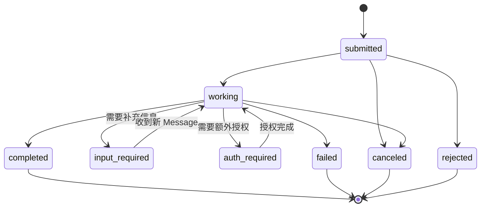

`input-required` 和 `auth-required` 是中断状态，不是失败；客户端补充信息或完成授权后，任务可以继续。协商也不是一个名为 `negotiating` 的标准状态，而是应用在 Message 或结构化数据中定义的交互语义。

#### 一次请求如何流转

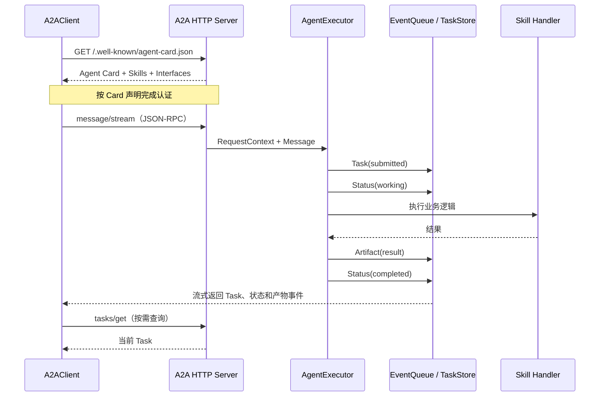

发现先于调用：客户端先读取 Agent Card，再根据其中的接口绑定创建传输客户端。认证方案也由 Card 声明，但 SDK 不会自动替应用获取凭据或判断授权范围。

本次服务采用长任务事件模式。`AgentExecutor` 必须先把 `Task` 放入事件队列，再发送状态和 Artifact；不能在一次执行中先返回独立 `Message`，又继续发送 Task 更新。客户端收到不同事件后，统一整理成 `task_id`、`context_id`、`status`、`result`、`artifacts` 和 `events`。

#### 从文章接口到可运行实现

文章展示了 `A2AServer`、`A2AClient` 和 `A2ATool`，但没有展开底层实现。本次仍按这三层补齐：

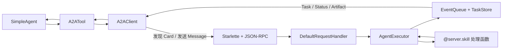

- `A2AServer` 保存 skill 处理函数和对外元数据，生成 Agent Card，并用官方路由启动 JSON-RPC 服务。
- `AgentExecutor` 把 Message 转成 Task，依次发布 `working`、Artifact 和 `completed`；异常则发布 `failed`。
- `A2AClient` 负责 Card 发现、消息发送、任务查询和取消，并归一化流式响应。
- `A2ATool` 把上述操作映射到现有 `Tool.run(parameters)`，Agent 不需要依赖 SDK 类型。

完整协议实现见 [`implementation.py`](./code/HelloAgents/hello_agents/protocols/a2a/implementation.py)，工具适配见 [`protocol_tools.py`](./code/HelloAgents/hello_agents/tools/builtin/protocol_tools.py)。

#### 服务端：注册技能并生成 Agent Card

注册形式保留原文的装饰器写法，同时补上描述、标签、示例和输入输出模式：

```python
from hello_agents import A2AServer

calculator = A2AServer(
    name="calculator-agent",
    description="提供加法和乘法计算的 Agent",
    capabilities={"math": ["addition", "multiplication"]},
)

@calculator.skill("add", examples=["计算 10 + 5"])
def add_numbers(query: str) -> str:
    expression = query.replace("计算", "")
    numbers = [float(value.strip()) for value in expression.split("+")]
    return f"计算结果: {sum(numbers)}"

calculator.run(host="127.0.0.1", port=5000)
```

这里传入的业务 `capabilities` 用于整理技能标签；协议级 `AgentCapabilities` 表示是否支持 streaming、push notifications 等特性，两者不能混为一谈。对外真正可发现的是 Card 中的 `skills`。

当前官方 Python SDK 已进入 1.x，与文章写作时常见的早期示例有较大差异。本次基于 `a2a-sdk==1.1.2` 实现：服务端组合 `DefaultRequestHandler`、`AgentExecutor`、`InMemoryTaskStore` 和路由工厂，没有使用已移除的旧应用包装类。

#### 客户端：发现、发送、查询和取消

文章中的同步调用方式保持不变：

```python
from hello_agents import A2AClient

client = A2AClient("http://127.0.0.1:5000")
card = client.get_agent_card()
response = client.execute_skill("add", "计算 10 + 5")

print(card["name"])
print(response["status"])
print(response["result"])
task = client.get_task(response["task_id"])
```

底层 SDK 是异步接口，代码同时提供 `get_agent_card_async()`、`send_message_async()`、`get_task_async()` 和 `cancel_task_async()`。同步方法只是方便普通 CLI 和 `Tool.run()` 使用；异步 Web 服务应直接调用 async 版本，避免阻塞事件循环。

取消是请求，不保证一定成功。任务已经完成、服务端不支持取消或业务处理无法及时响应时，都可能拒绝取消。本次计算任务很快结束，所以只验证了取消接口与事件处理代码，没有伪造“取消成功”的输出。

#### A2ATool：接入现有 Agent 循环

```python
from hello_agents import SimpleAgent
from hello_agents.tools import A2ATool

researcher_tool = A2ATool(
    name="researcher",
    description="研究员 Agent，可以搜索和分析资料",
    agent_url="http://127.0.0.1:5000",
)
coordinator = SimpleAgent(name="协调者", llm=llm)
coordinator.add_tool(researcher_tool)
```

`A2ATool` 支持 `get_agent_card`、`send_message`、`execute_skill`、`get_task` 和 `cancel_task`。模型若调用 `execute_skill`，至少要提供 `skill_name` 与 `input`；未知 skill、空消息、非法地址和网络错误都会转成可读错误，不能被包装成成功结果。

#### 实践一：离线完成多 Agent 协作

[`a2a_protocol_demo.py`](./code/HelloAgents/examples/a2a_protocol_demo.py) 保留原文的四组练习：计算器、研究员—撰写员—编辑链路、客服分流和两轮协商。它使用 `A2AClient.from_server()` 直接连接本地 Server 对象，不经过网络，适合先验证任务编排和数据传递。


研究结果与审校结果使用 JSON 传递，不用 `str(dict)` 配合 `eval()` 还原。这样既保留原文的数据流，也避免输入字符串执行任意 Python 代码。

```bash
cd code/HelloAgents
PYTHONPATH=. python3 examples/a2a_protocol_demo.py
```

实际输出：

```text
=== Agent Card 与技能调用 ===
Agent: calculator-agent
Skills: add, multiply, info
info: 我是 calculator-agent，支持 add, multiply, info。 [completed]
add: 计算结果: 10.0 + 5.0 = 15.0 [completed]
multiply: 计算结果: 6.0 × 7.0 = 42.0 [completed]

=== 三 Agent 内容协作 ===
# AI 在医疗领域的应用

主要应用包括：辅助影像分析、支持个性化诊疗。

使用时仍需人工复核。
反馈: 补充了使用边界
通过: True

=== A2ATool 与接待员 Agent ===
客服回复：技术专家：你们的 API 如何调用？ 可通过 REST API 和 Python SDK 接入。
客服回复：销售顾问：企业版的价格是多少？ 请根据席位数申请企业报价。

=== Agent 间协商 ===
第 1 轮: {'accepted': False, 'message': '时间太紧', 'counter_proposal': {'deadline': 7}}
第 2 轮: {'accepted': True, 'message': '接受提案'}
```

客服示例使用确定性假模型选择技术或销售工具，真实执行仍经过 `SimpleAgent → A2ATool → A2AClient → A2AServer`，没有调用收费模型。协商中的提案、反提案与接受条件是业务规则，不是 A2A 自动提供的谈判算法。

#### 实践二：官方 SDK 的真实 HTTP 闭环

网络实践需要 Python 3.10+：

```bash
pip install "a2a-sdk[http-server]>=1,<2"
```

先启动服务端：

```bash
cd code/HelloAgents
PYTHONPATH=. python3 examples/a2a_calculator_server.py --port 5000
```

再在另一个终端运行客户端：

```bash
PYTHONPATH=. python3 examples/a2a_calculator_client.py \
  --url http://127.0.0.1:5000
```

本机回环测试的实际业务输出如下，依赖库警告已略去：

```text
Agent Card: calculator-agent
Skills: add, multiply
Status: completed
Artifact: 计算结果: 10.0 + 5.0 = 15.0
Events: task:submitted -> status:working -> artifact:add-result -> status:completed
tasks/get: completed
```

这次验证经过真实 HTTP 与 JSON-RPC：客户端先读取 Agent Card，再接收四个流式事件，最后用 `tasks/get` 从服务端任务存储中取回完成状态。它比“实例创建成功”多验证了发现、传输、状态和产物四个环节。

#### 文章说明代码中补齐或修正的部分

| 原文说明代码留下的问题 | 本次处理 |
| --- | --- |
| `A2AServer`、`A2AClient` 只有用法，没有实现 | 补齐 Card、路由、Executor、EventQueue、TaskStore 和客户端 |
| 注册 Python 函数后没有生成可发现的技能信息 | 装饰器同时保存 handler 与 Agent Card metadata |
| `execute_skill()` 容易被误解为标准方法 | 明确它是 HelloAgents 兼容层，标准交互仍是 Message |
| 服务只返回字符串，看不到任务过程 | 按顺序发布 Task、working、Artifact、completed/failed |
| `str(dict)` 与 `eval()` 传递数据 | 改为 `json.dumps()` 与 `json.loads()` |
| 多服务启动后固定 `sleep(2)` | 真实部署应轮询 Agent Card 或健康检查后再发请求 |
| 启动线程后立即打印“服务已启动” | 只有 Card 可访问才代表服务已经就绪 |
| 协商使用自定义 `negotiating` 状态 | 协商作为 Message 数据，Task 保持规范状态 |
| 示例未处理未知技能和业务异常 | 统一进入 `failed` 状态并返回错误说明 |

文章给出了“研究 → 写作 → 编辑”的顺序，当前实现没有擅自加入规划器、向量数据库或模型路由。补齐的内容都围绕 A2A 发现、任务交换和 HelloAgents Tool 接入。

#### 实际部署还缺什么

本节是可运行的学习实现，不是生产网关：

- `InMemoryTaskStore` 在进程退出后丢失任务，生产环境要使用持久化存储并处理幂等键。
- Agent Card 声明能力不等于可信，应验证来源、签名和接口地址，防止恶意 Card 引导请求。
- 认证、凭据刷新和租户隔离要由应用配置；公开服务不能因为“支持 A2A”就默认匿名访问。
- 长任务需要超时、取消检查、重试边界、断线续订或 push notifications，且重试不能重复产生副作用。
- Artifact 可能包含文件、URL 或结构化数据，接收方仍要做类型、大小、来源和内容校验。
- Agent 直接互联会扩大信任边界。涉及付款、发布、删除或敏感数据时，应保留最小权限和人工确认。

### 参考资料

- [《Hello-Agents》第十章：智能体通信协议](https://github.com/datawhalechina/hello-agents/blob/main/docs/chapter10/%E7%AC%AC%E5%8D%81%E7%AB%A0%20%E6%99%BA%E8%83%BD%E4%BD%93%E9%80%9A%E4%BF%A1%E5%8D%8F%E8%AE%AE.md)
- [MCP 规范：Transports](https://modelcontextprotocol.io/specification/draft/basic/transports)
- [FastMCP 2：Client](https://gofastmcp.com/v2/clients/client)
- [FastMCP 2：Tools](https://gofastmcp.com/v2/servers/tools)
- [FastMCP 2：Resources](https://gofastmcp.com/v2/servers/resources)
- [FastMCP 2：Prompts](https://gofastmcp.com/v2/servers/prompts)
- [A2A Protocol 规范](https://a2a-protocol.org/latest/specification/)
- [A2A Python SDK](https://github.com/a2aproject/a2a-python)
- [A2A Python SDK 1.0 迁移说明](https://github.com/a2aproject/a2a-python/blob/main/docs/v1.0-migration-guide.md)
- [A2A Task 生命周期](https://a2a-protocol.org/latest/topics/life-of-a-task/)
- [Agent Network Protocol 官方文档](https://agent-network-protocol.com/)

### 小结

- MCP 统一的是 Host 与外部 Server 之间的能力发现和调用边界；Tools、Resources 和 Prompts 分别表达可执行操作、可读上下文和可复用模板。
- Function Calling 决定调用意图，HelloAgents Tool 统一框架内入口，MCP 负责跨进程或跨网络交互，三者可组成完整链路。
- MCP 规范的主要传输是 stdio 和 Streamable HTTP；内存 Server 是测试手段，启动参数不是新传输，SSE 只是旧服务兼容方式。
- FastMCP 底层使用异步会话；`MCPTool` 负责同步适配，`MCPWrappedTool` 负责将远程 Schema 展开为 Agent 可选择的独立工具。
- 本次代码实际跑通离线完整链和 FastMCP stdio 子进程，同时保留原文 GitHub 搜索、Markdown 生成与文件 Server 保存的多 Agent 流程。
- A2A 通过 Agent Card 发现能力，以 Message 交换输入和补充信息，以 Task 跟踪长任务，并把结果放入 Artifact；Skill 不是远程函数端点。
- `execute_skill()` 是 HelloAgents 为文章示例保留的便利接口。真实 SDK 闭环已验证 `submitted → working → Artifact → completed` 和 `tasks/get`，协商等业务语义仍由应用定义。
- 协议并不提供默认安全信任。Host 仍要限制 Server 能看到的目录、凭据和写操作，并对高影响行为保留人工确认。
