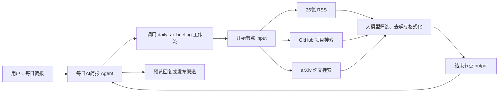
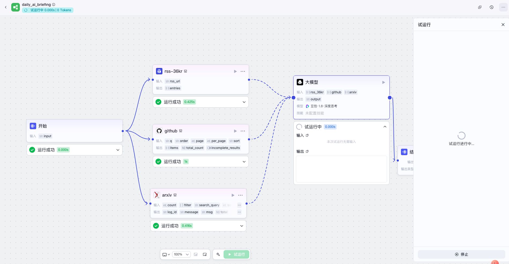
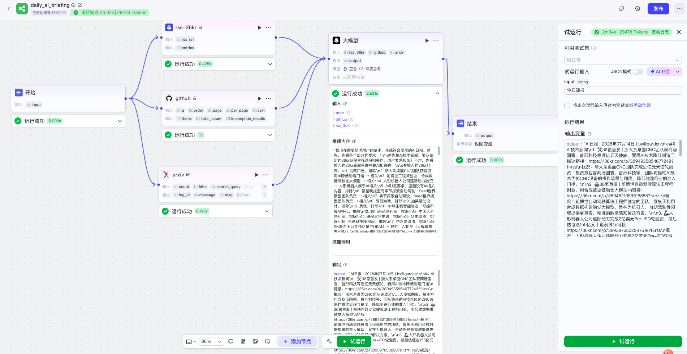
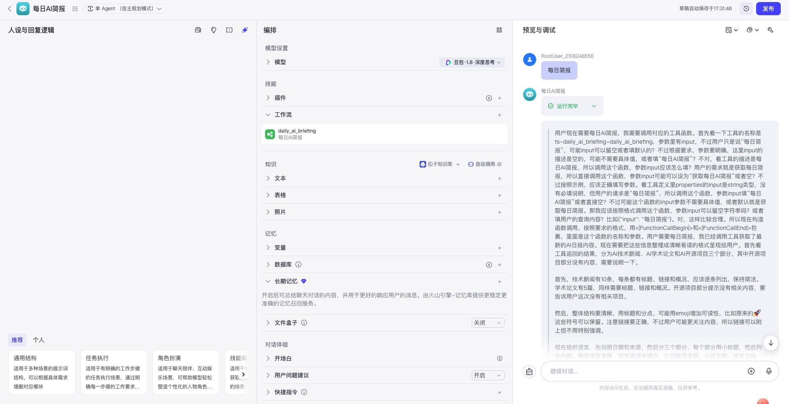
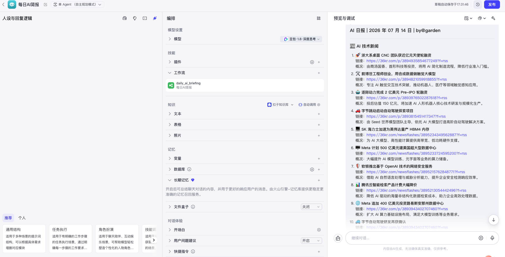
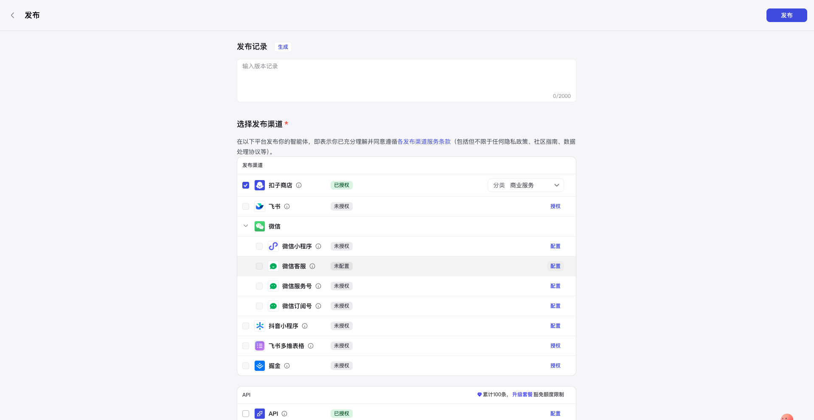
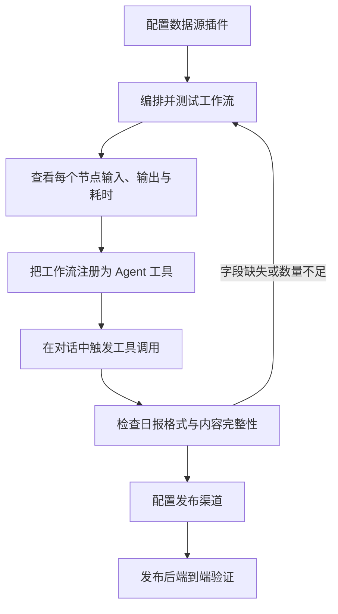

## 基于低代码平台的智能体搭建

> 阅读材料：[《Hello-Agents》第五章：基于低代码平台的智能体搭建](https://datawhalechina.github.io/hello-agents/#/./chapter5/%E7%AC%AC%E4%BA%94%E7%AB%A0%20%E5%9F%BA%E4%BA%8E%E4%BD%8E%E4%BB%A3%E7%A0%81%E5%B9%B3%E5%8F%B0%E7%9A%84%E6%99%BA%E8%83%BD%E4%BD%93%E6%90%AD%E5%BB%BA)
>
> Coze 实践：每日 AI 简报，截图时间为 2026 年 7 月 14 日。平台界面、套餐和功能会持续变化，笔记以本次实践状态为准。

### 从手写 Agent 到平台化构建

第四章通过 Python 实现了 ReAct、Plan-and-Solve 和 Reflection，让我理解了 Agent Loop 的内部机制。第五章则把这些底层能力封装为可视化节点，使开发重点从“如何实现循环”转向“如何表达业务流程”。

低代码平台不是取消代码，而是提高抽象层级：

| 纯代码中的概念 | 低代码平台中的对应物 |
|:--|:--|
| 函数、类 | 节点、插件、工具 |
| 参数和返回值 | 节点输入、节点输出 |
| 条件语句、循环、并发 | 分支、循环节点、并行连线 |
| 上下文和状态 | 变量、记忆、数据库 |
| Prompt 模板 | 人设、系统提示词、用户提示词 |
| 日志和断点 | 节点运行状态、输入输出与耗时 |
| API 部署 | 发布渠道、API 和应用集成 |

#### 低代码平台的价值

* **降低门槛**：把 API 调用、状态管理和任务编排封装为可配置节点。
* **提高原型速度**：可以先验证数据流、提示词和产品形态，再决定是否代码化。
* **增强可观测性**：每个节点的输入、输出、状态和耗时都能直接在画布上查看。
* **沉淀标准组件**：工作流、插件、知识库和提示词可以复用，方便团队协作。

#### 低代码平台没有消除的复杂度

平台只是把复杂度从代码迁移到了其他位置：

* 节点之间仍然需要稳定的数据契约和字段映射。
* 外部插件仍然会遇到鉴权、限流、超时和返回格式变化。
* 提示词仍然需要定义目标、边界、输入来源和输出结构。
* 可视化流程仍然需要版本管理、测试、监控和失败恢复。
* 发布到不同渠道仍然涉及授权、审核和平台规则。

因此，低代码更适合快速验证和标准化流程；当业务逻辑、高并发、合规或可测试性要求变高时，仍需结合代码开发。

### 低代码平台的定位

当前教材介绍了 Coze、Dify、FastGPT 和 n8n。下面的比较侧重稳定的产品定位，不把容易变化的插件数量、价格和套餐作为选型依据。

| 平台 | 核心定位 | 更适合的场景 | 主要取舍 |
|:--|:--|:--|:--|
| Coze | 零代码/低代码 Agent 构建与多渠道分发 | 快速原型、内容助手、个人创作者和运营场景 | 上手快、插件和发布体验直观，但深度工程控制受平台约束 |
| Dify | 开源 LLM 应用开发与运营平台 | 企业应用、复杂工作流、RAG 和模型管理 | 能力全面、可部署，但配置和运维门槛更高 |
| FastGPT | 面向知识库问答的 RAG 与 Agent 平台 | 私有文档问答、客服、专业知识助手 | RAG 链路精细，通用自动化生态相对不是重点 |
| n8n | 通用工作流自动化平台，AI 是其中一类节点 | 邮件、数据库、SaaS、API 与 AI 的业务集成 | 连接能力强、可私有化，复杂流程调试和协作仍需工程治理 |

选型不能只看“能否拖拽”，还应同时评估：

1. 数据是否允许进入托管平台。
2. 是否需要私有化部署和持久化存储。
3. 工作流能否导出、审查和版本化。
4. 所需插件、模型和发布渠道是否可用。
5. 调用频率、Token 成本和并发量是否可控。
6. 发生节点失败时能否重试、降级和告警。

### Coze 的核心模块

Coze 可以理解为一个围绕 Agent 的资源和交付平台：

| 模块 | 我的理解 |
|:--|:--|
| Agent | 面向用户的交互入口，负责理解意图、自主规划并选择工具 |
| 工作流 | 确定性更强的数据处理管道，适合固定步骤和结构化输出 |
| 插件 | 连接搜索、RSS、GitHub、arXiv 等外部能力 |
| 知识库 | 为模型提供领域资料和可检索的外部知识 |
| 变量、数据库和长期记忆 | 保存会话之外的状态与业务数据 |
| 提示词 | 定义角色、任务边界、工具使用规则和输出格式 |
| 预览与调试 | 检查工具调用、节点输入输出和最终回复 |
| 发布管理 | 把 Agent 分发到扣子商店、API 或其他已授权渠道 |

本次实践采用了两层结构：

* 底层 `daily_ai_briefing` 工作流负责获取并整理新闻数据。
* 上层“每日AI简报”Agent 负责理解用户请求，并自主决定调用该工作流。

这比把所有逻辑直接写进 Agent 提示词更清晰：工作流是可测试的工具，Agent 是使用工具的调度者。

### 实践：搭建“每日 AI 简报”

#### 实践目标

用户输入“每日简报”后，Agent 自动调用 `daily_ai_briefing`，从 36氪 RSS、GitHub 和 arXiv 获取 AI 相关内容，再由大模型筛选、概括并输出带日期、标题、链接和摘要的日报。

整体数据流如下：



#### 第一步：配置三路数据源

本次实践没有接入教材列出的全部媒体，而是先用三类代表性来源验证链路：

| 节点 | 输入配置 | 输出用途 |
|:--|:--|:--|
| `rss-36kr` | 36氪 RSS 地址 | 获取 AI 行业与融资新闻 |
| `github` | 查询词 `AI`，每页 10 条，按更新时间排序 | 获取近期更新的开源项目 |
| `arxiv` | 查询词 `AI`，数量 5，设置排序方式 | 获取近期学术论文 |

三条分支由开始节点同时触发，再汇入同一个大模型节点。视觉上是并行数据流，能够把“数据获取”和“内容加工”分离。

<div align="center">
  
  <p>图 1：36氪 RSS、GitHub、arXiv 三路数据源汇入大模型节点</p>
</div>

从节点输出字段可以看出，不同插件的数据结构并不一致：

* RSS 返回 `entries`。
* GitHub 返回 `items`、`total_count` 和 `incomplete_results`。
* arXiv 返回日志、消息、文本等字段。

这意味着连接成功并不等于模型一定能正确使用数据。下游提示词必须明确告诉模型每一路数据对应的变量和关键字段；如果插件升级后字段名变化，工作流也需要同步修改。

#### 第二步：让大模型完成语义加工

大模型节点接收 `rss_36kr`、`github` 和 `arxiv` 三组列表。它不负责抓取数据，而是完成更适合语言模型的任务：

1. 识别与 AI、LLM、AIGC 和大模型相关的条目。
2. 排除广告、重复内容和明显无关信息。
3. 为每条内容保留标题与原始链接。
4. 生成简短、准确的概况。
5. 按固定栏目和 Markdown 格式输出。

本次实际输出采用如下结构：

```text
AI 日报 | YYYY 年 MM 月 DD 日 | by@garden

## AI 技术新闻
1. Emoji + 标题
   链接：原始 URL
   概况：一句话摘要

## AI 学术论文
...

## AI 开源项目
...
```

提示词设计中，角色只是起点。真正决定稳定性的，是可验证的输出约束：

* 每个栏目需要多少条内容。
* 缺少数据时应该省略、说明还是触发重试。
* 标题、链接和摘要分别来自哪个字段。
* 是否允许模型补充输入中不存在的事实。
* 如何处理重复链接、无效链接和非当天内容。

#### 第三步：运行工作流并定位性能瓶颈

工作流运行成功后，三路数据分别返回：

| 输入 | 截图中的数量 |
|:--|--:|
| arXiv | 5 |
| GitHub | 10 |
| 36氪 RSS | 30 |

节点耗时如下：

| 节点 | 耗时 |
|:--|--:|
| 开始 | 0.000 秒 |
| RSS | 0.425 秒 |
| GitHub | 1 秒 |
| arXiv | 0.416 秒 |
| 大模型 | 约 2 分 31 秒 |
| 工作流总计 | 约 2 分 34 秒 |

本次运行总消耗为 **29478 Tokens**。从耗时可以推断，大模型生成占总时长约 98%，数据获取并不是主要瓶颈。

<div align="center">
  
  <p>图 2：工作流运行完成，显示节点耗时、输入数量、Token 与最终输出</p>
</div>

这个结果给出的优化方向很明确：

* 在进入大模型前先用规则节点按日期、关键词和链接去重，减少上下文。
* 不要把插件的全部原始字段交给模型，只保留标题、链接、摘要和必要元数据。
* 可以先用较便宜的模型逐路压缩，再由主模型完成最终编排。
* 对固定 Markdown 骨架使用模板节点，大模型只生成语义内容。
* 对耗时较长的日报任务考虑异步执行、定时生成和结果缓存。

#### 第四步：把工作流注册为 Agent 工具

在“每日AI简报”Agent 中，将 `daily_ai_briefing` 添加为可调用工作流。Agent 使用自主规划模式：收到“每日简报”后，先理解用户意图，再选择并调用对应工具，最后把工作流结果回复给用户。

<div align="center">
  
  <p>图 3：Agent 在预览调试中识别请求并调用 daily_ai_briefing</p>
</div>

截图中的调度过程暴露了一个容易忽略的问题：工具虽然只有一个 `input` 字符串参数，但参数语义并不明确，模型需要猜测应该传“每日简报”、用户原话还是空值。

因此，工作流作为工具时应写清楚：

* 工具在什么意图下使用。
* 每个参数的类型、含义、是否必填和默认值。
* 返回内容的结构。
* 工具失败或数据为空时如何处理。

好的工具描述相当于 Agent 与工作流之间的 API 文档，可以显著减少无效调用和参数猜测。

#### 第五步：检查实际日报

预览结果成功生成：

```text
AI 日报 | 2026 年 07 月 14 日 | by@garden
```

可见区域包含 10 条 AI 技术新闻，每条都有标题、原始链接和概况，说明固定格式已经生效。

<div align="center">
  
  <p>图 4：Agent 生成的 2026 年 7 月 14 日 AI 日报</p>
</div>

但调试文本一度提示“AI 开源项目部分没有内容”，而工作流运行面板又显示 GitHub 节点返回了 10 条记录。这说明：

> 上游节点有输出，不代表下游大模型一定读到了正确字段，也不代表最终结果满足栏目数量要求。

排查顺序应该是：

1. 查看 GitHub 节点的真实 `items` 结构。
2. 确认大模型节点绑定的是完整数组，而不是空字段或错误层级。
3. 在提示词中明确项目名称、链接、描述等字段路径。
4. 检查模型是否因上下文过长而忽略靠后的 GitHub 数据。
5. 为三个栏目分别增加数量校验，缺少时返回工作流重试，而不是静默交付。

#### 第六步：配置发布渠道

发布页显示扣子商店已经授权并被选中，API 也处于已授权状态；飞书、微信相关渠道、抖音小程序、飞书多维表格和掘金等渠道仍需要分别授权或配置。

<div align="center">
  
  <p>图 5：进入发布配置，为不同渠道单独完成授权与配置</p>
</div>

发布不是简单地点击一次按钮，而是一个交付过程：

* 填写版本记录，说明本次变更。
* 选择发布渠道与应用分类。
* 完成各渠道的账号授权、回调和权限配置。
* 检查渠道对 Markdown、链接、卡片和消息长度的支持差异。
* 发布后再次进行端到端验证。

本次截图证明已经进入发布配置阶段，但不能只凭该页面判断所有渠道均已发布成功；最终状态应以各渠道的发布结果和实际访问测试为准。

### 实践复盘

#### 已经跑通的闭环



这次实践已经完成“数据接入—工作流编排—模型加工—Agent 调用—结果预览—发布配置”的完整路径。相比只在工作流测试页得到字符串，上层 Agent 让这条流程变成了用户可以用自然语言触发的产品能力。

#### 需要继续优化的地方

1. **字段契约**：为 RSS、GitHub、arXiv 先转换成统一结构，例如 `title/url/summary/source/published_at`。
2. **内容校验**：在结束节点前验证 10 条新闻、5 篇论文和 5 个项目是否齐全。
3. **时间过滤**：日报应明确时区和“当天”的边界，避免混入旧内容。
4. **去重与可信度**：同一事件可能被多个来源转载，应按链接和语义去重，并优先保留原始来源。
5. **成本控制**：29478 Tokens 对一次日报偏高，应压缩输入并缓存结果。
6. **失败恢复**：单个插件失败时应降级为剩余来源，而不是让整条流程无结果。
7. **定时生成**：日报更适合定时任务生成一次，再由多个用户读取缓存。
8. **发布验收**：分别验证商店、API 和其他渠道的格式、权限与链接可访问性。

### 工作流与 Agent 的边界

这次实践让我更清楚地区分了两类编排：

| 维度 | 工作流 | Agent |
|:--|:--|:--|
| 控制方式 | 开发者预先定义步骤和连线 | 模型根据意图和上下文自主决策 |
| 稳定性 | 路径确定，容易测试和复现 | 灵活，但可能选错工具或参数 |
| 适合任务 | 抓取、转换、校验、固定格式输出 | 意图理解、工具选择、动态规划 |
| 本次角色 | 生成 `daily_ai_briefing` | 接收“每日简报”并调用工作流 |

更可靠的设计原则是：

* 确定性的事情交给工作流或代码。
* 需要语义判断的事情交给大模型。
* 需要动态选择路径的事情交给 Agent。
* 最终正确性不要只由大模型自我判断，而要增加规则和数据校验。

### 我的理解

* **可视化不等于无工程。** 节点输入输出就是接口，连线就是依赖关系，工作流仍然需要测试和版本管理。
* **模型不应该承担所有工作。** 抓取、日期过滤、去重、计数和模板渲染更适合确定性节点。
* **Agent 应组合稳定工具。** 先把工作流独立调通，再交给 Agent 调用，比一开始就在 Agent 内调试所有问题更容易定位故障。
* **可观测性是低代码的核心收益。** 本次直接看出 2 分 34 秒中有约 2 分 31 秒消耗在大模型节点。
* **发布能力也是架构的一部分。** 一个工作流只有在授权、渠道适配、版本记录和线上验收完成后，才真正成为可交付应用。
* **平台适合原型，代码保证上限。** 验证需求后，可以把高成本、强合规或高并发环节逐步替换为自建服务。

### 小结

低代码平台把智能体开发从底层循环实现提升到了业务编排层。本次 Coze 实践中，三路数据源通过工作流汇聚，由大模型完成语义筛选和日报生成，再由上层 Agent 根据自然语言请求调用，最后进入多渠道发布配置。

最重要的收获不是“会拖节点”，而是理解了一个完整智能体应用的分层：

```text
数据源 → 确定性工作流 → 大模型语义加工 → Agent 调度 → 渠道交付
```

低代码能够显著缩短从想法到原型的时间，但字段契约、内容校验、成本、失败恢复、权限和发布验收仍然需要工程化思维。

### 参考资料

* [Datawhale：第五章 基于低代码平台的智能体搭建](https://github.com/datawhalechina/hello-agents/blob/main/docs/chapter5/%E7%AC%AC%E4%BA%94%E7%AB%A0%20%E5%9F%BA%E4%BA%8E%E4%BD%8E%E4%BB%A3%E7%A0%81%E5%B9%B3%E5%8F%B0%E7%9A%84%E6%99%BA%E8%83%BD%E4%BD%93%E6%90%AD%E5%BB%BA.md)
* [Coze](https://www.coze.cn/)
* [Dify](https://dify.ai/)
* [FastGPT](https://fastgpt.cn/)
* [n8n](https://n8n.io/)
