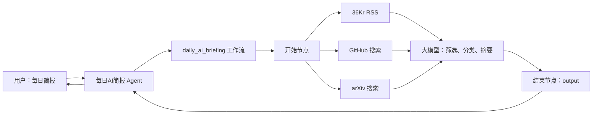
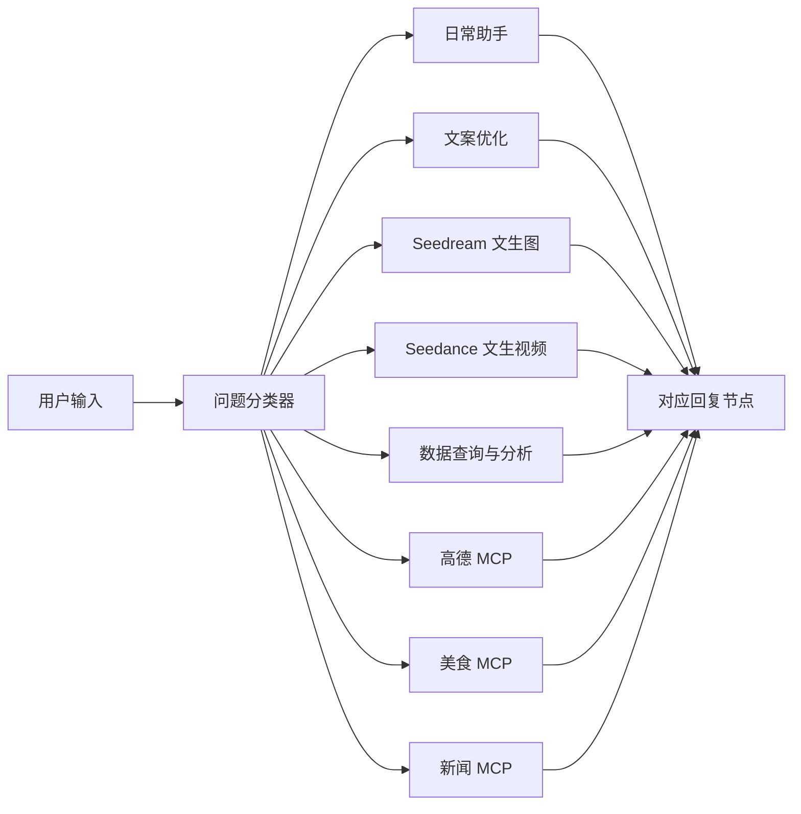
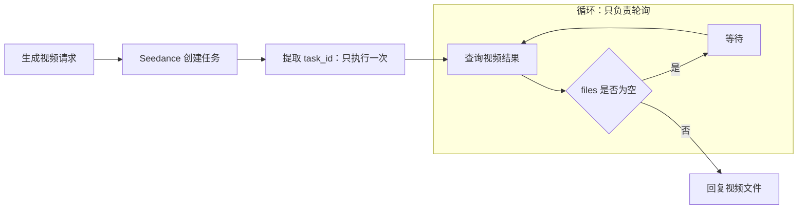
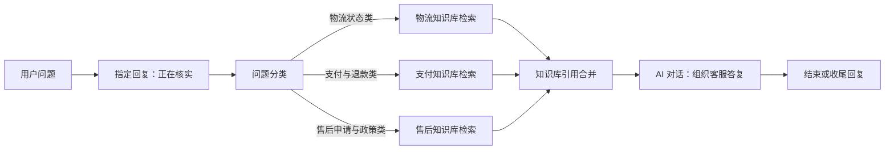
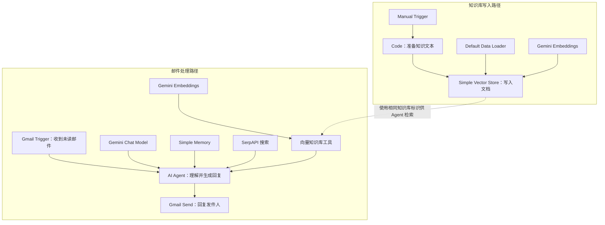

## 基于低代码平台的智能体搭建

> 阅读资料：[《Hello-Agents》第五章](https://datawhalechina.github.io/hello-agents/#/./chapter5/%E7%AC%AC%E4%BA%94%E7%AB%A0%20%E5%9F%BA%E4%BA%8E%E4%BD%8E%E4%BB%A3%E7%A0%81%E5%B9%B3%E5%8F%B0%E7%9A%84%E6%99%BA%E8%83%BD%E4%BD%93%E6%90%AD%E5%BB%BA)
>
> 实践一：使用 Coze 构建“每日 AI 简报”，截图记录于 2026 年 7 月 14 日。
>
> 实践二：使用 Dify 构建“Garden 个人助手”，重点实践多路由、MCP 和异步视频生成。
>
> 实践三：使用 FastGPT 构建“电商售后客服助手”。平台界面和功能以后可能调整。
>
> 实践四：使用 n8n AI Assistant（AI Chat）构建“Gmail AI Agent with Vector Store RAG”，并完成调试、发布与邮件回信验证。

### 低代码平台解决什么

低代码平台把模型、工具、知识库、记忆和发布渠道做成可配置节点。开发者仍要设计数据流和提示词，但不用从零处理模型接入、工具调度、状态传递与部署。

| 代码中的概念 | 低代码平台中的对应物 |
| --- | --- |
| 函数或 API | 插件、工具节点 |
| 控制流 | 工作流连线、分支、循环 |
| Prompt 与模型调用 | 大模型节点 |
| 应用入口 | Agent、聊天界面、API、发布渠道 |

本章介绍的四个平台侧重点不同：

| 平台 | 主要定位 | 更适合的场景 |
| --- | --- | --- |
| Coze | Agent、工作流与多渠道发布 | 快速制作原型和对话应用 |
| Dify | LLM 应用、工作流、RAG 与模型管理 | 需要私有化和完整应用能力的项目 |
| FastGPT | 知识库问答与 RAG | 企业文档检索、智能客服 |
| n8n | 通用业务自动化，AI 作为流程节点 | 连接大量业务系统和现有 API |

平台选择不只看模型数量，还要看数据是否允许托管、能否私有部署、工具接入方式、调试能力和发布渠道。

### Coze 的两层结构

这次实践用了工作流和 Agent 两层：

| 层级 | 职责 |
| --- | --- |
| 工作流（Workflow） | 拉取 36Kr、GitHub、arXiv 数据，交给大模型整理并返回日报 |
| Agent | 理解“每日简报”等自然语言请求，调用工作流并把结果回复给用户 |

工作流适合固定、可检查的执行步骤；Agent 负责对话入口和工具选择。把数据处理放在工作流里，问题更容易定位。

### 实践：每日 AI 简报

#### 整体流程



工作流名为 `daily_ai_briefing`。开始节点同时触发三个数据源，数据准备完毕后统一交给大模型，最后通过 `output` 返回 Markdown 日报。

#### 数据源与字段

| 节点 | 输入 | 主要输出 | 本次返回量 |
| --- | --- | --- | ---: |
| rss-36kr | RSS 地址 | `entries` | 30 条 |
| github | 查询词、排序、分页参数 | `items`、`total_count` | 10 条 |
| arxiv | 查询词、数量、筛选参数 | 论文标题、摘要等字段 | 5 条 |


三个节点并行执行，避免把网络请求串行叠加。需要注意的是，三个工具的返回结构不同，不能只把整个对象交给模型后期待它自行识别；关键字段应在节点映射或提示词中明确写出。

#### 大模型节点

大模型使用“豆包·1.8·深度思考”，输入为三个数据源的结果。它主要完成四件事：

1. 从原始结果中筛选与 AI 相关的内容。
2. 按技术新闻、学术论文和开源项目分类。
3. 为每条内容生成一句概述。
4. 按统一的 Markdown 模板输出标题、链接和摘要。

输出格式需要写成约束，而不是只说“生成日报”。例如：每个栏目最多多少条、字段缺失时如何处理、链接必须来自输入、禁止补造项目等。这样能降低格式漂移和内容幻觉。

#### 运行结果


本次运行记录如下：

| 环节 | 耗时或用量 |
| --- | ---: |
| 36Kr RSS | 0.425 秒 |
| GitHub | 1 秒 |
| arXiv | 0.416 秒 |
| 大模型 | 约 2 分 31 秒 |
| 工作流总耗时 | 约 2 分 34 秒 |
| Token 用量 | 29,478 Tokens |

三个数据节点都在 1 秒左右完成，大模型节点约占总耗时的 98%。瓶颈不在数据抓取，而在一次性输入过多内容并进行长文本推理。

可以从以下几处缩减成本和等待时间：

- 在进入大模型前裁剪无关字段，只保留标题、链接、时间、摘要和必要指标。
- 每个数据源先按时间、关键词或热度过滤，再限制候选数量。
- 不需要复杂推理时换用响应更快的模型，减少深度思考开销。
- 将“筛选”和“排版”拆开，便于观察是哪一步消耗最多。

#### Agent 调用工作流


“每日AI简报”Agent 采用自主规划模式，并把 `daily_ai_briefing` 配置为可调用工作流。用户输入“每日简报”后，Agent 识别意图、调用工作流，再把 `output` 作为最终回复。

工作流虽然只暴露一个 `input` 参数，也应写清它的含义和示例，例如“用户对日报日期、栏目或数量的补充要求”。参数描述含糊时，Agent 会在是否传空值、传原句还是自行改写之间反复判断。

#### 日报输出


最终页面生成了标题 `AI 日报｜2026 年 07 月 14 日｜by@garden`，技术新闻部分包含 10 条内容，每条都有标题、原始链接和一句概述。

调试记录中还有一个值得保留的问题：GitHub 节点已返回 10 条记录，但 Agent 的推理过程认为“AI 开源项目部分没有内容”。这说明“工具调用成功”不等于“下游正确使用了数据”。排查顺序应为：

1. 查看 GitHub 的 `items` 是否真正传入大模型节点。
2. 检查字段路径是否与提示词中的名称一致。
3. 确认裁剪或上下文长度限制没有截掉 GitHub 数据。
4. 在大模型输出前增加数量校验，例如要求报告三个来源各接收多少条。
5. 数据为空时明确输出原因，不让模型自行猜测。

数量校验能把静默丢数变成可见错误，比只检查节点是否显示“运行成功”更可靠。

#### 发布


实践已进入发布配置页。截图中扣子商店已授权并选中，API 也已授权；飞书、微信等渠道仍需要单独授权或配置。因此这里只能确认发布入口已经配置，不能据此判断所有渠道都已上线。

### Coze 实践结论

| 观察 | 结论 |
| --- | --- |
| 三个数据源可并行完成 | 独立的 I/O 节点应优先并行 |
| 大模型占绝大部分耗时 | 优化重点是输入裁剪、模型选择和任务拆分 |
| GitHub 有数据但栏目为空 | 节点成功之外还要检查字段映射和下游消费 |
| Agent 会犹豫如何填写 `input` | 工具参数要有明确语义、格式和示例 |
| 发布渠道状态不同 | 每个渠道都要分别检查授权、配置和发布结果 |

这次实践的核心不是把节点连起来，而是保证每条数据都能被正确传递、消费和验证。完整链路可以概括为：

`数据源 → 工作流 → 大模型 → Agent → 发布渠道`

### Dify：多路由个人助手

[原文 5.3 节](https://datawhalechina.github.io/hello-agents/#/./chapter5/%E7%AC%AC%E4%BA%94%E7%AB%A0%20%E5%9F%BA%E4%BA%8E%E4%BD%8E%E4%BB%A3%E7%A0%81%E5%B9%B3%E5%8F%B0%E7%9A%84%E6%99%BA%E4%BD%93%E6%90%AD%E5%BB%BA?id=_53-%e5%b9%b3%e5%8f%b0%e4%ba%8c%ef%bc%9adify)使用 Dify 构建“超级智能体个人助手”，把日常问答、文案优化、多模态生成、数据分析和 MCP 工具放进同一个 Chatflow。Dify 在这里承担两项工作：用问题分类器选择能力，再用不同的 Agent、插件或工作流完成任务。

#### 总体路由

我的应用名为“Garden 个人助手”。用户输入先经过问题分类器，再进入九类分支：

| 类别 | 处理方式 |
| --- | --- |
| 一般性日常生活问题 | 日常助手与常用工具 |
| 优化文案 | 文案优化助手 |
| 生成图片 | Seedream 文生图 |
| 生成视频 | Seedance 文生视频与结果轮询 |
| 查询数据 | 数据查询分支 |
| 数据分析 | 数据分析分支 |
| 地图导航 | 高德 MCP |
| 美食推荐 | 美食 MCP |
| 新闻资讯 | 新闻 MCP |



分类器和主要 Agent 使用 `DeepSeek-V4-Pro`。每个分支都有独立回复节点，避免不同节点的输出类型互相干扰。


测试“现在东京多少点”时，分类器进入日常助手，Agent 调用时间工具后返回东京时间，并补充与北京时间的时差。这个分支适合作为兜底，但工具描述要写清地点、时间、时区等参数，否则 Agent 容易在相似工具间选错。

#### 文案优化分支


输入“优化下面文本：欢迎使用 Dify，创建美好的智能世界”后，助手生成了一篇完整的营销文案。原文提示词要求输出超过 500 字，因此短句也被扩写成较长内容。

固定长度便于统一交付格式，但不适合所有请求。更合理的做法是让用户选择“精简、标准、详细”，或按原文长度设置扩写比例；没有明确要求时，优先保留原意和信息密度。

#### MCP 工具分支

高德、美食和新闻分支使用支持 MCP 工具的 ReAct Agent。问题分类器只负责路由，具体工具选择和参数填写交给各分支 Agent。


“从磨碟沙到天河公园应该怎么走”被分到地图导航，高德 MCP 返回地铁换乘和公交备选方案，并给出距离和预计耗时。


“磨碟沙附近有什么好吃的”进入美食推荐分支，结果按粤菜、快餐和小吃分类。推荐类结果会随时间变化，正式使用时应保留数据来源、查询时间和距离范围，不把模型整理后的内容当成长期有效信息。


新闻分支测试“获取今天 AI 资讯”，返回当天的 AI 新闻和来源。这里的“今天”依赖系统时间，调用工具时需要传入日期或时区，避免跨时区后取到前一天的数据。

#### 文生图分支


测试输入是“生成 Saber 在吃肯德基的图”。执行记录显示：

| 节点 | 耗时 |
| --- | ---: |
| 用户问题分类 | 4.116 秒 |
| Seedream 文生图 | 31.985 秒 |
| 图片回复 | 16.526 毫秒 |

图像生成占绝大部分时间，回复节点几乎没有额外开销。截图中的生成参数包括 2048×2048、JPEG 输出和水印开启；实际发布前还要确认品牌标识、角色版权和内容合规要求。

#### 文生视频：异步任务与轮询

视频生成不是一次请求直接返回文件，而是典型的异步任务：

1. Seedance 创建视频任务并返回任务 ID。
2. 从响应中提取任务 ID。
3. 使用任务 ID 查询生成状态。
4. 未完成时等待后重试，完成后返回 MP4 文件。

我的流程把“视频生成任务 ID 提取”放在循环外：




这次测试输入是“生成 Saber 在疯狂星期四吃肯德基的视频”，最终得到一个 4.62 MB 的 MP4 文件。节点记录如下：

| 节点 | 用量或耗时 |
| --- | ---: |
| 用户问题分类 | 1.08K Tokens，6.230 秒 |
| Seedance 创建视频任务 | 3.668 秒 |
| 视频任务 ID 提取 | 788 Tokens，3.894 秒 |
| 循环查询结果 | 约 1 分 11 秒 |

任务创建很快，主要等待发生在远程生成和轮询阶段。

#### 为什么把参数提取移到循环外

任务 ID 在任务创建成功后不会变化，它是循环不变量。假设查询结果需要轮询 `n` 次：

| 方案 | 参数提取次数 | 查询次数 |
| --- | ---: | ---: |
| 参数提取放在循环内 | `n` | `n` |
| 参数提取放在循环外 | 1 | `n` |

优化后少执行 `n - 1` 次参数提取。由于该节点本身调用大模型，本次单次就消耗 788 Tokens、约 3.9 秒，移出循环可以直接减少重复 Token、等待时间和失败点。

循环内部只保留会变化的状态：

`查询结果 → 判断 files 是否为空 → 等待或返回文件`

如果视频插件已经输出结构化的 `task_id` 字段，还可以直接引用该变量，不再调用大模型提取。循环还应设置最大次数、等待间隔和失败分支，分别处理任务超时、接口限流和生成失败，避免一直轮询。

#### Dify 实践结论

| 观察 | 结论 |
| --- | --- |
| 九类请求由一个分类器路由 | 新增能力时只需增加分类和独立分支 |
| MCP Agent 负责具体工具调用 | 分类器无需理解每个 API 参数 |
| 图片和视频生成耗时明显更长 | 前端需要展示处理中状态 |
| 视频任务 ID 在轮询期间不变 | 参数提取应放到循环外 |
| 轮询节点可能长时间运行 | 必须配置间隔、上限和异常出口 |

这次改动不是简单少放一个节点，而是把“初始化”和“重复检查”分开：循环外准备稳定参数，循环内只处理会变化的任务状态。

### FastGPT：知识库与工作流

[原文 5.4 节](https://datawhalechina.github.io/hello-agents/#/./chapter5/%E7%AC%AC%E4%BA%94%E7%AB%A0%20%E5%9F%BA%E4%BA%8E%E4%BD%8E%E4%BB%A3%E7%A0%81%E5%B9%B3%E5%8F%B0%E7%9A%84%E6%99%BA%E8%83%BD%E4%BD%93%E6%90%AD%E5%BB%BA?id=_54-%e5%b9%b3%e5%8f%b0%e4%b8%89%ef%bc%9afastgpt)把 FastGPT 定位为知识库问答与 Agent 构建平台。它的重点是把 RAG 链路做成可配置流程：

`文档导入 → 分块与索引 → 知识库检索 → 大模型生成`

知识库解决“根据什么资料回答”，工作流负责“按什么顺序处理”。两者组合后，客服、内部制度问答和产品助手这类场景不必把全部资料塞进提示词。

#### 原文方案与我的简化实践

原文的“智能投顾助手”包含知识库、MCP 实时数据、意图识别、风险问卷和投资报告，流程较长。本次只验证 FastGPT 最有代表性的两个环节：问题分类和知识库检索。

| 对比项 | 原文：智能投顾助手 | 我的实践：电商售后客服助手 |
| --- | --- | --- |
| 问题类型 | 概念咨询、股票查询、投资诊断等 | 物流、支付退款、售后政策 |
| 内部资料 | 金融知识库 | 三个售后知识库 |
| 外部工具 | 股票行情、图表等 MCP | 未接入 |
| 交互流程 | 风险问卷、画像分析、报告生成 | 分类、检索、直接回答 |
| 实践目标 | 验证完整 Agent 编排 | 先跑通分类与 RAG 主链路 |

删去 MCP 和表单后，节点更少，分类结果、检索分支和最终回答之间的关系也更容易观察。

#### 工作流设计

应用名为“电商售后客服助手”，流程如下：



上图补入了“知识库引用合并”节点，这是截图中当前流程还需要完善的地方。


流程开始后先返回“正在为您核实具体情况”，再进入问题分类。这个固定回复不会参与判断，只是让用户知道请求已经开始处理。

#### 问题分类

问题分类节点使用 `deepseek-v4-flash`，读取最近 6 条聊天记录和当前问题，再从三个类别中选择一条分支：

| 分类 | 典型问题 | 后续节点 |
| --- | --- | --- |
| 物流状态类 | 包裹位置、预计送达、物流停滞、修改地址 | 物流知识库检索 |
| 支付与退款类 | 付款失败、退款进度、退款未到账 | 支付知识库检索 |
| 售后申请与政策类 | 退换货条件、售后申请、平台规则 | 售后知识库检索 |

分类提示词中既写类别定义，也给出正反例，比只写“请判断问题类型”稳定。正式使用时还应增加“其他问题”分支，避免问候、商品咨询等输入被硬塞进售后类别。

#### 分支检索


三个知识库检索节点使用相同的参数：

| 配置 | 当前值 |
| --- | --- |
| 搜索方式 | 语义检索 |
| 检索问题 | 流程开始节点的“用户问题” |
| 引用上限 | 5000 |
| 最低相关度 | 0.4 |
| 结果重排 | 关闭 |
| 问题优化模型 | `gpt-5.4-mini` |

问题先分类再检索，可以缩小搜索范围，避免退款问题召回物流文档。最低相关度不能固定套用：过低会混入无关条款，过高又可能没有结果，应使用真实客服问题测试召回内容后再调整。

#### 知识库引用需要显式传递


截图中三个检索节点都连到了 AI 对话节点，但 AI 节点的“知识库引用”仍显示“选择引用变量”。连线只控制执行顺序，不能代替输入变量绑定。

FastGPT 的 AI 对话节点只能接收一份知识库引用。对于“分类后检索不同知识库，最后由同一个 AI 节点回答”的结构，应在中间加入“知识库搜索引用合并”节点，再完成以下映射：

`各检索节点的知识库引用 → 引用合并 → AI 对话的知识库引用`

否则流程虽然能生成答案，内容也可能只来自模型的预训练知识。提示词里写“已从知识库检索”并不能证明检索结果已经传入。

AI 对话节点同样使用 `deepseek-v4-flash`。提示词要求先表达理解，再给出清晰步骤，不暴露“知识库检索”等内部实现，适合直接面向客户。

#### 运行结果


测试问题是“微信退款多久到账？”。工作流先返回正在核实的提示，随后区分两种情况：

- 微信零钱或绑定储蓄卡支付：通常 1～3 个工作日原路退回。
- 微信绑定信用卡支付：通常 3～7 个工作日，具体取决于银行处理时间。

回答有同理心、时间范围和处理说明，基本符合售后客服语气。但当前结果还不能证明内容来自支付知识库，修复引用映射后应查看执行详情或知识库引用，确认召回了对应退款条款。

末尾的固定回复“本工作流已运行完毕……立即去体验吧”属于模板文案，与客服场景无关。可以直接删除，或改成“如果超过上述时间仍未到账，请提供订单号，我来继续核实”。

#### FastGPT 实践结论

| 观察 | 结论 |
| --- | --- |
| 先分类再检索 | 可以减少跨知识库误召回 |
| 三个分支共用一个 AI 节点 | 需要先合并知识库引用 |
| 节点连线正确但引用变量为空 | 工作流可运行不代表 RAG 已生效 |
| 固定回复放在耗时操作之前 | 能及时反馈处理状态 |
| 模板收尾出现在正式回答之后 | 发布前要清理默认文案 |

简化实践保留了 FastGPT 的主要价值：用可视化分支管理业务规则，用知识库约束回答依据。接入订单查询、退款进度等实时接口时，再增加 MCP 或 HTTP 工具即可。

### n8n：通用自动化与 AI Assistant

> 对应原文：[5.5 平台四：n8n](https://datawhalechina.github.io/hello-agents/#/./chapter5/%E7%AC%AC%E4%BA%94%E7%AB%A0%20%E5%9F%BA%E4%BA%8E%E4%BD%8E%E4%BB%A3%E7%A0%81%E5%B9%B3%E5%8F%B0%E7%9A%84%E6%99%BA%E8%83%BD%E4%BD%93%E6%90%AD%E5%BB%BA?id=_55-%e5%b9%b3%e5%8f%b0%e5%9b%9b%ef%bc%9an8n)

n8n 首先是通用工作流自动化平台，LLM、记忆和工具只是流程中的节点。它适合把 Gmail、数据库、HTTP API 和 AI Agent 串成可执行的业务流程，而不是只做一个聊天机器人。

原文通过手动添加节点搭建智能邮件助手；我的业务目标相近，但搭建方式不同：我把原文工作流截图交给 n8n AI Assistant，通过左侧 AI Chat 完成建图、配置检查、试跑和排错。最终产物仍是普通 n8n 工作流，可以在画布上继续编辑和发布。

这里的正式产品名是 `AI Assistant（Preview）`，AI Chat 指它在编辑器内的对话界面。它在本次实践前不久发布，并接替了早期的 AI Workflow Builder。

这次实践中，最值得关注的不是“AI 帮忙放了几个节点”，而是 **AI Chat 已经成为工作流编辑器的自然语言操作层**。它不只回答 n8n 的使用问题，还能直接修改画布并结合执行记录修复错误。

#### 工作流结构

工作流包含两条独立入口：一条写入知识库，一条处理 Gmail 邮件。



知识库路径由手动触发器启动，把 Code 节点中的文本经过 Data Loader 和 Gemini Embeddings 写入 `Simple Vector Store`。邮件路径由 Gmail Trigger 轮询未读邮件，AI Agent 根据邮件内容选择知识库或搜索工具，再由 Gmail 节点发出回复。

两条路径可以放在同一个画布中，但执行语义仍然独立：手动运行知识库分支不会顺带触发 Gmail，发布 Gmail 分支也不等于知识库一定已经写入。正式使用时应把内存向量库换成 Pinecone、Qdrant、PGVector 等持久化存储，避免不同执行之间的数据不可用。

#### 用 AI Chat 从参考图生成工作流

我在 AI Chat 中上传原文工作流截图，并提出“根据附件创建工作流”。它先识别出知识库写入和 Gmail Agent 两条路径，再读取相关节点的结构，生成节点、连线和参数。


生成后，AI Chat 主动修正了两个结构问题：为知识库写入路径补充触发节点，并调整 Memory 的会话键引用。随后它把 Gmail OAuth 配置以表单形式交给我处理。


这一步体现了 AI Assistant 与普通问答助手的差别：普通助手只能告诉我“应该添加哪些节点”，这里的 AI Chat 会直接操作当前项目中的工作流，修改结果同步显示在右侧画布上。

#### 凭证配置与运行检查

要运行该工作流，需要三类凭证：

| 节点 | 凭证 |
| --- | --- |
| Gmail Trigger、Send a message | Gmail OAuth2 |
| Gemini Chat Model、Gemini Embeddings | Google Gemini API |
| `search_google` | SerpAPI |


凭证仍在 n8n 的标准配置界面中授权，不能把密钥直接发到聊天框。AI Chat 的作用是指出缺失项、打开对应配置入口并在授权后继续检查。

完成配置后，它还给出三条有效提醒：内存向量库不适合跨执行持久化；自动回复所有未读邮件风险较高；中文知识库与英文提示词可能造成回复语言不一致。


#### 两种触发方式

工作流不是点击一次就会顺序跑完两条路径：

1. 点击 `Test workflow`，执行的是知识库写入路径。
2. 发布或监听 Gmail Trigger 后，需要向绑定邮箱发送一封新的未读邮件，才会进入邮件回复路径。


这类说明很实用。画布连线只能展示节点关系，AI Chat 则结合触发器类型解释实际运行时机，减少了“手动测试成功，为什么邮件路径没有执行”的误判。

#### 根据执行记录修复类型错误

第一次发送邮件时，`Send a message` 节点报错：

```text
input.split is not a function (item 0)
```


我让 AI Chat 检查失败执行。它发现 Gmail Trigger 开启了 `simple: false`，因此 `from` 是结构化对象，而 `sendTo` 需要字符串。节点内部对收件人调用 `.split()` 时就会失败。


修复过程不是重新生成整张工作流，而是修改 Gmail 节点的字段表达式，并重新校验节点参数。


修改前：

```text
{{ $('Gmail Trigger').item.json.from }}
```

修改后：

```text
{{ $('Gmail Trigger').item.json.from.value[0].address }}
```


修复的关键不是表达式写法本身，而是把节点间的字段契约说清楚：上游输出对象，下游需要字符串。AI Chat 能读取失败执行中的真实数据，再修改当前画布，这比脱离上下文猜测错误快得多。

#### 实际运行结果

知识库路径先单独执行成功，Code、Data Loader、Embeddings 和 Vector Store 节点均返回正常状态。


随后用可回复的邮箱发送测试邮件，Gmail Trigger、AI Agent 和 Send a message 完整执行成功。Gemini Chat Model 与 Simple Memory 被调用，搜索和知识库作为 Agent 可选工具保留。


发布前，n8n 要求填写版本名，并提示 Gemini 节点会消耗 n8n Connect 额度。发布属于有外部影响的操作，AI Chat 不会静默完成，仍需要人工确认。


测试邮箱收到主题为 `Re: n8n workflow test` 的自动回复。


执行历史保留了每次运行的状态和耗时：第 4 次执行为前述类型错误，修复后的多次执行均成功。它既是运行记录，也是定位回归问题的依据。


#### 为什么 AI Chat 是关键功能

AI Chat 把 n8n 的使用方式从“先熟悉节点，再搭工作流”改成了“先描述目标，再检查和调整生成结果”。

| 传统画布操作 | AI Chat 辅助操作 |
| --- | --- |
| 从空白画布搜索节点 | 用自然语言或参考图生成初始工作流 |
| 手动阅读每个节点的参数 | 根据节点结构生成并校验参数 |
| 自己判断缺少哪些凭证 | 列出依赖并打开授权入口 |
| 在执行数据中逐层排错 | 读取失败执行，解释原因并修改表达式 |
| 每次调整都回到画布操作 | 在同一段对话中连续增删、修改和复测 |

它真正降低的是三类成本：面对空白画布时的设计成本、节点字段映射的学习成本、跨节点排错的上下文切换成本。右侧仍是标准 n8n 工作流，用户可以检查每个节点，而不是得到一个不可见的黑盒结果。这种“对话生成 + 可视化审查”的组合，是我认为 n8n 很出色的产品设计。

AI Chat 也不能代替流程设计。触发条件、凭证授权、数据类型、外部副作用和存储持久性仍要人工确认。更合适的使用方式是：让它完成初稿和机械修改，自己负责业务约束、风险控制与最终验收。

#### n8n 实践结论

| 观察 | 结论 |
| --- | --- |
| AI Chat 可从截图生成节点与连线 | 适合快速还原参考方案，省去空白画布起步 |
| 能读取失败执行并直接改节点 | 它不仅负责生成，也能参与调试闭环 |
| Gmail `from` 为对象而发送节点需要字符串 | 节点连线正确不代表字段类型匹配 |
| 两条路径使用不同触发器 | 知识写入和邮件处理要分别测试 |
| Simple Vector Store 位于内存 | 演示方便，正式环境应换持久化向量库 |
| 自动回复会产生外部影响 | 发布前应增加过滤、草稿或人工审核 |
| 修复后收到邮件且连续执行成功 | 实践完成了构建、发布和真实回信验证 |

### 参考资料

- [Hello-Agents 第五章：基于低代码平台的智能体搭建](https://datawhalechina.github.io/hello-agents/#/./chapter5/%E7%AC%AC%E4%BA%94%E7%AB%A0%20%E5%9F%BA%E4%BA%8E%E4%BD%8E%E4%BB%A3%E7%A0%81%E5%B9%B3%E5%8F%B0%E7%9A%84%E6%99%BA%E8%83%BD%E4%BD%93%E6%90%AD%E5%BB%BA)
- [Hello-Agents 第五章 GitHub 源文件](https://github.com/datawhalechina/hello-agents/blob/main/docs/chapter5/%E7%AC%AC%E4%BA%94%E7%AB%A0%20%E5%9F%BA%E4%BA%8E%E4%BD%8E%E4%BB%A3%E7%A0%81%E5%B9%B3%E5%8F%B0%E7%9A%84%E6%99%BA%E4%BD%93%E6%90%AD%E5%BB%BA.md)
- [Coze](https://www.coze.cn/)
- [Dify](https://dify.ai/)
- [Dify：参数提取节点示例](https://docs.dify.ai/en/guides/application-orchestrate/creating-an-application)
- [Dify：工作流错误处理](https://docs.dify.ai/zh/use-dify/build/predefined-error-handling-logic)
- [FastGPT](https://fastgpt.io/)
- [FastGPT：问题分类节点](https://doc.fastgpt.io/zh-CN/guide/build/workflow/nodes/question_classify)
- [FastGPT：知识库搜索节点](https://doc.fastgpt.io/zh-CN/guide/build/workflow/nodes/dataset_search)
- [FastGPT：知识库搜索引用合并](https://doc.fastgpt.io/zh-CN/guide/build/workflow/nodes/knowledge_base_search_merge)
- [n8n](https://n8n.io/)
- [n8n AI Assistant（Preview）](https://docs.n8n.io/build/ways-of-building-workflows/ai-assistant-preview/)
- [n8n：AI Assistant 发布说明](https://community.n8n.io/t/introducing-the-ai-assistant-the-workflow-building-agent-inside-n8n/302667)
- [n8n：AI Workflow Builder 使用建议](https://blog.n8n.io/ai-workflow-builder-best-practices/)
