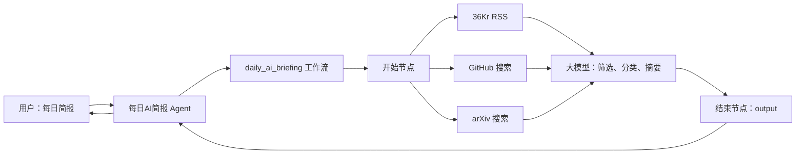
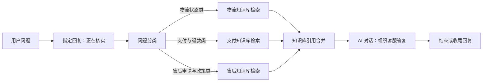

## 基于低代码平台的智能体搭建

> 阅读资料：[《Hello-Agents》第五章](https://datawhalechina.github.io/hello-agents/#/./chapter5/%E7%AC%AC%E4%BA%94%E7%AB%A0%20%E5%9F%BA%E4%BA%8E%E4%BD%8E%E4%BB%A3%E7%A0%81%E5%B9%B3%E5%8F%B0%E7%9A%84%E6%99%BA%E8%83%BD%E4%BD%93%E6%90%AD%E5%BB%BA)
>
> 实践一：使用 Coze 构建“每日 AI 简报”，截图记录于 2026 年 7 月 14 日。
>
> 实践二：使用 FastGPT 构建“电商售后客服助手”。平台界面和功能以后可能调整。

### 低代码平台解决什么

低代码平台把模型、工具、知识库、记忆和发布渠道做成可配置节点。开发者仍要设计数据流和提示词，但不用从零处理模型接入、工具调度、状态传递与部署。

| 代码中的概念 | 低代码平台中的对应物 |
| --- | --- |
| 函数或 API | 插件、工具节点 |
| 控制流 | 工作流连线、分支、循环 |
| Prompt 与模型调用 | 大模型节点 |
| 应用入口 | Agent、聊天界面、API、发布渠道 |

本章介绍的四个平台侧重点不同：

| 平台 | 主要定位 | 更适合的场景 |
| --- | --- | --- |
| Coze | Agent、工作流与多渠道发布 | 快速制作原型和对话应用 |
| Dify | LLM 应用、工作流、RAG 与模型管理 | 需要私有化和完整应用能力的项目 |
| FastGPT | 知识库问答与 RAG | 企业文档检索、智能客服 |
| n8n | 通用业务自动化，AI 作为流程节点 | 连接大量业务系统和现有 API |

平台选择不只看模型数量，还要看数据是否允许托管、能否私有部署、工具接入方式、调试能力和发布渠道。

### Coze 的两层结构

这次实践用了工作流和 Agent 两层：

| 层级 | 职责 |
| --- | --- |
| 工作流（Workflow） | 拉取 36Kr、GitHub、arXiv 数据，交给大模型整理并返回日报 |
| Agent | 理解“每日简报”等自然语言请求，调用工作流并把结果回复给用户 |

工作流适合固定、可检查的执行步骤；Agent 负责对话入口和工具选择。把数据处理放在工作流里，问题更容易定位。

### 实践：每日 AI 简报

#### 整体流程

工作流名为 `daily_ai_briefing`。开始节点同时触发三个数据源，数据准备完毕后统一交给大模型，最后通过 `output` 返回 Markdown 日报。

#### 数据源与字段

| 节点 | 输入 | 主要输出 | 本次返回量 |
| --- | --- | --- | ---: |
| rss-36kr | RSS 地址 | `entries` | 30 条 |
| github | 查询词、排序、分页参数 | `items`、`total_count` | 10 条 |
| arxiv | 查询词、数量、筛选参数 | 论文标题、摘要等字段 | 5 条 |

三个节点并行执行，避免把网络请求串行叠加。需要注意的是，三个工具的返回结构不同，不能只把整个对象交给模型后期待它自行识别；关键字段应在节点映射或提示词中明确写出。

#### 大模型节点

大模型使用“豆包·1.8·深度思考”，输入为三个数据源的结果。它主要完成四件事：

1. 从原始结果中筛选与 AI 相关的内容。
2. 按技术新闻、学术论文和开源项目分类。
3. 为每条内容生成一句概述。
4. 按统一的 Markdown 模板输出标题、链接和摘要。

输出格式需要写成约束，而不是只说“生成日报”。例如：每个栏目最多多少条、字段缺失时如何处理、链接必须来自输入、禁止补造项目等。这样能降低格式漂移和内容幻觉。

#### 运行结果

本次运行记录如下：

| 环节 | 耗时或用量 |
| --- | ---: |
| 36Kr RSS | 0.425 秒 |
| GitHub | 1 秒 |
| arXiv | 0.416 秒 |
| 大模型 | 约 2 分 31 秒 |
| 工作流总耗时 | 约 2 分 34 秒 |
| Token 用量 | 29,478 Tokens |

三个数据节点都在 1 秒左右完成，大模型节点约占总耗时的 98%。瓶颈不在数据抓取，而在一次性输入过多内容并进行长文本推理。

可以从以下几处缩减成本和等待时间：

- 在进入大模型前裁剪无关字段，只保留标题、链接、时间、摘要和必要指标。
- 每个数据源先按时间、关键词或热度过滤，再限制候选数量。
- 不需要复杂推理时换用响应更快的模型，减少深度思考开销。
- 将“筛选”和“排版”拆开，便于观察是哪一步消耗最多。

#### Agent 调用工作流

“每日AI简报”Agent 采用自主规划模式，并把 `daily_ai_briefing` 配置为可调用工作流。用户输入“每日简报”后，Agent 识别意图、调用工作流，再把 `output` 作为最终回复。

工作流虽然只暴露一个 `input` 参数，也应写清它的含义和示例，例如“用户对日报日期、栏目或数量的补充要求”。参数描述含糊时，Agent 会在是否传空值、传原句还是自行改写之间反复判断。

#### 日报输出

最终页面生成了标题 `AI 日报｜2026 年 07 月 14 日｜by@garden`，技术新闻部分包含 10 条内容，每条都有标题、原始链接和一句概述。

调试记录中还有一个值得保留的问题：GitHub 节点已返回 10 条记录，但 Agent 的推理过程认为“AI 开源项目部分没有内容”。这说明“工具调用成功”不等于“下游正确使用了数据”。排查顺序应为：

1. 查看 GitHub 的 `items` 是否真正传入大模型节点。
2. 检查字段路径是否与提示词中的名称一致。
3. 确认裁剪或上下文长度限制没有截掉 GitHub 数据。
4. 在大模型输出前增加数量校验，例如要求报告三个来源各接收多少条。
5. 数据为空时明确输出原因，不让模型自行猜测。

数量校验能把静默丢数变成可见错误，比只检查节点是否显示“运行成功”更可靠。

#### 发布

实践已进入发布配置页。截图中扣子商店已授权并选中，API 也已授权；飞书、微信等渠道仍需要单独授权或配置。因此这里只能确认发布入口已经配置，不能据此判断所有渠道都已上线。

### Coze 实践结论

| 观察 | 结论 |
| --- | --- |
| 三个数据源可并行完成 | 独立的 I/O 节点应优先并行 |
| 大模型占绝大部分耗时 | 优化重点是输入裁剪、模型选择和任务拆分 |
| GitHub 有数据但栏目为空 | 节点成功之外还要检查字段映射和下游消费 |
| Agent 会犹豫如何填写 `input` | 工具参数要有明确语义、格式和示例 |
| 发布渠道状态不同 | 每个渠道都要分别检查授权、配置和发布结果 |

这次实践的核心不是把节点连起来，而是保证每条数据都能被正确传递、消费和验证。完整链路可以概括为：

`数据源 → 工作流 → 大模型 → Agent → 发布渠道`

### FastGPT：知识库与工作流

[原文 5.4 节](https://datawhalechina.github.io/hello-agents/#/./chapter5/%E7%AC%AC%E4%BA%94%E7%AB%A0%20%E5%9F%BA%E4%BA%8E%E4%BD%8E%E4%BB%A3%E7%A0%81%E5%B9%B3%E5%8F%B0%E7%9A%84%E6%99%BA%E8%83%BD%E4%BD%93%E6%90%AD%E5%BB%BA?id=_54-%e5%b9%b3%e5%8f%b0%e4%b8%89%ef%bc%9afastgpt)把 FastGPT 定位为知识库问答与 Agent 构建平台。它的重点是把 RAG 链路做成可配置流程：

`文档导入 → 分块与索引 → 知识库检索 → 大模型生成`

知识库解决“根据什么资料回答”，工作流负责“按什么顺序处理”。两者组合后，客服、内部制度问答和产品助手这类场景不必把全部资料塞进提示词。

#### 原文方案与我的简化实践

原文的“智能投顾助手”包含知识库、MCP 实时数据、意图识别、风险问卷和投资报告，流程较长。本次只验证 FastGPT 最有代表性的两个环节：问题分类和知识库检索。

| 对比项 | 原文：智能投顾助手 | 我的实践：电商售后客服助手 |
| --- | --- | --- |
| 问题类型 | 概念咨询、股票查询、投资诊断等 | 物流、支付退款、售后政策 |
| 内部资料 | 金融知识库 | 三个售后知识库 |
| 外部工具 | 股票行情、图表等 MCP | 未接入 |
| 交互流程 | 风险问卷、画像分析、报告生成 | 分类、检索、直接回答 |
| 实践目标 | 验证完整 Agent 编排 | 先跑通分类与 RAG 主链路 |

删去 MCP 和表单后，节点更少，分类结果、检索分支和最终回答之间的关系也更容易观察。

#### 工作流设计

应用名为“电商售后客服助手”，流程如下：

上图补入了“知识库引用合并”节点，这是截图中当前流程还需要完善的地方。

流程开始后先返回“正在为您核实具体情况”，再进入问题分类。这个固定回复不会参与判断，只是让用户知道请求已经开始处理。

#### 问题分类

问题分类节点使用 `deepseek-v4-flash`，读取最近 6 条聊天记录和当前问题，再从三个类别中选择一条分支：

| 分类 | 典型问题 | 后续节点 |
| --- | --- | --- |
| 物流状态类 | 包裹位置、预计送达、物流停滞、修改地址 | 物流知识库检索 |
| 支付与退款类 | 付款失败、退款进度、退款未到账 | 支付知识库检索 |
| 售后申请与政策类 | 退换货条件、售后申请、平台规则 | 售后知识库检索 |

分类提示词中既写类别定义，也给出正反例，比只写“请判断问题类型”稳定。正式使用时还应增加“其他问题”分支，避免问候、商品咨询等输入被硬塞进售后类别。

#### 分支检索

三个知识库检索节点使用相同的参数：

| 配置 | 当前值 |
| --- | --- |
| 搜索方式 | 语义检索 |
| 检索问题 | 流程开始节点的“用户问题” |
| 引用上限 | 5000 |
| 最低相关度 | 0.4 |
| 结果重排 | 关闭 |
| 问题优化模型 | `gpt-5.4-mini` |

问题先分类再检索，可以缩小搜索范围，避免退款问题召回物流文档。最低相关度不能固定套用：过低会混入无关条款，过高又可能没有结果，应使用真实客服问题测试召回内容后再调整。

#### 知识库引用需要显式传递

截图中三个检索节点都连到了 AI 对话节点，但 AI 节点的“知识库引用”仍显示“选择引用变量”。连线只控制执行顺序，不能代替输入变量绑定。

FastGPT 的 AI 对话节点只能接收一份知识库引用。对于“分类后检索不同知识库，最后由同一个 AI 节点回答”的结构，应在中间加入“知识库搜索引用合并”节点，再完成以下映射：

`各检索节点的知识库引用 → 引用合并 → AI 对话的知识库引用`

否则流程虽然能生成答案，内容也可能只来自模型的预训练知识。提示词里写“已从知识库检索”并不能证明检索结果已经传入。

AI 对话节点同样使用 `deepseek-v4-flash`。提示词要求先表达理解，再给出清晰步骤，不暴露“知识库检索”等内部实现，适合直接面向客户。

#### 运行结果

测试问题是“微信退款多久到账？”。工作流先返回正在核实的提示，随后区分两种情况：

- 微信零钱或绑定储蓄卡支付：通常 1～3 个工作日原路退回。
- 微信绑定信用卡支付：通常 3～7 个工作日，具体取决于银行处理时间。

回答有同理心、时间范围和处理说明，基本符合售后客服语气。但当前结果还不能证明内容来自支付知识库，修复引用映射后应查看执行详情或知识库引用，确认召回了对应退款条款。

末尾的固定回复“本工作流已运行完毕……立即去体验吧”属于模板文案，与客服场景无关。可以直接删除，或改成“如果超过上述时间仍未到账，请提供订单号，我来继续核实”。

#### FastGPT 实践结论

| 观察 | 结论 |
| --- | --- |
| 先分类再检索 | 可以减少跨知识库误召回 |
| 三个分支共用一个 AI 节点 | 需要先合并知识库引用 |
| 节点连线正确但引用变量为空 | 工作流可运行不代表 RAG 已生效 |
| 固定回复放在耗时操作之前 | 能及时反馈处理状态 |
| 模板收尾出现在正式回答之后 | 发布前要清理默认文案 |

简化实践保留了 FastGPT 的主要价值：用可视化分支管理业务规则，用知识库约束回答依据。接入订单查询、退款进度等实时接口时，再增加 MCP 或 HTTP 工具即可。

### 参考资料

- [Hello-Agents 第五章：基于低代码平台的智能体搭建](https://datawhalechina.github.io/hello-agents/#/./chapter5/%E7%AC%AC%E4%BA%94%E7%AB%A0%20%E5%9F%BA%E4%BA%8E%E4%BD%8E%E4%BB%A3%E7%A0%81%E5%B9%B3%E5%8F%B0%E7%9A%84%E6%99%BA%E8%83%BD%E4%BD%93%E6%90%AD%E5%BB%BA)
- [Hello-Agents 第五章 GitHub 源文件](https://github.com/datawhalechina/hello-agents/blob/main/docs/chapter5/%E7%AC%AC%E4%BA%94%E7%AB%A0%20%E5%9F%BA%E4%BA%8E%E4%BD%8E%E4%BB%A3%E7%A0%81%E5%B9%B3%E5%8F%B0%E7%9A%84%E6%99%BA%E4%BD%93%E6%90%AD%E5%BB%BA.md)
- [Coze](https://www.coze.cn/)
- [Dify](https://dify.ai/)
- [FastGPT](https://fastgpt.io/)
- [FastGPT：问题分类节点](https://doc.fastgpt.io/zh-CN/guide/build/workflow/nodes/question_classify)
- [FastGPT：知识库搜索节点](https://doc.fastgpt.io/zh-CN/guide/build/workflow/nodes/dataset_search)
- [FastGPT：知识库搜索引用合并](https://doc.fastgpt.io/zh-CN/guide/build/workflow/nodes/knowledge_base_search_merge)
- [n8n](https://n8n.io/)
