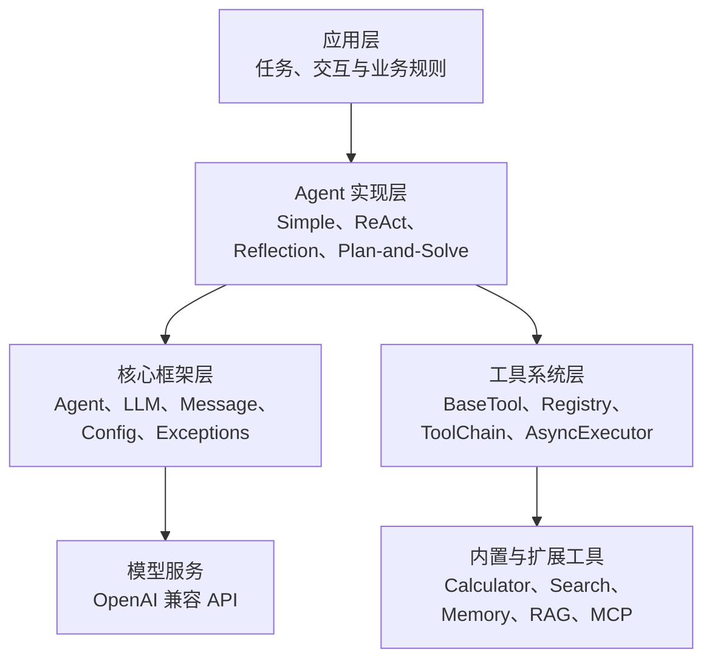
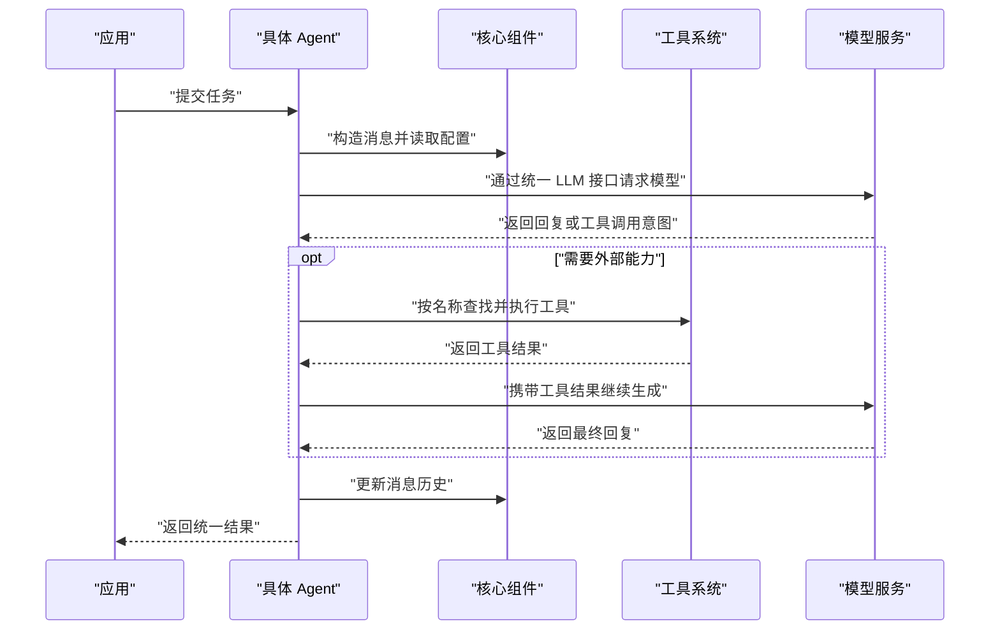
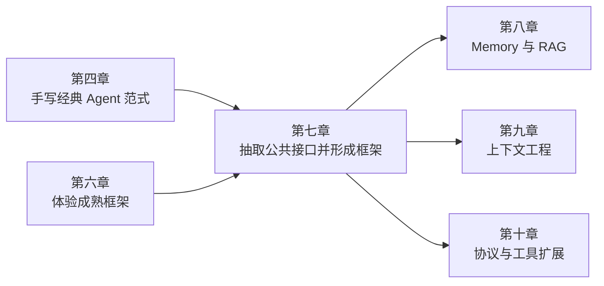

## 构建你的智能体框架

> 阅读资料：[《Hello-Agents》第七章 7.1：框架整体架构设计](https://datawhalechina.github.io/hello-agents/#/./chapter7/%E7%AC%AC%E4%B8%83%E7%AB%A0%20%E6%9E%84%E5%BB%BA%E4%BD%A0%E7%9A%84Agent%E6%A1%86%E6%9E%B6?id=_71-%e6%a1%86%e6%9e%b6%e6%95%b4%e4%bd%93%e6%9e%b6%e6%9e%84%e8%ae%be%e8%ae%a1)
>
> 本节内容：为什么要自建 Agent 框架、HelloAgents 的设计取舍以及整体目录分层。

### 从使用框架转向设计框架

第四章通过手写代码理解 ReAct、Plan-and-Solve 和 Reflection，第六章则直接使用 AutoGen、AgentScope、CAMEL 和 LangGraph。进入第七章后，关注点从“如何调用框架”转向“一个框架为什么要这样组织”。

单个 Agent 只需要模型、提示词和执行循环；一个可复用框架还需要解决：

- 输入、输出和历史消息如何统一表示。
- 不同模型服务如何通过同一入口调用。
- Agent 范式如何共享公共能力。
- 工具如何注册、查找、执行和组合。
- 配置、异常和扩展点放在哪一层。

因此，自建框架的目标不是再写一套更长的 Agent 代码，而是把反复出现的机制整理成稳定边界。

### 为什么还要自建框架

成熟框架功能丰富，但它们的目标是覆盖尽可能多的业务场景，不一定适合学习内部机制。

| 问题 | 对开发的影响 | 自建框架带来的价值 |
| --- | --- | --- |
| 抽象层过多 | 完成简单任务前，要先理解大量框架概念 | 只保留 Agent、Model、Message、Tool 等必要抽象 |
| API 迭代频繁 | 升级后接口变化，旧代码需要迁移 | 固定章节版本，让代码与学习内容对应 |
| 核心流程黑盒化 | 出错时难以判断问题位于提示词、模型还是框架 | 可以跟踪消息、模型调用和工具执行的完整路径 |
| 依赖复杂 | 安装体积大，容易与现有项目发生版本冲突 | 控制依赖数量，问题更容易定位 |

自建过程也完成了能力上的转变：

- 从会调用 Agent，进一步理解推理、工具调用和状态传递。
- 可以为金融、医疗、教育等领域加入自己的安全规则和工具。
- 可以控制模型请求、上下文长度、并发方式与资源消耗。
- 会实际处理接口抽象、模块解耦、配置和异常等工程问题。

这里的“自建”并不意味着取代成熟框架。HelloAgents 更像一个可拆解的教学框架：它优先保证代码透明和知识连贯，生产级框架则还要处理权限、租户隔离、持久化、分布式调度和完整的可观测性。

### HelloAgents 的四个设计理念

#### 轻量且可读

框架尽量减少重型依赖，并按章节逐步增加能力。遇到错误时，可以直接沿着自己的代码定位，而不是在多层封装中反复跳转。

轻量不等于把所有逻辑写在一个文件中，而是只保留必要抽象，同时保证模块职责清楚。

#### 基于标准 API

HelloAgents 选择兼容 OpenAI 的消息和模型接口，不再额外发明一套模型协议。模型供应商只要提供兼容接口，通常就能通过 `api_key`、`base_url` 和 `model` 完成接入。

这一选择降低了迁移成本，但“接口兼容”不代表“能力完全一致”。不同模型对工具调用、结构化输出、流式响应和思考模式的支持仍可能不同，框架需要保留供应商差异的处理位置。

#### 渐进式演进

每个阶段都保留可安装的历史版本，本节对应的体验版本为：

```bash
pip install "hello-agents==0.1.1"
```

要求 Python 3.10+。固定版本的意义是保证书中接口与本地代码一致，避免在学习过程中被最新版本的 API 变化打断。

学习时可以采用两条路径：

1. 先安装章节版本，快速理解框架对外提供什么能力。
2. 再跟随章节实现内部组件，通过测试检查自己的实现。

前者建立整体认识，后者回答“这个接口内部究竟做了什么”。

#### “万物皆为工具”

除 Agent 核心外，HelloAgents 计划把 Memory、RAG、MCP 等能力统一放进 Tool 体系。Agent 面对的仍然是同一种操作：根据任务选择能力，传入参数并读取结果。

这种设计的优点是：

- 减少需要学习的顶层概念。
- 复用工具注册、参数描述、执行和错误处理流程。
- 新能力可以通过新增工具接入，不必修改 Agent 主循环。

它也存在边界。计算器是一次调用即可完成的无状态工具，而 Memory 具有生命周期，RAG 涉及索引和检索策略，MCP 是通信协议，RL 更接近训练方法。教学框架可以先统一它们的调用入口；当系统变复杂后，仍可能需要为状态管理、资源释放、权限和可观测性设计专门接口。

我的理解是：“万物皆工具”适合统一 Agent 的使用视角，但不应抹掉各类能力在实现和生命周期上的差异。

### 整体分层

HelloAgents 遵循“分层解耦、职责单一、接口统一”。应用层只依赖 Agent 的公共入口，具体 Agent 复用核心组件，并通过工具层扩展能力。



目录蓝图如下：

```text
hello_agents/
├── core/
│   ├── agent.py              # Agent 基类
│   ├── llm.py                # 统一模型接口
│   ├── message.py            # 消息格式
│   ├── config.py             # 配置管理
│   └── exceptions.py         # 异常体系
├── agents/
│   ├── simple_agent.py
│   ├── react_agent.py
│   ├── reflection_agent.py
│   └── plan_solve_agent.py
└── tools/
    ├── base.py               # 工具公共接口
    ├── registry.py           # 工具注册与查找
    ├── chain.py              # 工具链
    ├── async_executor.py     # 异步执行
    └── builtin/
        ├── calculator.py
        └── search.py
```

| 层 | 主要职责 | 变化频率 |
| --- | --- | --- |
| `core` | 定义稳定数据结构、公共接口、配置和异常 | 应尽量稳定 |
| `agents` | 实现不同推理与执行范式 | 随新范式扩展 |
| `tools` | 为 Agent 提供外部能力 | 随业务快速扩展 |
| 应用层 | 组合 Agent、工具和业务规则 | 随具体项目变化 |

依赖方向比目录名称更重要：`core` 不应该反过来依赖某个具体 Agent；新增工具也不应要求修改 Agent 基类。只有保持依赖从上层实现指向下层接口，框架才真正具备可扩展性。

### 一次任务如何穿过框架

7.1 只给出了架构蓝图，后续章节才会实现具体接口。按照这套分层，一次任务的预期流转过程是：



核心层统一“数据长什么样”，Agent 层决定“任务怎么做”，工具层提供“还能做什么”，应用层规定“为什么做以及何时结束”。这四个问题分开后，替换模型、增加工具或新增 Agent 范式时，影响范围才可控。

### 与前后章节的关系



第四章的独立实现提供算法原型，第六章展示成熟框架的组织方式，第七章再把两部分经验收敛为自己的公共底座。后续高级能力不必各自建立一套 Agent 循环，而是围绕已有的消息、模型和工具接口继续扩展。

### 小结

- 自建框架的主要价值是透明、可控和可扩展，而不是功能数量。
- 先确定模块职责和依赖方向，再开始编写具体类。
- 核心接口应稳定，Agent 范式与工具应允许独立扩展。
- 标准 API 降低接入成本，但不能消除不同模型的能力差异。
- “万物皆工具”统一了使用方式，同时仍要尊重状态、协议和训练能力的实现差异。
