## 构建你的智能体框架

> 阅读资料：[《Hello-Agents》第七章 7.1：框架整体架构设计](https://datawhalechina.github.io/hello-agents/#/./chapter7/%E7%AC%AC%E4%B8%83%E7%AB%A0%20%E6%9E%84%E5%BB%BA%E4%BD%A0%E7%9A%84Agent%E6%A1%86%E6%9E%B6?id=_71-%e6%a1%86%e6%9e%b6%e6%95%b4%e4%bd%93%e6%9e%b6%e6%9e%84%e8%ae%be%e8%ae%a1)
>
> 阅读资料：[《Hello-Agents》第七章 7.2：HelloAgentsLLM 扩展](https://datawhalechina.github.io/hello-agents/#/./chapter7/%E7%AC%AC%E4%B8%83%E7%AB%A0%20%E6%9E%84%E5%BB%BA%E4%BD%A0%E7%9A%84Agent%E6%A1%86%E6%9E%B6?id=_72-helloagentsllm%e6%89%a9%e5%b1%95)
>
> 阅读资料：[《Hello-Agents》第七章 7.3：框架接口实现](https://datawhalechina.github.io/hello-agents/#/./chapter7/%E7%AC%AC%E4%B8%83%E7%AB%A0%20%E6%9E%84%E5%BB%BA%E4%BD%A0%E7%9A%84Agent%E6%A1%86%E6%9E%B6?id=_73-%e6%a1%86%e6%9e%b6%e6%8e%a5%e5%8f%a3%e5%ae%9e%e7%8e%b0)
>
> 阅读资料：[《Hello-Agents》第七章 7.4.5：FunctionCallAgent](https://datawhalechina.github.io/hello-agents/#/./chapter7/%E7%AC%AC%E4%B8%83%E7%AB%A0%20%E6%9E%84%E5%BB%BA%E4%BD%A0%E7%9A%84Agent%E6%A1%86%E6%9E%B6?id=_745-functioncallagent)
>
> 阅读资料：[《Hello-Agents》第七章 7.5：工具系统](https://datawhalechina.github.io/hello-agents/#/./chapter7/%E7%AC%AC%E4%B8%83%E7%AB%A0%20%E6%9E%84%E5%BB%BA%E4%BD%A0%E7%9A%84Agent%E6%A1%86%E6%9E%B6?id=_75-%e5%b7%a5%e5%85%b7%e7%b3%bb%e7%bb%9f)
>
> 实践：沿着章节的演进路线持续完善 `HelloAgents`，实现统一 LLM、Message、Config、异常、Agent 抽象接口，补齐四种任务组织方式、Function Calling 协议以及工具注册、计算、搜索、链式和异步执行能力。

### 框架整体架构设计

#### 从使用框架转向设计框架

第四章通过手写代码理解 ReAct、Plan-and-Solve 和 Reflection，第六章则直接使用 AutoGen、AgentScope、CAMEL 和 LangGraph。进入第七章后，关注点从“如何调用框架”转向“一个框架为什么要这样组织”。

单个 Agent 只需要模型、提示词和执行循环；一个可复用框架还需要解决：

- 输入、输出和历史消息如何统一表示。
- 不同模型服务如何通过同一入口调用。
- Agent 范式如何共享公共能力。
- 工具如何注册、查找、执行和组合。
- 配置、异常和扩展点放在哪一层。

因此，自建框架的目标不是再写一套更长的 Agent 代码，而是把反复出现的机制整理成稳定边界。

#### 为什么还要自建框架

成熟框架功能丰富，但它们的目标是覆盖尽可能多的业务场景，不一定适合学习内部机制。

| 问题 | 对开发的影响 | 自建框架带来的价值 |
| --- | --- | --- |
| 抽象层过多 | 完成简单任务前，要先理解大量框架概念 | 只保留 Agent、Model、Message、Tool 等必要抽象 |
| API 迭代频繁 | 升级后接口变化，旧代码需要迁移 | 固定章节版本，让代码与学习内容对应 |
| 核心流程黑盒化 | 出错时难以判断问题位于提示词、模型还是框架 | 可以跟踪消息、模型调用和工具执行的完整路径 |
| 依赖复杂 | 安装体积大，容易与现有项目发生版本冲突 | 控制依赖数量，问题更容易定位 |

自建过程也完成了能力上的转变：

- 从会调用 Agent，进一步理解推理、工具调用和状态传递。
- 可以为金融、医疗、教育等领域加入自己的安全规则和工具。
- 可以控制模型请求、上下文长度、并发方式与资源消耗。
- 会实际处理接口抽象、模块解耦、配置和异常等工程问题。

这里的“自建”并不意味着取代成熟框架。HelloAgents 更像一个可拆解的教学框架：它优先保证代码透明和知识连贯，生产级框架则还要处理权限、租户隔离、持久化、分布式调度和完整的可观测性。

#### HelloAgents 的四个设计理念

**轻量且可读**

框架尽量减少重型依赖，并按章节逐步增加能力。遇到错误时，可以直接沿着自己的代码定位，而不是在多层封装中反复跳转。

轻量不等于把所有逻辑写在一个文件中，而是只保留必要抽象，同时保证模块职责清楚。

**基于标准 API**

HelloAgents 选择兼容 OpenAI 的消息和模型接口，不再额外发明一套模型协议。模型供应商只要提供兼容接口，通常就能通过 `api_key`、`base_url` 和 `model` 完成接入。

这一选择降低了迁移成本，但“接口兼容”不代表“能力完全一致”。不同模型对工具调用、结构化输出、流式响应和思考模式的支持仍可能不同，框架需要保留供应商差异的处理位置。

**渐进式演进**

每个阶段都保留可安装的历史版本，本节对应的体验版本为：

```bash
pip install "hello-agents==0.1.1"
```

要求 Python 3.10+。固定版本的意义是保证书中接口与本地代码一致，避免在学习过程中被最新版本的 API 变化打断。

学习时可以采用两条路径：

1. 先安装章节版本，快速理解框架对外提供什么能力。
2. 再跟随章节实现内部组件，通过测试检查自己的实现。

前者建立整体认识，后者回答“这个接口内部究竟做了什么”。

**“万物皆为工具”**

除 Agent 核心外，HelloAgents 计划把 Memory、RAG、MCP 等能力统一放进 Tool 体系。Agent 面对的仍然是同一种操作：根据任务选择能力，传入参数并读取结果。

这种设计的优点是：

- 减少需要学习的顶层概念。
- 复用工具注册、参数描述、执行和错误处理流程。
- 新能力可以通过新增工具接入，不必修改 Agent 主循环。

它也存在边界。计算器是一次调用即可完成的无状态工具，而 Memory 具有生命周期，RAG 涉及索引和检索策略，MCP 是通信协议，RL 更接近训练方法。教学框架可以先统一它们的调用入口；当系统变复杂后，仍可能需要为状态管理、资源释放、权限和可观测性设计专门接口。

我的理解是：“万物皆工具”适合统一 Agent 的使用视角，但不应抹掉各类能力在实现和生命周期上的差异。

#### 整体分层

HelloAgents 遵循“分层解耦、职责单一、接口统一”。应用层只依赖 Agent 的公共入口，具体 Agent 复用核心组件，并通过工具层扩展能力。

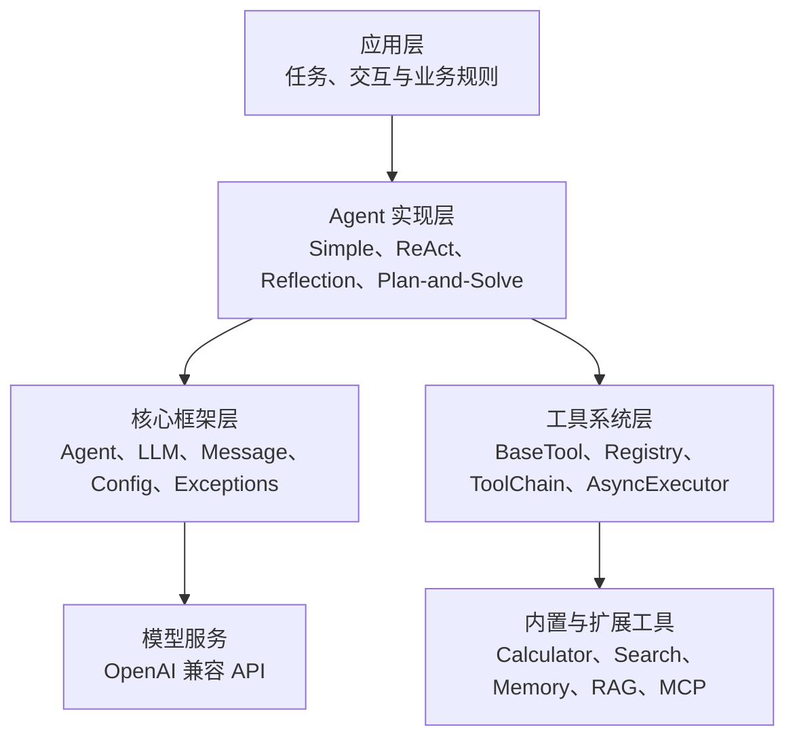

目录蓝图如下：

```text
hello_agents/
├── core/
│   ├── agent.py              # Agent 基类
│   ├── llm.py                # 统一模型接口
│   ├── message.py            # 消息格式
│   ├── config.py             # 配置管理
│   └── exceptions.py         # 异常体系
├── agents/
│   ├── simple_agent.py
│   ├── react_agent.py
│   ├── reflection_agent.py
│   └── plan_solve_agent.py
└── tools/
    ├── base.py               # 工具公共接口
    ├── registry.py           # 工具注册与查找
    ├── chain.py              # 工具链
    ├── async_executor.py     # 异步执行
    └── builtin/
        ├── calculator.py
        └── search.py
```

| 层 | 主要职责 | 变化频率 |
| --- | --- | --- |
| `core` | 定义稳定数据结构、公共接口、配置和异常 | 应尽量稳定 |
| `agents` | 实现不同推理与执行范式 | 随新范式扩展 |
| `tools` | 为 Agent 提供外部能力 | 随业务快速扩展 |
| 应用层 | 组合 Agent、工具和业务规则 | 随具体项目变化 |

依赖方向比目录名称更重要：`core` 不应该反过来依赖某个具体 Agent；新增工具也不应要求修改 Agent 基类。只有保持依赖从上层实现指向下层接口，框架才真正具备可扩展性。

#### 一次任务如何穿过框架

7.1 只给出了架构蓝图，后续章节才会实现具体接口。按照这套分层，一次任务的预期流转过程是：

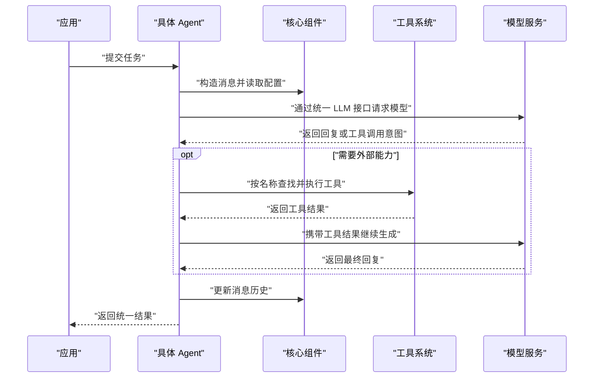

核心层统一“数据长什么样”，Agent 层决定“任务怎么做”，工具层提供“还能做什么”，应用层规定“为什么做以及何时结束”。这四个问题分开后，替换模型、增加工具或新增 Agent 范式时，影响范围才可控。

#### 与前后章节的关系

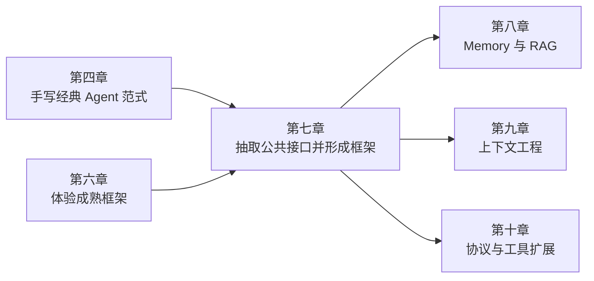

第四章的独立实现提供算法原型，第六章展示成熟框架的组织方式，第七章再把两部分经验收敛为自己的公共底座。后续高级能力不必各自建立一套 Agent 循环，而是围绕已有的消息、模型和工具接口继续扩展。

### HelloAgentsLLM 扩展

7.2 将前面只支持一组 `model`、`api_key` 和 `base_url` 的模型客户端扩展为统一入口，目标包含三部分：

1. 处理不同云端模型服务的默认地址和环境变量。
2. 通过 OpenAI 兼容接口调用 vLLM 与 Ollama 本地服务。
3. 根据配置推断 provider，减少重复参数。

这三部分解决的是同一个问题：Agent 不应该关心模型部署在哪里。Agent 只提交 messages，`HelloAgentsLLM` 负责解析配置、创建客户端并统一返回结果。

这里不能再增加一套平行的模型客户端。后续实现 `Agent` 基类时，会直接从 `hello_agents.core.llm` 导入 `HelloAgentsLLM`；因此 7.2 应继续修改这个核心类，而不是新建一个只在本节使用的 Provider 子类。

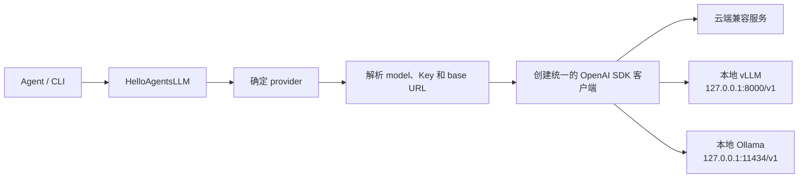

#### 多提供商扩展

**先修正接口不一致**

附件中的父类构造函数是：

```python
def __init__(
    self,
    model=None,
    apiKey=None,
    baseUrl=None,
    timeout=None,
):
    ...
```

原文在非 ModelScope 分支中调用：

```python
super().__init__(
    model=model,
    api_key=api_key,
    base_url=base_url,
    provider=provider,
    **kwargs,
)
```

这段调用与实际父类接口不一致：

- 父类参数名是 `apiKey` 和 `baseUrl`，不是 `api_key` 和 `base_url`。
- 父类没有 `provider` 参数。
- 父类没有接收任意 `**kwargs`，传入 `temperature`、`max_tokens` 等字段同样会报错。
- 父类把 SDK 客户端保存在 `self.client`，原文 ModelScope 分支却写入 `self._client`，继承的 `think()` 无法读取。

因此，照抄这段代码会在模型请求前抛出 `TypeError`；ModelScope 分支即使完成初始化，调用 `think()` 时也会找不到客户端。

不过，本章的目标是持续完善框架，而不是长期保留旧父类、再叠加一个子类。实践代码直接把原来的 `HelloAgentsLLM` 升级为章节所需接口：

```python
class HelloAgentsLLM:
    def __init__(
        self,
        model=None,
        api_key=None,
        base_url=None,
        provider=None,
        temperature=0.7,
        max_tokens=None,
        timeout=None,
        **kwargs,
    ):
        ...
```

`provider`、配置解析、客户端创建和调用方法都收进同一个类，避免后续出现“Agent 使用基础类，示例却使用扩展类”的分叉。旧代码中的 `apiKey`、`baseUrl` 暂时作为兼容别名接收，新代码统一使用 `api_key`、`base_url`。

配置解析顺序为：

```text
构造参数
  → provider 专属环境变量
    → 通用 LLM_* 环境变量
      → 章节示例默认值
```

所有 provider 最终都通过 `_create_client()` 创建 `self._client`，同时保留旧代码使用的 `self.client` 兼容别名。流式接口 `think()` 返回生成器，非流式接口 `invoke()` 返回完整字符串，`stream_invoke()` 则作为后续框架组件使用的流式别名。完整实现见 [`hello_agents/core/llm.py`](./code/HelloAgents/hello_agents/core/llm.py)。

#### 本地模型调用

vLLM 和 Ollama 都能提供 OpenAI 兼容的 `/v1/chat/completions`，所以 Python 侧不需要编写两套请求代码。真正不同的是模型部署、资源调度和服务管理。

| 对比项 | vLLM 实践 | Ollama 实践 |
| --- | --- | --- |
| 模型 | `Qwen/Qwen1.5-0.5B-Chat` | `qwen3:0.6b` |
| 地址 | `http://127.0.0.1:8000/v1` | `http://127.0.0.1:11434/v1` |
| 模型来源 | 本地下载后上传到服务器 | `ollama pull` |
| 主要目标 | 精细控制 GPU 推理参数 | 快速下载、启动和管理模型 |
| Python 调用 | OpenAI SDK | 同一个 OpenAI SDK |
| API Key | 服务未鉴权时使用非空占位值 `EMPTY` | SDK 要求非空，Ollama 会忽略 `ollama` |

**vLLM 实际部署**

测试环境是 NVIDIA GeForce RTX 2080 Ti，驱动最高兼容 CUDA 12.4。直接安装最新版组合先后遇到了驱动、Tokenizer、BF16、CPU KV Cache 和 CUDA Graph 兼容问题，最后验证成功的版本和参数为：

```text
vLLM 0.7.3
Transformers 4.48.2
Tokenizers 0.21.0
Qwen/Qwen1.5-0.5B-Chat
FP16
最大上下文 4096
```

模型无法从服务器直接访问 Hugging Face，因此先在本地下载，再上传到：

```text
/mnt/data/models/Qwen1.5-0.5B-Chat
```

最终稳定启动命令：

```bash
HF_HUB_OFFLINE=1 \
TRANSFORMERS_OFFLINE=1 \
CUDA_VISIBLE_DEVICES=0 \
python -m vllm.entrypoints.openai.api_server \
  --model /mnt/data/models/Qwen1.5-0.5B-Chat \
  --served-model-name Qwen/Qwen1.5-0.5B-Chat \
  --dtype float16 \
  --max-model-len 4096 \
  --gpu-memory-utilization 0.70 \
  --swap-space 0 \
  --enforce-eager \
  --max-num-seqs 16 \
  --host 0.0.0.0 \
  --port 8000
```

这些固定版本和参数是针对当前 2080 Ti 环境的兼容方案，不是所有 GPU 的通用最佳配置：

- 2080 Ti 不支持 BF16，所以使用 FP16。
- `--swap-space 0` 避开 CPU KV Cache 初始化错误。
- `--enforce-eager` 避开当前 Turing、XFormers 与 CUDA Graph 组合的问题。
- 上下文限制为 4096，以减少 KV Cache 显存占用。
- 离线变量阻止服务重新访问 Hugging Face。

启动完成后先检查服务端实际暴露的模型名：

```bash
curl http://127.0.0.1:8000/v1/models
```

客户端的 `model` 必须与 `--served-model-name` 一致。仅仅“模型文件已经加载”不能证明 Chat API 可用，还应实际请求 `/v1/chat/completions`。

**Ollama 实际部署**

Ollama 由 systemd 管理，本地服务默认监听 `127.0.0.1:11434`。模型通过以下命令拉取并验证：

```bash
ollama pull qwen3:0.6b
ollama run qwen3:0.6b
```

Ollama 原生聊天接口是 `/api/chat`；为了复用 `HelloAgentsLLM` 中的 OpenAI SDK，本次使用它提供的兼容地址：

```text
http://127.0.0.1:11434/v1
```

可以分别检查服务和模型：

```bash
curl http://127.0.0.1:11434/api/tags
ollama list
```

允许其他机器访问时可以设置 `OLLAMA_HOST=0.0.0.0:11434`，但未配置认证的端口不应直接暴露到公网；即使在局域网中，也应通过防火墙限制来源。

**使用同一份实践代码切换**

章节代码集中在 `code/HelloAgents/`：

```text
HelloAgents/
├── .env.example
├── hello_agents/
│   ├── __init__.py
│   └── core/
│       ├── __init__.py
│       ├── agent.py
│       ├── config.py
│       ├── exceptions.py
│       ├── llm.py
│       └── message.py
└── examples/
    ├── __init__.py
    ├── core_interfaces_demo.py
    └── llm_provider_demo.py
```

安装客户端依赖：

```bash
python -m pip install openai python-dotenv pydantic
```

复制并填写本章环境变量：

```bash
cd code/HelloAgents
cp .env.example .env
```

调用已部署的 vLLM：

```bash
python -m examples.llm_provider_demo \
  --provider vllm \
  --prompt "请解释什么是 ReAct Agent。"
```

切换到 Ollama 时只改 provider：

```bash
python -m examples.llm_provider_demo \
  --provider ollama \
  --prompt "请解释什么是 ReAct Agent。"
```

控制台输出：

```bash
python -m examples.llm_provider_demo \
  --provider vllm \
  --prompt "请解释什么是 ReAct Agent。"
当前连接：provider=vllm, model=Qwen/Qwen1.5-0.5B-Chat, base_url=http://127.0.0.1:8000/v1
🧠 正在调用 Qwen/Qwen1.5-0.5B-Chat 模型...
✅ 大语言模型响应成功:
ReAct Agent 是一种用于模拟和预测的机器学习模型，它能够根据输入数据进行自我调整和优化，以达到最佳的预测结果。它通常用于预测未来事件，例如股票价格、天气预报等。ReAct Agent 通过使用神经网络来模拟人类大脑中的神经元网络，从而实现预测和学习。

python -m examples.llm_provider_demo \
  --provider ollama \
  --prompt "请解释什么是 ReAct Agent。"
当前连接：provider=ollama, model=qwen3:0.6b, base_url=http://127.0.0.1:11434/v1
🧠 正在调用 qwen3:0.6b 模型...
✅ 大语言模型响应成功:
ReAct Agent 是一种基于强化学习的多智能体协作系统，通过模拟人类交互方式，实现自主学习与协作。其核心特点包括：

1. **多智能体协作**：通过多个智能体的交互，实现复杂任务的自动化执行。
2. **强化学习机制**：通过奖励信号不断优化决策策略。
3. **动态适应性**：能够根据环境变化实时调整策略。

应用场景包括但不限于工业自动化、智能客服等场景，强调在复杂环境中实现高效协作。
```

CLI 没有提供 `--api-key` 参数，避免密钥进入终端历史。云端 Key 只从 `.env` 读取。完整入口见 [`examples/llm_provider_demo.py`](./code/HelloAgents/examples/llm_provider_demo.py)，配置模板见 [`.env.example`](./code/HelloAgents/.env.example)。

#### Provider 规则推断

原文的 `_auto_detect_provider()` 会检查环境变量、匹配域名和端口，最后再猜测 API Key 前缀。这里没有模型参与，也没有动态探索服务能力，本质上是按优先级执行 `if/elif` 规则。

称为“自动检测”容易掩盖它的局限：

- 同时存在多个云服务 Key 时，固定检查顺序会替用户做决定。
- `8000` 端口不一定是 vLLM，vLLM 也不一定运行在 `8000`。
- 代理地址可能不包含服务商域名。
- Key 前缀可能变化或被不同兼容服务复用。
- 推断成功只能说明规则命中，不能证明地址可访问、模型存在或接口兼容。

实践代码保留章节中的 `_auto_detect_provider()` 名称，以便和后续代码衔接；它内部调用 `_infer_provider_by_rules()`，明确说明这只是确定性规则。选择顺序为：

```text
构造参数 provider
  → .env 中的 LLM_PROVIDER
    → auto 规则推断
```

日常使用仍建议显式填写 `provider` 或 `LLM_PROVIDER`，根据成本、隐私、模型能力和服务状态主动切换，而不是让环境中恰好存在的变量决定调用目标。

只有选择 `provider="auto"` 时才会执行规则推断：

- 先根据实际 `base_url` 的主机和端口匹配。
- 环境中出现多个候选 provider 时直接报错，要求显式选择。
- 不通过 API Key 格式猜测服务商。
- 无法识别的 OpenAI 兼容地址按 `custom` 处理。

规则推断可以减少本地演示的配置量，但显式配置更适合生产环境，因为配置文件和启动命令能够直接说明请求将被发往哪里。

### 框架接口实现

`HelloAgentsLLM` 解决了模型调用问题，7.3 继续补齐框架内部的公共约定：

| 组件 | 负责什么 | 不负责什么 |
| --- | --- | --- |
| `Message` | 统一消息格式，保存角色、正文和附加信息 | 不管理整段对话 |
| `Config` | 集中保存框架配置，支持从环境变量读取 | 不主动修改已经创建的 LLM |
| `Agent` | 规定构造参数、`run()` 入口和历史管理方法 | 不实现具体推理流程 |
| `exceptions` | 建立统一异常类型 | 不决定异常如何恢复 |

#### 先补齐文章缺失的继承链

7.3 到 `Agent` 抽象类便结束了。紧接着的 7.4 却直接编写 `MySimpleAgent(SimpleAgent)`、`MyReActAgent(ReActAgent)` 等子类，没有先展示四个父类的完整实现。只复制正文代码，会出现两个问题：

- `SimpleAgent`、`ReActAgent`、`ReflectionAgent`、`PlanAndSolveAgent` 无处导入。
- 子类调用的 `_get_enhanced_system_prompt()`、`_parse_tool_calls()`、`planner`、`executor` 等成员也没有来源。

官方 `learn_version` 分支保存了这些父类。本次实践以该分支为依据补齐实现，而不是重新设计另一套 Agent：

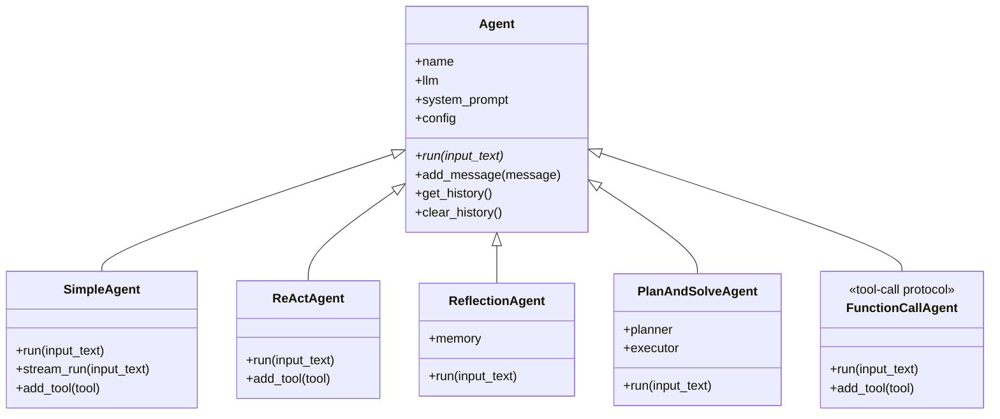

这里要区分两层“基类”：

- `Agent` 是抽象基类，只定义框架契约，不能直接实例化。
- 四种范式类已经实现 `run()`，可以直接使用；它们同时也是 7.4 中 `MySimpleAgent` 等定制类的父类。
- `FunctionCallAgent` 在继承结构上也是具体 Agent，但它解决的是工具调用协议问题，不属于新的推理范式。

这样既保持了 7.3 的接口边界，也让后续继承示例拥有真实、可运行的基础。

#### Message：统一消息格式

模型 API 接收的是字典，框架内部还需要时间、元数据和类型约束。如果始终直接传递字典，字段拼写错误和附加信息混入 API 请求都不容易发现。

```python
MessageRole = Literal["user", "assistant", "system", "tool"]

class Message(BaseModel):
    content: str
    role: MessageRole
    timestamp: datetime = Field(default_factory=datetime.now)
    metadata: Dict[str, Any] = Field(default_factory=dict)

    def to_dict(self) -> Dict[str, str]:
        return {"role": self.role, "content": self.content}
```

`Message` 采用“对内丰富、对外兼容”的设计：

- `role` 只允许四种标准角色，Pydantic 会在运行时校验非法值。
- `timestamp` 和 `metadata` 留在框架内部，可用于日志、追踪和后续上下文工程。
- `to_dict()` 只输出模型需要的 `role` 与 `content`，避免把内部字段发送给 API。
- `Field(default_factory=...)` 为每条消息分别创建时间和元数据，避免共享可变默认值。

完整代码见 [`message.py`](./code/HelloAgents/hello_agents/core/message.py)。

#### Config：集中配置

`Config` 将散落在 Agent 中的参数收拢到一个对象中：

```python
class Config(BaseModel):
    default_model: str = "gpt-3.5-turbo"
    default_provider: str = "openai"
    temperature: float = 0.7
    max_tokens: int | None = None
    debug: bool = False
    log_level: str = "INFO"
    max_history_length: int = 100
```

直接使用 `Config()` 会读取类中的默认值；需要加载环境变量时，应显式调用 `Config.from_env()`：

```python
config = Config.from_env()
```

环境变量配置已补充到 [`.env.example`](./code/HelloAgents/.env.example)。`to_dict()` 同时兼容 Pydantic v1 的 `dict()` 和 v2 的 `model_dump()`。

这里有两个容易混淆的边界：

- `Config` 只是配置数据，不会自动把 `temperature` 写入已经创建的 `HelloAgentsLLM`。
- `max_history_length` 是预留配置，当前 `Agent.add_message()` 还没有执行截断。

它们需要由后续具体 Agent 在构造和运行时接入。完整代码见 [`config.py`](./code/HelloAgents/hello_agents/core/config.py)。

#### Agent：定义统一入口

`Agent` 继承 `ABC`，并用 `@abstractmethod` 约束所有子类实现 `run()`：

```python
class Agent(ABC):
    def __init__(self, name, llm, system_prompt=None, config=None):
        self.name = name
        self.llm = llm
        self.system_prompt = system_prompt
        self.config = config or Config()
        self._history: list[Message] = []

    @abstractmethod
    def run(self, input_text: str, **kwargs) -> str:
        raise NotImplementedError
```

基类提供 `add_message()`、`get_history()` 和 `clear_history()`，具体子类只需关注如何组织消息、调用模型和生成答案。`get_history()` 返回列表副本，外部清空或追加这个副本不会改变 Agent 内部历史。

`Agent` 本身不会自动插入系统提示词，也不会自动调用 LLM。具体父类负责消费输入、组织消息并调用模型：

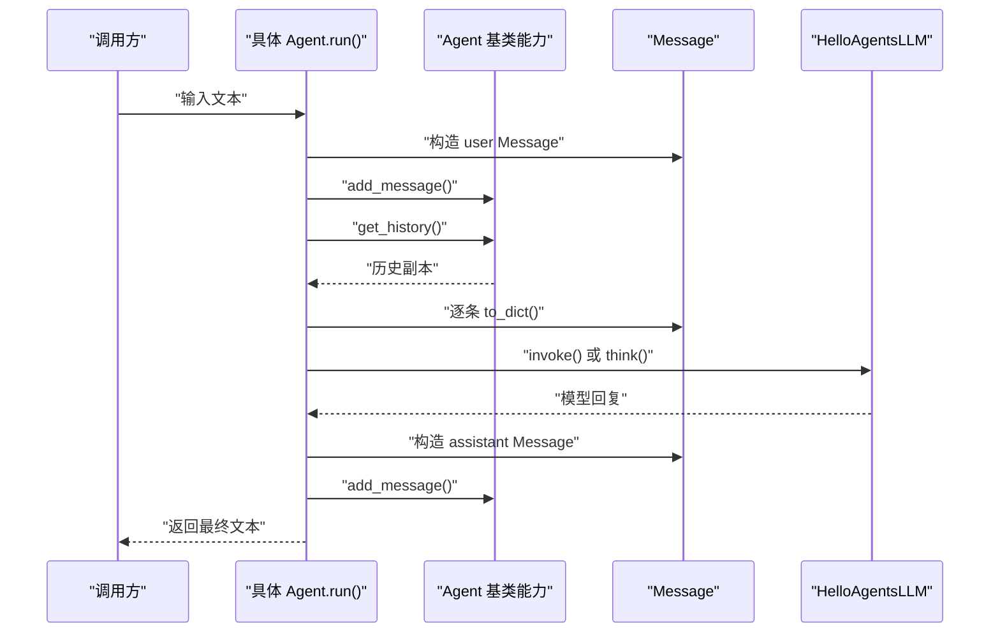

这张图描述的是具体 Agent 的实现职责，不是 `Agent` 基类已经完成的隐式行为。完整接口见 [`agent.py`](./code/HelloAgents/hello_agents/core/agent.py)。

#### 四种 Agent 父类

四种实现共享相同的构造依赖和 `run(input_text, **kwargs) -> str` 入口，但消息编排方式不同：

| 父类 | 核心循环 | 额外依赖 | 终止方式 |
| --- | --- | --- | --- |
| `SimpleAgent` | 用户消息 → LLM → 回复 | 可选 `ToolRegistry` | 模型不再输出工具标记，或达到工具迭代上限 |
| `ReActAgent` | Thought → Action → Observation | `ToolRegistry` | 输出 `Finish[...]`，或达到 `max_steps` |
| `ReflectionAgent` | 初稿 → 反思 → 修改 | 短期 `Memory` | 独立输出“无需改进”，或达到 `max_iterations` |
| `PlanAndSolveAgent` | 生成静态计划 → 逐步执行 | `Planner`、`Executor` | 所有计划步骤执行完毕，或计划解析失败 |

**SimpleAgent**

`SimpleAgent` 是普通对话入口。它先放入系统提示词，再拼接 `_history` 和当前用户消息；如果没有启用工具，调用一次 `llm.invoke()` 即可。

启用工具后，它沿用文章的文本协议：

```text
[TOOL_CALL:工具名:参数]
```

父类解析标记、执行工具，再把结果作为新的用户消息交还给模型。这个协议便于观察，但依赖模型严格输出文本格式，不如原生 Function Calling 稳定。实现见 [`simple_agent.py`](./code/HelloAgents/hello_agents/agents/simple_agent.py)。

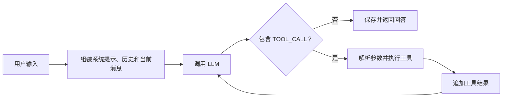

**ReActAgent**

`ReActAgent` 每轮要求模型输出 `Thought` 和 `Action`。`Action` 只能是 `tool[input]` 或 `Finish[answer]`。工具执行结果记录为 `Observation`，并在下一轮重新放入提示词。

```text
Thought: 需要把文本转换成大写。
Action: upper[hello]
Observation: HELLO
```

`current_history` 是单次任务的推理轨迹，每次 `run()` 都会重置；框架的 `_history` 只保存最终用户消息和答案。这样不会把内部推理过程混入普通对话历史。实现见 [`react_agent.py`](./code/HelloAgents/hello_agents/agents/react_agent.py)。

**ReflectionAgent**

`ReflectionAgent` 先生成初稿，然后重复“评审—修改”。它用一个很小的 `Memory` 保存 `execution` 和 `reflection` 记录，下一轮修改只读取最近一次执行结果。

停止协议必须判断完整反馈，而不是判断是否包含“无需改进”。例如：

```text
还需补充例子；目前不满足“无需改进”的条件。
```

这句话显然要求继续修改。如果使用 `"无需改进" in feedback`，却会被错误终止。实践代码先去除首尾空白和句末标点，再要求结果精确等于“无需改进”；实现见 [`reflection_agent.py`](./code/HelloAgents/hello_agents/agents/reflection_agent.py)。

**PlanAndSolveAgent**

`PlanAndSolveAgent` 将规划和执行拆成两个对象：

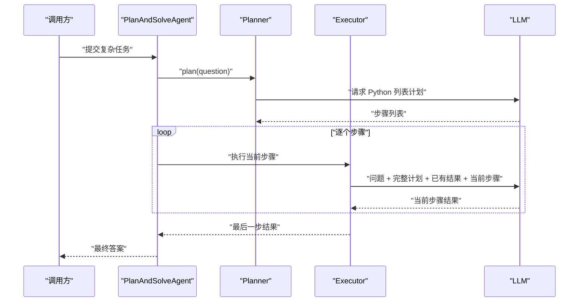

`Planner` 用 `ast.literal_eval()` 解析带 `python` 标识的代码围栏，避免使用 `eval()`。`Executor` 把每一步结果累积到 `history`，下一步因此能消费前面的产出。计划生成后不会动态调整，这是该范式与 ReAct 的主要区别。实现见 [`plan_solve_agent.py`](./code/HelloAgents/hello_agents/agents/plan_solve_agent.py)。

#### FunctionCallAgent：工具调用协议，而非第五种推理范式

把 `FunctionCallAgent` 和前四种 Agent 并排列出，容易把两个维度混在一起：

| 维度 | 回答的问题 | 本章实现 |
| --- | --- | --- |
| 任务组织与控制流 | Agent 如何完成任务、何时停止 | Simple、ReAct、Reflection、Plan-and-Solve |
| 工具调用协议 | 模型如何表达工具名和参数，结果如何回传 | 文本标记、`Action` 文本、原生 `tool_calls` |

因此，`FunctionCallAgent` 更准确的定位是“使用 OpenAI 兼容原生函数调用协议的 Agent”。它目前的控制流最接近启用工具后的 `SimpleAgent`：都在“模型—工具—模型”之间循环，区别主要在消息格式。

| 对比项 | `SimpleAgent` | `ReActAgent` | `FunctionCallAgent` |
| --- | --- | --- | --- |
| 工具描述 | 写入提示词 | 写入提示词 | 作为 `tools` JSON Schema 传入 API |
| 调用表达 | `[TOOL_CALL:name:params]` | `Action: name[input]` | `assistant.tool_calls` |
| 参数解析 | 正则和自定义文本解析 | 从方括号提取字符串 | 解析 `function.arguments` JSON |
| 结果回传 | 普通 user 消息 | `Observation` 文本 | `role="tool"` 与 `tool_call_id` |
| 前提 | 模型能遵守提示词 | 模型能遵守 ReAct 格式 | 模型和服务端支持结构化工具调用 |

所谓“原生函数调用”并不是模型替应用执行 Python 函数。模型只返回“希望调用哪个工具以及使用哪些参数”；真正的参数校验、权限判断、函数执行和异常处理仍由应用完成。

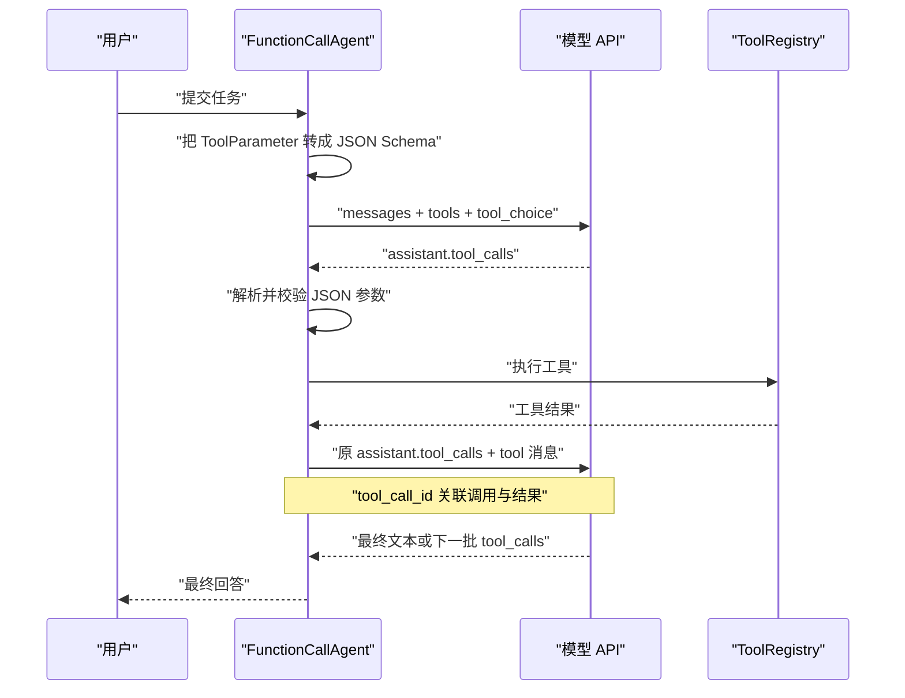

父类包含五个关键步骤：

- `_build_tool_schemas()`：把 `Tool` 元数据转换为 Chat Completions 的 `tools` Schema；轻量函数统一暴露一个 `input` 字符串参数。
- `_extract_message_content()`：兼容纯字符串、空内容和列表式内容。
- `_parse_function_call_arguments()`：将模型返回的 JSON 字符串解析为字典。
- `_convert_parameter_types()`：根据 `ToolParameter` 恢复整数、浮点数和布尔值。
- `_invoke_with_tools()`：保留 SDK 返回的 `tool_calls` 结构，驱动后续执行循环。

这里出现了一个值得保留的“抽象泄漏”：现有 `HelloAgentsLLM.invoke()` 只返回文本，会丢失 `tool_calls`，所以 `FunctionCallAgent` 必须访问 `llm._client`。当前实现与文章保持一致；后续若继续完善框架，更合理的方向是让 LLM 层返回统一的结构化响应，而不是让 Agent 依赖 SDK 私有客户端。

`tool_choice` 默认使用 `"auto"`，允许模型自行决定是否调用工具；达到 `max_tool_iterations` 后，最后一次请求改为 `"none"`，要求模型停止调用并整理答案。即使接口声称兼容 OpenAI，也不代表所选模型一定支持 `tools`，实际使用前仍需检查模型能力。

完整实现见 [`function_call_agent.py`](./code/HelloAgents/hello_agents/agents/function_call_agent.py)。

#### 工具系统的前置接口

`SimpleAgent`、`ReActAgent` 和 `FunctionCallAgent` 都依赖工具注册表。7.3 先提供两项基础能力，7.5 再在此之上补齐具体工具、工具链和异步执行器：

- [`base.py`](./code/HelloAgents/hello_agents/tools/base.py)：`ToolParameter` 和抽象 `Tool`。
- [`registry.py`](./code/HelloAgents/hello_agents/tools/registry.py)：注册、查找、执行和列出工具，同时支持直接注册字符串函数。

Memory、RAG 和 MCP 仍留给后续章节。当前依赖关系是：

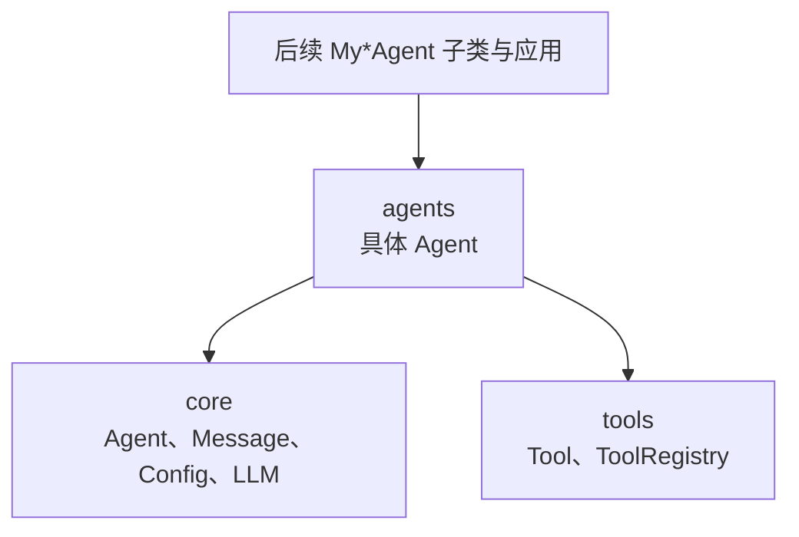

#### 异常边界

所有框架异常都继承 `HelloAgentsException`：

```text
HelloAgentsException
├── LLMException
├── AgentException
├── ConfigException
└── ToolException
```

调用方可以只捕获基类统一处理，也可以针对模型、Agent、配置和工具错误分别恢复。7.3 先建立类型边界，具体模块将在后续迭代中逐步使用这些细分异常。代码见 [`exceptions.py`](./code/HelloAgents/hello_agents/core/exceptions.py)。

#### 代码实践

当前代码结构为：

```text
code/HelloAgents/
├── hello_agents/
│   ├── core/
│   │   ├── agent.py
│   │   ├── config.py
│   │   ├── exceptions.py
│   │   ├── llm.py
│   │   └── message.py
│   ├── agents/
│   │   ├── function_call_agent.py
│   │   ├── simple_agent.py
│   │   ├── react_agent.py
│   │   ├── reflection_agent.py
│   │   └── plan_solve_agent.py
│   └── tools/
│       ├── builtin/
│       │   ├── calculator.py
│       │   └── search_tool.py
│       ├── async_executor.py
│       ├── base.py
│       ├── chain.py
│       └── registry.py
└── examples/
    ├── core_interfaces_demo.py
    ├── agent_paradigms_demo.py
    └── tool_system_demo.py
```

[`core_interfaces_demo.py`](./code/HelloAgents/examples/core_interfaces_demo.py) 保留最小 `EchoAgent`，用于检查 `Message`、抽象接口和历史副本。[`agent_paradigms_demo.py`](./code/HelloAgents/examples/agent_paradigms_demo.py) 使用确定性 Fake LLM，覆盖四种任务控制流和原生函数调用协议，不调用真实模型：

```bash
cd code/HelloAgents
python -m examples.agent_paradigms_demo
```

运行结果：

```text
SimpleAgent: 工具结果是 HELLO。
ReActAgent: HELLO
FunctionCallAgent: HELLO（原生 tool 消息已回传：True）
ReflectionAgent: 加入例子后的第二版答案（轨迹 4 条）
PlanAndSolveAgent: 最终结论（上一步结果已传递：True）
```

这组结果分别确认了：

- `SimpleAgent` 能识别文本工具调用并把结果送回模型。
- `ReActAgent` 会消费 Observation，再通过 `Finish[...]` 结束。
- `FunctionCallAgent` 能生成工具 Schema，并使用 `tool_call_id` 把执行结果回传给对应调用。
- Reflection 第一条反馈虽然含有“无需改进”，但没有误终止；第二轮收到独立完成信号后才停止。
- Plan-and-Solve 的第二步提示词中包含第一步结果。

这些测试只验证控制流和继承基础。模型质量、提示词稳定性、工具安全和真实网络异常仍需要接入实际模型后评估。

### 工具系统

#### 统一接口、参数描述与注册表

工具系统负责把模型的“调用意图”接到真实代码上。一个完整调用至少经过四层：

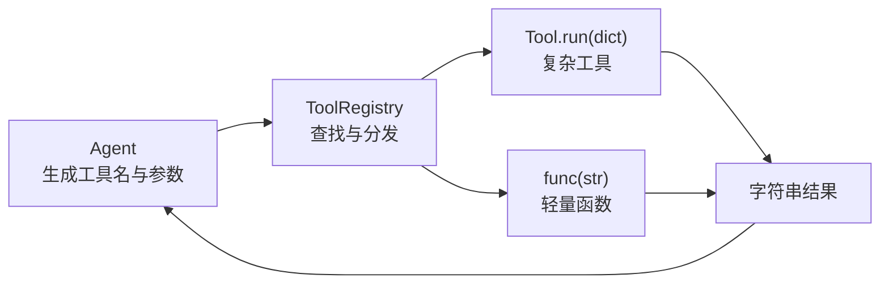

`Tool` 统一复杂工具的接口：

- `name` 和 `description` 负责工具发现。
- `get_parameters()` 返回 `ToolParameter`，描述参数名、JSON 类型、必填项和默认值。
- `run(parameters)` 接收字典并返回字符串，使不同 Agent 可以复用同一执行入口。
- `to_openai_schema()` 把上述元数据转换为 Function Calling 所需的 JSON Schema。

`ToolParameter` 继承 Pydantic，只能保证“参数描述对象”本身结构正确；正文当前的 `validate_parameters()` 只检查必填参数是否存在，并不会自动验证调用值的 Python 类型。运行时类型转换和业务校验仍要由 Agent 或具体工具完成。

```python
def to_openai_schema(self):
    properties = {}
    required = []
    for parameter in self.get_parameters():
        properties[parameter.name] = {
            "type": parameter.type,
            "description": parameter.description,
        }
        if parameter.required:
            required.append(parameter.name)

    return {
        "type": "function",
        "function": {
            "name": self.name,
            "description": self.description,
            "parameters": {
                "type": "object",
                "properties": properties,
                "required": required,
            },
        },
    }
```

本次将正文提到但本地基类缺失的 `to_openai_schema()` 补进 [`base.py`](./code/HelloAgents/hello_agents/tools/base.py)，并让 `FunctionCallAgent` 直接调用它，避免同一套 Schema 转换逻辑散落在 Agent 中。

`ToolRegistry` 保留两种注册方式：

| 注册方式 | 输入接口 | 适合场景 | 能否生成完整参数 Schema |
| --- | --- | --- | --- |
| `register_tool(Tool)` | `dict` | 搜索客户端、数据库等有状态或多参数工具 | 可以 |
| `register_function(...)` | `str` | 计算、文本处理等单输入函数 | 只能统一为 `input: string` |

注册表只做保存、发现和分发，不负责决定“什么时候调用哪个工具”。这个决策属于 Agent 或模型。

#### 计算器：AST 白名单，而不是 `eval`

正文使用 `ast.parse(..., mode="eval")` 解析表达式，这个方向是对的，但示例仍有几个未闭合的分支：

- `except:` 会吞掉所有异常，无法区分语法错误和程序错误。
- 不支持的运算符会得到 `None`，随后才在调用时失败。
- `ast.Constant` 没有限定数字，字符串和布尔值也会进入计算。
- 函数调用直接访问 `node.func.id`，属性调用并没有被明确拒绝。

实践代码用 AST 白名单补齐这些边界，只接受数字、`+ - * /`、`sqrt()` 和常量 `pi`，不使用 Python 的 `eval()`。危险表达式、未知函数、除零、非数值常量和超长输入都会返回明确的失败结果。

[`calculator.py`](./code/HelloAgents/hello_agents/tools/builtin/calculator.py) 同时提供两种用法：

```python
# 与正文一致：把单输入函数快速注册为工具
registry = create_calculator_registry()
registry.execute_tool("my_calculator", "sqrt(16) + 2 * 3")

# 框架对象方式：可描述参数并生成 Function Calling Schema
registry.register_tool(CalculatorTool())
```

两种方式复用同一个安全求值函数，因此不会出现示例代码和内置工具行为不一致的问题。

#### 多源搜索：按规则选择与失败降级

`SearchTool` 把 Tavily 和 SerpApi 包装成相同的 `run({"input": query})` 接口。所谓“自动选择”并不是模型判断，而是固定规则：

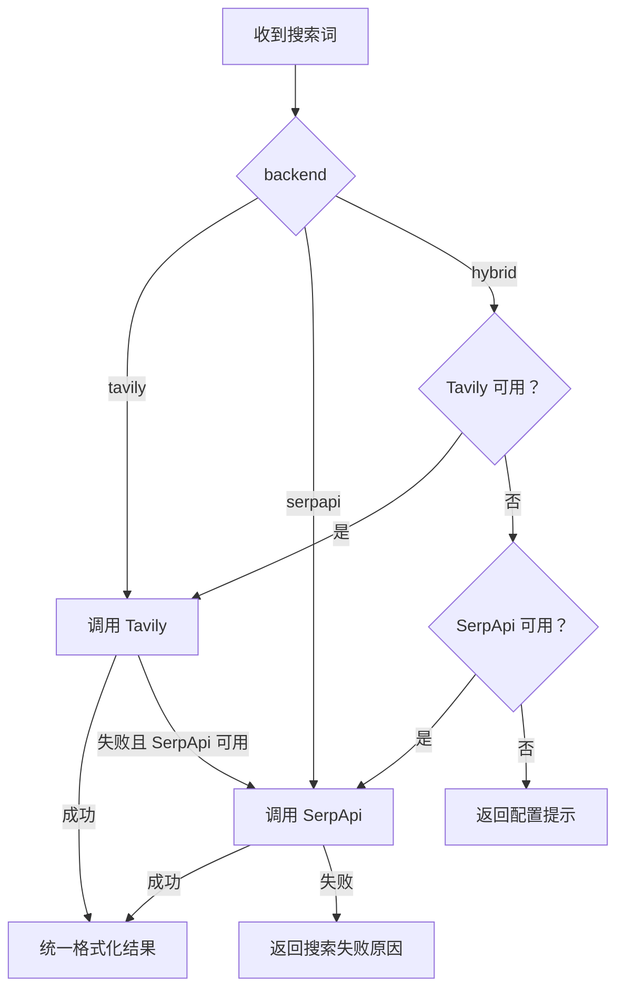

`hybrid` 模式优先 Tavily，异常时再尝试 SerpApi；显式指定后端时不会静默换源。不同服务返回的 `answer/results/content/url` 和 `organic_results/snippet/link` 会被整理为统一文本，Agent 无须理解各家的响应结构。

正文只展示了构造器、降级方法和部分格式化逻辑。本次补齐了：

- 后端取值校验、环境变量读取和可选依赖导入。
- `run()`、`search()` 与 `get_parameters()`。
- Tavily、SerpApi 的完整请求和结果格式化。
- 空查询、缺少依赖、缺少密钥、单后端失败和双后端失败的返回路径。
- 可注入客户端，便于离线测试降级逻辑。

SerpApi 使用 `from serpapi import GoogleSearch`，对应 `google-search-results` 包的调用方式。真实搜索需要额外安装依赖并配置密钥：

```bash
pip install tavily-python google-search-results
```

```dotenv
TAVILY_API_KEY=""
SERPAPI_API_KEY=""
```

完整实现见 [`search_tool.py`](./code/HelloAgents/hello_agents/tools/builtin/search_tool.py)。

#### 工具链：用上下文连接固定步骤

`ToolChain` 不是另一种 Agent。它没有规划和动态选路，只按预先声明的顺序运行工具。每一步包含：

- `tool_name`：注册表中的工具名。
- `input_template`：使用 `str.format()` 从上下文拼出本步输入。
- `output_key`：把结果写回上下文，供后续步骤引用。

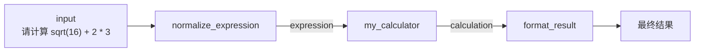

正文的 `搜索 → 计算` 示例把整段自然语言搜索结果直接交给 AST 计算器，只有搜索结果本身恰好是表达式时才可执行。工具链机制没有问题，问题在于相邻工具的数据契约不匹配。实践因此改为三步确定性链：规范表达式、计算、格式化；每一步输出都能被下一步直接消费。

[`chain.py`](./code/HelloAgents/hello_agents/tools/chain.py) 还补充了空链和模板变量缺失的处理，并复制外部 `context`，避免执行时意外修改调用方字典。工具执行错误仍以字符串进入上下文，这与当前 `ToolRegistry` 的返回协议一致；若以后需要自动中断，应该把结果改成包含 `ok/error/data` 的结构，而不是依赖错误文本。

#### 异步执行：让同步 I/O 工具并行

`ToolRegistry` 是同步接口。`AsyncToolExecutor` 使用 `ThreadPoolExecutor` 把多个独立调用移出事件循环，再通过 `asyncio.gather()` 等待结果：

```python
results = await executor.execute_tools_parallel([
    {"tool_name": "search", "input_data": "Python"},
    {"tool_name": "search", "input_data": "LangGraph"},
])
```

它适合网络请求、文件读取等等待时间较长的同步 I/O 工具；纯 Python 的 CPU 密集计算通常受 GIL 影响，线程池未必能加速。`gather()` 返回值顺序与任务输入顺序一致，不代表任务按该顺序完成。

正文只在 `__del__()` 中关闭线程池，资源释放时机不稳定。本次在 [`async_executor.py`](./code/HelloAgents/hello_agents/tools/async_executor.py) 中增加 `close()` 和上下文管理器，实践代码通过 `with` 确保线程池及时关闭。

#### 代码实践

[`tool_system_demo.py`](./code/HelloAgents/examples/tool_system_demo.py) 不调用真实模型和搜索 API，使用 Fake Tavily 与 Fake SerpApi 验证主搜索源失败后的降级路径，同时覆盖 Schema、计算器安全、三步工具链和并行执行：

```bash
cd code/HelloAgents
python3 -m examples.tool_system_demo
```

实际输出：

```text
=== Tool、Schema 与注册表 ===
Schema：python_calculator，必填参数 ['input']
计算器：sqrt(16) + 2 * 3 = 10.0
危险表达式：已拒绝

=== 多源搜索降级 ===
混合搜索：Tavily 失败后切换到 SerpApi Fake 客户端
无密钥搜索：返回配置提示，未发起网络请求

=== 工具链 ===
三步工具链：最终结果：sqrt(16) + 2 * 3 = 10.0

=== 异步执行器 ===
并行执行：['AGENT', '11']
```

这次实践验证的是框架控制流和异常边界，不代表真实 Tavily、SerpApi 的网络质量。接入真实服务后还需要继续测试限流、超时、重试和返回字段变化。

### 参考资料

- [《Hello-Agents》第七章：构建你的智能体框架](https://github.com/datawhalechina/hello-agents/blob/main/docs/chapter7/%E7%AC%AC%E4%B8%83%E7%AB%A0%20%E6%9E%84%E5%BB%BA%E4%BD%A0%E7%9A%84Agent%E6%A1%86%E6%9E%B6.md)
- [HelloAgents `learn_version`：`core/llm.py`](https://github.com/jjyaoao/HelloAgents/blob/learn_version/hello_agents/core/llm.py)
- [HelloAgents `learn_version`：`core` 接口](https://github.com/jjyaoao/HelloAgents/tree/learn_version/hello_agents/core)
- [HelloAgents `learn_version`：Agent 实现](https://github.com/jjyaoao/HelloAgents/tree/learn_version/hello_agents/agents)
- [HelloAgents `learn_version`：工具接口与注册表](https://github.com/jjyaoao/HelloAgents/tree/learn_version/hello_agents/tools)
- [HelloAgents `learn_version`：内置工具](https://github.com/jjyaoao/HelloAgents/tree/learn_version/hello_agents/tools/builtin)
- [OpenAI Function Calling Guide](https://developers.openai.com/api/docs/guides/function-calling)
- [Pydantic Migration Guide](https://docs.pydantic.dev/latest/migration/)
- [vLLM OpenAI-Compatible Server](https://docs.vllm.ai/en/latest/serving/online_serving/openai_compatible_server/)
- [Ollama OpenAI compatibility](https://docs.ollama.com/api/openai-compatibility)
- [Ollama `qwen3:0.6b`](https://ollama.com/library/qwen3:0.6b)

### 小结

- 自建框架的价值在于透明、可控和可扩展，设计时应先确定模块职责与依赖方向。
- 核心接口保持稳定，具体 Agent 和工具才能独立扩展。
- “万物皆工具”统一了调用方式，但不能忽略 Memory、RAG 和协议组件的状态与生命周期。
- HelloAgentsLLM 隔离了 Agent 与模型部署细节，云端服务、vLLM 和 Ollama 可以复用同一调用入口。
- Provider 自动检测只是确定性规则匹配；显式选择比隐式推断更容易排查和复现。
- `Message` 统一内部消息格式，`Config` 集中保存配置，但两者都不替具体 Agent 执行业务逻辑。
- `Agent` 只规定依赖、历史管理和 `run()` 入口；四种具体父类分别实现普通对话、ReAct、Reflection 和 Plan-and-Solve 的控制流。
- 正文后续直接继承四种 Agent，却没有展示其父类源码；补齐继承链后，`My*Agent` 示例才具备完整上下文。
- 文本协议适合教学和观察，但依赖模型严格遵循格式；工具调用上限和范式自身的终止条件都不能省略。
- `FunctionCallAgent` 不是第五种推理范式，而是以 JSON Schema、`tool_calls` 和 `tool_call_id` 实现的结构化工具调用方式；工具最终仍由应用执行。
- `Tool` 统一复杂工具接口，`ToolRegistry` 同时容纳对象工具和单输入函数，`to_openai_schema()` 则把工具元数据接到 Function Calling。
- 工具安全不能交给模型保证：计算器需要 AST 白名单，搜索工具需要空输入、依赖、密钥、失败降级等完整边界。
- 工具链适合数据契约明确的固定流水线；异步执行器适合彼此独立且以等待为主的同步 I/O 工具。
