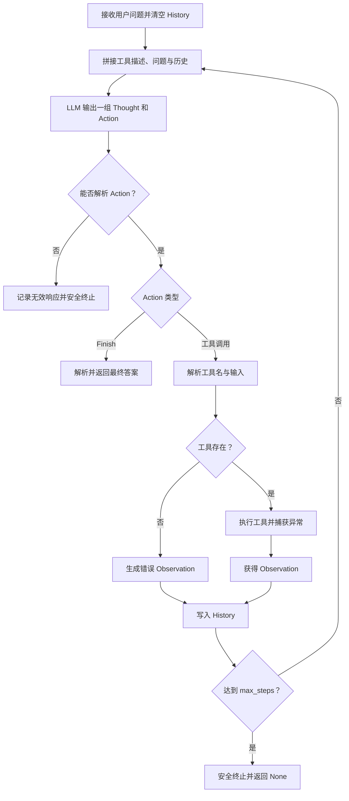
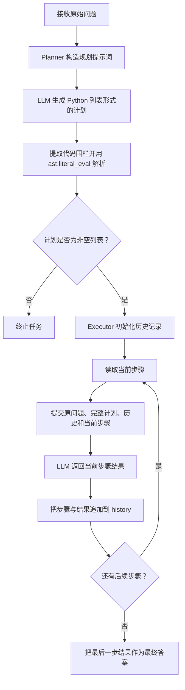
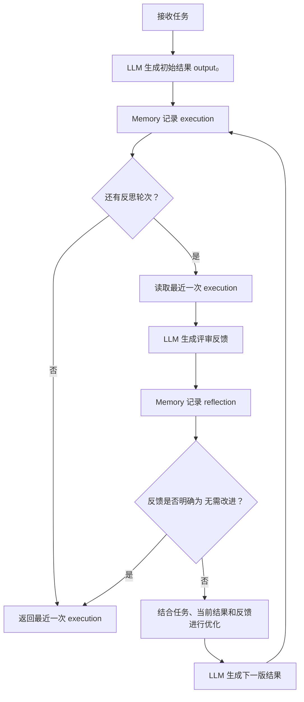
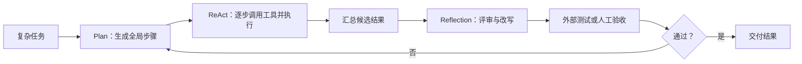

## 智能体经典范式构建

> 阅读材料：[《Hello-Agents》第四章：智能体经典范式构建](https://datawhalechina.github.io/hello-agents/#/./chapter4/%E7%AC%AC%E5%9B%9B%E7%AB%A0%20%E6%99%BA%E8%83%BD%E4%BD%93%E7%BB%8F%E5%85%B8%E8%8C%83%E5%BC%8F%E6%9E%84%E5%BB%BA)
>
> 本地实践：[`code`](./code/)

### 本章要解决的问题

大语言模型可以理解问题、生成文本，却不会天然地管理任务状态、调用外部工具或判断何时停止。一个可工作的智能体，需要在模型之外补上一层明确的控制循环：

* **推理协议**：约束模型每轮应该输出什么。
* **状态管理**：保存问题、计划、历史行动和中间结果。
* **外部能力**：把搜索、计算器或 API 封装为模型可选择的工具。
* **循环与停止条件**：决定何时继续、纠错、重试或返回答案。

本章的三种经典范式，分别从三个角度组织这个控制循环：

| 范式 | 核心问题 | 一句话理解 |
|:--|:--|:--|
| ReAct | 下一步应该做什么，环境反馈是什么 | 边思考、边行动、边修正 |
| Plan-and-Solve | 复杂任务应该如何拆解和执行 | 先制定全局计划，再逐步求解 |
| Reflection | 已有结果还能怎样改进 | 生成、评审、优化，迭代提高质量 |

我的核心理解是：**Agent 的可靠性不只来自模型能力，更来自模型外部的协议、状态和验证机制。**

### 环境准备与公共组件

#### 运行环境

示例使用 Python 3.10 或更高版本，基础依赖为：

```bash
python3 -m venv .venv
source .venv/bin/activate
pip install openai python-dotenv google-search-results
```

配置文件参考 [`.env.example`](./code/.env.example)：

```dotenv
# .env file
LLM_API_KEY=""
LLM_MODEL_ID=""
LLM_BASE_URL=""
SERPAPI_API_KEY=""
```

运行真实模型前，将它复制为 `.env` 并填写配置，不能把真实密钥提交到仓库。[`llm.py`](./code/llm.py) 还支持可选的 `LLM_TIMEOUT`，未配置时默认 60 秒。

#### LLM 调用层

[`HelloAgentsLLM`](./code/llm.py) 是三种范式共享的模型客户端，它完成四件事：

1. 使用 `load_dotenv()` 读取环境变量。
2. 创建兼容 OpenAI Chat Completions 接口的客户端。
3. 以流式方式接收并打印模型输出。
4. 将分块内容重新拼接成完整字符串，交给上层 Agent 解析。

这层封装把“如何访问模型”与“如何组织 Agent 循环”分离。更换模型服务时，只需保证服务兼容相同接口，不必重写三种范式。

异常目前被捕获并转换为 `None`。教学代码因此容易理解，但生产环境还应区分超时、限流、鉴权失败和服务端错误，并加入重试、退避及可观测日志。

#### 实践代码索引

| 分组 | 文件与职责 |
|:--|:--|
| 公共能力 | [`llm.py`](./code/llm.py)：模型调用；[`.env.example`](./code/.env.example)：环境变量模板 |
| ReAct | [`too_executor.py`](./code/too_executor.py)：工具注册与调度；[`search_tool.py`](./code/search_tool.py)、[`serpapi_tool.py`](./code/serpapi_tool.py)：搜索工具；[`react_agent.py`](./code/react_agent.py)：核心循环；[`react_agent_main.py`](./code/react_agent_main.py)：CLI 与 Mock |
| Plan-and-Solve | [`plan.py`](./code/plan.py)：规划器；[`plan_executor.py`](./code/plan_executor.py)：执行器；[`plan_and_solve_agent.py`](./code/plan_and_solve_agent.py)：流程协调；[`plan_and_solve_agent_main.py`](./code/plan_and_solve_agent_main.py)：CLI |
| Reflection | [`memory.py`](./code/memory.py)：短期记忆；[`reflection_agent.py`](./code/reflection_agent.py)：反思循环；[`reflection_agent_main.py`](./code/reflection_agent_main.py)：提示词、CLI 与 Mock |

### ReAct：推理与行动交替

#### 为什么需要 ReAct

仅靠模型内部知识回答问题，容易遇到知识过期、计算不可靠和无法操作外部系统等限制。ReAct 将推理（Reasoning）与行动（Acting）交错执行，让模型可以根据真实的工具反馈调整下一步。

第 `t` 轮可以抽象为：

$$
(Thought_t, Action_t) = policy(question, History_{t-1})
$$

工具执行动作后产生观察：

$$
Observation_t = Tool(Action_t)
$$

新的 `Thought → Action → Observation` 被追加到历史，再交给下一轮模型。这里的关键不是让模型一次写出完整方案，而是让它每轮只做一个决策。

#### 工作流程



#### 提示词协议

实践代码要求模型每轮遵守以下文本协议：

```text
Thought: 本轮对问题和历史的分析
Action: tool_name[tool_input]
```

信息足够时改为：

```text
Thought: 已经具备回答条件
Action: Finish[最终答案]
```

[`ReActAgent`](./code/react_agent.py) 只解析并执行第一个 `Action`。如果模型一次生成多个动作，也必须等工具返回 `Observation` 后再进入下一轮，避免后续动作建立在虚构观察之上。

#### 工具层与代码映射

[`ToolExecutor`](./code/too_executor.py) 保存工具名称、描述和执行函数。Agent 把工具描述加入提示词，模型输出工具名后，再由执行器找到对应 Python 函数。

当前接口把所有工具统一为“单个字符串输入”：

```python
tool_executor.registerTool(
    name="calculator",
    description="执行安全的数学四则运算",
    func=safe_calculator,
)
```

实践入口提供三类工具：

* `calculator`：使用 AST 白名单执行四则运算，避免直接 `eval` 任意代码。
* `echo`：原样返回输入，便于调试控制流。
* `search`：调用 SerpApi，依次尝试答案框、知识图谱和前三条自然搜索结果。

附件中的文件名 `too_executor.py` 很可能是 `tool_executor.py` 的拼写遗留，但现有模块引用保持一致，因此本次保留原名。`search_tool.py` 与 `serpapi_tool.py` 功能基本相同，也作为实践演进痕迹一并保留。

#### 实践一：计算器与搜索

不配置任何 API Key，可以先运行两轮 Mock：

```bash
cd ai/book_note/Hello-Agents/code
python react_agent_main.py --mock
```

第一轮模型选择 `calculator[12 * 8 + 6]`，工具返回 `102`；第二轮看到观察结果后输出 `Finish[12 * 8 + 6 = 102]`。这验证了标准闭环：

```text
Thought → Action → Observation → Thought → Finish
```

配置真实模型与 `SERPAPI_API_KEY` 后，可以运行需要最新信息的问题：

```bash
python react_agent_main.py "查询一个需要实时搜索才能回答的问题"
```

搜索结果只是观察数据，并不天然可靠。Agent 仍需判断来源是否匹配问题、多个结果是否冲突，以及“最新”究竟指哪个产品线或时间范围。

#### 优势、局限与工程改进

**优势：**

* 能获取模型参数之外的实时信息。
* 每次工具反馈都会影响下一步，具备动态纠错能力。
* 完整轨迹便于观察模型为何选择某个工具。
* 未知工具和执行异常会转成 Observation，让模型有机会自行修正。

**局限：**

* 每轮至少一次模型调用，串行延迟和成本较高。
* 正则解析依赖模型严格遵守 `Thought/Action` 格式。
* 工具输入中的复杂括号或格式漂移可能破坏文本解析。
* Agent 可能重复搜索、循环调用或在 `max_steps` 内仍得不到答案。
* `max_steps` 只是安全阀，不代表任务成功。

**工程改进：**

* 用模型原生工具调用或 JSON Schema 代替自由文本正则。
* 为工具定义明确的参数类型、超时、重试和权限边界。
* 对搜索类 Observation 保留来源链接、时间与置信信息。
* 为每轮记录耗时、Token、工具输入输出和终止原因。

### Plan-and-Solve：先规划，再逐步执行

#### 核心思想

复杂问题容易出现漏步骤、局部计算正确但整体目标偏移等问题。Plan-and-Solve 将任务拆成两个阶段：

1. **Plan**：一次性把原问题分解成有顺序的可执行步骤。
2. **Solve**：带着完整计划和历史结果，逐步完成当前步骤。

规划阶段可以表示为：

$$
Plan = planner(question) = [step_1, step_2, ..., step_n]
$$

第 `i` 步执行时：

$$
result_i = executor(question, Plan, result_1, ..., result_{i-1}, step_i)
$$

#### 工作流程



#### 代码结构与状态传递

[`Planner`](./code/plan.py) 要求模型返回带 `python` 标记的代码围栏，并使用 `ast.literal_eval` 将字符串安全解析成列表。它比 `eval` 安全，但仍依赖固定的围栏格式。

[`Executor`](./code/plan_executor.py) 每轮都向模型提供：

* 原始问题，避免执行过程中丢失最终目标。
* 完整计划，帮助模型理解当前步骤的位置。
* 已完成步骤及结果，建立步骤间的数据依赖。
* 当前步骤，约束模型只解决眼前子任务。

若计划包含 `N` 个步骤，总调用次数通常是 `N + 1`：一次规划，加上 `N` 次执行。当前实现没有单独的最终汇总调用，而是直接返回最后一步结果，因此计划的最后一步必须显式负责汇总答案。

#### 实践二：水果店应用题

问题为：周一卖出 15 个苹果；周二是周一的两倍；周三比周二少 5 个；求三天总数。

规划器生成的逻辑步骤为：

1. 记录周一数量：`15`。
2. 计算周二：`15 × 2 = 30`。
3. 计算周三：`30 - 5 = 25`。
4. 汇总三天：`15 + 30 + 25 = 70`。

运行真实模型：

```bash
python plan_and_solve_agent_main.py +  "一个水果店周一卖出15个苹果，周二是周一的两倍，周三比周二少5个，三天共卖出多少个？"
```

这个案例展示了 Plan-and-Solve 的价值：各步运算并不难，难点在于不漏掉中间关系，并让最后一步回到原始目标。

#### 优势、局限与工程改进

**优势：**

* 全局结构清晰，适合能够预先分解的任务。
* 执行器始终看到完整计划，目标一致性高。
* 历史结果显式传递，便于定位哪一步开始出错。

**局限：**

* 计划是静态的，执行时发现前提错误也不会自动重规划。
* 早期步骤错误会沿历史传播到后续步骤。
* 列表解析依赖精确的 Markdown 围栏。
* 当前实现没有步骤校验、工具调用、失败恢复和独立汇总。

**工程改进：**

* 让规划器输出受 Schema 约束的步骤对象，而不是 Python 字符串列表。
* 为步骤加入 `pending/running/succeeded/failed` 状态和显式依赖。
* 每步执行后调用校验器；失败时局部重试或回到 Planner 重规划。
* 将“执行步骤”和“综合最终答案”拆为不同阶段。

### Reflection：执行、反思与优化

#### 核心思想

Reflection 不急于接受第一个可用结果，而是让模型扮演生成者、评审者和改写者：

$$
feedback_i = reflect(task, output_i)
$$

$$
output_{i+1} = refine(task, output_i, feedback_i)
$$

它以额外调用成本换取结果质量，适合代码、报告、方案等可以反复修订的产物。

本章的 Reflection 是“生成—批评—改写”的简化教学实现。它与 Reflexion 论文中的语言强化框架思想相关，但不是完整复现：后者还强调环境反馈、情景记忆以及跨尝试的语言反思，并不更新模型权重。

#### 工作流程



#### Memory 与三类提示词

[`Memory`](./code/memory.py) 使用两类记录保存轨迹：

* `execution`：初稿或优化后的结果。
* `reflection`：针对最近一次结果的评审反馈。

`get_last_execution()` 从后向前查找最新结果，保证最终返回的是产物而不是评审文本。`get_trajectory()` 可以格式化完整轨迹，但当前 [`ReflectionAgent`](./code/reflection_agent.py) 并未使用它；每轮提示词只消费最近一次结果和本轮反馈。

入口定义三类角色提示词：

| 提示词 | 角色 | 输出 |
|:--|:--|:--|
| Initial | 实现者 | 根据任务生成初稿 |
| Reflect | 严格评审者 | 分析问题并提出改进意见 |
| Refine | 优化者 | 根据初稿与反馈生成新版本 |

最大迭代次数为 `K` 时，最多调用 `1 + 2K` 次模型：一次初始生成，每轮一次反思和一次优化。如果反思明确通过，就提前终止并省去本轮优化。

#### 实践三：素数函数优化

Mock 先生成逐个候选数试除的版本，最坏时间复杂度接近 `O(n²)`。评审指出算法瓶颈并建议埃拉托斯特尼筛法，优化版本使用 `bytearray` 和切片批量标记合数，将时间复杂度改善到约 `O(n log log n)`。

```bash
python reflection_agent_main.py --mock
```

真实模型可能第一次就给出筛法，这会削弱“低效初稿→评审→优化”的演示效果。这说明 Reflection 的收益取决于初稿质量、评审标准和任务是否存在可改进空间；教学时使用确定性的 Mock 更容易观察控制流。

#### 一次重要的停止条件修复

附件原实现使用：

```python
if "无需改进" in feedback:
    break
```

当评审回答“当前结果并非无需改进，仍需优化”时，其中仍包含“无需改进”，旧逻辑会错误停止。这暴露了一个关键问题：**自然语言子串不能直接充当可靠的控制协议。**

本地代码已改为先去除首尾空白和常见句末标点，再要求反馈精确等于“无需改进”。因此：

| 反馈 | 是否停止 |
|:--|:--:|
| `无需改进` | 是 |
| `无需改进。` | 是 |
| `并非无需改进，仍需优化` | 否 |

更稳健的生产方案是使用结构化状态，例如 `{"status": "done"}` 或 `{"status": "continue", "feedback": "..."}`，并用 Schema 校验。

#### 优势、局限与工程改进

**优势：**

* 能系统地发现初稿中的缺陷并生成更高质量版本。
* 记忆保留了“结果—反馈—新结果”的演化轨迹。
* 评审提示词可以针对正确性、效率、安全性或表达质量定制。

**局限：**

* 每轮增加两次模型调用，延迟和费用明显上升。
* 同一模型自评可能产生自我确认偏差。
* “反思写得好”不等于结果已经通过客观验证。
* 上下文会随轨迹增长，完整保留所有版本可能带来噪声和成本。

**工程改进：**

* 让单元测试、静态分析、事实核查或人工评审成为外部反馈。
* 将停止状态与评审正文分离为结构化字段。
* 设置最大迭代数、质量阈值和成本预算。
* 对长轨迹做摘要，只保留仍有价值的失败经验。

### 三种范式的横向比较

| 维度 | ReAct | Plan-and-Solve | Reflection |
|:--|:--|:--|:--|
| 核心循环 | 思考→行动→观察 | 规划→逐步执行 | 执行→反思→优化 |
| 主要信息来源 | 外部工具与环境反馈 | 原问题、计划和历史结果 | 当前结果与评审反馈 |
| 路径是否动态 | 动态选择下一动作 | 默认按静态计划执行 | 根据反馈迭代结果 |
| 典型调用量 | 最多 `max_steps` 次 | `N + 1` 次 | 最多 `1 + 2K` 次 |
| 适合任务 | 搜索、API、探索性任务 | 数学推理、报告拆解、流程明确的任务 | 代码优化、写作润色、高质量产物 |
| 主要风险 | 循环、工具误用、格式漂移 | 错误计划向后传播 | 成本高、自评偏差、错误收敛 |
| 核心安全阀 | `max_steps` 与工具权限 | 计划校验与重规划 | 精确停止信号与最大迭代数 |

选型时可以先问：

1. **必须访问实时数据或外部系统吗？** 优先 ReAct。
2. **任务路径能否在开始时稳定拆解？** 优先 Plan-and-Solve。
3. **第一版答案通常不够，质量是否比速度更重要？** 优先 Reflection。

三者不是互斥的。复杂系统可以先由 Planner 给出全局步骤，每个步骤内部使用 ReAct 获取工具反馈，最后再用 Reflection 和外部验证器检查最终产物：



### 我的实践总结

#### 本次代码整理

同步附件时保留了原有教学结构和 CLI，仅做保证代码可理解、可解析和控制流正确的最小修复：

| 问题 | 处理 |
|:--|:--|
| 三个入口文件末尾混入大段运行日志，Reflection 日志中的三引号破坏 Python 语法 | 删除日志，将重要现象提炼到笔记 |
| `serpapi_tool.py` 使用 `os.getenv` 却没有导入 `os` | 补充 `import os` |
| Reflection 用子串判断停止，否定句也会误停 | 改为规范化后的精确匹配 |
| ReAct 入口动态注入已存在的依赖和重复提示词 | 改为普通模块导入和按需加载搜索工具 |
| Plan 入口仍保留“补注入 ast”的过时代码 | 直接使用已正常导入 `ast` 的规划模块 |
| `too_executor.py` 拼写与两份搜索工具重复 | 为保持附件引用关系与实践轨迹，暂不重命名或删除 |

#### 离线验证结果

验证过程没有调用真实 LLM 或搜索接口：

* 13 个 Python 文件全部通过内存语法编译。
* ReAct Mock 用两轮完成计算，最终结果为 `102`。
* Reflection Mock 确实经历初稿、评审、筛法优化和明确停止。
* 回归反馈“当前结果并非无需改进，仍需优化”时，Agent 会继续生成下一版。
* Plan-and-Solve 使用 Fake LLM 验证了计划解析、历史传递和 `70 个苹果` 的最终结果。
* 缺少 `SERPAPI_API_KEY` 时，搜索工具返回清晰的配置错误，并不会创建搜索客户端。

#### 从代码中得到的工程认识

* **文本协议就是接口。** 只要程序要解析模型输出，就要像设计 API 一样设计格式、校验和错误处理。
* **状态必须显式。** History、Plan 和 Memory 决定模型在下一轮能够看到什么，也决定错误如何传播。
* **停止条件要机器可判定。** 自然语言关键词匹配非常脆弱，结构化状态更可靠。
* **反思不等于验证。** 模型认为自己正确，不能替代测试、工具反馈或人工验收。
* **强模型也不能替代控制流。** 模型可能一次给出好答案，也可能偏离格式；边界、预算和恢复机制仍应由程序负责。
* **教学实现与生产实现要区分。** 正则和字符串列表便于理解原理，生产环境更适合原生工具调用、Schema、持久状态、可观测性和权限控制。

### 小结

三种经典范式对应三种解决问题的策略：

* ReAct 通过外部观察减少闭门推理，适合不确定且需要工具的任务。
* Plan-and-Solve 通过全局分解减少漏步骤，适合路径清晰的多步任务。
* Reflection 通过评审和改写提高结果上限，适合质量优先、允许迭代的任务。

真正值得掌握的不是三个固定类，而是它们背后的 Agent Loop：**模型生成决策，程序执行和保存状态，环境返回反馈，停止协议决定是否交付。**

### 参考资料

* [Datawhale：第四章 智能体经典范式构建](https://github.com/datawhalechina/hello-agents/blob/main/docs/chapter4/%E7%AC%AC%E5%9B%9B%E7%AB%A0%20%E6%99%BA%E8%83%BD%E4%BD%93%E7%BB%8F%E5%85%B8%E8%8C%83%E5%BC%8F%E6%9E%84%E5%BB%BA.md)
* [Hello-Agents 第四章官方配套代码](https://github.com/datawhalechina/hello-agents/tree/main/code/chapter4)
* [ReAct: Synergizing Reasoning and Acting in Language Models](https://arxiv.org/abs/2210.03629)
* [Plan-and-Solve Prompting](https://arxiv.org/abs/2305.04091)
* [Reflexion: Language Agents with Verbal Reinforcement Learning](https://arxiv.org/abs/2303.11366)
