## 上下文工程

> 阅读资料：[《Hello-Agents》第九章 9.1：什么是上下文工程](https://datawhalechina.github.io/hello-agents/#/./chapter9/%E7%AC%AC%E4%B9%9D%E7%AB%A0%20%E4%B8%8A%E4%B8%8B%E6%96%87%E5%B7%A5%E7%A8%8B?id=_91-%e4%bb%80%e4%b9%88%e6%98%af%e4%b8%8a%e4%b8%8b%e6%96%87%e5%b7%a5%e7%a8%8b)
>
> 阅读资料：[《Hello-Agents》第九章 9.2：为什么上下文工程重要](https://datawhalechina.github.io/hello-agents/#/./chapter9/%E7%AC%AC%E4%B9%9D%E7%AB%A0%20%E4%B8%8A%E4%B8%8B%E6%96%87%E5%B7%A5%E7%A8%8B?id=_92-%e4%b8%ba%e4%bb%80%e4%b9%88%e4%b8%8a%e4%b8%8b%e6%96%87%e5%b7%a5%e7%a8%8b%e9%87%8d%e8%a6%81)
>
> 阅读资料：[《Hello-Agents》第九章 9.3：在 Hello-Agents 中的实践——ContextBuilder](https://datawhalechina.github.io/hello-agents/#/./chapter9/%E7%AC%AC%E4%B9%9D%E7%AB%A0%20%E4%B8%8A%E4%B8%8B%E6%96%87%E5%B7%A5%E7%A8%8B?id=_93-%e5%9c%a8-hello-agents-%e4%b8%ad%e7%9a%84%e5%ae%9e%e8%b7%b5%ef%bc%9acontextbuilder)
>
> 阅读资料：[《Hello-Agents》第九章 9.4：NoteTool——结构化笔记](https://datawhalechina.github.io/hello-agents/#/./chapter9/%E7%AC%AC%E4%B9%9D%E7%AB%A0%20%E4%B8%8A%E4%B8%8B%E6%96%87%E5%B7%A5%E7%A8%8B?id=_94-notetool%ef%bc%9a%e7%bb%93%e6%9e%84%e5%8c%96%e7%ac%94%e8%ae%b0)
>
> 阅读资料：[《Hello-Agents》第九章 9.5：TerminalTool——即时文件系统访问](https://datawhalechina.github.io/hello-agents/#/./chapter9/%E7%AC%AC%E4%B9%9D%E7%AB%A0%20%E4%B8%8A%E4%B8%8B%E6%96%87%E5%B7%A5%E7%A8%8B?id=_95-terminaltool%ef%bc%9a%e5%8d%b3%e6%97%b6%e6%96%87%e4%bb%b6%e7%b3%bb%e7%bb%9f%e8%ae%bf%e9%97%ae)
>
> 阅读资料：[《Hello-Agents》第九章 9.6：长程智能体实战——代码库维护助手](https://datawhalechina.github.io/hello-agents/#/./chapter9/%E7%AC%AC%E4%B9%9D%E7%AB%A0%20%E4%B8%8A%E4%B8%8B%E6%96%87%E5%B7%A5%E7%A8%8B?id=_96-%e9%95%bf%e7%a8%8b%e6%99%ba%e8%83%bd%e4%bd%93%e5%ae%9e%e6%88%98%ef%bc%9a%e4%bb%a3%e7%a0%81%e5%ba%93%e7%bb%b4%e6%8a%a4%e5%8a%a9%e6%89%8b)
>
> 当前阅读范围为 9.1～9.6：ContextBuilder 组织本轮上下文，NoteTool 保存任务状态，TerminalTool 即时读取文件，最终组合成长程代码库维护助手。

### 什么是上下文工程

#### 上下文是模型在一次调用中实际看到的信息

上下文（Context）是某次模型推理时送入上下文窗口的 Token 集合。它不只包括用户刚输入的问题，还可能包含系统指令、少样本示例、对话历史、工具定义、检索结果、工具执行结果、记忆和当前任务状态。

| 上下文来源 | 典型内容 | 主要作用 |
| --- | --- | --- |
| 系统指令 | 角色、规则、安全边界 | 约束整体行为 |
| 当前任务 | 用户问题、目标、验收标准 | 告诉模型现在要做什么 |
| 少样本示例 | 典型输入输出 | 展示期望行为和格式 |
| 工具定义 | 名称、用途、参数 Schema | 告诉模型能做什么 |
| 历史与状态 | 最近消息、计划、待办、阶段结果 | 保持过程连续 |
| 外部知识 | RAG 片段、文件内容、数据库记录 | 提供模型参数之外的事实 |
| 环境反馈 | 工具输出、错误、测试结果 | 支持下一步判断与纠错 |
| 输出要求 | 格式、长度、引用方式 | 约束最终交付物 |

模型权重不是上下文；数据库、文件和记忆中尚未取出的内容也不是上下文。只有被选中并送入本次调用的信息，才会影响这一轮推理。

因此，上下文工程可以理解为：在模型和上下文窗口的约束下，持续选择、组织、更新本轮最有用的信息，使模型更稳定地产生期望行为。

#### 上下文是随 Agent 循环变化的运行时状态

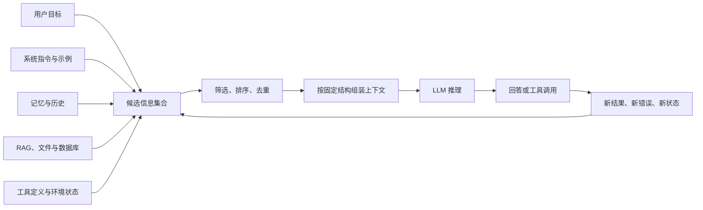

单轮生成时，上下文可以提前写好；Agent 会循环调用模型，每一轮又会产生新的观察、文件、错误和中间结论。如果把所有历史原样累积，候选信息会持续增长。上下文工程因此不是一次性的 Prompt 编写，而是贯穿每轮推理的状态管理过程。

我对它的理解是：**上下文窗口不是资料仓库，而是模型当前的工作台。** 仓库可以很大，但工作台上只应摆放当前任务需要的材料。

#### 提示工程是上下文工程的一部分

| 对比项 | 提示工程 | 上下文工程 |
| --- | --- | --- |
| 核心问题 | 指令应该怎么写 | 本轮应该让模型看到什么 |
| 主要对象 | 系统提示、用户提示、示例 | 提示、工具、历史、记忆、检索结果和环境反馈 |
| 时间范围 | 常见于单次或少量调用 | 随多轮 Agent Loop 持续变化 |
| 典型动作 | 改写指令、补充示例、规定格式 | 获取、筛选、排序、隔离、压缩和更新信息 |
| 失败表现 | 指令歧义、格式不稳定 | 关键信息缺失、噪声过多、历史冲突、工具结果污染 |

二者不是替代关系。清晰的 Prompt 仍然重要，只是无法单独解决长任务中的历史膨胀、动态检索、工具反馈和状态同步问题。RAG、Memory、工具系统也不是上下文工程的竞争方案，它们是候选信息的来源；上下文工程决定何时取、取多少以及怎样放入当前窗口。

### 为什么上下文工程重要

#### 能放进去，不等于能有效使用

模型的上下文窗口有明确容量限制，还需要为回答预留空间：

```text
可用输入预算 = 上下文窗口上限 - 预留输出 Token

系统指令 + 当前任务 + 工具定义 + 历史 + 检索结果
<= 可用输入预算
```

达到预算上限只是最直接的问题。更隐蔽的问题是：即使所有文本都能放进窗口，模型也未必能同等准确地定位和利用每条信息。

“Lost in the Middle”实验显示，相关信息在长上下文中的位置会影响模型表现，位于开头或结尾时通常更容易被利用，处于中间时可能下降。这说明上下文长度是接口给出的硬容量，而有效上下文还受到任务、模型、信息位置、结构和干扰项影响。

标准自注意力需要建立序列位置之间的关系，其计算量随序列长度呈二次增长。不过，计算成本增加与答案质量下降不是同一个结论。后者还涉及训练分布、位置编码、信息冲突和检索难度，不能简单解释成“注意力被平均分掉”。不同模型和任务的退化曲线也并不相同。

#### 上下文腐蚀来自低信号信息的累积

上下文腐蚀（Context Rot）指随着上下文增长，模型定位、回忆或正确使用关键信息的能力下降。常见诱因包括：

- 大量与当前任务无关的历史消息；
- 多次工具调用产生的重复输出；
- 旧计划与新计划同时存在；
- 检索片段相似但互相矛盾；
- 错误日志、调试信息和中间草稿长期滞留；
- 关键约束被埋在长文本中间；
- 工具数量过多、描述相近，增加选择歧义。

问题并不是 Token 数量本身，而是新增 Token 是否带来足够的任务价值。高质量上下文追求的是高信号密度：信息足够完成任务，但没有无关重复项。

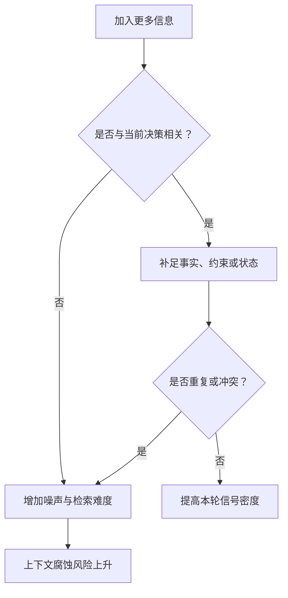

所以“扩大窗口”与“管理上下文”解决的是不同层面的问题。更大的窗口提高容量上限，上下文工程提高容量利用率。

#### Agent 比单轮问答更依赖上下文管理

Agent 每一轮都会读取旧状态并产生新状态：模型给出工具调用，环境返回结果，结果又进入下一轮上下文。若没有管理机制，错误和冗余会沿循环不断放大。

| Agent 阶段 | 需要保留 | 应避免长期保留 |
| --- | --- | --- |
| 理解任务 | 用户目标、硬约束、验收标准 | 与目标无关的寒暄 |
| 制定计划 | 当前计划、依赖、完成状态 | 已废弃但未标记的旧计划 |
| 调用工具 | 参数、必要前置状态 | 全部工具手册和无关 Schema |
| 处理结果 | 关键观察、错误原因、产物位置 | 大段重复日志和完整原始响应 |
| 最终交付 | 结论、证据、未解决问题 | 已完成步骤的逐轮推理记录 |

上下文选择会直接影响行为：缺少验收标准，Agent 可能过早结束；缺少错误结果，Agent 会重复失败操作；保留过多陈旧计划，又可能继续执行已经取消的方向。

### 有效上下文的组成

#### 系统提示要提供最小必要信息

系统提示常见两个极端：

- **过度硬编码**：塞入大量脆弱的条件分支，规则互相覆盖，难以维护。
- **过于空泛**：只写“你是一个有帮助的助手”，没有任务边界、工具规则和输出标准。

“最小必要信息”不等于字数最少，而是每条内容都有明确作用。可以用 Markdown 或 XML 分区，把背景、规则、工具指引和输出要求分开；先从简洁版本开始，再根据实际失败补充规则，不应提前穷举所有可能情况。

#### 工具描述也是上下文

模型通常根据工具名称、说明和参数 Schema 决定是否调用。工具越多不一定越强，职责重叠会让“选哪个工具”本身变成模糊问题。

有效工具集应满足：

- 单个工具职责清楚，名称和参数没有歧义；
- 相近能力尽量合并或明确边界；
- 错误返回可理解，并告诉 Agent 下一步怎样修正；
- 默认输出紧凑，详细内容可以按需继续获取；
- 只暴露当前任务可能用到的最小可行工具集。

工具执行后的返回值同样会进入上下文。设计工具时不仅要考虑函数能否正确运行，还要考虑输出是否适合模型阅读。

#### 少样本示例重在典型和多样

Few-shot 示例直接展示期望行为，比抽象描述更容易约束格式和决策方式。但把所有边界条件都写成示例会迅速耗尽预算，也可能让模型机械模仿不相关细节。

更合适的做法是选少量典型样本，覆盖不同但常见的行为：正常路径、关键边界和拒绝条件。示例的价值需要通过实际任务成功率验证，而不是按数量衡量。

### 上下文检索与智能体式搜索

#### 从一次性加载转向按需获取

预检索会在推理前准备一批可能相关的材料；JIT（Just-in-time）上下文只先提供文件路径、URL、表名或查询入口，由 Agent 在运行中逐步读取需要的内容。

| 策略 | 优点 | 局限 | 适合场景 |
| --- | --- | --- | --- |
| 一次性预加载 | 延迟低，首次调用即可使用 | 容易放入过量或过时信息 | 范围小、内容稳定的任务 |
| Embedding 预检索 | 能从大知识库筛选相关片段 | 依赖索引、切分和查询表达 | 文档问答、相似内容召回 |
| JIT 工具检索 | 信息新鲜，可逐层探索 | 调用更多、延迟更高，可能走错方向 | 代码库、文件系统、动态数据 |
| 混合策略 | 兼顾启动速度和探索能力 | 需要设计预加载与按需获取的边界 | 大多数复杂 Agent 任务 |

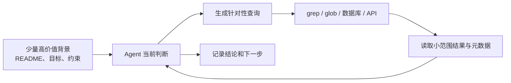

路径、目录层级、名称、文件大小和时间戳也是上下文。它们可以先帮助 Agent 判断信息用途，再决定是否读取正文。这种从元数据到局部内容、再到相关细节的过程就是渐进式披露。

JIT 不是预检索的全面替代。任务固定且资料很少时，直接加载更简单；动态数据或大型代码库更适合工具检索。常用的混合方式是预先提供项目约定和关键索引，同时允许 Agent 用 `glob`、`grep`、数据库查询等原语继续探索。

### 长时程任务中的上下文管理

大型代码迁移、长时间研究或跨会话项目会超出单个上下文窗口。原文给出三种主要策略：

| 策略 | 核心做法 | 适合任务 | 主要风险 |
| --- | --- | --- | --- |
| 压缩整合 | 用高保真摘要接续新窗口 | 需要连续对话和状态接力 | 摘要遗漏、错误被固化 |
| 结构化笔记 | 把目标、决策、待办和阻塞写到窗口外 | 有里程碑的开发和研究 | 笔记过时、记录与真实状态不一致 |
| 子代理 | 在独立上下文中并行探索，只回传结果 | 可拆分的复杂研究与分析 | 重复工作、摘要丢失证据、整合冲突 |

#### 压缩整合

压缩不是简单截掉最早消息，而是保留后续仍会影响决策的内容，例如目标、架构决策、已修改文件、测试状态、未解决问题和下一步；重复工具输出、闲聊和已经失效的中间草稿可以移除。

压缩是有损操作。安全顺序应先保证关键内容不丢，再逐步删除冗余；摘要还需要能追溯原始产物，不能把模型生成的总结当成唯一事实来源。

#### 结构化笔记

结构化笔记把重要状态放到上下文窗口之外，后续按需读取。常见内容包括：

- 当前目标与验收标准；
- 已完成、进行中和待办事项；
- 关键决策及原因；
- 文件、数据集和运行产物的位置；
- 阻塞问题与失败尝试；
- 最近更新时间。

笔记的关键不是“写下来”，而是把它作为任务状态持续维护。只追加不更新会让新旧结论冲突，反而制造新的上下文污染。

#### 子代理架构

主代理保留目标、拆分和最终综合，各子代理使用相对干净的窗口完成局部研究。回传内容应包含结论、证据位置、假设和未解决问题，而不是只有一段无法核验的摘要。

子代理带来的主要价值是关注点隔离和并行探索，不是凭空增加正确性。任务边界不清或结果无法合并时，多代理只会放大通信成本。

### 在 Hello-Agents 中的实践：ContextBuilder

前面的 Memory 和 RAG 负责保存、检索信息，`ContextBuilder` 负责在一次模型调用前把候选信息变成可用上下文。它不替代信息源，也不负责生成答案，职责是执行 GSSC：Gather、Select、Structure、Compress。

完整实现见：

- [ContextBuilder 与数据结构](./code/HelloAgents/hello_agents/context/builder.py)
- [context 模块导出](./code/HelloAgents/hello_agents/context/__init__.py)
- [基础构建与 Agent 集成示例](./code/HelloAgents/examples/context_builder_demo.py)

#### 设计目标

| 目标 | 解决的问题 |
| --- | --- |
| 统一入口 | 各 Agent 不必重复编写记忆检索、RAG 检索和历史拼装逻辑 |
| 稳定形态 | 固定分区便于模型理解，也便于日志检查和 A/B 测试 |
| 预算守护 | 在 `max_tokens` 内优先保留系统指令和高价值信息 |
| 最小规则 | 只使用相关性和新近性评分，避免过早引入复杂优先级体系 |

构建结果使用固定语义骨架：

```text
[Role & Policies]  角色与规则
[Task]             当前问题
[State]            任务状态
[Evidence]         RAG 等外部证据
[Context]          对话历史与记忆
[Output]           输出要求
```

其中 `[Task]`、`[Output]` 始终存在，其余分区在有内容时生成。分区不是装饰：它把不同语义的信息隔开，调试时也能直接判断问题来自指令、证据还是历史。

#### 两个核心数据结构

`ContextPacket` 是候选信息的统一单位：

```python
@dataclass
class ContextPacket:
    content: str
    timestamp: datetime
    token_count: int
    relevance_score: float = 0.5
    metadata: dict[str, Any] = field(default_factory=dict)
```

`content` 是正文，`timestamp` 用于计算新近性，`token_count` 用于预算选择，`relevance_score` 表示与任务的相关程度，`metadata["type"]` 决定信息最终进入哪个分区。

`ContextConfig` 管理构建策略：

| 参数 | 默认值 | 作用 |
| --- | ---: | --- |
| `max_tokens` | 3000 | 最终上下文预算 |
| `reserve_ratio` | 0.2 | 为系统指令预留的比例 |
| `min_relevance` | 0.1 | 过滤低相关候选项 |
| `enable_compression` | `True` | 超限时是否压缩 |
| `relevance_weight` | 0.7 | 相关性权重 |
| `recency_weight` | 0.3 | 新近性权重 |

两个权重之和必须为 1。实践代码使用显式 `ValueError` 校验，而不是原文中的 `assert`，因为 Python 以优化模式运行时会移除断言，配置校验也会随之失效。

#### GSSC 流水线

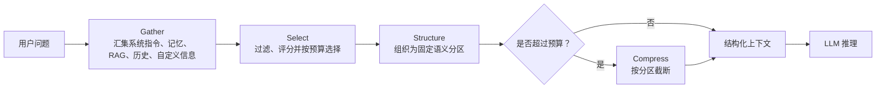

##### Gather：汇集候选信息

信息来自五个入口：

1. 系统指令，相关性固定为 1，在选择阶段始终优先保留；
2. `MemoryTool` 检索出的相关记忆；
3. `RAGTool` 返回的知识片段及来源；
4. 最近 5 条对话历史；
5. 调用者通过 `custom_packets` 传入的任务状态或临时知识。

Memory 或 RAG 失败只跳过对应来源，不中断整次构建。当前框架的两个工具已经能返回结构化对象，因此实现直接保留记忆时间、检索分数和 RAG 来源；只有面对其他只返回字符串的兼容工具时，才把整段结果包装成一个 Packet。

##### Select：选择高价值信息

系统指令以外的候选项使用相关性与新近性的加权分数：

```text
综合分数 = 0.7 × 相关性分数 + 0.3 × 新近性分数

新近性分数 = exp(-0.1 × 信息年龄小时数 / 24)
```

选择过程先过滤低于 `min_relevance` 的信息，再按综合分数降序填充预算。实现仍沿用原文的关键词重叠思路，没有另加向量模型；为了让中文文本可以比较，分词时同时提取英文单词和汉字。

`reserve_ratio` 的实际含义是给系统指令留位置：普通信息最多使用 `max_tokens - max(系统指令 Token, 预留 Token)`。某个大 Packet 放不下时只跳过它，继续检查后面较小的 Packet；如果直接 `break`，仍能装入的小块信息也会被误删。

##### Structure：固定上下文形态

被选中的 Packet 根据 `metadata["type"]` 分流：

| Packet 类型 | 目标分区 |
| --- | --- |
| `system_instruction` | `[Role & Policies]` |
| `state`、`task_state` | `[State]` |
| `rag_result`、`knowledge` | `[Evidence]` |
| 历史、记忆和普通信息 | `[Context]` |

原文的目标骨架列出了 `[State]`，但展示的 `_structure()` 没有生成它；实践代码补齐了这一分区。选择阶段会改变 Packet 的排序，而多轮对话必须保持先后关系，所以历史消息在写入 `[Context]` 前按时间重新升序排列。

##### Compress：最后一道预算保护

Select 按 Packet 的估算 Token 选择，但 `[Task]`、分区标题、分隔符和 `[Output]` 也会占用空间，因此 Structure 后仍需检查一次总长度。

当前实现沿用原文“无额外模型调用、按分区截断”的思路，并补充了固定骨架保护，优先保留 `[Output]`、`[Task]` 和 `[Role & Policies]`。这只是兜底措施：截断无法理解语义，重要信息仍可能位于被删除的后半段。若后续改用 LLM 摘要，应同时考虑额外延迟、费用和摘要失真，不能把“压缩后更短”等同于“上下文更好”。

代码中的 Token 数是轻量估算值，适合演示预算流程，不等同于具体模型 Tokenizer 的精确结果。接入生产模型时，应替换成对应模型的 Tokenizer，并为最终输入和输出继续保留安全余量。

#### 与 Agent 的消息流程

示例中的 `ContextAwareAgent` 继承 `SimpleAgent`，但模型调用前先交给 `ContextBuilder`：

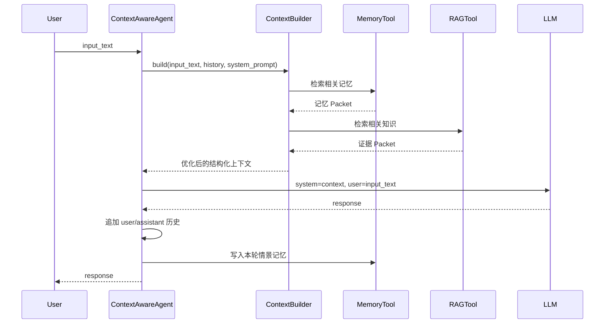

这条链路中，当前问题既出现在 `[Task]`，也作为 `user` 消息发送。前者给结构化上下文提供完整任务语义，后者保留标准 Chat Completions 消息边界，与原文的集成方式一致。

#### 实践运行结果

示例使用临时目录保存 Memory 与 RAG 数据，并用确定性 `DemoLLM` 避免调用真实 API。运行命令：

```bash
cd code/HelloAgents
python3 examples/context_builder_demo.py
```

构建出的主要内容如下：

```text
[Role & Policies]
你是一位资深 Python 数据工程顾问，请给出可执行建议。

[Task]
如何优化 Pandas 的内存占用？

[State]
当前状态：CSV 读取已完成，尚未处理内存优化。

[Evidence]
如何优化 Pandas 的内存占用？可以使用 category 类型、数值 downcast、
chunksize 分块读取，并及时删除不再使用的中间 DataFrame。
来源：text:pandas-memory-guide

[Context]
user: 我已经完成 CSV 读取模块。
assistant: 接下来可以处理数据类型和大文件读取。
记忆：用户正在使用 Python 和 Pandas 开发数据分析工具。

[Output]
请基于以上信息，提供准确、有据的回答。
```

随后 `ContextAwareAgent` 返回：

```text
可以先将低基数字符串列转换为 category，再通过 downcast 缩小数值列类型；
大文件使用 chunksize 分块读取。
```

结果说明四类候选信息没有直接混成一段文本：当前进度进入 `[State]`，RAG 内容和来源进入 `[Evidence]`，对话与用户记忆进入 `[Context]`。这正是 ContextBuilder 相比手写字符串拼接的价值。

#### 实现边界

- 默认相关性仍是轻量关键词重叠，适合教学和小规模任务；语义改写较大时可能漏选。
- `relevance_score=0.5` 同时是默认值和合法分数，当前实现沿用原文并把它视为“需要重新计算”；更严格的接口可以改用 `None` 表示未评分。
- 截断压缩不会生成摘要，不保证关键语义完整。
- Memory 和 RAG 的检索质量决定 Gather 的上限；ContextBuilder 只能筛选候选信息，不能补回从未召回的证据。
- 相关性权重、新近性权重与阈值没有通用最优值，需要结合任务成功率、Token 消耗和延迟做日志分析或 A/B 测试。

### NoteTool：结构化笔记

长任务不能把全部过程一直留在对话历史中。压缩历史虽然能腾出窗口，但摘要是有损的；NoteTool 选择把目标、进度、结论、阻塞和下一步写入独立文件，之后再按当前问题取回。

它与前一章的 Memory、RAG 不在同一职责层：

| 组件 | 主要保存内容 | 典型检索方式 | 在上下文中的作用 |
| --- | --- | --- | --- |
| Memory | 用户偏好、交互经历、稳定事实 | 相关性、重要性、时间 | 延续个体和会话状态 |
| RAG | 外部文档和知识片段 | 向量或关键词召回 | 为回答补充证据 |
| NoteTool | 当前项目的状态、决策、阻塞与行动项 | 类型、标签、标题和正文关键词 | 支撑跨轮次、跨会话接续任务 |

NoteTool 更像 Agent 的项目工作日志，而不是无限追加的聊天记录。笔记需要可更新、可删除，已解决的阻塞也应及时改写成结论，否则旧状态仍会污染后续上下文。

完整实现见：

- [NoteTool](./code/HelloAgents/hello_agents/tools/builtin/note_tool.py)
- [NoteTool 与 ContextBuilder 集成示例](./code/HelloAgents/examples/note_tool_demo.py)

实现需要额外安装 PyYAML：

```bash
pip install PyYAML
```

#### Markdown、YAML 与索引各自负责什么

每条笔记保存为独立的 Markdown 文件。YAML 前置元数据负责结构化字段，正文继续使用易读、易修改的 Markdown：

```markdown
---
id: note_20260904_173908_1
title: 业务逻辑层依赖冲突
type: blocker
tags:
  - dependency
  - urgent
created_at: '2026-09-04T17:39:08+08:00'
updated_at: '2026-09-04T17:39:08+08:00'
---

第三方库版本不兼容，影响业务逻辑层的三个模块。
```

工作目录中的 `notes_index.json` 只保存 ID、标题、类型、标签、时间和文件位置。`list`、类型过滤和摘要无需逐个解析 Markdown；只有 `read` 和正文搜索才打开文件。

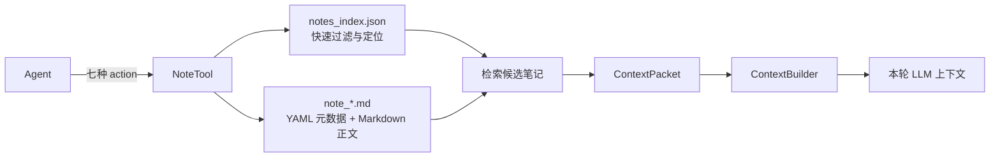

这种文件式设计的优点是可读、可用 Git 追踪、无需数据库；索引丢失时也能从有效的 Markdown 文件重建。实践实现还使用临时文件替换原文件，降低写入中断造成半份 YAML 或半份索引的风险。

#### 笔记类型是一种状态约定

| 类型 | 记录内容 | 何时读取 |
| --- | --- | --- |
| `task_state` | 当前阶段、已完成项、剩余工作 | 恢复任务时 |
| `conclusion` | 已验证结论与关键决策 | 做相似决策时 |
| `blocker` | 阻塞原因、影响范围、失败尝试 | 规划下一步前 |
| `action` | 明确待办及验收条件 | 执行阶段 |
| `reference` | 文件、文档和外部资源位置 | 需要证据时 |
| `general` | 暂不属于上述类别的信息 | 按关键词检索时 |

类型不是让内容“看起来结构化”，而是提供稳定的检索入口。例如项目助手可以始终优先加载 `blocker`，再用用户问题搜索其他相关笔记。阻塞解决后应更新或删除原笔记，并将验证结果保存为 `conclusion`。

#### 七个动作组成完整生命周期

NoteTool 保留原文定义的七个动作，没有增加另一套调用协议：

| action | 输入重点 | 返回内容 |
| --- | --- | --- |
| `create` | 标题、正文、类型、标签 | 新笔记 ID |
| `read` | `note_id` | 元数据和完整正文 |
| `update` | `note_id` 与待修改字段 | 更新结果 |
| `search` | 关键词，可选类型和标签 | 含正文的匹配结果 |
| `list` | 可选类型和标签 | 不含正文的元数据列表 |
| `summary` | 无 | 总数、类型分布、最近笔记 |
| `delete` | `note_id` | 删除结果 |

```python
from hello_agents import NoteTool

notes = NoteTool(workspace="./project_notes")

note_id = notes.run({
    "action": "create",
    "title": "业务逻辑层依赖冲突",
    "content": "第三方库版本不兼容，影响三个模块。",
    "note_type": "blocker",
    "tags": ["dependency", "urgent"],
})

results = notes.run({
    "action": "search",
    "query": "依赖冲突",
    "note_type": "blocker",
    "limit": 5,
})
```

搜索仍遵循原文的轻量方案：在标题、正文和标签上进行不区分大小写的子串匹配，然后按更新时间倒序排列。标签过滤采用“命中任一标签”的语义。它适合规模较小、词汇稳定的项目笔记，不等同于语义检索。

#### 从外部笔记到本轮上下文

文件存在并不代表模型已经看见它。集成时还要完成一次显式的数据转换：

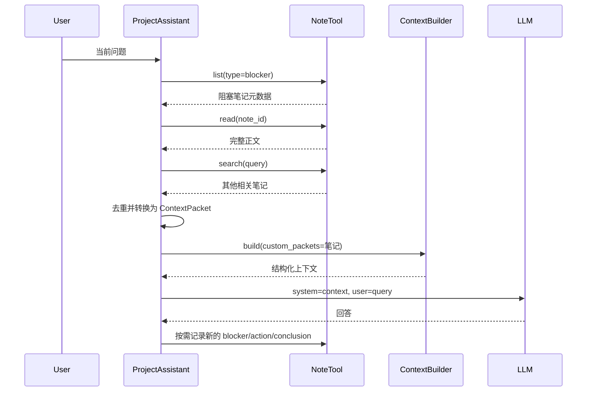

`list` 为了快速只返回元数据，所以不能直接假设其中存在 `content`。示例先用 `read` 补齐 blocker 正文，再和 `search` 的完整结果合并、按 ID 去重。随后把笔记类型映射为相关性权重，其中 `blocker > action > task_state > conclusion`，并用 `metadata["type"] = "note"` 交给 ContextBuilder，最终进入 `[Context]` 分区。

原文的说明性代码还有一个相似断点：Markdown 的 YAML 中没有 `file_path`，更新逻辑却尝试从 YAML 读取它。完整实现以 JSON 索引作为文件定位来源，读取时才把 `file_path` 补入返回元数据，写回 Markdown 前再移除它。这样 YAML 保存业务元数据，文件位置只由索引维护。

#### 实践运行结果

示例不调用真实模型，使用确定性的 `DemoLLM` 检查 blocker 是否已经进入 ContextBuilder 生成的上下文。运行方式：

```bash
cd code/HelloAgents
python3 examples/note_tool_demo.py
```

关键输出如下：

```text
已注册工具： ['note']
读取标题： 数据管道重构 - 第一阶段
✅ 笔记已更新：数据管道重构 - 第一阶段
搜索结果： ['业务逻辑层依赖冲突']
Blocker 列表： ['业务逻辑层依赖冲突']
✅ 笔记已删除：重构参考资料
重启后笔记数： 2
项目助手回答： 先用 pipdeptree 定位冲突链，再在独立分支统一约束版本并更新锁文件；完成后运行单元测试和集成测试，确认依赖调整没有引入回归。
交互后摘要： total_notes=3，task_state=1，blocker=2
```

这次运行依次覆盖了创建、读取、更新、搜索、列表、摘要和删除。重新构造 NoteTool 后仍能从索引读到两条笔记；项目助手回答后，又把本轮“问题”按示例规则记录成新的 blocker，因此总数恢复为三条。

#### 实现边界

- 关键词命中无法识别同义改写；笔记增多后可将“候选召回”替换成向量或全文索引，但七个动作和文件格式可以保持不变。
- JSON 索引是派生数据，不是正文真相。索引缺失时实现会从 Markdown 重建；索引损坏、手工改错 YAML 或多个进程同时写入仍需要额外的修复与并发控制。
- 自动按关键词判断 `blocker`、`action`、`conclusion` 只是演示规则，不是模型理解，也不适合作为生产环境的唯一分类依据。
- 写入笔记不等于完成工作。状态、结论和行动项应带来源或验收结果，并由人定期检查过期内容。
- 当前文件存储适合个人项目和教学实践；大量笔记、复杂权限或多实例服务应使用数据库和事务机制。

### TerminalTool：即时文件系统访问

RAG 适合反复查询相对稳定的大型知识库，但分析代码、日志或配置时，信息可能刚刚发生变化，也未必值得提前切分和建索引。TerminalTool 让 Agent 从目录和文件名开始探索，只在需要时读取局部内容，属于 JIT（Just-in-time）上下文。

| 对比项 | RAG | TerminalTool |
| --- | --- | --- |
| 准备方式 | 预先加载、切分、向量化 | 调用时直接探索文件系统 |
| 信息新鲜度 | 取决于索引更新时间 | 读取当前文件状态 |
| 检索方式 | 语义或关键词召回 | `find`、`grep`、`head` 等精确命令 |
| 适合内容 | 文档知识、长期资料 | 代码、日志、配置、数据预览 |
| 主要代价 | 建库和索引维护 | 多次工具调用与命令安全风险 |

TerminalTool 不取代 RAG。前者适合先定位再局部读取，后者适合从大量文本中召回语义相关片段；实际系统可以先用目录元数据缩小范围，再决定直接读取还是进入 RAG。

完整实现见：

- [TerminalTool](./code/HelloAgents/hello_agents/tools/builtin/terminal_tool.py)
- [即时探索与上下文集成示例](./code/HelloAgents/examples/terminal_tool_demo.py)

实现只使用 Python 标准库，不会执行写文件命令，也不提供任意 Shell。

#### 命令接口与目录状态

原文把能力收敛成一个 `command` 参数：

```python
from hello_agents import TerminalTool

terminal = TerminalTool(
    workspace="./project",
    timeout=30,
    max_output_size=10 * 1024 * 1024,
)

terminal.run({"command": "find . -name '*.py' -type f"})
terminal.run({"command": "grep -rn 'TODO' --include='*.py' ."})
terminal.run({"command": "head -n 50 src/service.py"})
```

`workspace` 是固定根目录，`current_dir` 是会随 `cd` 改变的当前目录。`cd ~` 回到工作区根目录，`cd ..` 只有在结果仍位于根目录内时才允许。目录状态保存在同一个工具实例中，因此连续调用可以逐层探索。

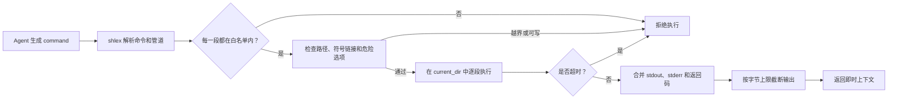

实现保留原文列出的命令，包括目录查看、内容预览、搜索和文本处理：`ls`、`cat`、`head`、`tail`、`find`、`grep`、`wc`、`sort`、`uniq`、`cut`、`awk`、`sed`、`pwd`、`cd` 等。初始化时传入 `allowed_commands` 只能继续缩小集合，不能借此加入 `rm`、`mv` 或解释器。

#### 四层安全约束

| 层次 | 实现方式 | 防止的问题 |
| --- | --- | --- |
| 命令白名单 | 检查管道中的每一段命令 | 直接执行 `rm`、`curl`、`python` 等任意程序 |
| 工作目录限制 | 路径解析后必须位于 `workspace`，同时检查符号链接 | 绝对路径、`..` 和链接逃逸 |
| 超时控制 | 整条管道共享截止时间 | 长时间扫描或不结束的文本处理 |
| 输出限制 | 按 UTF-8 字节数截断并添加标记 | 大文件结果挤满后续上下文 |

原文的 `_execute_command()` 使用 `shell=True`。如果只检查整条字符串的第一个单词，`ls; rm ...`、`cat file | 非白名单命令` 或命令替换仍可能绕过白名单。因此实践实现用 `shlex` 识别控制符，只允许 `|`；管道每一段分别验证，再通过 `subprocess.run([...], shell=False)` 执行。

允许命令也不代表所有选项都安全。例如 `find -exec` 可以启动其他程序，`sed -i`、`sort -o` 和 `tree -o` 可以写文件，`awk system()` 可以再次调用 Shell，`grep -R` 和跟随符号链接的选项可能越过目录边界。这些入口在执行前会被单独拒绝。

原文示例本身有两处安全规则不一致：代码分析使用了 `find -exec`，协同示例使用了白名单中没有的 `git log`。实践实现以本节“只读、不可派生执行”的安全目标为准，前者直接拒绝，后者也不会默认放行。确实需要 Git 信息时，宜增加只暴露 `status/log/diff` 的专用工具，而不是把整个 `git` 命令加入通用白名单。

管道不是交给 Shell 的字符串，而是按顺序执行：上一段的标准输出作为下一段的标准输入。这样仍能完成原文中的日志统计：

```bash
grep ERROR logs/app.log | cut -d: -f3 | sort | uniq -c
```

但不支持 `;`、`&&`、`||`、重定向、后台任务、变量展开和命令替换。写入文件不属于本节的即时只读检索能力。

#### 从即时结果到可用上下文

终端输出可能很长，也可能只在当前轮有价值。调用者应先用 `find`、`grep` 定位，再用 `head`、`sed` 读取小范围内容，不应一开始就 `cat` 整个代码库。

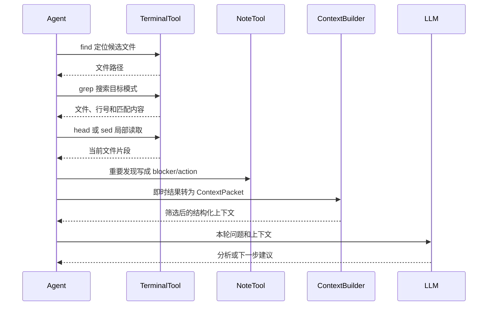

三类信息需要分开处理：

| 信息 | 去向 | 原因 |
| --- | --- | --- |
| 一次性的目录列表、搜索结果 | `ContextPacket` | 只服务当前判断，无需长期保存 |
| 已确认的项目事实、稳定结构 | MemoryTool | 后续交互可能再次使用 |
| 阻塞、决策、计划和验收结果 | NoteTool | 需要跨会话维护并允许人工修改 |

示例把 TODO 搜索结果包装为 `metadata={"type": "code_structure", "source": "terminal"}` 的 ContextPacket，由 ContextBuilder 放入 `[Context]`。同一条 TODO 还被保存为 blocker 笔记；这不是要求所有终端输出都保存，而是因为它已经成为需要跟踪的项目问题。

#### 实践运行结果

示例使用临时目录构造小型 Python 项目和日志，不访问真实项目，也不调用模型 API：

```bash
cd code/HelloAgents
python3 examples/terminal_tool_demo.py
```

关键输出如下：

```text
已注册工具： ['terminal', 'note']
Python 文件：
./src/processor.py
./tests/test_processor.py

TODO 搜索：
./src/processor.py:3:        # TODO: invalidate cache after updating rows

错误类型统计：
   2 DatabaseConnectionError
   1 TimeoutException

已记录笔记： processor.py 缓存失效待办
维护建议： processor.py 中仍有缓存失效 TODO；先补充缓存更新测试，再实现失效逻辑，并把验证结果更新到 blocker 笔记。
越界访问： ❌ 不允许访问工作目录外的路径：/etc/passwd
非白名单： ❌ 不允许的命令：rm
控制符注入： ❌ 不支持的控制符：;
大文件是否截断： True
```

运行结果说明即时信息经历了“定位文件—搜索 TODO—局部预览—统计日志—记录笔记—注入上下文”的完整链路；安全检查结果也由工具返回，不会让 Agent 循环因异常中断。

#### 实现边界

- 白名单和路径校验是应用层防护，不是操作系统级沙箱。处理不可信输入时仍应放进低权限容器，关闭网络并限制 CPU、内存、进程数和挂载目录。
- 路径检查与命令读取之间仍可能发生符号链接竞态；高安全场景应使用隔离文件系统或基于文件描述符的访问机制。
- 输出上限控制的是送回 Agent 的内容，子进程完成前仍可能产生较大的临时内存开销；生产实现应改为流式读取并在达到上限时终止进程。
- `current_dir` 属于有状态数据。同一个 TerminalTool 不宜被互不相关的并发任务共享，实践实现用锁保证单实例调用不会交错。
- 本实现面向类 Unix 命令环境；不同系统的命令、参数和输出格式可能不同，不能假设同一条命令跨平台完全一致。
- TerminalTool 返回的是文件当前状态，不自动判断内容真假或重要性；进入 ContextBuilder 前仍需筛选、标注来源并控制长度。

### 长程智能体实战：代码库维护助手

9.3～9.5 分别解决“怎样组织上下文”“怎样保存长期状态”和“怎样即时读取代码库”，9.6 将三者放进同一个循环，并加入 MemoryTool 保存交互经历。目标不是让 LLM 一次读完整个仓库，而是让它在多轮、多会话中持续知道：当前代码是什么状态、已经发现什么、接下来做什么。

完整代码见：

- [CodebaseMaintainer](./code/HelloAgents/hello_agents/applications/codebase_maintainer.py)
- [跨会话离线实践](./code/HelloAgents/examples/codebase_maintainer_demo.py)

#### 分层不是堆叠四份相同信息

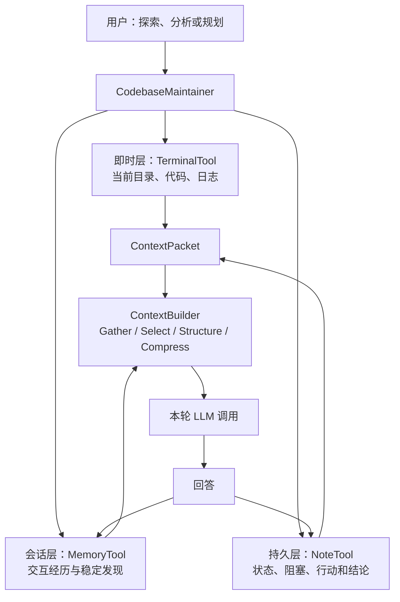

| 层次 | 生命周期 | 保存内容 | 不应保存 |
| --- | --- | --- | --- |
| TerminalTool | 单次读取 | 当前文件、目录、日志和搜索结果 | 已过时的副本 |
| 对话历史 | 当前实例 | 最近 10 轮 user/assistant 消息 | 全部工具原始输出 |
| MemoryTool | 跨实例 | 每轮交互经历、可复用事实 | 需要人工维护的正式计划 |
| NoteTool | 跨实例 | `task_state`、`blocker`、`action`、`conclusion` | 无筛选的临时搜索结果 |
| ContextBuilder | 单次调用 | 从以上来源选出的高价值信息 | 数据源的永久副本 |

同一事实不应在每层重复一遍。TerminalTool 的输出先作为候选上下文；只有已确认且以后仍有价值的发现才进入 Memory，只有需要跟踪和人工修改的状态才进入 NoteTool。

#### 四种模式控制预处理

| mode | 调用前收集的信息 | 主要用途 |
| --- | --- | --- |
| `explore` | 前 20 个 Python 文件路径 | 了解模块和入口 |
| `analyze` | Python 文件行数、TODO/FIXME、用户点名的文件片段 | 发现具体代码问题 |
| `plan` | 最近 3 条 `task_state` 标题，并优先加载 blocker 正文 | 安排后续任务 |
| `auto` | 用关键词规则路由到前三种模式 | 减少调用者手动选择 |

`auto` 不是模型自主判断。实现明确使用规则：出现“计划、下一步、任务”进入 `plan`，出现“分析、问题、错误、TODO/FIXME、复杂度”进入 `analyze`，其余进入 `explore`。规则可解释、可测试，但也可能误判，调用方始终可以显式指定模式。

分析模式没有沿用原文的：

```bash
find . -name '*.py' -exec wc -l {} +
```

因为 `find -exec` 与 9.5 的“不可派生执行”原则冲突。完整实现先用安全的 `find` 取得文件列表，再把经过引用处理的路径交给 `wc -l`；最多统计 50 个文件并限制命令长度。这样仍保留原文的行数统计目的，不为 TerminalTool 打开任意执行入口。

#### 一轮请求的六步消息流

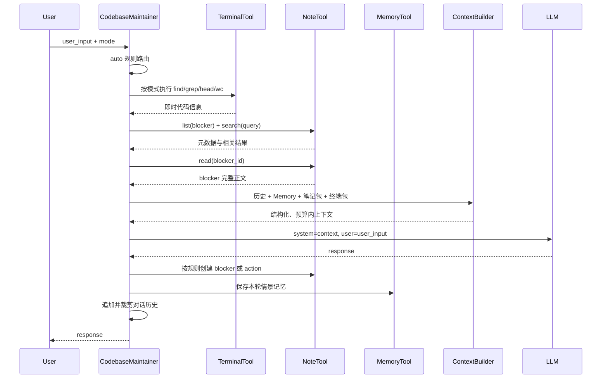

核心调用保持原文六个阶段：

```python
pre_context = self._preprocess_by_mode(query, effective_mode)
notes = self._retrieve_relevant_notes(query)
note_packets = self._notes_to_packets(notes)

context = self.context_builder.build(
    user_query=query,
    conversation_history=self.conversation_history,
    system_instructions=self._build_system_instructions(effective_mode),
    custom_packets=[*note_packets, *pre_context],
)

response = self.llm.invoke([
    {"role": "system", "content": context},
    {"role": "user", "content": query},
])

self._postprocess_response(query, response, effective_mode)
self._update_history(query, response)
self._record_interaction(query, response)
```

当前框架的 `HelloAgentsLLM.invoke()` 接收消息列表，不能直接传入原文展示的 `context` 字符串。当前问题虽然已经位于 ContextBuilder 的 `[Task]`，仍作为独立 `user` 消息发送，以保留标准聊天协议的角色边界。

#### 笔记检索与自动记录

每轮都先取最多 2 条 blocker，再按用户问题搜索其他笔记。`list` 只有元数据，所以 blocker 必须继续调用 `read` 补齐正文，之后才能转换成 ContextPacket。相关性保持原文顺序：

```text
blocker 0.90 > action 0.80 > task_state 0.75 > conclusion 0.70
```

回答后使用原文的轻量规则记录状态：回答中出现“问题、bug、错误、阻塞”时创建 blocker；规划模式或输入中出现“计划、下一步、任务、todo”时创建 action。它只是自动归档规则，不是问题真的被验证。实践实现只有在 NoteTool 返回有效 ID 后才增加统计值，写入失败则保留主回答并输出警告。

原文的结果分析称关键信息会自动进入 Memory，但展示代码没有实际写入。完整实现把每轮 user/assistant 对保存为 episodic memory，使重新实例化后的 ContextBuilder 能检索上一会话经历；当前实例的对话历史仍只保留最近 20 条消息。

#### 哪些状态能跨会话

| 状态 | 是否持久化 | 新实例中的表现 |
| --- | --- | --- |
| Markdown 笔记与 JSON 索引 | 是 | 可继续读取 blocker、action 和 task_state |
| SQLite 记忆 | 是 | 可检索上一会话的交互经历 |
| 对话历史列表 | 否 | 新实例从空历史开始 |
| TerminalTool 当前目录 | 否 | 重新回到代码库根目录 |
| 会话统计和 session ID | 否 | 每个实例重新计数 |

默认状态目录为 `./<project_name>_maintainer/`，也可通过 `state_path` 显式指定。笔记、记忆和报告都放在该目录下，与被分析的代码库分开。`generate_report()` 将会话 ID、持续时间、命令次数、自动笔记数、问题数和笔记摘要原子写入 JSON。

#### 实践运行结果

示例在临时目录构造一个 Flask 风格小项目，通过确定性 DemoLLM 检查每种模式所需信息是否真的进入上下文，不调用外部模型：

```bash
cd code/HelloAgents
python3 examples/codebase_maintainer_demo.py
```

第一次会话的主要输出：

```text
👤 用户：请探索 . 的代码结构
🔍 探索代码库结构...
探索结论：当前代码库按 models、services 和 tests 分层；建议先查看用户模型和订单服务，再核对相应测试。

👤 用户：请分析代码质量，重点关注 TODO 和 FIXME
📊 分析代码质量...
📝 已自动创建问题笔记
分析结论：发现代码问题：user.py 尚未落实邮箱唯一约束，order_service.py 仍有订单校验 FIXME。应先补失败测试，再分别修改模型约束和服务校验。

👤 用户：根据当前进度，规划下一步任务
📋 加载任务规划...
📝 已自动创建行动计划笔记
规划结论：下一步任务：第一，补充邮箱重复和非法订单测试；第二，修改模型与服务；第三，运行测试并把通过结果记录为 conclusion。

命令执行数：4
本会话创建笔记数：3
发现问题数：1
持久笔记总数：3
```

关闭助手并使用相同 `state_path` 创建新实例后：

```text
👤 用户：请回顾上一会话发现的代码问题
🧭 规则路由：auto → analyze
恢复结论：已恢复上一会话状态：当前 blocker 是邮箱唯一约束和订单校验，已有行动计划要求先补测试再修改实现。
恢复后笔记总数：3
恢复后情景记忆数：4
```

第二个实例没有继承 Python 对象中的历史列表，却仍能同时看到持久笔记和前三轮情景记忆；回答完成后又记录了当前轮，所以情景记忆数变为 4。这才是本例“跨会话”的实际含义，不是让单个上下文窗口永久增长。

#### 原文说明代码中补齐的部分

- `from typing import Dict， Any` 使用了中文逗号，无法通过 Python 语法解析。
- 原文直接 `llm.invoke(context)` 与当前框架接口不一致，已改成标准消息列表。
- blocker 来自 `list` 时不含正文，已通过 `read` 补齐再注入上下文。
- `find -exec` 与 TerminalTool 的安全边界冲突，已改为分两步统计。
- 原文的 `auto` 实际总是探索代码库；完整实现将其明确为可解释的规则路由。
- MemoryTool 原本只参与检索却没有写入，本实现保存每轮情景记忆，形成跨会话闭环。
- 报告写入使用临时文件替换，避免中途中断留下不完整 JSON。

#### 实现边界

- 示例只能根据文件列表、行数、TODO/FIXME 和明确点名的 Python 文件做初步分析，没有计算圈复杂度、测试覆盖率，也没有运行测试。
- DemoLLM 用于验证消息链路，不代表真实模型的代码分析质量；接入真实模型后仍需检查其结论是否有文件和行号依据。
- 自动模式和笔记分类都是关键词规则，不能替代意图分类、问题确认或人工审核。
- TerminalTool 仍是只读工具，助手会提出修改计划但不会直接编辑代码；若以后加入写工具，应增加差异预览、审批、测试和回滚。
- blocker 每轮优先加载有助于避免遗忘，也可能让已解决问题反复进入上下文；解决后必须更新为 conclusion 或删除。
- 自动记录没有做语义去重，多次讨论同一问题可能产生重复笔记。生产实现需要稳定任务 ID、状态迁移和幂等写入。
- “跨会话”依赖复用相同的 `project_name` 与 `state_path`；迁移或删除状态目录后，助手无法自行恢复旧状态。

### 如何判断上下文是否有效

上下文工程不能只统计用了多少 Token，还需要观察它是否真正改善任务结果：

| 观察指标 | 要回答的问题 |
| --- | --- |
| 任务成功率 | 模型是否完成了目标和验收条件 |
| 关键信息召回 | 必要约束、证据和状态是否进入窗口 |
| 噪声比例 | 有多少内容没有参与当前决策 |
| 冲突率 | 是否同时出现互相矛盾的历史或规则 |
| 工具选择正确率 | 模型是否选择正确工具并生成有效参数 |
| 上下文 Token | 输入成本是否在预算内 |
| 延迟与调用次数 | JIT 检索或压缩是否带来不可接受的开销 |
| 压缩保真度 | 重启窗口后能否继续完成任务 |

评价应围绕具体失败模式进行。例如模型忽略约束时，要判断约束是否缺失、位置不合理还是与其他内容冲突；不能看到长上下文就直接归因于窗口长度。

### 参考资料

- [《Hello-Agents》第九章：上下文工程](https://github.com/datawhalechina/hello-agents/blob/main/docs/chapter9/%E7%AC%AC%E4%B9%9D%E7%AB%A0%20%E4%B8%8A%E4%B8%8B%E6%96%87%E5%B7%A5%E7%A8%8B.md)
- [Anthropic：Effective context engineering for AI agents](https://www.anthropic.com/engineering/effective-context-engineering-for-ai-agents)
- [Liu et al.：Lost in the Middle: How Language Models Use Long Contexts](https://direct.mit.edu/tacl/article/doi/10.1162/tacl_a_00638/119630/Lost-in-the-Middle-How-Language-Models-Use-Long)
- [Vaswani et al.：Attention Is All You Need](https://papers.neurips.cc/paper/7181-attention-is-all-you-need.pdf)

### 小结

- 上下文是模型在一次推理中实际可见的 Token，不包括尚未取出的外部资料。
- 提示工程负责写好指令，上下文工程还要管理工具、历史、记忆、检索结果、环境反馈和任务状态。
- 上下文窗口的容量不等于模型有效利用信息的能力；更多 Token 可能补足证据，也可能引入噪声、冲突和位置偏差。
- 系统提示、工具和示例都应追求最小必要信息，而不是无限增加规则、能力和样本。
- 预加载适合小而稳定的资料，JIT 检索适合动态或大规模信息，复杂任务通常使用混合策略。
- 长时程任务可以通过压缩整合、结构化笔记和子代理延续，但三者都需要处理信息损失和状态一致性。
- ContextBuilder 将信息获取、选择、结构化和压缩统一为 GSSC 流水线，并通过固定分区守住上下文形态。
- NoteTool 用 Markdown 正文、YAML 元数据和 JSON 索引保存长期任务状态，并通过七个动作维护笔记生命周期。
- 笔记只有经过检索、补齐正文并转换为 ContextPacket，才会成为当前模型调用可见的上下文。
- TerminalTool 通过白名单命令即时探索文件系统；只有经过路径、选项、超时和输出检查的结果才能返回给 Agent。
- TerminalTool 适合短期即时信息，稳定事实进入 Memory，项目状态进入 NoteTool，三者最后由 ContextBuilder 按当前任务筛选。
- CodebaseMaintainer 把模式预处理、笔记检索、上下文构建、模型调用和状态回写连成六步循环，并用持久笔记与情景记忆支持跨会话恢复。
- 长程不等于无限保留历史：Terminal 结果按需读取，对话历史有长度上限，只有需要复用或跟踪的信息才进入 Memory 和 NoteTool。
- 相关性与新近性评分只是筛选规则，不会把低质量检索结果自动变成可靠证据；实际效果仍取决于上游信息源和参数评估。
- 上下文工程的目标不是填满窗口，而是在每次调用前为当前决策提供高信号、可追溯且不冲突的信息。
