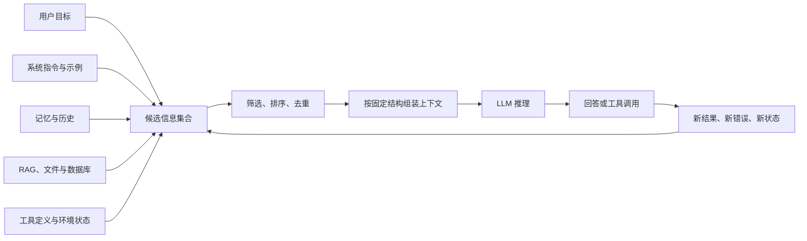
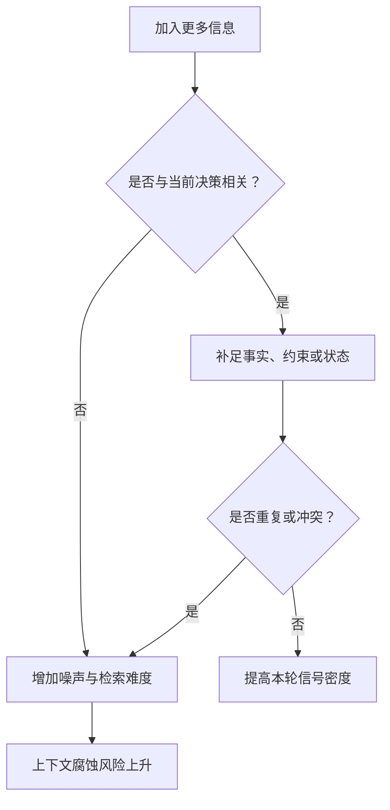
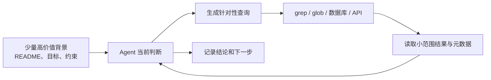

## 上下文工程

> 阅读资料：[《Hello-Agents》第九章 9.1：什么是上下文工程](https://datawhalechina.github.io/hello-agents/#/./chapter9/%E7%AC%AC%E4%B9%9D%E7%AB%A0%20%E4%B8%8A%E4%B8%8B%E6%96%87%E5%B7%A5%E7%A8%8B?id=_91-%e4%bb%80%e4%b9%88%e6%98%af%e4%b8%8a%e4%b8%8b%e6%96%87%e5%b7%a5%e7%a8%8b)
>
> 阅读资料：[《Hello-Agents》第九章 9.2：为什么上下文工程重要](https://datawhalechina.github.io/hello-agents/#/./chapter9/%E7%AC%AC%E4%B9%9D%E7%AB%A0%20%E4%B8%8A%E4%B8%8B%E6%96%87%E5%B7%A5%E7%A8%8B?id=_92-%e4%b8%ba%e4%bb%80%e4%b9%88%e4%b8%8a%e4%b8%8b%e6%96%87%e5%b7%a5%e7%a8%8b%e9%87%8d%e8%a6%81)
>
> 本次阅读范围为 9.1、9.2，重点理解上下文工程的边界、有限注意力预算、JIT 检索和长时程任务策略。

### 什么是上下文工程

#### 上下文是模型在一次调用中实际看到的信息

上下文（Context）是某次模型推理时送入上下文窗口的 Token 集合。它不只包括用户刚输入的问题，还可能包含系统指令、少样本示例、对话历史、工具定义、检索结果、工具执行结果、记忆和当前任务状态。

| 上下文来源 | 典型内容 | 主要作用 |
| --- | --- | --- |
| 系统指令 | 角色、规则、安全边界 | 约束整体行为 |
| 当前任务 | 用户问题、目标、验收标准 | 告诉模型现在要做什么 |
| 少样本示例 | 典型输入输出 | 展示期望行为和格式 |
| 工具定义 | 名称、用途、参数 Schema | 告诉模型能做什么 |
| 历史与状态 | 最近消息、计划、待办、阶段结果 | 保持过程连续 |
| 外部知识 | RAG 片段、文件内容、数据库记录 | 提供模型参数之外的事实 |
| 环境反馈 | 工具输出、错误、测试结果 | 支持下一步判断与纠错 |
| 输出要求 | 格式、长度、引用方式 | 约束最终交付物 |

模型权重不是上下文；数据库、文件和记忆中尚未取出的内容也不是上下文。只有被选中并送入本次调用的信息，才会影响这一轮推理。

因此，上下文工程可以理解为：在模型和上下文窗口的约束下，持续选择、组织、更新本轮最有用的信息，使模型更稳定地产生期望行为。

#### 上下文是随 Agent 循环变化的运行时状态



单轮生成时，上下文可以提前写好；Agent 会循环调用模型，每一轮又会产生新的观察、文件、错误和中间结论。如果把所有历史原样累积，候选信息会持续增长。上下文工程因此不是一次性的 Prompt 编写，而是贯穿每轮推理的状态管理过程。

我对它的理解是：**上下文窗口不是资料仓库，而是模型当前的工作台。** 仓库可以很大，但工作台上只应摆放当前任务需要的材料。

#### 提示工程是上下文工程的一部分

| 对比项 | 提示工程 | 上下文工程 |
| --- | --- | --- |
| 核心问题 | 指令应该怎么写 | 本轮应该让模型看到什么 |
| 主要对象 | 系统提示、用户提示、示例 | 提示、工具、历史、记忆、检索结果和环境反馈 |
| 时间范围 | 常见于单次或少量调用 | 随多轮 Agent Loop 持续变化 |
| 典型动作 | 改写指令、补充示例、规定格式 | 获取、筛选、排序、隔离、压缩和更新信息 |
| 失败表现 | 指令歧义、格式不稳定 | 关键信息缺失、噪声过多、历史冲突、工具结果污染 |

二者不是替代关系。清晰的 Prompt 仍然重要，只是无法单独解决长任务中的历史膨胀、动态检索、工具反馈和状态同步问题。RAG、Memory、工具系统也不是上下文工程的竞争方案，它们是候选信息的来源；上下文工程决定何时取、取多少以及怎样放入当前窗口。

### 为什么上下文工程重要

#### 能放进去，不等于能有效使用

模型的上下文窗口有明确容量限制，还需要为回答预留空间：

```text
可用输入预算 = 上下文窗口上限 - 预留输出 Token

系统指令 + 当前任务 + 工具定义 + 历史 + 检索结果
<= 可用输入预算
```

达到预算上限只是最直接的问题。更隐蔽的问题是：即使所有文本都能放进窗口，模型也未必能同等准确地定位和利用每条信息。

“Lost in the Middle”实验显示，相关信息在长上下文中的位置会影响模型表现，位于开头或结尾时通常更容易被利用，处于中间时可能下降。这说明上下文长度是接口给出的硬容量，而有效上下文还受到任务、模型、信息位置、结构和干扰项影响。

标准自注意力需要建立序列位置之间的关系，其计算量随序列长度呈二次增长。不过，计算成本增加与答案质量下降不是同一个结论。后者还涉及训练分布、位置编码、信息冲突和检索难度，不能简单解释成“注意力被平均分掉”。不同模型和任务的退化曲线也并不相同。

#### 上下文腐蚀来自低信号信息的累积

上下文腐蚀（Context Rot）指随着上下文增长，模型定位、回忆或正确使用关键信息的能力下降。常见诱因包括：

- 大量与当前任务无关的历史消息；
- 多次工具调用产生的重复输出；
- 旧计划与新计划同时存在；
- 检索片段相似但互相矛盾；
- 错误日志、调试信息和中间草稿长期滞留；
- 关键约束被埋在长文本中间；
- 工具数量过多、描述相近，增加选择歧义。

问题并不是 Token 数量本身，而是新增 Token 是否带来足够的任务价值。高质量上下文追求的是高信号密度：信息足够完成任务，但没有无关重复项。



所以“扩大窗口”与“管理上下文”解决的是不同层面的问题。更大的窗口提高容量上限，上下文工程提高容量利用率。

#### Agent 比单轮问答更依赖上下文管理

Agent 每一轮都会读取旧状态并产生新状态：模型给出工具调用，环境返回结果，结果又进入下一轮上下文。若没有管理机制，错误和冗余会沿循环不断放大。

| Agent 阶段 | 需要保留 | 应避免长期保留 |
| --- | --- | --- |
| 理解任务 | 用户目标、硬约束、验收标准 | 与目标无关的寒暄 |
| 制定计划 | 当前计划、依赖、完成状态 | 已废弃但未标记的旧计划 |
| 调用工具 | 参数、必要前置状态 | 全部工具手册和无关 Schema |
| 处理结果 | 关键观察、错误原因、产物位置 | 大段重复日志和完整原始响应 |
| 最终交付 | 结论、证据、未解决问题 | 已完成步骤的逐轮推理记录 |

上下文选择会直接影响行为：缺少验收标准，Agent 可能过早结束；缺少错误结果，Agent 会重复失败操作；保留过多陈旧计划，又可能继续执行已经取消的方向。

### 有效上下文的组成

#### 系统提示要提供最小必要信息

系统提示常见两个极端：

- **过度硬编码**：塞入大量脆弱的条件分支，规则互相覆盖，难以维护。
- **过于空泛**：只写“你是一个有帮助的助手”，没有任务边界、工具规则和输出标准。

“最小必要信息”不等于字数最少，而是每条内容都有明确作用。可以用 Markdown 或 XML 分区，把背景、规则、工具指引和输出要求分开；先从简洁版本开始，再根据实际失败补充规则，不应提前穷举所有可能情况。

#### 工具描述也是上下文

模型通常根据工具名称、说明和参数 Schema 决定是否调用。工具越多不一定越强，职责重叠会让“选哪个工具”本身变成模糊问题。

有效工具集应满足：

- 单个工具职责清楚，名称和参数没有歧义；
- 相近能力尽量合并或明确边界；
- 错误返回可理解，并告诉 Agent 下一步怎样修正；
- 默认输出紧凑，详细内容可以按需继续获取；
- 只暴露当前任务可能用到的最小可行工具集。

工具执行后的返回值同样会进入上下文。设计工具时不仅要考虑函数能否正确运行，还要考虑输出是否适合模型阅读。

#### 少样本示例重在典型和多样

Few-shot 示例直接展示期望行为，比抽象描述更容易约束格式和决策方式。但把所有边界条件都写成示例会迅速耗尽预算，也可能让模型机械模仿不相关细节。

更合适的做法是选少量典型样本，覆盖不同但常见的行为：正常路径、关键边界和拒绝条件。示例的价值需要通过实际任务成功率验证，而不是按数量衡量。

### 上下文检索与智能体式搜索

#### 从一次性加载转向按需获取

预检索会在推理前准备一批可能相关的材料；JIT（Just-in-time）上下文只先提供文件路径、URL、表名或查询入口，由 Agent 在运行中逐步读取需要的内容。

| 策略 | 优点 | 局限 | 适合场景 |
| --- | --- | --- | --- |
| 一次性预加载 | 延迟低，首次调用即可使用 | 容易放入过量或过时信息 | 范围小、内容稳定的任务 |
| Embedding 预检索 | 能从大知识库筛选相关片段 | 依赖索引、切分和查询表达 | 文档问答、相似内容召回 |
| JIT 工具检索 | 信息新鲜，可逐层探索 | 调用更多、延迟更高，可能走错方向 | 代码库、文件系统、动态数据 |
| 混合策略 | 兼顾启动速度和探索能力 | 需要设计预加载与按需获取的边界 | 大多数复杂 Agent 任务 |



路径、目录层级、名称、文件大小和时间戳也是上下文。它们可以先帮助 Agent 判断信息用途，再决定是否读取正文。这种从元数据到局部内容、再到相关细节的过程就是渐进式披露。

JIT 不是预检索的全面替代。任务固定且资料很少时，直接加载更简单；动态数据或大型代码库更适合工具检索。常用的混合方式是预先提供项目约定和关键索引，同时允许 Agent 用 `glob`、`grep`、数据库查询等原语继续探索。

### 长时程任务中的上下文管理

大型代码迁移、长时间研究或跨会话项目会超出单个上下文窗口。原文给出三种主要策略：

| 策略 | 核心做法 | 适合任务 | 主要风险 |
| --- | --- | --- | --- |
| 压缩整合 | 用高保真摘要接续新窗口 | 需要连续对话和状态接力 | 摘要遗漏、错误被固化 |
| 结构化笔记 | 把目标、决策、待办和阻塞写到窗口外 | 有里程碑的开发和研究 | 笔记过时、记录与真实状态不一致 |
| 子代理 | 在独立上下文中并行探索，只回传结果 | 可拆分的复杂研究与分析 | 重复工作、摘要丢失证据、整合冲突 |

#### 压缩整合

压缩不是简单截掉最早消息，而是保留后续仍会影响决策的内容，例如目标、架构决策、已修改文件、测试状态、未解决问题和下一步；重复工具输出、闲聊和已经失效的中间草稿可以移除。

压缩是有损操作。安全顺序应先保证关键内容不丢，再逐步删除冗余；摘要还需要能追溯原始产物，不能把模型生成的总结当成唯一事实来源。

#### 结构化笔记

结构化笔记把重要状态放到上下文窗口之外，后续按需读取。常见内容包括：

- 当前目标与验收标准；
- 已完成、进行中和待办事项；
- 关键决策及原因；
- 文件、数据集和运行产物的位置；
- 阻塞问题与失败尝试；
- 最近更新时间。

笔记的关键不是“写下来”，而是把它作为任务状态持续维护。只追加不更新会让新旧结论冲突，反而制造新的上下文污染。

#### 子代理架构

主代理保留目标、拆分和最终综合，各子代理使用相对干净的窗口完成局部研究。回传内容应包含结论、证据位置、假设和未解决问题，而不是只有一段无法核验的摘要。

子代理带来的主要价值是关注点隔离和并行探索，不是凭空增加正确性。任务边界不清或结果无法合并时，多代理只会放大通信成本。

### 如何判断上下文是否有效

上下文工程不能只统计用了多少 Token，还需要观察它是否真正改善任务结果：

| 观察指标 | 要回答的问题 |
| --- | --- |
| 任务成功率 | 模型是否完成了目标和验收条件 |
| 关键信息召回 | 必要约束、证据和状态是否进入窗口 |
| 噪声比例 | 有多少内容没有参与当前决策 |
| 冲突率 | 是否同时出现互相矛盾的历史或规则 |
| 工具选择正确率 | 模型是否选择正确工具并生成有效参数 |
| 上下文 Token | 输入成本是否在预算内 |
| 延迟与调用次数 | JIT 检索或压缩是否带来不可接受的开销 |
| 压缩保真度 | 重启窗口后能否继续完成任务 |

评价应围绕具体失败模式进行。例如模型忽略约束时，要判断约束是否缺失、位置不合理还是与其他内容冲突；不能看到长上下文就直接归因于窗口长度。

### 参考资料

- [《Hello-Agents》第九章：上下文工程](https://github.com/datawhalechina/hello-agents/blob/main/docs/chapter9/%E7%AC%AC%E4%B9%9D%E7%AB%A0%20%E4%B8%8A%E4%B8%8B%E6%96%87%E5%B7%A5%E7%A8%8B.md)
- [Anthropic：Effective context engineering for AI agents](https://www.anthropic.com/engineering/effective-context-engineering-for-ai-agents)
- [Liu et al.：Lost in the Middle: How Language Models Use Long Contexts](https://direct.mit.edu/tacl/article/doi/10.1162/tacl_a_00638/119630/Lost-in-the-Middle-How-Language-Models-Use-Long)
- [Vaswani et al.：Attention Is All You Need](https://papers.neurips.cc/paper/7181-attention-is-all-you-need.pdf)

### 小结

- 上下文是模型在一次推理中实际可见的 Token，不包括尚未取出的外部资料。
- 提示工程负责写好指令，上下文工程还要管理工具、历史、记忆、检索结果、环境反馈和任务状态。
- 上下文窗口的容量不等于模型有效利用信息的能力；更多 Token 可能补足证据，也可能引入噪声、冲突和位置偏差。
- 系统提示、工具和示例都应追求最小必要信息，而不是无限增加规则、能力和样本。
- 预加载适合小而稳定的资料，JIT 检索适合动态或大规模信息，复杂任务通常使用混合策略。
- 长时程任务可以通过压缩整合、结构化笔记和子代理延续，但三者都需要处理信息损失和状态一致性。
- 上下文工程的目标不是填满窗口，而是在每次调用前为当前决策提供高信号、可追溯且不冲突的信息。
