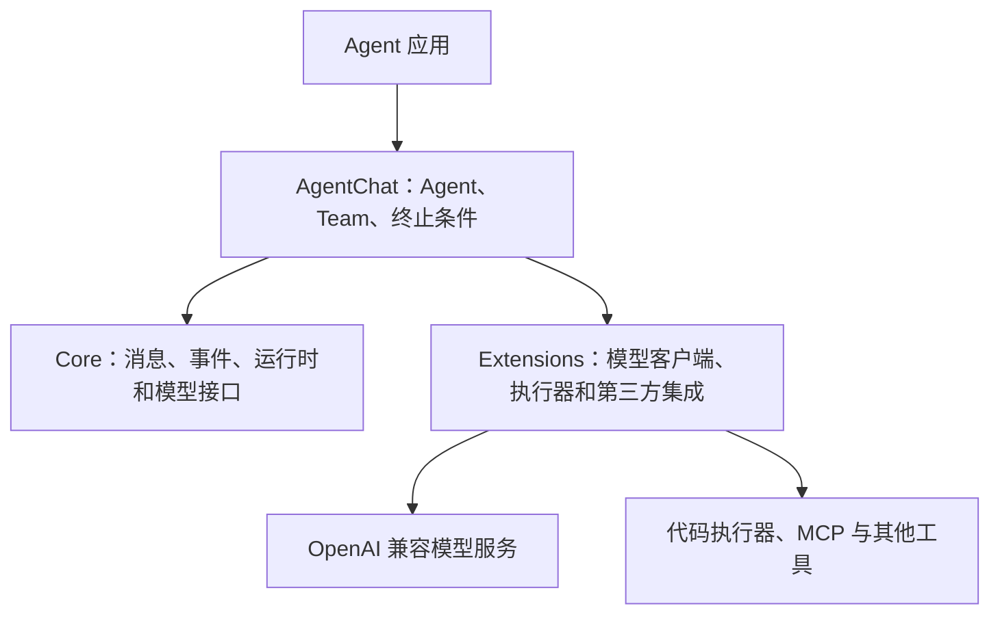
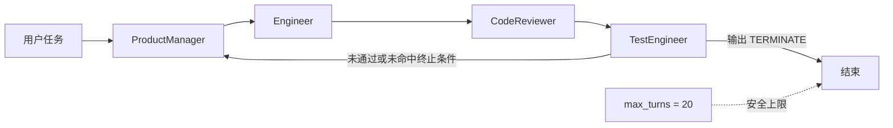
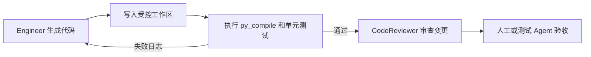

## 框架开发实践

> 阅读资料：[《Hello-Agents》第六章 6.1：从手动实现到框架开发](https://datawhalechina.github.io/hello-agents/#/./chapter6/%E7%AC%AC%E5%85%AD%E7%AB%A0%20%E6%A1%86%E6%9E%B6%E5%BC%80%E5%8F%91%E5%AE%9E%E8%B7%B5?id=_61-%e4%bb%8e%e6%89%8b%e5%8a%a8%e5%ae%9e%e7%8e%b0%e5%88%b0%e6%a1%86%e6%9e%b6%e5%bc%80%e5%8f%91)
>
> 阅读资料：[《Hello-Agents》第六章 6.2：AutoGen](https://datawhalechina.github.io/hello-agents/#/./chapter6/%E7%AC%AC%E5%85%AD%E7%AB%A0%20%E6%A1%86%E6%9E%B6%E5%BC%80%E5%8F%91%E5%AE%9E%E8%B7%B5?id=_62-%e6%a1%86%e6%9e%b6%e4%b8%80%ef%bc%9aautogen)
>
> 实践：使用 AutoGen 组织产品经理、工程师、代码审查员和测试工程师，协作设计比特币价格展示应用。

### 从手动实现到框架开发

第四章手写 ReAct、Plan-and-Solve 和 Reflection，重点是理解 Agent Loop；进入真实项目后，还要处理消息传递、模型切换、工具注册、状态保存、终止控制和运行日志。框架把这些公共能力封装起来，让代码集中在角色、任务和业务规则上。

#### 框架主要封装什么

| 能力 | 手动实现 | 框架开发 |
| --- | --- | --- |
| 执行循环 | 自己维护推理、行动和终止判断 | 使用 Agent 或 Team 的统一运行接口 |
| 模型接入 | 在业务代码中直接调用 SDK | 通过模型客户端抽象切换服务 |
| 工具调用 | 自定义名称解析、参数校验和执行器 | 统一工具声明、注册和调用协议 |
| 记忆与状态 | 手动拼接历史消息 | 使用会话状态、记忆组件或持久化接口 |
| 多智能体协作 | 自己编写角色切换逻辑 | 使用轮询、选择器、群聊或图结构编排 |
| 可观测性 | 依赖零散的 `print` | 统一消息流、事件、日志和调用统计 |

框架的价值不是让 Agent 自动变得正确，而是把重复的控制逻辑变成稳定接口。提示词、业务边界、工具权限和验收标准仍然由开发者负责。

#### 四种框架的侧重点

| 框架 | 核心思路 | 适合场景 |
| --- | --- | --- |
| AutoGen | 通过多角色对话推进任务 | 软件开发团队、研究讨论等协作任务 |
| AgentScope | 强调工程化、消息传递与分布式运行 | 大规模、多实例的 Agent 应用 |
| CAMEL | 通过角色扮演和启发式提示驱动双 Agent 协作 | 研究者与程序员等深度对话场景 |
| LangGraph | 把执行过程建模为节点、边和状态 | 分支明确、需要循环和审计的工作流 |

选择框架时要先判断任务依赖哪种控制方式：开放式讨论适合对话协作，强流程和高审计要求更适合显式图结构。不能只比较“能接多少模型”。

### AutoGen：用对话组织协作

AutoGen 将多个具有不同系统提示词的 Agent 放入同一个 Team，通过消息传递推进任务。原文以 `0.7.4` 为例，其架构已经从早期的类继承方式转向分层、组合和异步优先的设计。

#### 分层架构



| 模块 | 职责 |
| --- | --- |
| `autogen-core` | 提供事件驱动运行时、消息协议和底层接口 |
| `autogen-agentchat` | 提供 `AssistantAgent`、Team 和高层对话 API |
| `autogen-ext` | 提供 OpenAI 兼容模型客户端、代码执行器等扩展 |

模型调用主要是网络 I/O，因此新版接口以 `async/await` 为主。应用通过 `run()` 或 `run_stream()` 驱动 Agent，不需要为每次模型请求手动管理线程。

#### 本次用到的组件

| 组件 | 作用 |
| --- | --- |
| `AssistantAgent` | 用模型和系统提示词定义一个角色 |
| `RoundRobinGroupChat` | 按参与者列表顺序轮流发言 |
| `TextMentionTermination` | 在指定来源的消息出现目标文本时结束 |
| `Console` | 流式显示团队消息和 Token 统计 |
| `OpenAIChatCompletionClient` | 调用 OpenAI 兼容模型服务 |

原文使用 `UserProxyAgent` 代表用户并承担执行工作。本次实践没有采用它，而是创建了一个同样由模型驱动的 `TestEngineer`。这样可以自动分析代码，但它只能阅读对话中的文本，没有真正保存或执行生成的程序。

### 环境与模型客户端

AutoGen AgentChat 要求 Python 3.10+。本次代码需要以下依赖：

```bash
pip install -U "autogen-agentchat" "autogen-ext[openai]" python-dotenv
```

环境变量沿用现有的 [`.env.example`](./code/.env.example)：

```text
LLM_API_KEY=""
LLM_MODEL_ID=""
LLM_BASE_URL=""
```

自定义模型名称不在 AutoGen 的内置模型表中，因此客户端通过 `model_info` 显式声明能力：

```python
return OpenAIChatCompletionClient(
    model=model,
    api_key=api_key,
    base_url=base_url,
    model_info={
        "vision": False,
        "function_calling": False,
        "json_output": False,
        "family": "unknown",
        "structured_output": False,
    },
)
```

运行时只打印掩码后的 API Key，避免密钥进入日志。完整实践代码见 [`autogen.py`](./code/autogen.py)。

代码注释说明 `base_url` 来自 `LLM_BASE_URL`，但实际实现将地址写在源码中，环境变量没有被使用。这不影响本次运行，却降低了可移植性。后续应统一为：

```python
base_url = os.getenv("LLM_BASE_URL", "").strip()
```

本次按实践原样保留代码，没有直接修改这一处。

### 实践：比特币价格应用开发团队

#### 任务和角色

目标是生成一个 Streamlit 应用，展示 BTC/USD 当前价格、24 小时涨跌额和涨跌幅，并支持手动刷新、加载提示和网络异常处理。

| Agent | 预期职责 | 完成标记 |
| --- | --- | --- |
| `ProductManager` | 分析需求、拆分功能、给出验收标准 | “请工程师开始实现” |
| `Engineer` | 生成完整代码、依赖和启动命令 | “请代码审查员检查” |
| `CodeReviewer` | 检查正确性、健壮性和安全性 | “请测试工程师验证” |
| `TestEngineer` | 静态测试并决定是否结束 | `TERMINATE` 或要求修复 |

工程师选择 CoinGecko 的公开接口。接口返回当前价格和 24 小时涨跌幅，涨跌额通过以下公式间接计算：

$$
P_{24h}=\frac{P_{now}}{1+r/100}, \qquad \Delta P=P_{now}-P_{24h}
$$

其中 $P_{now}$ 是当前价格，$r$ 是 24 小时涨跌幅。这个结果可能与交易平台直接提供的涨跌额存在少量采样误差。

#### 固定轮询流程



团队编排的核心代码很短：

```python
termination_condition = TextMentionTermination(
    text="TERMINATE",
    sources=["TestEngineer"],
)

team_chat = RoundRobinGroupChat(
    participants=[
        product_manager,
        engineer,
        code_reviewer,
        test_engineer,
    ],
    termination_condition=termination_condition,
    max_turns=20,
)

result = await Console(
    team_chat.run_stream(task=task),
    output_stats=True,
)
```

`sources=["TestEngineer"]` 很重要。用户任务、Engineer 或 CodeReviewer 即使提到 `TERMINATE`，也不会提前结束；只有测试工程师给出该文本才算通过。`max_turns` 则防止团队一直循环。

#### 实际协作过程

控制台不是一次顺利生成，而是经历了三轮：

| 轮次 | 主要结果 | 暴露的问题 |
| --- | --- | --- |
| 第一轮 | 产品经理完成规划，工程师生成 Streamlit 应用 | 审查发现负数金额显示为 `$-1,234.56`，刷新失败时旧数据提示不清楚 |
| 第二轮 | ProductManager 根据意见给出修订代码 | 修订代码把 `if value is None:` 写坏，产生阻塞启动的语法错误 |
| 第三轮 | ProductManager 再次修复，后续角色复核 | Engineer 和 CodeReviewer 都曾输出 `TERMINATE`，但来源不匹配，因此继续到 TestEngineer 后才结束 |

第一轮生成的应用已经覆盖了主要需求：

- 使用 Streamlit 的 `st.metric` 展示价格数据。
- 使用 `st.spinner` 表示加载状态。
- 请求配置连接和读取超时。
- 处理 HTTP 429、网络失败、非法 JSON 和字段缺失。
- 使用 `st.session_state` 保存最近一次成功数据。
- 不需要业务 API Key，行情来自 CoinGecko 公共接口。

代码审查和测试没有只给出“通过/失败”，而是发现了具体的格式和状态问题。负数金额应从 `$-1,234.56` 修正为 `-$1,234.56`；刷新失败但存在旧数据时，也应明确提示当前展示的不是最新结果。

第二轮出现的语法错误更能说明多 Agent 审查的价值：模型根据反馈重写代码时可能修好一个问题，又引入新的问题。后续三个角色都识别出缺少冒号以及代码块末尾可能存在多余反引号，最终才继续验收。

#### 运行统计

| 指标 | 结果 |
| --- | ---: |
| 消息数 | 13 |
| 输入 Token | 114,227 |
| 输出 Token | 16,125 |
| 总 Token | 130,352 |
| 执行时间 | 401.93 秒 |
| 停止原因 | `TestEngineer` 的消息命中 `TERMINATE` |

四个 Agent 使用同一个不断增长的会话历史。轮次越多，每个角色重新读取的上下文越长，因此输入 Token 远高于最终产出的代码量。这是对话式多智能体最直接的成本。

### 从实践中看到的边界

#### “测试通过”不等于真实执行通过

本次没有为 Agent 配置文件写入工具或代码执行器。团队讨论的 `app.py` 和 `requirements.txt` 只存在于消息中，测试工程师也只进行了静态阅读。

最终日志将 `python -m py_compile app.py` 描述为“预期通过”，并没有展示命令的真实退出码；Streamlit 页面和 CoinGecko 请求同样没有实际运行。因此这次结果只能说明团队完成了文本层面的设计、审查与修订，不能证明应用已经可以部署。

可靠的开发闭环至少还需要：



代码执行应放在隔离环境中，并限制网络、文件路径、运行时间和依赖安装权限。不能因为参与者名为 `TestEngineer`，就默认它真的执行了测试。

#### 固定轮询只保证顺序，不保证职责

`RoundRobinGroupChat` 严格按照参与者列表轮转，但不会判断“当前问题应该交给谁”。本次第二轮由 ProductManager 直接生成修订代码，随后 Engineer 反而承担了语法复核，出现明显的角色越界。

如果流程要求“测试失败必须回到 Engineer”，可以采用以下方式：

| 问题 | 改进方式 |
| --- | --- |
| 固定轮询导致角色越界 | 使用选择式 Team，或用显式状态机控制下一位发言者 |
| 所有角色反复读取完整历史 | 只传递需求、最新代码、审查意见等结构化交接数据 |
| 代码只存在于 Markdown 消息 | 将文件作为受版本控制的共享产物，并传递路径或提交标识 |
| 测试结果来自模型推断 | 接入受限代码执行器，将退出码和测试日志作为证据 |
| 对话轮次和 Token 持续增长 | 设置消息、Token、超时上限，并对旧上下文做摘要 |
| 文本终止条件可能被误提及 | 限定消息来源，或改用结构化状态与明确的验收字段 |

#### 框架减少样板代码，但不会替代流程设计

AutoGen 已经处理了异步调用、消息流、轮询和终止检查，但团队能否稳定工作仍取决于角色边界和交接协议。多 Agent 不应该只是让多个模型轮流写长文，而应该让不同角色操作可验证的共享产物，并用真实工具结果决定下一步。

本次实践中最有效的设计是限定终止消息来源；最需要改进的地方则是缺少代码执行能力和条件路由。框架解决了“如何让角色持续对话”，下一步要解决的是“如何让对话受到工程证据约束”。

### 参考资料

- [Hello-Agents 第六章：框架开发实践](https://datawhalechina.github.io/hello-agents/#/./chapter6/%E7%AC%AC%E5%85%AD%E7%AB%A0%20%E6%A1%86%E6%9E%B6%E5%BC%80%E5%8F%91%E5%AE%9E%E8%B7%B5)
- [Hello-Agents 第六章 GitHub 源文件](https://github.com/datawhalechina/hello-agents/blob/main/docs/chapter6/Chapter6-Framework-Development-Practice.md)
- [AutoGen 官方文档](https://microsoft.github.io/autogen/stable/index.html)
- [AutoGen AgentChat Quickstart](https://microsoft.github.io/autogen/stable/user-guide/agentchat-user-guide/quickstart.html)
- [AutoGen Termination Conditions](https://microsoft.github.io/autogen/stable/user-guide/agentchat-user-guide/tutorial/termination.html)
- [AutoGen 0.2 到 0.4 迁移说明](https://microsoft.github.io/autogen/stable/user-guide/agentchat-user-guide/migration-guide.html)
