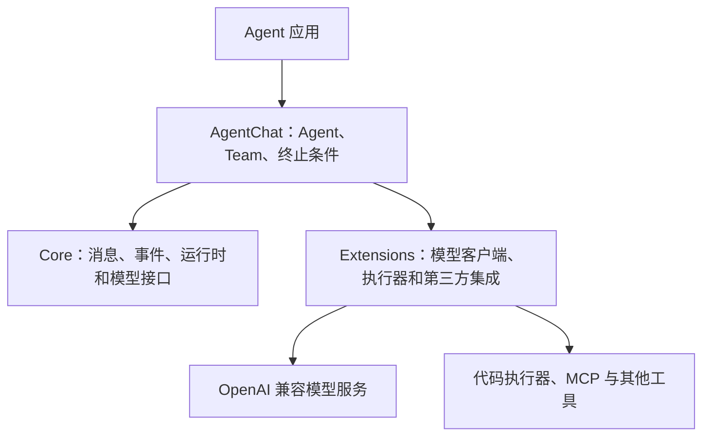
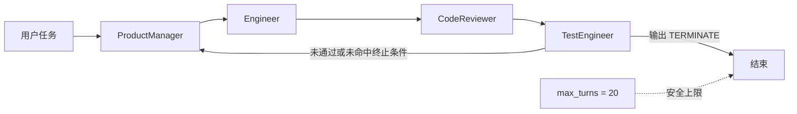
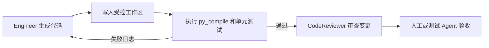
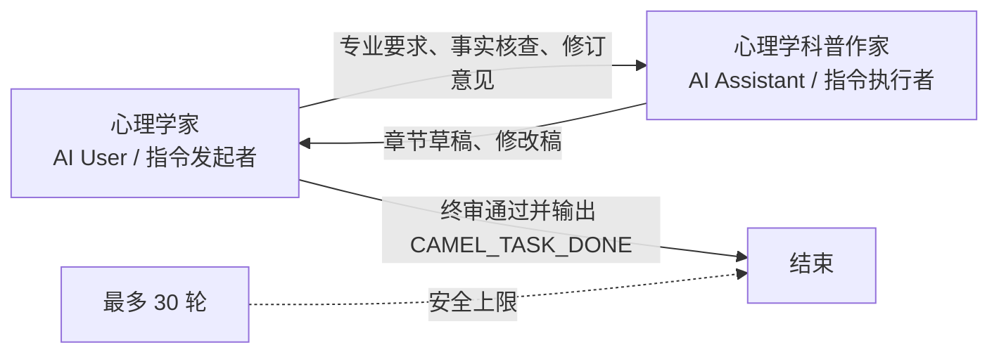
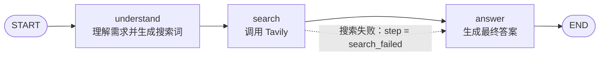
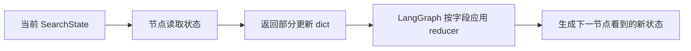

## 框架开发实践

> 阅读资料：[《Hello-Agents》第六章 6.1：从手动实现到框架开发](https://datawhalechina.github.io/hello-agents/#/./chapter6/%E7%AC%AC%E5%85%AD%E7%AB%A0%20%E6%A1%86%E6%9E%B6%E5%BC%80%E5%8F%91%E5%AE%9E%E8%B7%B5?id=_61-%e4%bb%8e%e6%89%8b%e5%8a%a8%e5%ae%9e%e7%8e%b0%e5%88%b0%e6%a1%86%e6%9e%b6%e5%bc%80%e5%8f%91)
>
> 阅读资料：[《Hello-Agents》第六章 6.2：AutoGen](https://datawhalechina.github.io/hello-agents/#/./chapter6/%E7%AC%AC%E5%85%AD%E7%AB%A0%20%E6%A1%86%E6%9E%B6%E5%BC%80%E5%8F%91%E5%AE%9E%E8%B7%B5?id=_62-%e6%a1%86%e6%9e%b6%e4%b8%80%ef%bc%9aautogen)
>
> 阅读资料：[《Hello-Agents》第六章 6.4：CAMEL](https://datawhalechina.github.io/hello-agents/#/./chapter6/%E7%AC%AC%E5%85%AD%E7%AB%A0%20%E6%A1%86%E6%9E%B6%E5%BC%80%E5%8F%91%E5%AE%9E%E8%B7%B5?id=_64-%e6%a1%86%e6%9e%b6%e4%b8%89%ef%bc%9acamel)
>
> 阅读资料：[《Hello-Agents》第六章 6.5：LangGraph](https://datawhalechina.github.io/hello-agents/#/./chapter6/%E7%AC%AC%E5%85%AD%E7%AB%A0%20%E6%A1%86%E6%9E%B6%E5%BC%80%E5%8F%91%E5%AE%9E%E8%B7%B5?id=_65-%e6%a1%86%e6%9e%b6%e5%9b%9b%ef%bc%9alanggraph)
>
> 实践：使用 AutoGen 组织产品经理、工程师、代码审查员和测试工程师，协作设计比特币价格展示应用。
>
> 实践：使用 CAMEL 组织心理学家与心理学科普作家，协作编写《拖延症心理学》。
>
> 实践：使用 LangGraph 构建“理解 → 搜索 → 回答”的三步问答助手。

### 从手动实现到框架开发

第四章手写 ReAct、Plan-and-Solve 和 Reflection，重点是理解 Agent Loop；进入真实项目后，还要处理消息传递、模型切换、工具注册、状态保存、终止控制和运行日志。框架把这些公共能力封装起来，让代码集中在角色、任务和业务规则上。

#### 框架主要封装什么

| 能力 | 手动实现 | 框架开发 |
| --- | --- | --- |
| 执行循环 | 自己维护推理、行动和终止判断 | 使用 Agent 或 Team 的统一运行接口 |
| 模型接入 | 在业务代码中直接调用 SDK | 通过模型客户端抽象切换服务 |
| 工具调用 | 自定义名称解析、参数校验和执行器 | 统一工具声明、注册和调用协议 |
| 记忆与状态 | 手动拼接历史消息 | 使用会话状态、记忆组件或持久化接口 |
| 多智能体协作 | 自己编写角色切换逻辑 | 使用轮询、选择器、群聊或图结构编排 |
| 可观测性 | 依赖零散的 `print` | 统一消息流、事件、日志和调用统计 |

框架的价值不是让 Agent 自动变得正确，而是把重复的控制逻辑变成稳定接口。提示词、业务边界、工具权限和验收标准仍然由开发者负责。

#### 四种框架的侧重点

| 框架 | 核心思路 | 适合场景 |
| --- | --- | --- |
| AutoGen | 通过多角色对话推进任务 | 软件开发团队、研究讨论等协作任务 |
| AgentScope | 强调工程化、消息传递与分布式运行 | 大规模、多实例的 Agent 应用 |
| CAMEL | 通过角色扮演和启发式提示驱动双 Agent 协作 | 研究者与程序员等深度对话场景 |
| LangGraph | 把执行过程建模为节点、边和状态 | 分支明确、需要循环和审计的工作流 |

选择框架时要先判断任务依赖哪种控制方式：开放式讨论适合对话协作，强流程和高审计要求更适合显式图结构。不能只比较“能接多少模型”。

### AutoGen：用对话组织协作

AutoGen 将多个具有不同系统提示词的 Agent 放入同一个 Team，通过消息传递推进任务。原文以 `0.7.4` 为例，其架构已经从早期的类继承方式转向分层、组合和异步优先的设计。

#### 分层架构



| 模块 | 职责 |
| --- | --- |
| `autogen-core` | 提供事件驱动运行时、消息协议和底层接口 |
| `autogen-agentchat` | 提供 `AssistantAgent`、Team 和高层对话 API |
| `autogen-ext` | 提供 OpenAI 兼容模型客户端、代码执行器等扩展 |

模型调用主要是网络 I/O，因此新版接口以 `async/await` 为主。应用通过 `run()` 或 `run_stream()` 驱动 Agent，不需要为每次模型请求手动管理线程。

#### 本次用到的组件

| 组件 | 作用 |
| --- | --- |
| `AssistantAgent` | 用模型和系统提示词定义一个角色 |
| `RoundRobinGroupChat` | 按参与者列表顺序轮流发言 |
| `TextMentionTermination` | 在指定来源的消息出现目标文本时结束 |
| `Console` | 流式显示团队消息和 Token 统计 |
| `OpenAIChatCompletionClient` | 调用 OpenAI 兼容模型服务 |

原文使用 `UserProxyAgent` 代表用户并承担执行工作。本次实践没有采用它，而是创建了一个同样由模型驱动的 `TestEngineer`。这样可以自动分析代码，但它只能阅读对话中的文本，没有真正保存或执行生成的程序。

### 环境与模型客户端

AutoGen AgentChat 要求 Python 3.10+。本次代码需要以下依赖：

```bash
pip install -U "autogen-agentchat" "autogen-ext[openai]" python-dotenv
```

环境变量沿用现有的 [`.env.example`](./code/.env.example)：

```text
LLM_API_KEY=""
LLM_MODEL_ID=""
LLM_BASE_URL=""
```

自定义模型名称不在 AutoGen 的内置模型表中，因此客户端通过 `model_info` 显式声明能力：

```python
return OpenAIChatCompletionClient(
    model=model,
    api_key=api_key,
    base_url=base_url,
    model_info={
        "vision": False,
        "function_calling": False,
        "json_output": False,
        "family": "unknown",
        "structured_output": False,
    },
)
```

运行时只打印掩码后的 API Key，避免密钥进入日志。完整实践代码见 [`autogen.py`](./code/autogen.py)。

代码注释说明 `base_url` 来自 `LLM_BASE_URL`，但实际实现将地址写在源码中，环境变量没有被使用。这不影响本次运行，却降低了可移植性。后续应统一为：

```python
base_url = os.getenv("LLM_BASE_URL", "").strip()
```

本次按实践原样保留代码，没有直接修改这一处。

### 实践：比特币价格应用开发团队

#### 任务和角色

目标是生成一个 Streamlit 应用，展示 BTC/USD 当前价格、24 小时涨跌额和涨跌幅，并支持手动刷新、加载提示和网络异常处理。

| Agent | 预期职责 | 完成标记 |
| --- | --- | --- |
| `ProductManager` | 分析需求、拆分功能、给出验收标准 | “请工程师开始实现” |
| `Engineer` | 生成完整代码、依赖和启动命令 | “请代码审查员检查” |
| `CodeReviewer` | 检查正确性、健壮性和安全性 | “请测试工程师验证” |
| `TestEngineer` | 静态测试并决定是否结束 | `TERMINATE` 或要求修复 |

工程师选择 CoinGecko 的公开接口。接口返回当前价格和 24 小时涨跌幅，涨跌额通过以下公式间接计算：

$$
P_{24h}=\frac{P_{now}}{1+r/100}, \qquad \Delta P=P_{now}-P_{24h}
$$

其中 `P_now` 是当前价格，`r` 是 24 小时涨跌幅。这个结果可能与交易平台直接提供的涨跌额存在少量采样误差。

#### 固定轮询流程



团队编排的核心代码很短：

```python
termination_condition = TextMentionTermination(
    text="TERMINATE",
    sources=["TestEngineer"],
)

team_chat = RoundRobinGroupChat(
    participants=[
        product_manager,
        engineer,
        code_reviewer,
        test_engineer,
    ],
    termination_condition=termination_condition,
    max_turns=20,
)

result = await Console(
    team_chat.run_stream(task=task),
    output_stats=True,
)
```

`sources=["TestEngineer"]` 很重要。用户任务、Engineer 或 CodeReviewer 即使提到 `TERMINATE`，也不会提前结束；只有测试工程师给出该文本才算通过。`max_turns` 则防止团队一直循环。

#### 实际协作过程

控制台不是一次顺利生成，而是经历了三轮：

| 轮次 | 主要结果 | 暴露的问题 |
| --- | --- | --- |
| 第一轮 | 产品经理完成规划，工程师生成 Streamlit 应用 | 审查发现负数金额显示为 `$-1,234.56`，刷新失败时旧数据提示不清楚 |
| 第二轮 | ProductManager 根据意见给出修订代码 | 修订代码把 `if value is None:` 写坏，产生阻塞启动的语法错误 |
| 第三轮 | ProductManager 再次修复，后续角色复核 | Engineer 和 CodeReviewer 都曾输出 `TERMINATE`，但来源不匹配，因此继续到 TestEngineer 后才结束 |

第一轮生成的应用已经覆盖了主要需求：

- 使用 Streamlit 的 `st.metric` 展示价格数据。
- 使用 `st.spinner` 表示加载状态。
- 请求配置连接和读取超时。
- 处理 HTTP 429、网络失败、非法 JSON 和字段缺失。
- 使用 `st.session_state` 保存最近一次成功数据。
- 不需要业务 API Key，行情来自 CoinGecko 公共接口。

代码审查和测试没有只给出“通过/失败”，而是发现了具体的格式和状态问题。负数金额应从 `$-1,234.56` 修正为 `-$1,234.56`；刷新失败但存在旧数据时，也应明确提示当前展示的不是最新结果。

第二轮出现的语法错误更能说明多 Agent 审查的价值：模型根据反馈重写代码时可能修好一个问题，又引入新的问题。后续三个角色都识别出缺少冒号以及代码块末尾可能存在多余反引号，最终才继续验收。

#### 运行统计

| 指标 | 结果 |
| --- | ---: |
| 消息数 | 13 |
| 输入 Token | 114,227 |
| 输出 Token | 16,125 |
| 总 Token | 130,352 |
| 执行时间 | 401.93 秒 |
| 停止原因 | `TestEngineer` 的消息命中 `TERMINATE` |

四个 Agent 使用同一个不断增长的会话历史。轮次越多，每个角色重新读取的上下文越长，因此输入 Token 远高于最终产出的代码量。这是对话式多智能体最直接的成本。

### 从实践中看到的边界

#### “测试通过”不等于真实执行通过

本次没有为 Agent 配置文件写入工具或代码执行器。团队讨论的 `app.py` 和 `requirements.txt` 只存在于消息中，测试工程师也只进行了静态阅读。

最终日志将 `python -m py_compile app.py` 描述为“预期通过”，并没有展示命令的真实退出码；Streamlit 页面和 CoinGecko 请求同样没有实际运行。因此这次结果只能说明团队完成了文本层面的设计、审查与修订，不能证明应用已经可以部署。

可靠的开发闭环至少还需要：



代码执行应放在隔离环境中，并限制网络、文件路径、运行时间和依赖安装权限。不能因为参与者名为 `TestEngineer`，就默认它真的执行了测试。

#### 固定轮询只保证顺序，不保证职责

`RoundRobinGroupChat` 严格按照参与者列表轮转，但不会判断“当前问题应该交给谁”。本次第二轮由 ProductManager 直接生成修订代码，随后 Engineer 反而承担了语法复核，出现明显的角色越界。

如果流程要求“测试失败必须回到 Engineer”，可以采用以下方式：

| 问题 | 改进方式 |
| --- | --- |
| 固定轮询导致角色越界 | 使用选择式 Team，或用显式状态机控制下一位发言者 |
| 所有角色反复读取完整历史 | 只传递需求、最新代码、审查意见等结构化交接数据 |
| 代码只存在于 Markdown 消息 | 将文件作为受版本控制的共享产物，并传递路径或提交标识 |
| 测试结果来自模型推断 | 接入受限代码执行器，将退出码和测试日志作为证据 |
| 对话轮次和 Token 持续增长 | 设置消息、Token、超时上限，并对旧上下文做摘要 |
| 文本终止条件可能被误提及 | 限定消息来源，或改用结构化状态与明确的验收字段 |

#### 框架减少样板代码，但不会替代流程设计

AutoGen 已经处理了异步调用、消息流、轮询和终止检查，但团队能否稳定工作仍取决于角色边界和交接协议。多 Agent 不应该只是让多个模型轮流写长文，而应该让不同角色操作可验证的共享产物，并用真实工具结果决定下一步。

本次实践中最有效的设计是限定终止消息来源；最需要改进的地方则是缺少代码执行能力和条件路由。框架解决了“如何让角色持续对话”，下一步要解决的是“如何让对话受到工程证据约束”。

### CAMEL：用角色扮演推动双 Agent 协作

CAMEL 的 `RolePlaying` 为两个 Agent 建立固定的协作协议：AI User 负责生成指令、推动任务，AI Assistant 负责执行指令、返回结果。`user` 和 `assistant` 在这里首先是协议位置，不等同于现实产品中的真人用户和聊天助手。

#### 协议角色不等于业务角色

| 协议位置 | 框架职责 | 本次业务角色 |
| --- | --- | --- |
| AI User | 提出下一步指令、审阅结果、推动任务 | 心理学家 |
| AI Assistant | 执行指令、提交本轮产物 | 心理学科普作家 |

心理学家掌握学科知识，适合规划内容、提出专业要求、核查事实并负责终审；科普作家擅长组织语言和叙事，适合撰写及修改正文。这种映射同时符合 CAMEL 的对话协议和职业直觉：



教材案例采用了相反的映射：

```python
user_role_name = "作家"
assistant_role_name = "心理学家"
```

这能运行，因为 AI User 本来就负责发指令；但运行结果会变成“作家要求心理学家写正文”。框架机制只能解释程序为何这样运行，不能证明职业分工合理。若坚持这种顺序，至少应把“作家”改名为“心理学内容主编”；本次则直接调整为：

```python
user_role_name = "心理学家"
assistant_role_name = "心理学科普作家"
```

这里需要区分两件事：理解 CAMEL 的 `user/assistant` 协议，不等于接受命名与职责错位的案例设计。

#### 改造后的 AI 科普电子书案例

实践目标仍是合作编写约 8000～10000 字的《拖延症心理学》，面向普通读者解释拖延机制、常见类型和影响因素，并提供可执行的改善建议。提示词额外写清了两类约束：

- 心理学家负责框架、专业审查和最终验收，不承担正文写作。
- 科普作家负责成稿，不虚构研究，也不把写作任务反向交回心理学家。

完整代码见 [`camel_ebook.py`](./code/camel_ebook.py)。本次沿用教材的 CAMEL 版本，模型后端改为 DeepSeek：

```bash
pip install "camel-ai==0.2.75" python-dotenv
```

环境变量复用 [`.env.example`](./code/.env.example) 中的配置：

```text
LLM_API_KEY=""
LLM_MODEL_ID="deepseek-v4-flash"
LLM_BASE_URL="https://api.deepseek.com"
```

代码将 `deepseek-v4-flash` 和 DeepSeek 官方 API 地址设为默认值，因此必须配置的只有 `LLM_API_KEY`。仍然保留模型和地址环境变量，方便切换到 `deepseek-v4-pro` 或代理地址。

运行方式：

```bash
cd code
python camel_ebook.py
```

模型和会话的关键配置如下：

```python
model = ModelFactory.create(
    model_platform=ModelPlatformType.DEEPSEEK,
    model_type=model_id,
    url=base_url,
    api_key=api_key,
    model_config_dict={
        "temperature": 0.3,
        "max_tokens": 8192,
    },
)

session = RolePlaying(
    user_role_name="心理学家",
    assistant_role_name="心理学科普作家",
    task_prompt=TASK_PROMPT,
    model=model,
    with_task_specify=False,
)
```

`with_task_specify=False` 表示不再让额外的任务细化 Agent 改写需求。角色职责、内容结构和完成条件已经写进 `TASK_PROMPT`，关闭它可以减少一次模型调用，也避免细化阶段重新解释角色分工。

#### 对话循环和终止条件

`init_chat()` 生成启动消息；此后每轮调用 `step(input_msg)`。方法返回 `assistant_response` 和 `user_response`，下一轮再把本轮 Assistant 的消息作为输入：

```python
input_msg = session.init_chat()

for turn in range(1, chat_turn_limit + 1):
    assistant_response, user_response = session.step(input_msg)
    ...
    input_msg = assistant_response.msg
```

返回值顺序容易造成误解：虽然元组里 `assistant_response` 在前，但一轮对话的业务顺序仍是心理学家先提出要求，科普作家再执行。控制台因此按“心理学家 → 科普作家”的顺序显示消息。

本次设置了三层结束保护：

1. 任一 Agent 被 CAMEL 标记为 `terminated` 时停止，并显示框架给出的原因。
2. 只有心理学家将 `<CAMEL_TASK_DONE>` 作为独立一行输出，才算终审通过。
3. 最多执行 30 轮，避免模型无法达成一致时持续消耗 Token。

完成标记只检查 AI User 的响应。科普作家即使在提示词复述或正文中提到该文本，也无权提前结束任务。这与 AutoGen 实践中限定 `TERMINATE` 来源是同一个思路：完成条件不仅要有文本，还要有明确的签发者。

#### 实际运行结果

运行 `python camel_ebook.py` 后，两个 Agent 共协作 9 轮，完成了大纲、引言、五个章节和总结。模型在终稿中自述全文约 9500 字；控制台没有输出 Token 或耗时统计，因此这里只记录对话过程，不推算调用成本。

| 轮次 | 心理学家的主要指令 | 科普作家的产出 |
| --- | --- | --- |
| 1 | 规划结构并指定可用理论 | 引言、五章和总结的大纲 |
| 2 | 要求以生活场景开篇，区分拖延与懒惰 | 引言草稿 |
| 3 | 简化神经学术语、核查普遍率数据 | 修订引言并撰写第一章 |
| 4 | 补充研究出处、统一术语和章节衔接 | 修订前文并撰写第二章 |
| 5 | 指定完美主义、自我效能、人格与动机四部分 | 第三章草稿 |
| 6 | 要求补充冲动性的研究依据 | 修订第三章并撰写第四章 |
| 7 | 细化文化差异和数字干扰的证据 | 修订第四章并撰写第五章 |
| 8 | 解释 ACT“去融合”，完成全书收束 | 修订第五章并撰写总结 |
| 9 | 独立输出 `<CAMEL_TASK_DONE>` | 确认全书完成，程序结束 |

下面连续保留第 1～3 轮的关键输出，可以看到“大纲 → 引言 → 审阅并修订”的推进过程；过长的章节正文用方括号标出省略：

```text
======================== 第 1 轮 ========================

心理学家（AI User / 指令发起者）：
Instruction: 请撰写全书大纲草案，包含引言、至少5个核心章节和总结，
各章标题需体现拖延症心理学核心主题，并注明拟使用的关键心理学理论或研究。

心理学科普作家（AI Assistant / 指令执行者）：
Solution: 以下是我根据您的要求起草的《拖延症心理学》全书大纲草案。

引言：为什么我们总是等到最后一刻？
第一章：拖延的定义与迷思——撕下懒惰的标签
第二章：情绪调节——拖延背后的心理机制
第三章：谁更容易拖延？——个体差异与人格因素
第四章：环境的影响——社会与情境因素如何助长拖延
第五章：从知道到做到——基于实证的改善策略
总结：与自己和解，逐步改变

======================== 第 2 轮 ========================

心理学家（AI User / 指令发起者）：
Instruction: 请按照大纲撰写引言部分，字数约800-1000字，语言生动易懂，
以日常场景开篇，引用Steel（2007）关于拖延普遍率的数据，
并清晰区分拖延与懒惰，避免道德评判。

心理学科普作家（AI Assistant / 指令执行者）：
Solution: 以下是为《拖延症心理学》撰写的引言正文。

凌晨两点，咖啡已经凉透，屏幕上的光标在空白文档里一闪一闪。
你本打算下午三点就开始写这份报告，可现在距离截止时间只剩八小时……

大约20%的成年人属于慢性拖延者……如果加上偶尔拖延的人，
这个比例会更高——超过80%的大学生承认自己定期拖延学业任务。

这不是简单的懒，而是一场发生在前额叶皮层和边缘系统之间的“内战”。

[其余引言正文省略]

======================== 第 3 轮 ========================

心理学家（AI User / 指令发起者）：
Instruction: 请对引言进行修订：
1. 将“前额叶皮层和边缘系统之间的内战”改为更通俗的
   “理性与冲动的拉锯战”；
2. 为“超过80%的大学生……”补充可查引用，不能确认时标注“待核验”；
3. 输出修订后的引言，并开始撰写第一章“拖延的定义与迷思”。

心理学科普作家（AI Assistant / 指令执行者）：
Solution: 以下是根据您的指示修订后的引言全文，以及第一章草稿。

这不是简单的懒，而是一场理性与冲动的拉锯战。

同一项元分析指出，超过80%的大学生承认自己定期拖延学业任务。

拖延是一种自愿推迟计划行动的行为，即使知道这样做可能会带来
更糟糕的后果（Steel, 2007）。

- 拖延：你想做或知道应该做，但被情绪卡住了。
- 懒惰：你不想做，而且不在乎做不做。
- 放松：你主动选择休息，并清楚这是有意的充电。

[修订后的引言和第一章其余正文省略]

[第 4～8 轮继续补充引用、统一术语，并完成第二至第五章和总结]

======================== 第 9 轮 ========================

心理学家（AI User / 指令发起者）：
<CAMEL_TASK_DONE>

心理学科普作家（AI Assistant / 指令执行者）：
我已按照所有要求完成了《拖延症心理学》全书……

心理学家已完成终审，电子书协作结束。
```

这次结果验证了调整后的职责关系。心理学家没有代写正文，而是反复检查引用、术语和逻辑，例如要求为“大学生拖延比例”“拖延与创造力”“冲动性”和数字干扰补充依据；科普作家则根据意见持续成稿。

运行也暴露了三个问题：

- 首轮出现 `Model provided globally` 警告，因为同一个模型实例被传给两个 Agent。这符合本案例的配置方式，不影响执行。
- 原配置没有设置 `max_tokens`，CAMEL 将其回退为 `999_999_999` 并连续告警两次。代码现已明确设置为 `8192`，足以覆盖本次单轮章节输出，也避免不合理的默认上限。
- 日志中有少量汉字显示为 `�`。仅凭粘贴后的日志无法判断是模型响应、终端显示还是复制过程造成的；若要保存正式书稿，应把响应按 UTF-8 直接写入文件后再检查。

第 9 轮还有一个协议细节：`RolePlaying.step()` 会先生成心理学家的指令，再生成科普作家的响应，最后才把两条消息一起返回。因此心理学家已经给出完成标记时，科普作家仍会产生一条确认回复，外层循环随后才能结束。若要省掉这次额外调用，需要拆开两个 Agent 的执行步骤，而不是继续使用封装后的 `step()`。

虽然心理学家多次要求补充研究出处，模型声称“引用真实”仍不能当作外部核验结果。正式发布前仍应逐条检查论文、统计数字和理论归属，尤其是“超过 80% 的大学生拖延”和“实施意图使执行率提高两到三倍”等量化表述。

#### 这类协作的边界

- `RolePlaying` 是严格的“发指令—执行”协作，不是两个地位完全对等的共同作者。若任务需要自由讨论，应改用群聊或显式流程。
- 心理学家仍由语言模型扮演，没有检索工具时只能做模型内部的事实审查。涉及研究结论和引用时，还需要接入可靠资料源并保留出处。
- 8000～10000 字的长文在多轮对话中容易出现章节重复、术语漂移和上下文增长。更稳妥的工程方案是按结构生成章节，再增加一次全书合并与一致性检查。
- 文本完成标记仍可能被模型误用。生产流程应把验收结果改成结构化字段，而不是只依赖字符串匹配。

这次修改没有改变 CAMEL 的运行机制，只是让业务角色与机制中的职责对齐。角色名称不是装饰，它会影响提示词理解、输出质量，也决定读者能否准确看懂协作关系。

### LangGraph：用状态图控制执行流程

AutoGen 主要通过角色对话推进任务，LangGraph 则要求开发者明确写出状态、节点和边。它更像一个面向 Agent 工作流的状态机运行时：节点负责计算，边负责调度，状态负责在节点之间传递数据。

#### 状态、节点和边

| 组成 | 含义 | 三步问答助手中的实现 |
| --- | --- | --- |
| State | 整个流程共享的数据 | 消息、用户需求、搜索词、搜索结果、最终答案、当前步骤 |
| Node | 读取状态并产生更新的函数 | `understand`、`search`、`answer` |
| Edge | 决定节点执行顺序 | 三个节点按固定顺序连接 |
| Reducer | 决定字段如何接收节点更新 | `messages` 使用 `add_messages` 合并 |
| Checkpointer | 按线程保存执行状态 | `InMemorySaver` |

三步问答助手的图很简单：



搜索失败不会改变图的走向，流程仍然进入 `answer`。区别在于 `search` 会把 `step` 写成 `search_failed`，回答节点据此改用模型已有知识。这属于“节点内部根据状态选择策略”，还不是条件边。

#### 实践环境

完整代码见 [`langgraph_search_assistant.py`](./code/langgraph_search_assistant.py)，需要 Python 3.10+：

```bash
pip install -U langgraph langchain-openai tavily-python python-dotenv
```

`.env` 配置如下，不要提交真实密钥：

```text
LLM_API_KEY=""
LLM_MODEL_ID="deepseek-v4-flash"
LLM_BASE_URL="https://api.deepseek.com"
TAVILY_API_KEY=""
```

DeepSeek 官方提供 OpenAI 兼容接口，模型名为 `deepseek-v4-flash`。代码把它设为默认模型，同时保留 `LLM_MODEL_ID` 和 `LLM_BASE_URL`，因此也能切换到其他 OpenAI 兼容服务：

```python
model = os.getenv("LLM_MODEL_ID", "").strip() or "deepseek-v4-flash"
base_url = os.getenv("LLM_BASE_URL", "").strip() or "https://api.deepseek.com"

llm = ChatOpenAI(
    model=model,
    api_key=os.getenv("LLM_API_KEY"),
    base_url=base_url,
    temperature=0.7,
)
```

运行方式：

```bash
cd code
python langgraph_search_assistant.py
```

#### 实际运行结果

输入“明天我要去北京，天气怎么样？有合适的景点吗？”后，三个节点依次完成需求理解、实时搜索和答案整理：

```text
python langgraph_search_assistant.py
🔍 智能搜索助手启动！
我会使用 Tavily API 搜索最新信息。
输入 quit、q、exit 或 退出可结束程序。

🤔 您想了解什么：明天我要去北京，天气怎么样？有合适的景点吗?

============================================================
🧠 理解阶段：我理解您的需求：理解：用户想知道明天北京的天气情况，并希望获得适合游玩的景点推荐。

搜索词：北京明天天气 景点推荐
🔍 正在搜索：北京明天天气 景点推荐
🔍 搜索阶段：✅ 搜索完成！正在为您整理答案……

💡 最终回答：
根据搜索结果，为您整理北京明天的天气情况及适合游玩的景点推荐如下：

### ☀️ 明日北京天气概况

- **天气状况**：**多云间晴**（Partly Cloudy）
- **最高气温**：约 **31°C**
- **降水量**：**无降水**
- **穿衣建议**：建议穿着轻薄的夏季衣物（如棉质T恤、短裤），注意防晒。

> 数据来源：中国气象局及综合天气信息

### 🏛️ 适合游玩的景点推荐

天气晴好、无雨，非常适合户外及文化景点游览。以下是推荐的热门目的地：

1. **故宫博物院** – 北京必访的历史文化地标，适合半日或一日深度游览。
2. **颐和园** – 皇家园林，景色宜人，适合散步、拍照。
3. **天安门广场** – 周边可与故宫一同游览。
4. **慕田峪长城 / 八达岭长城** – 如果计划去郊区，长城是不错的选择（气温比市区略低，建议带件薄外套）。

> 参考来源：KKday北京旅游攻略
============================================================
```

运行结果能直接看到状态的传递：`understand` 将自然语言问题改写为“北京明天天气 景点推荐”，`search` 使用该关键词调用 Tavily，`answer` 再把天气与景点信息整理成最终回复。

“明天”依赖程序运行日期，天气也会持续变化。最终回答虽然写出了来源名称，但没有展示天气数据的具体链接和发布时间，实际出行前仍应打开权威天气页面复核。

#### 三个节点如何分工

| 节点 | 读取的主要字段 | 返回的更新 |
| --- | --- | --- |
| `understand` | `messages` 中最新的 `HumanMessage` | 需求总结、搜索词、步骤和一条提示消息 |
| `search` | `search_query` | Tavily 结果、搜索状态和一条提示消息 |
| `answer` | `user_query`、`search_results`、`step` | 最终答案、完成状态和一条回答消息 |

图的构建代码只描述执行关系：

```python
workflow = StateGraph(SearchState)
workflow.add_node("understand", understand_query_node)
workflow.add_node("search", tavily_search_node)
workflow.add_node("answer", generate_answer_node)

workflow.add_edge(START, "understand")
workflow.add_edge("understand", "search")
workflow.add_edge("search", "answer")
workflow.add_edge("answer", END)
```

业务计算留在节点中，流程顺序留在图中，这正是 LangGraph 的核心分工。

#### `Annotated[list, add_messages]` 是什么类型

实践代码使用了更完整的写法：

```python
class SearchState(TypedDict):
    messages: Annotated[list[AnyMessage], add_messages]
    user_query: str
    search_query: str
    search_results: str
    final_answer: str
    step: str
```

`Annotated[T, metadata]` 不会创建一种新的容器类型，它是在基础类型 `T` 后附加元数据：

- `list[AnyMessage]` 是字段的基础类型，运行时保存的仍然是普通列表。
- `AnyMessage` 表示列表元素是 LangChain 消息，例如 `HumanMessage` 或 `AIMessage`。
- `add_messages` 是给 LangGraph 读取的 reducer，规定新消息如何并入旧消息。

因此，`Annotated[list, add_messages]` 可以理解为“一个由 `add_messages` 管理更新方式的列表”，但它在 Python 运行时不是 `AddMessagesList` 之类的新类型。

`add_messages` 通常会追加新消息；如果新旧消息的 ID 相同，则用新消息更新旧消息。它还会把兼容的字典消息转换为 LangChain 消息对象，所以比简单的 `operator.add` 更适合对话状态。

#### 为什么节点返回字典，而不是 `SearchState`

原理对前文示例中的 `AgentState` 和本案例的 `SearchState` 完全相同。这里容易混淆“状态结构”和“状态更新”：

- `SearchState` 是 `TypedDict` 定义的状态 Schema，说明完整状态允许有哪些字段以及字段类型。
- 节点收到的是当前完整状态。
- 节点返回的是本次产生的部分更新，不需要复制所有字段。
- `TypedDict` 只提供类型约束，运行时的状态对象本身仍然是普通 `dict`。

LangGraph 官方对节点签名的概括是 `State -> Partial<State>`。Python 没有直接对应的 `Partial` 类型，因此本次节点明确写成：

```python
def understand_query_node(
    state: SearchState,
) -> dict[str, object]:
    return {
        "search_query": "LangGraph reducer",
        "step": "understood",
        "messages": [AIMessage(content="开始搜索")],
    }
```

是的，这里存在自动更新机制。编译后的 LangGraph 运行时会接收节点返回的字典，逐字段写回共享状态：



具体规则如下：

| 节点返回情况 | LangGraph 的处理 |
| --- | --- |
| 返回 `messages` | 调用 `add_messages(旧消息, 新消息)` |
| 返回 `step`、`search_query` 等普通字段 | 新值覆盖旧值 |
| 没有返回某个字段 | 保留该字段当前值 |
| 返回状态 Schema 之外的字段 | 不能作为正常状态字段使用 |
| 返回列表等非字典对象 | 抛出 `InvalidUpdateError` |

例如，节点只返回：

```python
{
    "step": "searched",
    "messages": [AIMessage(content="搜索完成")],
}
```

运行时会覆盖 `step`、合并 `messages`，但保留 `user_query`、`search_query` 和其他未返回字段。这就是观察到“返回字典字段与 `SearchState` 一致，随后状态自动更新”的原因。

节点不应直接修改传入的状态。尤其是带 reducer 的 `messages`：如果先在原列表上追加消息，再把完整状态返回，运行时还会执行一次 `add_messages`，容易产生重复或难以追踪的副作用。返回最小的更新字典更清楚。

#### Checkpointer 不等于自动多轮对话

本案例使用：

```python
app = workflow.compile(checkpointer=InMemorySaver())
```

Checkpointer 通过 `thread_id` 区分状态。当前 CLI 为每个问题生成新的 `search-session-N`，所以多个问题彼此独立；“可以持续交互”只表示程序会继续接收输入，不代表后一个问题自动继承前一个问题的语境。

如果要做真正的上下文对话，需要为同一会话复用 `thread_id`，并设计哪些历史消息继续进入下一轮。本次代码保持原案例的一问一答边界，没有扩展成多轮聊天助手。

#### 这次实践的认识

- LangGraph 不负责自动规划流程，它负责可靠地执行开发者定义的流程。
- 显式状态让中间结果可检查，节点失败时也容易定位问题。
- 当前流程虽然调用了 LLM 和搜索工具，但图本身是确定的，尚未体现 LangGraph 的条件边和循环优势。
- `step` 目前只控制回答策略。若要在搜索失败时重试、改写关键词或转人工，应使用条件边建立真正的分支或循环。
- 提示词文本解析仍有脆弱性。生产环境可以改用结构化输出，但这不属于本次原案例范围。
- `InMemorySaver` 只保存在进程内，程序退出后状态消失；长期运行需要持久化 checkpointer。

### 参考资料

- [Hello-Agents 第六章：框架开发实践](https://datawhalechina.github.io/hello-agents/#/./chapter6/%E7%AC%AC%E5%85%AD%E7%AB%A0%20%E6%A1%86%E6%9E%B6%E5%BC%80%E5%8F%91%E5%AE%9E%E8%B7%B5)
- [Hello-Agents 第六章 GitHub 源文件](https://github.com/datawhalechina/hello-agents/blob/main/docs/chapter6/Chapter6-Framework-Development-Practice.md)
- [AutoGen 官方文档](https://microsoft.github.io/autogen/stable/index.html)
- [AutoGen AgentChat Quickstart](https://microsoft.github.io/autogen/stable/user-guide/agentchat-user-guide/quickstart.html)
- [AutoGen Termination Conditions](https://microsoft.github.io/autogen/stable/user-guide/agentchat-user-guide/tutorial/termination.html)
- [AutoGen 0.2 到 0.4 迁移说明](https://microsoft.github.io/autogen/stable/user-guide/agentchat-user-guide/migration-guide.html)
- [CAMEL Societies：AI User 与 AI Assistant](https://docs.camel-ai.org/key_modules/societies)
- [CAMEL `RolePlaying` API](https://docs.camel-ai.org/reference/camel.societies.role_playing)
- [CAMEL 模型配置](https://docs.camel-ai.org/key_modules/models)
- [CAMEL 安装说明](https://docs.camel-ai.org/get_started/installation)
- [LangGraph 官方概览](https://docs.langchain.com/oss/python/langgraph/overview)
- [LangGraph Graph API](https://docs.langchain.com/oss/python/langgraph/use-graph-api)
- [LangGraph `add_messages` API](https://reference.langchain.com/python/langgraph/graph/message)
- [DeepSeek 模型与 API 地址](https://api-docs.deepseek.com/quick_start/pricing)
