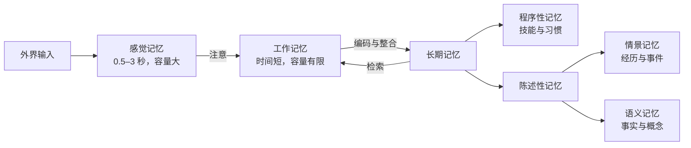
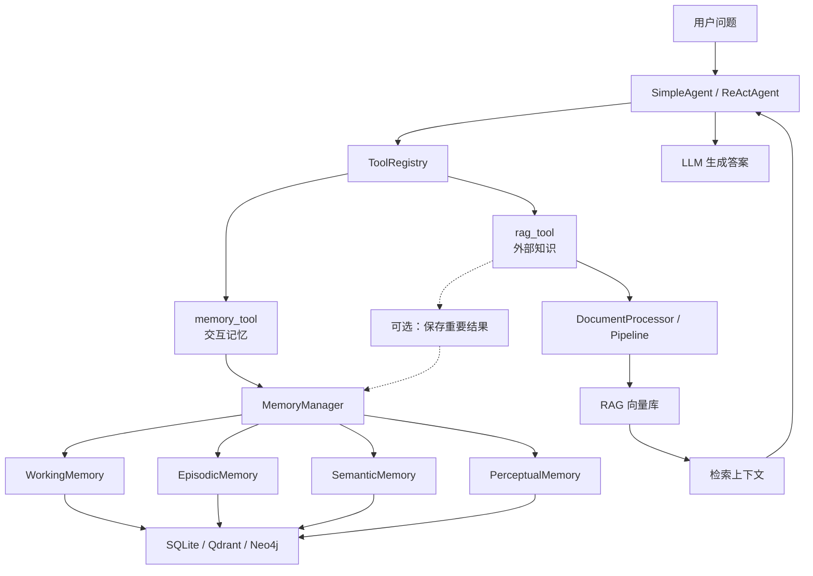

## 记忆与检索

> 阅读资料：[《Hello-Agents》第八章 8.1：从认知科学到智能体记忆](https://datawhalechina.github.io/hello-agents/#/./chapter8/%E7%AC%AC%E5%85%AB%E7%AB%A0%20%E8%AE%B0%E5%BF%86%E4%B8%8E%E6%A3%80%E7%B4%A2?id=_81-%e4%bb%8e%e8%ae%a4%e7%9f%a5%e7%a7%91%e5%ad%a6%e5%88%b0%e6%99%ba%e8%83%bd%e4%bd%93%e8%ae%b0%e5%bf%86)
>
> 本节先建立记忆与 RAG 的概念边界和分层架构，具体记忆类、存储后端和检索策略留待后续小节实现。

### 从认知科学到智能体记忆

#### 人类记忆带来的分层思路

经典的 Atkinson–Shiffrin 模型将人类记忆看成多个容量和保留时间不同的存储层。信息不是被无差别地永久保留，而是先短暂进入感觉记忆，通过注意进入工作记忆，其中部分内容才会进入长期记忆。



原文引用“`7±2` 个项目”描述工作记忆容量，这是 Miller 的经典观察，但不是一个在所有任务中都固定成立的常数。信息如何分块、是否允许复述、任务类型都会改变测量结果；Cowan 后来对短时记忆容量重新分析，提出注意焦点更接近四个块。对 Agent 工程有用的结论不是硬套某个数字，而是：当前可用容量有限，必须选择、压缩和淘汰信息。

人类记忆与 Agent 组件不是一对一的复制关系，更合适的理解是“设计类比”：

| 认知概念 | Agent 中的对应能力 | 适合保存的内容 |
| --- | --- | --- |
| 感觉记忆 | 原始输入缓冲、多模态预处理 | 尚未筛选的文本、图像、音频特征 |
| 工作记忆 | 当前会话上下文、计划和工具观测 | 正在执行的任务状态 |
| 情景记忆 | 按时间保存交互经历 | 何时做了什么、结果如何 |
| 语义记忆 | 可持久检索的事实、偏好和规则 | “用户喜欢简洁回答”等抽象知识 |
| 程序性记忆 | 工具、Skill、提示词模板和执行策略 | “如何完成任务” |
| 感知记忆 | 章节额外引入的多模态长期记忆 | 媒体文件、嵌入向量及其元数据 |

其中，“感觉记忆”是人类认知模型的短暂输入层，章节中的 `PerceptualMemory` 则是为图像、音频等数据设计的工程模块，两者不应因为名称相近就直接画等号。

#### 模型上下文不等于长期记忆

LLM API 默认是无状态的：每次请求只能看到当次提交的消息。第七章 `Agent._history` 会把历史消息重新放进下一次请求，因此同一进程、同一 Agent 实例内看起来“记得”。但它仍只是临时消息列表：

- 重启程序或重新创建 Agent 后丢失。
- 历史越长，Token 成本越高，并最终受上下文窗口限制。
- 只能按原始顺序回放，不会按相关性召回，也没有遗忘和整合策略。

| 概念 | 存在位置 | 生命周期 | 是否会更新模型参数 |
| --- | --- | --- | --- |
| 模型内置知识 | 模型权重 | 通常随模型版本固定 | 已在训练阶段写入 |
| 对话历史 | 当前 Agent 内存与请求上下文 | 会话或进程级 | 否 |
| Agent 长期记忆 | 文档库、向量库或图库 | 可跨会话 | 否，使用时再检索 |
| RAG 外部知识 | 用户知识库、文档或 API | 由知识源管理 | 否，只增强当次上下文 |

所以，“让 Agent 有记忆”的主体是应用系统，不是某次 LLM 调用本身。

#### 为什么同时需要 Memory 和 RAG

Memory 和 RAG 都会“先检索，再把结果放入上下文”，但两者解决的问题不同。

| 对比项 | Memory | RAG |
| --- | --- | --- |
| 主要来源 | Agent 与用户的交互、任务过程 | 外部文档、数据库、API |
| 主要目标 | 保持连续性、个性化和经验复用 | 弥补知识时效性与专业性不足 |
| 写入时机 | 交互后持续产生，需要筛选 | 通常由文档入库流程统一构建 |
| 典型查询 | “我上次的学习进度是什么？” | “这份产品手册如何规定超时？” |
| 主要风险 | 记住错误、过时或敏感信息 | 检索错片段、过期资料或丢失来源 |

RAG 可以降低幻觉、提供来源，但不会自动保证答案正确；检索本身、知识源和模型对证据的使用都可能出错。同样，“全部记住”也不等于记忆能力强：无选择写入只会增加噪声、冲突、存储和隐私成本。

#### HelloAgents 的记忆与 RAG 架构

第七章确立了“万物皆工具”的扩展方式，因此第八章没有再新建 MemoryAgent 或 RAGAgent，而是把两种能力封装成 `memory_tool` 和 `rag_tool`，通过 `ToolRegistry` 交给现有 Agent 使用。



记忆系统分为四层：

1. **基础设施层**：`MemoryItem` 统一数据结构，`BaseMemory` 定义接口，`MemoryManager` 负责调度，`MemoryConfig` 保存参数。
2. **记忆类型层**：工作、情景、语义和感知记忆分别处理不同生命周期和数据形态。
3. **存储后端层**：SQLite 适合结构化持久化，Qdrant 负责向量相似检索，Neo4j 表达实体关系。
4. **嵌入服务层**：通过统一接口在云端嵌入、本地 Transformer 和 TF-IDF 之间切换。

RAG 则拆成文档处理、嵌入表示、向量存储和智能问答四层。两个系统可以共用嵌入服务和向量存储抽象，但应用语义仍然需要隔离：“用户说过什么”不应与“某份文档写了什么”混在同一命名空间。

这是本章的目标架构，不代表每个项目都必须同时部署 SQLite、Qdrant 和 Neo4j。例如，个人助手可以先使用 SQLite 加轻量嵌入；只有当语义检索规模或多跳关系查询真正出现时，再引入专用向量库或图库。

#### 快速体验应该验证什么

原文给出了 `hello-agents[all]` 安装方式，并需要额外配置 Qdrant、Neo4j、LLM 和 Embedding 服务。这是完整架构的体验环境，不是理解 8.1 概念的前置条件。

示例的主要调用关系是：

```python
registry = ToolRegistry()
registry.register_tool(MemoryTool(user_id="user123"))
registry.register_tool(RAGTool(knowledge_base_path="./knowledge_base"))
agent.tool_registry = registry
```

初始化日志只能说明 SQLite、Qdrant、Neo4j 和嵌入模型已连接，不能单独证明“记忆成功”。一个有效的跨会话测试至少应该：

1. 在第一个会话写入一条可识别信息。
2. 销毁 Agent，重新创建实例，但使用相同 `user_id` 和存储后端。
3. 在新会话中检索该信息，并检查召回条目的内容、用户隔离和来源。
4. 更新或删除该记忆，确认旧内容不再被召回。

同理，RAG 测试不能只看“有答案”，还应检查答案是否来自命中片段、来源是否可追溯，以及未命中时模型是否拒绝编造。

#### 工程上需要继续回答的问题

- **写什么**：记录原始对话，还是抽取后的事实、偏好和任务结果？
- **何时写**：每轮都写，还是先做重要性判断和去重？
- **怎么召回**：仅用向量相似度，还要同时考虑时间、重要性、用户和会话？
- **如何处理冲突**：用户新偏好与旧偏好相反时，是覆盖、保留版本还是降低旧记忆权重？
- **如何遗忘**：容量、时效、使用频率和重要性如何共同决定删除或归档？
- **如何治理**：敏感信息是否允许写入，用户能否查看、修正和删除自己的记忆？

存储只是记忆系统的一小部分。真正决定效果的是写入、召回、整合、遗忘和治理策略。

### 参考资料

- [《Hello-Agents》第八章：记忆与检索](https://github.com/datawhalechina/hello-agents/blob/main/docs/chapter8/%E7%AC%AC%E5%85%AB%E7%AB%A0%20%E8%AE%B0%E5%BF%86%E4%B8%8E%E6%A3%80%E7%B4%A2.md)
- [Atkinson & Shiffrin (1968), *Human Memory: A Proposed System and Its Control Processes*](https://escholarship.org/uc/item/5kd4s4j3)
- [Miller (1956), *The Magical Number Seven, Plus or Minus Two*](https://pubmed.ncbi.nlm.nih.gov/13310704/)
- [Cowan (2001), *The Magical Number 4 in Short-Term Memory*](https://pubmed.ncbi.nlm.nih.gov/11515286/)

### 小结

- 人类记忆模型为 Agent 提供的是分层、选择和有限容量的设计思路，不是一套可以机械复制的生物学结构。
- LLM 本身无状态；对话历史只是临时上下文，不等于可持久、可检索的长期记忆。
- Memory 记录 Agent 的交互与经验，RAG 引入外部知识；两者的检索技术可以复用，但数据语义和生命周期不同。
- HelloAgents 将记忆和 RAG 封装为工具，复用第七章的 Agent 与 `ToolRegistry`，同时在内部保持分层和存储抽象。
- 可持久不等于有效记忆；一个可用系统还要解决筛选、召回、冲突、遗忘、隔离和用户删除权。
