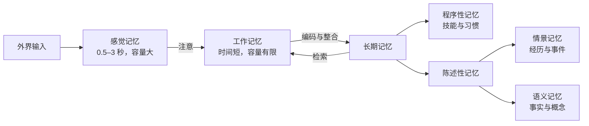
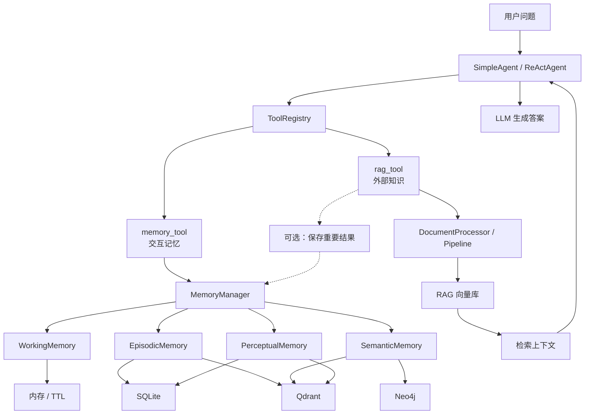
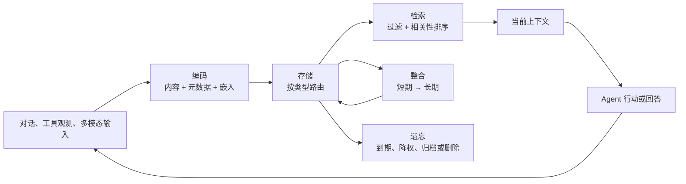
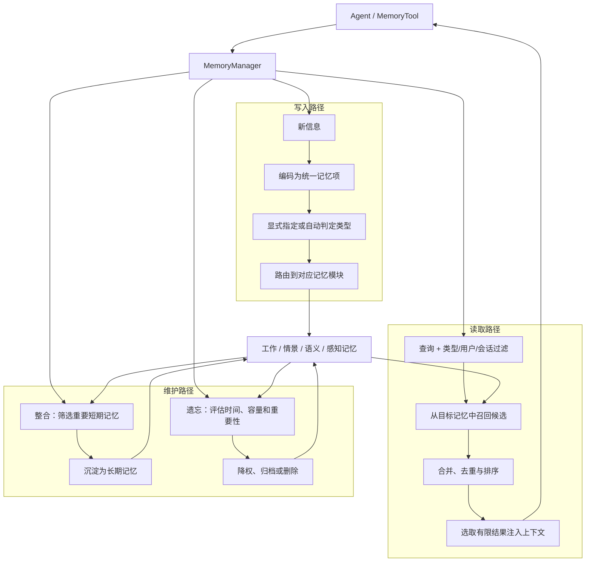
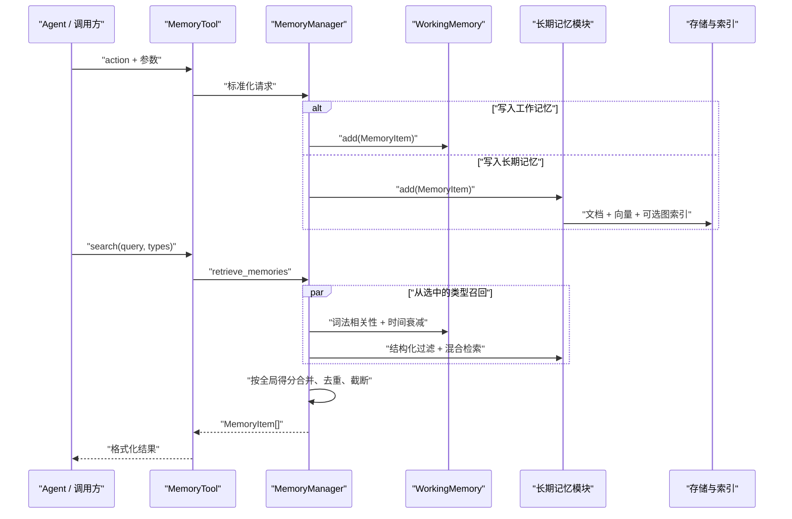
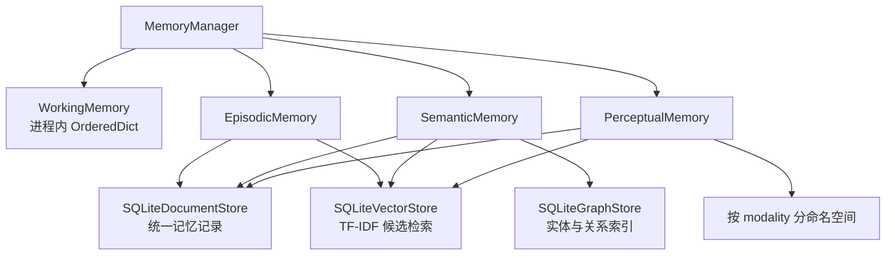

## 记忆与检索

> 阅读资料：[《Hello-Agents》第八章 8.1：从认知科学到智能体记忆](https://datawhalechina.github.io/hello-agents/#/./chapter8/%E7%AC%AC%E5%85%AB%E7%AB%A0%20%E8%AE%B0%E5%BF%86%E4%B8%8E%E6%A3%80%E7%B4%A2?id=_81-%e4%bb%8e%e8%ae%a4%e7%9f%a5%e7%a7%91%e5%ad%a6%e5%88%b0%e6%99%ba%e8%83%bd%e4%bd%93%e8%ae%b0%e5%bf%86)
>
> 阅读资料：[《Hello-Agents》第八章 8.2.1：记忆系统的工作流程](https://datawhalechina.github.io/hello-agents/#/./chapter8/%E7%AC%AC%E5%85%AB%E7%AB%A0%20%E8%AE%B0%E5%BF%86%E4%B8%8E%E6%A3%80%E7%B4%A2?id=_821-%e8%ae%b0%e5%bf%86%e7%b3%bb%e7%bb%9f%e7%9a%84%e5%b7%a5%e4%bd%9c%e6%b5%81%e7%a8%8b)
>
> 阅读资料：[《Hello-Agents》第八章 8.2：记忆系统——让智能体拥有记忆](https://datawhalechina.github.io/hello-agents/#/./chapter8/%E7%AC%AC%E5%85%AB%E7%AB%A0%20%E8%AE%B0%E5%BF%86%E4%B8%8E%E6%A3%80%E7%B4%A2?id=_82-%e8%ae%b0%e5%bf%86%e7%b3%bb%e7%bb%9f%ef%bc%9a%e8%ae%a9%e6%99%ba%e8%83%bd%e4%bd%93%e6%8b%a5%e6%9c%89%e8%ae%b0%e5%bf%86)
>
> 8.1 建立记忆与 RAG 的概念边界，8.2 再把编码、存储、检索、整合和遗忘落实到 `MemoryTool`、`MemoryManager` 与四种记忆实现中。

### 从认知科学到智能体记忆

#### 人类记忆带来的分层思路

经典的 Atkinson–Shiffrin 模型将人类记忆看成多个容量和保留时间不同的存储层。信息不是被无差别地永久保留，而是先短暂进入感觉记忆，通过注意进入工作记忆，其中部分内容才会进入长期记忆。



原文引用“`7±2` 个项目”描述工作记忆容量，这是 Miller 的经典观察，但不是一个在所有任务中都固定成立的常数。信息如何分块、是否允许复述、任务类型都会改变测量结果；Cowan 后来对短时记忆容量重新分析，提出注意焦点更接近四个块。对 Agent 工程有用的结论不是硬套某个数字，而是：当前可用容量有限，必须选择、压缩和淘汰信息。

人类记忆与 Agent 组件不是一对一的复制关系，更合适的理解是“设计类比”：

| 认知概念 | Agent 中的对应能力 | 适合保存的内容 |
| --- | --- | --- |
| 感觉记忆 | 原始输入缓冲、多模态预处理 | 尚未筛选的文本、图像、音频特征 |
| 工作记忆 | 当前会话上下文、计划和工具观测 | 正在执行的任务状态 |
| 情景记忆 | 按时间保存交互经历 | 何时做了什么、结果如何 |
| 语义记忆 | 可持久检索的事实、偏好和规则 | “用户喜欢简洁回答”等抽象知识 |
| 程序性记忆 | 工具、Skill、提示词模板和执行策略 | “如何完成任务” |
| 感知记忆 | 章节额外引入的多模态长期记忆 | 媒体文件、嵌入向量及其元数据 |

其中，“感觉记忆”是人类认知模型的短暂输入层，章节中的 `PerceptualMemory` 则是为图像、音频等数据设计的工程模块，两者不应因为名称相近就直接画等号。

#### 模型上下文不等于长期记忆

LLM API 默认是无状态的：每次请求只能看到当次提交的消息。第七章 `Agent._history` 会把历史消息重新放进下一次请求，因此同一进程、同一 Agent 实例内看起来“记得”。但它仍只是临时消息列表：

- 重启程序或重新创建 Agent 后丢失。
- 历史越长，Token 成本越高，并最终受上下文窗口限制。
- 只能按原始顺序回放，不会按相关性召回，也没有遗忘和整合策略。

| 概念 | 存在位置 | 生命周期 | 是否会更新模型参数 |
| --- | --- | --- | --- |
| 模型内置知识 | 模型权重 | 通常随模型版本固定 | 已在训练阶段写入 |
| 对话历史 | 当前 Agent 内存与请求上下文 | 会话或进程级 | 否 |
| Agent 长期记忆 | 文档库、向量库或图库 | 可跨会话 | 否，使用时再检索 |
| RAG 外部知识 | 用户知识库、文档或 API | 由知识源管理 | 否，只增强当次上下文 |

所以，“让 Agent 有记忆”的主体是应用系统，不是某次 LLM 调用本身。

#### 为什么同时需要 Memory 和 RAG

Memory 和 RAG 都会“先检索，再把结果放入上下文”，但两者解决的问题不同。

| 对比项 | Memory | RAG |
| --- | --- | --- |
| 主要来源 | Agent 与用户的交互、任务过程 | 外部文档、数据库、API |
| 主要目标 | 保持连续性、个性化和经验复用 | 弥补知识时效性与专业性不足 |
| 写入时机 | 交互后持续产生，需要筛选 | 通常由文档入库流程统一构建 |
| 典型查询 | “我上次的学习进度是什么？” | “这份产品手册如何规定超时？” |
| 主要风险 | 记住错误、过时或敏感信息 | 检索错片段、过期资料或丢失来源 |

RAG 可以降低幻觉、提供来源，但不会自动保证答案正确；检索本身、知识源和模型对证据的使用都可能出错。同样，“全部记住”也不等于记忆能力强：无选择写入只会增加噪声、冲突、存储和隐私成本。

#### HelloAgents 的记忆与 RAG 架构

第七章确立了“万物皆工具”的扩展方式，因此第八章没有再新建 MemoryAgent 或 RAGAgent，而是把两种能力封装成 `memory_tool` 和 `rag_tool`，通过 `ToolRegistry` 交给现有 Agent 使用。



记忆系统分为四层：

1. **基础设施层**：`MemoryItem` 统一数据结构，`BaseMemory` 定义接口，`MemoryManager` 负责调度，`MemoryConfig` 保存参数。
2. **记忆类型层**：工作、情景、语义和感知记忆分别处理不同生命周期和数据形态。
3. **存储后端层**：SQLite 适合结构化持久化，Qdrant 负责向量相似检索，Neo4j 表达实体关系。
4. **嵌入服务层**：通过统一接口在云端嵌入、本地 Transformer 和 TF-IDF 之间切换。

RAG 则拆成文档处理、嵌入表示、向量存储和智能问答四层。两个系统可以共用嵌入服务和向量存储抽象，但应用语义仍然需要隔离：“用户说过什么”不应与“某份文档写了什么”混在同一命名空间。

这是本章的目标架构，不代表每个项目都必须同时部署 SQLite、Qdrant 和 Neo4j。例如，个人助手可以先使用 SQLite 加轻量嵌入；只有当语义检索规模或多跳关系查询真正出现时，再引入专用向量库或图库。

#### 快速体验应该验证什么

原文给出了 `hello-agents[all]` 安装方式，并需要额外配置 Qdrant、Neo4j、LLM 和 Embedding 服务。这是完整架构的体验环境，不是理解 8.1 概念的前置条件。

示例的主要调用关系是：

```python
registry = ToolRegistry()
registry.register_tool(MemoryTool(user_id="user123"))
registry.register_tool(RAGTool(knowledge_base_path="./knowledge_base"))
agent.tool_registry = registry
```

初始化日志只能说明 SQLite、Qdrant、Neo4j 和嵌入模型已连接，不能单独证明“记忆成功”。一个有效的跨会话测试至少应该：

1. 在第一个会话写入一条可识别信息。
2. 销毁 Agent，重新创建实例，但使用相同 `user_id` 和存储后端。
3. 在新会话中检索该信息，并检查召回条目的内容、用户隔离和来源。
4. 更新或删除该记忆，确认旧内容不再被召回。

同理，RAG 测试不能只看“有答案”，还应检查答案是否来自命中片段、来源是否可追溯，以及未命中时模型是否拒绝编造。

#### 工程上需要继续回答的问题

- **写什么**：记录原始对话，还是抽取后的事实、偏好和任务结果？
- **何时写**：每轮都写，还是先做重要性判断和去重？
- **怎么召回**：仅用向量相似度，还要同时考虑时间、重要性、用户和会话？
- **如何处理冲突**：用户新偏好与旧偏好相反时，是覆盖、保留版本还是降低旧记忆权重？
- **如何遗忘**：容量、时效、使用频率和重要性如何共同决定删除或归档？
- **如何治理**：敏感信息是否允许写入，用户能否查看、修正和删除自己的记忆？

存储只是记忆系统的一小部分。真正决定效果的是写入、召回、整合、遗忘和治理策略。

### 记忆系统的工作流程

#### 五个阶段构成记忆闭环

记忆不是“写入数据库，需要时再查出来”这两个动作。原文将认知过程拆成编码、存储、检索、整合和遗忘五个阶段：

| 阶段 | 认知含义 | Agent 中的工程动作 |
| --- | --- | --- |
| 编码 Encoding | 把感知信息转换成可保留的表示 | 清洗内容，补充时间、用户、会话、重要性和模态等元数据，必要时生成嵌入 |
| 存储 Storage | 保留编码后的信息 | 根据记忆类型和生命周期路由到内存、文档库、向量库或图库 |
| 检索 Retrieval | 在需要时找回相关信息 | 结合查询、记忆类型、用户、时间和重要性召回候选项 |
| 整合 Consolidation | 将有价值的短期信息转为更稳定的长期记忆 | 筛选、去重、摘要和抽象，将重要经历沉淀为情景或语义记忆 |
| 遗忘 Forgetting | 清理不重要或过时信息 | 按 TTL、容量、时间、重要性或用户删除请求降权、归档或删除 |



这五个阶段不是只跑一次的单向 ETL。检索结果会影响 Agent 的新行动，新行动又会产生待编码的信息；整合和遗忘则持续调整已存储的内容，因此整体是一个闭环。

#### 记忆阶段与记忆类型是两个维度

编码、检索和遗忘描述的是“当前在做什么”；工作、情景、语义和感知记忆描述的是“正在处理哪类信息”。两者是正交关系，不能把“工作记忆”理解成编码阶段，也不能把“语义记忆”理解成检索结果。

| 记忆类型 | 主要内容 | 生命周期与检索特点 | 例子 |
| --- | --- | --- | --- |
| WorkingMemory | 当前会话和任务中间状态 | 纯内存、会话级，容量有限，原文示例默认 50 条 | “用户刚才要求把结果转成 JSON” |
| EpisodicMemory | 具体事件、交互与任务经历 | 长期保存，按时间顺序或主题回顾 | “用户上周完成了第一个 Python 项目” |
| SemanticMemory | 从经历中抽象出的事实、概念和规则 | 持久性强，适合语义检索和关联推理 | “用户是 Python 开发者” |
| PerceptualMemory | 图像、音频等多模态信息 | 根据重要性和存储空间管理，支持跨模态检索 | “用户上传的代码截图包含某函数” |

“默认 50 条”是工程配置示例，不是认知科学定律。实际容量应由单条记忆大小、Token 预算、任务周期和响应延迟决定。

还有一个容易忽略的不对称：8.1 在人类长期记忆中介绍了程序性记忆，HelloAgents 的四种 `Memory` 实现却没有 `ProceduralMemory`。在当前架构中，工具、Skill、Agent 控制流和提示词模板承担了部分“如何做”的职责，但它们不由 `MemoryManager` 动态学习或更新。

#### HelloAgents 中的写入、读取和维护流程

将认知阶段落到框架后，可以把完整工作流程拆成三条路径：



`MemoryTool` 是 Agent 看到的统一入口，`MemoryManager` 则负责把操作分发给各记忆模块。这种分层使 Agent 无需知道数据最后位于内存、SQLite、Qdrant 还是 Neo4j。

写入时的“记忆类型”可以由调用方明确指定，也可以交给分类器判断。后者只是自动分类逻辑，并不保证结果正确；涉及长期指令、隐私信息或高价值经验时，仍然需要明确规则和可审核的元数据。

检索阶段也不应把所有命中记忆全部塞进提示词。记忆库可以很大，工作上下文仍然有限；因此需要在用户隔离和类型过滤后，只选取与当前任务最相关的少量结果。

#### 遗忘不是数据丢失，而是容量管理

如果系统只增加记忆而不清理，时间越长，相似候选、过时事实和冲突偏好就越多，检索精度反而会下降。因此遗忘是记忆系统的正常功能：

- 工作记忆在会话结束或 TTL 到期后清理。
- 长期记忆根据时间、重要性、容量和访问频率调整权重或归档。
- 已被新信息取代的事实应停止参与默认检索，必要时保留可追溯版本。
- 用户明确要求删除的内容必须从文档、向量索引和图关系中同步清理。

整合同样不是简单地把工作记忆整批复制到长期存储。它应当先判断价值，再做去重、摘要和抽象；否则只是把短期噪声变成了长期噪声。

#### 如何检查记忆流程是否真正有效

| 环节 | 常见失败 | 需要观察的信号 |
| --- | --- | --- |
| 编码 | 类型分错、用户或会话元数据丢失 | 标准化后的记忆项、分类原因和嵌入版本 |
| 存储 | 文档已写入，但向量或图索引未同步 | 各后端记录 ID、写入状态和重试日志 |
| 检索 | 相似但不相关，或召回了其他用户的信息 | 查询、过滤条件、候选分数、来源和最终入选项 |
| 整合 | 把普通对话或错误信息升级为长期事实 | 整合前后的条目、摘要依据和版本关系 |
| 遗忘 | 删除了重要信息，或只删文档未删索引 | 策略、命中条件、删除数量与跨后端一致性 |

评估记忆系统时，不能只问“有没有召回内容”，还要问“召回的是否正确、是否属于当前用户、是否仍然有效、是否值得占用当前上下文”。

### 记忆系统的代码实现

#### 从 MemoryTool 进入系统

`MemoryTool` 是 Agent 能看到的统一接口，具体记忆类型和存储后端都藏在工具内部。它支持以下动作：

| action | 作用 | 关键参数 |
| --- | --- | --- |
| `add` | 添加工作、情景、语义或感知记忆 | `content`、`memory_type`、`importance` |
| `search` | 跨类型或按类型检索 | `query`、`memory_types`、`limit`、`min_importance` |
| `summary` / `stats` | 查看内容摘要和数量、重要性等统计 | `limit_per_type` |
| `update` / `remove` | 修改或删除指定记忆 | `memory_id` |
| `forget` | 按重要性、时间或容量清理 | `strategy`、`threshold`、`max_age_days` |
| `consolidate` | 将重要短期记忆转为长期记忆 | `from_type`、`to_type`、`importance_threshold` |
| `clear_all` | 清除当前用户的全部记忆 | 无 |

原文快速体验使用 `memory_tool.run("add", content=...)`，工具系统的标准接口却是 `run(parameters: dict)`。实践代码同时兼容两种写法：

```python
memory_tool.run(
    "add",
    content="用户是一名前端工程师",
    memory_type="semantic",
    importance=0.9,
)

memory_tool.run({
    "action": "search",
    "query": "前端工程师",
    "memory_types": ["semantic"],
    "limit": 3,
})
```

前者适合直接练习，后者可以由 `ToolRegistry` 和 Agent 正常分发。完整实现见 [memory_tool.py](./code/HelloAgents/hello_agents/tools/builtin/memory_tool.py)。

工具只处理参数、会话元数据和输出格式，不直接访问数据库。写入时会补充 `session_id` 与 RFC 3339 时间；感知记忆若提供 `file_path`，还会根据扩展名推断 `image`、`audio`、`video` 或 `text` 模态。

`auto_classify=True` 只是根据“刚才、昨天、模态”等关键词执行确定性路由，不是模型完成的智能分类。长期偏好、敏感信息和高价值经验更适合由调用方明确指定类型。

#### MemoryManager 负责路由和跨类型操作

`MemoryManager` 根据配置创建已启用的记忆类型，统一处理写入、跨类型检索、更新、删除、遗忘和整合。其核心不是“保存一个列表”，而是维护稳定的调度边界：



每类记忆先返回带 `_retrieval_score` 的候选项，Manager 再做全局排序。不能只按 `importance` 排序：重要但与当前问题无关的记忆，不应压过真正相关的内容。

整合也不是复制。实践中会创建目标记忆，写入 `consolidated_from` 和 `source_memory_id`，再删除来源记忆；目标重要性提升 10%，但上限固定为 1.0。若来源删除失败，会回滚新写入，避免同时留下两份不一致记录。完整调度代码见 [manager.py](./code/HelloAgents/hello_agents/memory/manager.py)。

#### 统一数据结构与存储边界

`MemoryItem` 统一了四种记忆的数据形态：

```python
class MemoryItem(BaseModel):
    id: str
    content: str
    memory_type: str
    user_id: str
    timestamp: datetime
    importance: float
    metadata: dict[str, Any]
```

实现时还补上了几个容易遗漏的约束：`content` 不能为空；`memory_type` 只能是四个已知值；`importance` 必须落在 `[0, 1]`；时间统一保存为带时区的 UTC 时间；可变的 `metadata` 和模态列表通过 `default_factory` 创建，避免不同对象共享同一个默认字典或列表。

本地实践的存储关系如下：



章节的目标后端是 SQLite + Qdrant + Neo4j。本地代码没有把外部服务和密钥变成运行前提，而是用 SQLite 实现相同的文档、向量、图三层接口，并用轻量 TF-IDF 完成候选检索。这样可以完整验证控制流；接入 Qdrant、Neo4j 或云端 Embedding 时，只需替换存储和嵌入实现，不需要改 `MemoryTool`、`MemoryManager` 或四种记忆的职责。

这里必须区分能力边界：TF-IDF 是稀疏词法相似度，不具备稠密向量模型的语义泛化；感知记忆保存媒体路径、模态和文本描述，并按模态检索，但没有加载 CLIP、CLAP，因此不能宣称已经完成图文或音文的跨模态语义对齐。

#### 四种记忆的检索侧重点

| 类型 | 保存内容 | 生命周期 | 检索与评分 |
| --- | --- | --- | --- |
| `WorkingMemory` | 当前对话、计划和中间状态 | 纯内存；默认 50 条；TTL 到期或重启即消失 | TF-IDF 70% + 关键词 30%，再乘时间衰减和重要性权重 |
| `EpisodicMemory` | 具体事件和交互经历 | SQLite 持久化 | 向量相似度 80% + 时间近因性 20% |
| `SemanticMemory` | 稳定事实、偏好、概念和规则 | SQLite 持久化 | 向量相似度 70% + 图关系 30% |
| `PerceptualMemory` | 媒体描述、路径和模态元数据 | SQLite 持久化、模态隔离 | 同模态相似度 80% + 时间近因性 20% |

四种评分都使用温和的重要性权重 `0.8 + importance × 0.4`，因此重要性只把分数缩放到原来的 0.8～1.2 倍，不会完全盖过相关性。

工作记忆的最终分数为：

`score = relevance × time_decay × (0.8 + importance × 0.4)`

其中 `relevance = tfidf × 0.7 + keyword × 0.3`。检索前先清理 TTL 已过期内容；超过容量时淘汰重要性最低的项，重要性相同再淘汰较早写入的项。它不写入 SQLite，因此“重启后为空”是正确行为，而不是持久化失败。

情景与感知记忆使用相同的融合形式：

`score = (vector × 0.8 + recency × 0.2) × (0.8 + importance × 0.4)`

情景记忆还能先按用户、时间、重要性和会话元数据过滤；感知记忆再增加 `modality` 过滤。时间不是唯一依据：近期但无查询交集的候选不会因为近因分而被强行返回。

语义记忆的评分为：

`score = (vector × 0.7 + graph × 0.3) × (0.8 + importance × 0.4)`

本地实现用规则提取常见的“是、喜欢、擅长、使用、负责、学习”等关系并写入图索引。这只是可替换的确定性兜底，不等同于通用实体关系抽取；生产环境仍应接入 spaCy、LLM 抽取器或已有知识图谱。

#### 遗忘与整合必须同步所有索引

`forget` 的三种策略对应三个不同问题：

- `importance`：删除低于阈值的低价值记录。
- `time`：删除超过指定天数的旧记录。
- `capacity`：超过容量时，优先删除重要性低且更早的记录。

无论由哪个策略触发，删除都必须同时作用于文档记录、向量索引和图关系；否则下一次检索可能返回“主记录已删除、索引仍存在”的幽灵记忆。用户主动删除同样需要走这条完整链路。

整合常见的两条路径是 `working → episodic` 和 `episodic → semantic`。前者保留值得复盘的具体经历，后者应在去重和抽象后才沉淀为稳定事实。当前实现按重要性阈值完成迁移，但没有让 LLM 自动摘要，因此不会擅自把多条经历概括成新知识。

#### 我的代码实践

代码放在 [hello_agents/memory/](./code/HelloAgents/hello_agents/memory/)，示例见 [memory_system_demo.py](./code/HelloAgents/examples/memory_system_demo.py)。它不调用 LLM，也不访问外部服务：

```bash
cd code/HelloAgents
pip install pydantic python-dotenv openai
python examples/memory_system_demo.py
```

实践依次完成注册工具、写入四类记忆、检索、更新、工作记忆整合、删除感知记忆、按重要性遗忘、重启召回、用户隔离和清空。去掉每次随机生成的 UUID 后，实际输出如下：

```text
已注册工具： ['memory']
写入后数量： {'working': 1, 'episodic': 0, 'semantic': 1, 'perceptual': 1}
检索结果： ['用户是一名前端工程师，喜欢 Python 和 TypeScript。']
已更新记忆：<UUID>
整合完成：working → episodic，迁移 1 条记忆。
已删除记忆：<UUID>
遗忘完成：semantic=1
维护后数量： {'working': 0, 'episodic': 1, 'semantic': 1, 'perceptual': 0}
重启后召回： ['用户是一名前端工程师，主要使用 Python 和 TypeScript。']
重启后工作记忆： 0
其他用户召回： 0
清理完成：working=0, episodic=1, semantic=1, perceptual=0
```

这组结果验证了三件事：长期记忆能跨实例恢复；工作记忆保持会话级生命周期；相同数据库中的不同用户仍由 `user_id` 隔离。它还说明“Agent 注册了 MemoryTool”不等于系统会自动记住所有对话：Agent 仍需显式调用工具，或由应用在对话结束后调用 `auto_record_conversation()`。是否自动写入应由产品规则决定，不能默认把每句话永久保存。

### 参考资料

- [《Hello-Agents》第八章：记忆与检索](https://github.com/datawhalechina/hello-agents/blob/main/docs/chapter8/%E7%AC%AC%E5%85%AB%E7%AB%A0%20%E8%AE%B0%E5%BF%86%E4%B8%8E%E6%A3%80%E7%B4%A2.md)
- [HelloAgents `learn_version`：memory 模块源码](https://github.com/jjyaoao/HelloAgents/tree/learn_version/hello_agents/memory)
- [Atkinson & Shiffrin (1968), *Human Memory: A Proposed System and Its Control Processes*](https://escholarship.org/uc/item/5kd4s4j3)
- [Miller (1956), *The Magical Number Seven, Plus or Minus Two*](https://pubmed.ncbi.nlm.nih.gov/13310704/)
- [Cowan (2001), *The Magical Number 4 in Short-Term Memory*](https://pubmed.ncbi.nlm.nih.gov/11515286/)

### 小结

- 人类记忆模型为 Agent 提供的是分层、选择和有限容量的设计思路，不是一套可以机械复制的生物学结构。
- LLM 本身无状态；对话历史只是临时上下文，不等于可持久、可检索的长期记忆。
- Memory 记录 Agent 的交互与经验，RAG 引入外部知识；两者的检索技术可以复用，但数据语义和生命周期不同。
- HelloAgents 将记忆和 RAG 封装为工具，复用第七章的 Agent 与 `ToolRegistry`，同时在内部保持分层和存储抽象。
- 记忆生命周期由编码、存储、检索、整合和遗忘构成，检索与新行动会继续产生新信息，因此它是闭环而非单向流水线。
- 工作、情景、语义和感知是记忆类型；编码、检索和遗忘是对这些记忆执行的操作，两个维度不能混淆。
- `MemoryTool` 统一对外动作，`MemoryManager` 负责路由和全局排序，具体记忆实现负责各自的生命周期、评分和存储一致性。
- 工作记忆是带 TTL 的进程内缓存；情景、语义和感知记忆持久化保存，并分别强调时间、实体关系和模态隔离。
- 本地 TF-IDF 与规则图索引用于跑通架构，不等同于稠密语义检索或跨模态对齐；生产后端可在不改变上层协议的前提下替换。
- 可持久不等于有效记忆；一个可用系统还要解决筛选、召回、冲突、遗忘、隔离和用户删除权。
